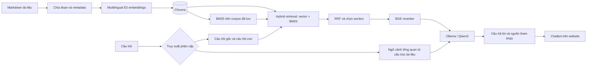
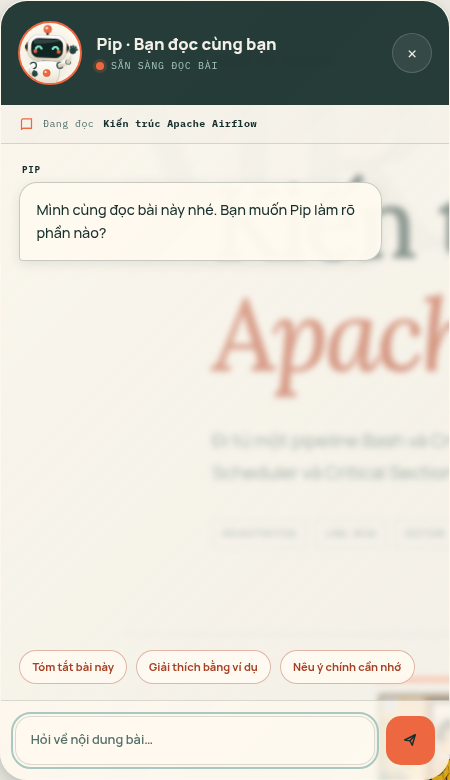
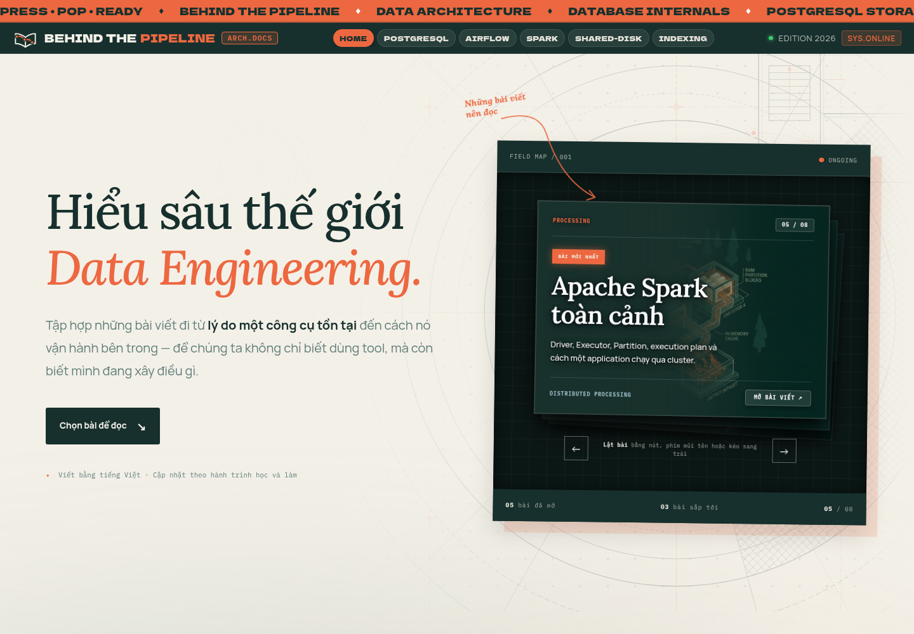
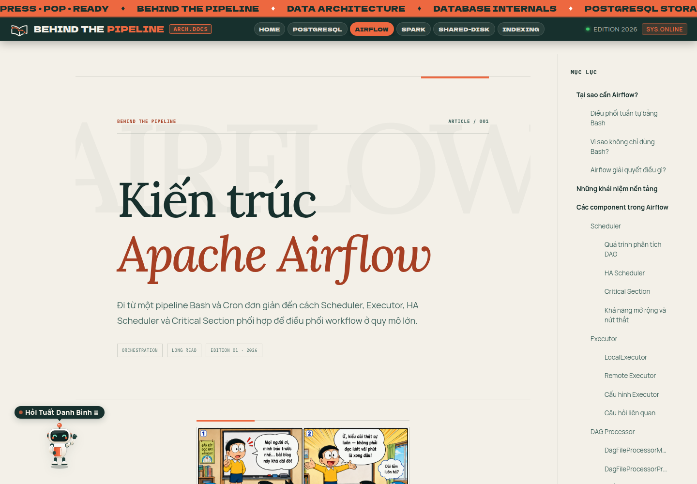

<div align="center">
  
  <h1>Data Engineering Handbook with RAG</h1>
  <p><strong>Retrieval-Augmented Generation for Data Engineering.</strong></p>
  <p>Hệ thống hỏi đáp tài liệu tiếng Việt với hybrid retrieval, câu trả lời có dẫn nguồn<br>và chatbot tích hợp trong website kiến thức Behind the Pipeline.</p>
  <a href="https://itslewis-de.github.io/Handbook_DE_with_RAG/">
    
  </a>
  <p>
    <a href="https://itslewis-de.github.io/Handbook_DE_with_RAG/#thu-vien">Thư viện bài viết</a> ·
    <a href="#chatbot-đọc-cùng-bạn">Chatbot</a> ·
    <a href="#chạy-trên-máy-cá-nhân">Chạy tại local</a>
  </p>
</div>

> [!IMPORTANT]
> **[→ MỞ WEBSITE: itslewis-de.github.io/Handbook_DE_with_RAG](https://itslewis-de.github.io/Handbook_DE_with_RAG/)**
>
> Khám phá kho kiến thức Behind the Pipeline và giao diện chatbot. Chạy backend local theo hướng dẫn bên dưới để trải nghiệm hỏi đáp RAG.

## Về dự án

**Handbook DE with RAG** kết hợp cẩm nang Data Engineering với hệ thống hỏi đáp tài liệu. **Pipeline RAG** là phần **Retrieval-Augmented Generation (RAG)** cho kho kiến thức Data Engineering bằng tiếng Việt. Hệ thống xử lý tài liệu, tạo chỉ mục, truy xuất các đoạn liên quan và dùng mô hình ngôn ngữ để tạo câu trả lời kèm nguồn tham khảo. **Behind the Pipeline** là website xuất bản tài liệu và giao diện để người đọc tương tác với chatbot.

- **Hybrid retrieval:** kết hợp tìm kiếm vector trong Chroma với BM25 để tìm theo ngữ nghĩa và thuật ngữ kỹ thuật.
- **Truy xuất phân cấp:** chế độ mặc định `hierarchical` xử lý câu hỏi tổng quan qua cấu trúc tài liệu; câu hỏi chi tiết đi qua tách truy vấn, hybrid retrieval và reranking.
- **Xếp hạng lại:** `BAAI/bge-reranker-v2-m3` chấm điểm các đoạn theo câu hỏi gốc trước khi đưa vào ngữ cảnh.
- **Hợp nhất kết quả bằng RRF:** kết hợp thứ hạng của hai bộ tìm kiếm và chọn các section khác nhau làm ngữ cảnh.
- **Trả lời có dẫn nguồn:** liên kết từ câu trả lời về đúng phần trong bài viết; kiểm tra citation và xử lý trường hợp thiếu bằng chứng.
- **Mô hình chạy local:** Ollama phục vụ `qwen3:4b-instruct`; embedding đa ngôn ngữ dùng `intfloat/multilingual-e5-small`.
- **Pipeline có thể đánh giá:** các script và bộ câu hỏi trong `backend/` hỗ trợ đánh giá retrieval và câu trả lời.
- **Giao diện tích hợp:** API FastAPI kết nối chatbot ngay trong trang đọc bài, đi cùng thư viện kiến thức trực quan.

## Luồng hoạt động RAG



`ingest.py` tạo và lưu chỉ mục; `overview_retrieval.py` điều phối truy xuất phân cấp; `retrieval.py`, `decomposition.py` và `reranking.py` truy xuất ngữ cảnh chi tiết; `answering.py` sinh, kiểm tra câu trả lời và citation; `app.py` cung cấp API `/chat` cho giao diện.

## Chatbot đọc cùng bạn

<p align="center">
  
</p>

**Pip** là trợ lý đọc tài liệu, được mở qua biểu tượng robot ở góc trang bài viết. Khung chat hiển thị tên bài đang đọc, các gợi ý câu hỏi và ô nhập để trao đổi với backend RAG.

- Tìm nội dung liên quan bằng tìm kiếm ngữ nghĩa kết hợp BM25.
- Sinh câu trả lời tiếng Việt bằng Ollama với model `qwen3:4b-instruct`.
- Đính kèm nguồn tham khảo, liên kết tới đúng phần trong bài viết.
- Có xử lý trường hợp thiếu bằng chứng, lỗi kết nối và thời gian chờ.
- Hỗ trợ `Enter` để gửi, `Shift + Enter` để xuống dòng và `Escape` để thu nhỏ.

Ví dụ câu hỏi: “Executor trong Airflow làm gì?”, “Shared-disk khác shared-nothing thế nào?” hoặc “shared_buffers có vai trò gì trong PostgreSQL?”.

> [!NOTE]
> GitHub Pages phục vụ website tĩnh. Chatbot hiện mặc định gọi `http://127.0.0.1:8001/chat` và cần backend chạy riêng; chưa có API công khai được cấu hình sẵn. Ảnh trên là giao diện chào của chatbot, không phải một phiên trả lời trực tuyến. Chỉ mục hiện bao gồm bài Airflow, Shared-disk vs. shared-nothing, PostgreSQL và Index.

## Nội dung trong thư viện

Hiện có **4 bài viết đã xuất bản**, cũng là nguồn tài liệu cho chatbot.

| Chủ đề | Nội dung chính | Đọc trên website |
| --- | --- | --- |
| Data Architecture | Shared-disk, shared-nothing, data locality, shuffle, skew và mở rộng hệ thống | [Shared-disk vs. shared-nothing](https://itslewis-de.github.io/Handbook_DE_with_RAG/architecture/shared-disk-vs-shared-nothing/) |
| Apache Airflow | DAG, Scheduler, DAG File Processor, Executor và High Availability | [Kiến trúc Airflow](https://itslewis-de.github.io/Handbook_DE_with_RAG/airflow/architecture/) |
| PostgreSQL | Database cluster, schema, `shared_buffers` và cấu trúc lưu trữ | [Phân cấp & lưu trữ](https://itslewis-de.github.io/Handbook_DE_with_RAG/postgres/postgres/) |
| Database Index | Full table scan, cấu trúc index và cách database tìm bản ghi | [Index trong cơ sở dữ liệu](https://itslewis-de.github.io/Handbook_DE_with_RAG/index/) |

**Trong lộ trình:** Apache Kafka, dbt, Docker và Kubernetes cho Data Engineer.

## Thiết kế website

[](https://itslewis-de.github.io/Handbook_DE_with_RAG/)

Giao diện sử dụng nền giấy sáng, màu xanh trầm và điểm nhấn cam; kết hợp họa tiết bản vẽ kỹ thuật với thẻ bài viết dạng chồng giấy. Trang bài viết dành nhiều không gian cho nội dung, mục lục và hình minh họa. Bố cục thích ứng với desktop và điện thoại, cùng font được lưu trong dự án.



*Ảnh chụp giao diện thật từ bản build của dự án: trang chủ ở phía trên và trang đọc bài Airflow cùng robot Pip.*

## Công nghệ

| Thành phần | Công nghệ |
| --- | --- |
| Website | MkDocs Material, Markdown, HTML, CSS, JavaScript |
| Xuất bản | GitHub Pages |
| API chatbot | Python, FastAPI, Uvicorn |
| RAG | LangChain, Chroma, BM25 |
| Embedding | `intfloat/multilingual-e5-small` |
| Reranker | `BAAI/bge-reranker-v2-m3` |
| Mô hình trả lời | Ollama · `qwen3:4b-instruct` |
| Quản lý dependency | uv |

## Chạy trên máy cá nhân

### Website

Cần **Python 3.12+** và [uv](https://docs.astral.sh/uv/).

```bash
git clone https://github.com/ItsLewis-DE/Handbook_DE_with_RAG.git
cd Handbook_DE_with_RAG
uv sync
uv run mkdocs serve
```

Mở **http://127.0.0.1:8000**. Để kiểm tra bản build:

```bash
uv run mkdocs build --strict
```

Kết quả được tạo trong thư mục `site/`.

### Backend chatbot

Cài [Ollama](https://ollama.com/), khởi động dịch vụ và tải model:

```bash
ollama pull qwen3:4b-instruct
```

Mở terminal khác, từ thư mục gốc dự án:

```bash
cd backend
uv sync
uv run python ingest.py
uv run uvicorn app:app --host 127.0.0.1 --port 8001
```

Lần ingest đầu tiên cần tải model embedding và tạo chỉ mục tại `backend/.data/`. Chạy lại ingest sau khi cập nhật tài liệu trong danh sách `ARTICLE_PATHS` hoặc thay đổi cấu hình chỉ mục, rồi khởi động lại backend.

Luồng truy xuất chi tiết còn tải model reranker ở lần sử dụng đầu tiên.

Giữ cả website và backend đang chạy. Mở một bài viết trên website local, bấm robot Pip và nhập câu hỏi. Có thể kiểm tra API tại **http://127.0.0.1:8001/health** hoặc **http://127.0.0.1:8001/docs**.

Khi triển khai chatbot cho website công khai, cần một backend HTTPS, cấu hình `pip-chat-endpoint` trong thẻ meta của trang và thêm origin `https://itslewis-de.github.io` vào CORS tại `backend/app.py`. GitHub Pages chỉ lưu trữ phần giao diện.

### Xuất bản lên GitHub Pages

Website dùng nhánh `gh-pages` làm nguồn GitHub Pages. Từ thư mục gốc, chạy:

```bash
uv run mkdocs gh-deploy --strict
```

Lệnh này build website và push nội dung tĩnh lên `gh-pages`. Thay đổi mã nguồn và README cần được commit, push riêng lên `main`.

Địa chỉ hiện tại: **https://itslewis-de.github.io/Handbook_DE_with_RAG/**. Đường dẫn `/pipeline-rag/` cũ không còn phục vụ website sau khi repo đổi tên.

## Cấu trúc dự án

```text
.
├── docs/                 # Bài viết, landing page, hình ảnh, CSS và JavaScript
├── backend/              # API chatbot, ingestion, retrieval và đánh giá RAG
├── overrides/            # Tùy biến template MkDocs Material
├── assets/readme/        # Ảnh chụp website và chatbot cho README
├── scripts/              # Công cụ hỗ trợ phát triển
├── mkdocs.yml            # Điều hướng và cấu hình website
├── pyproject.toml        # Dependency cho website
└── uv.lock               # Phiên bản dependency được khóa
```

## Đóng góp

Bạn có thể [mở issue](https://github.com/ItsLewis-DE/Handbook_DE_with_RAG/issues) để báo lỗi, góp ý cách giải thích hoặc đề xuất chủ đề. Với thay đổi nội dung, hãy ghi rõ nguồn tham khảo, kiểm tra hình ảnh và liên kết, sau đó chạy `uv run mkdocs build --strict` trước khi gửi pull request.

---

<p align="center">
  <strong>Pipeline RAG — hỏi từ tài liệu, trả lời có nguồn.</strong><br>
  <a href="https://itslewis-de.github.io/Handbook_DE_with_RAG/">Khám phá thư viện →</a>
</p>
