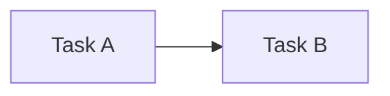
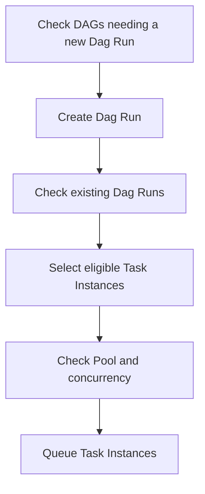
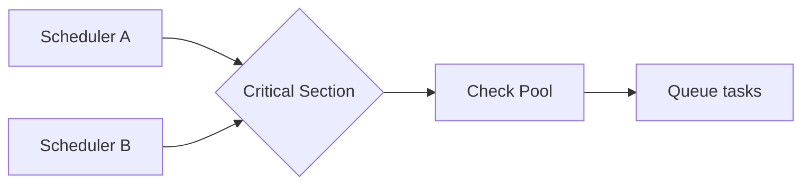
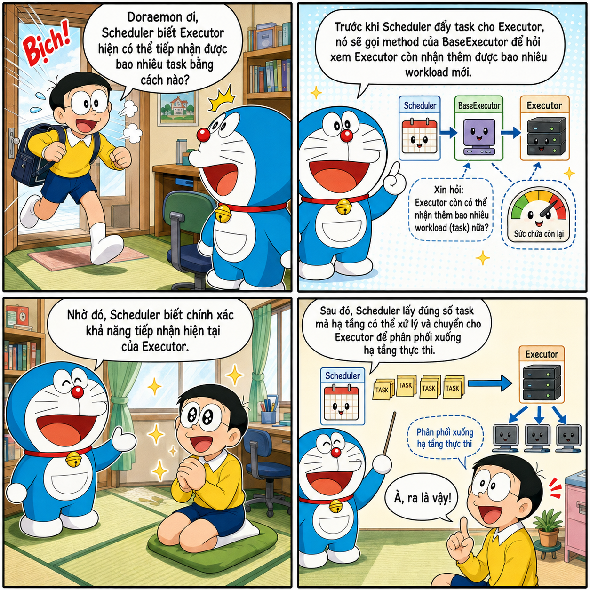
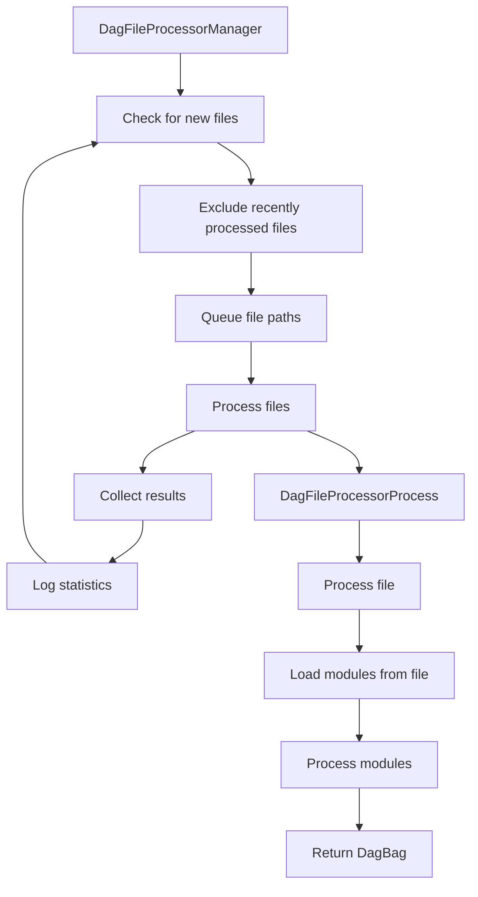
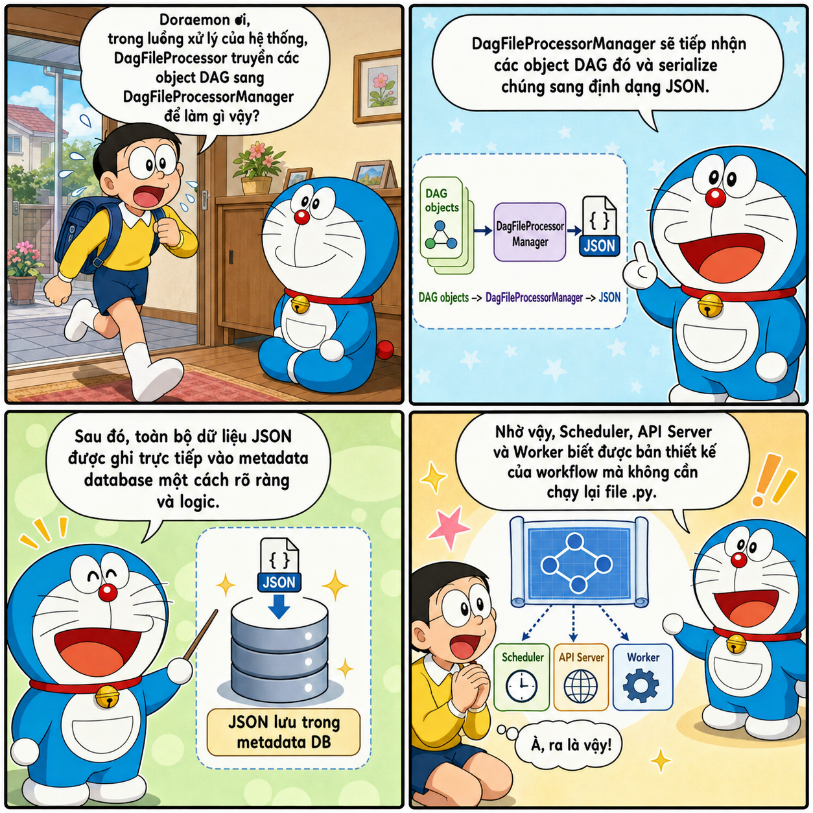
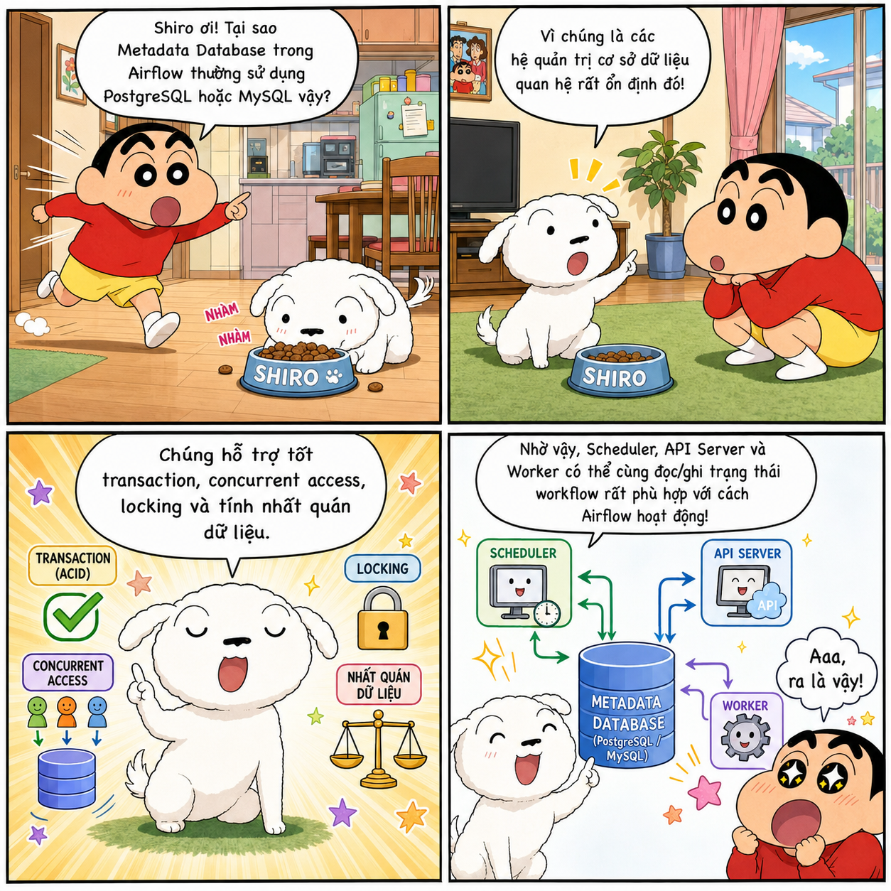
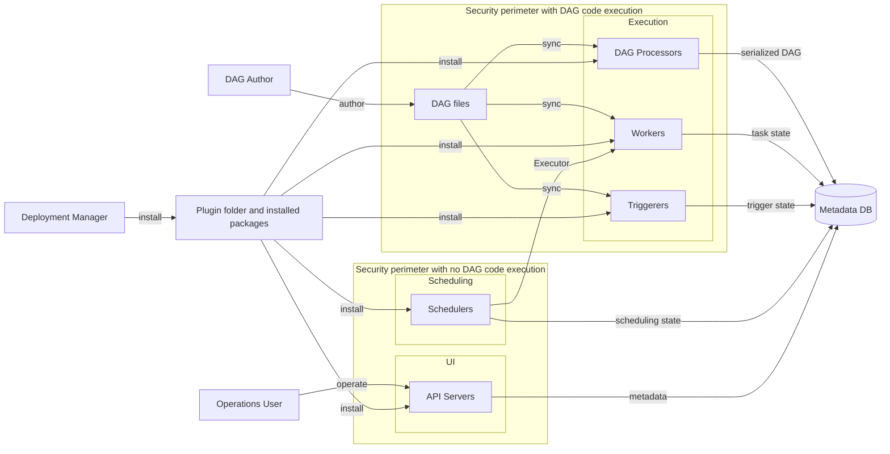
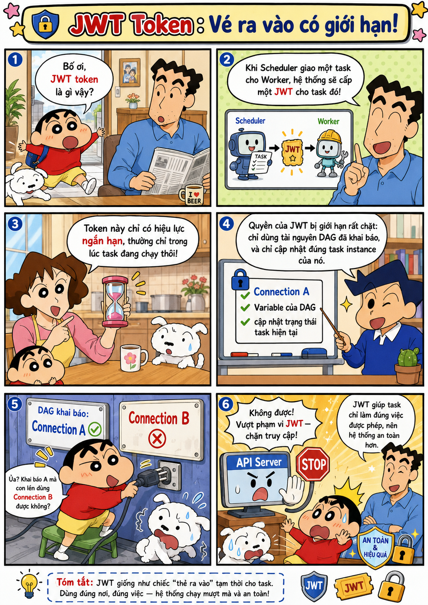
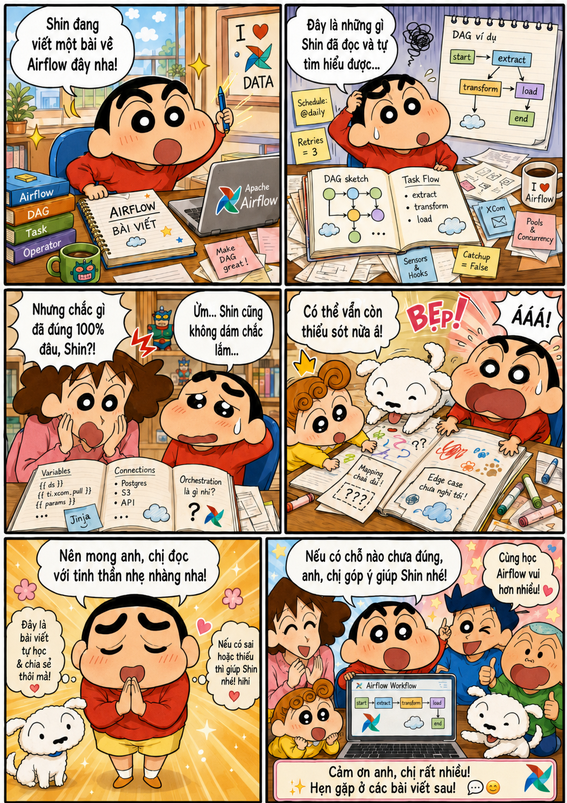

<header class="airflow-article-hero">
  <div class="airflow-article-hero__eyebrow">
    <a href="../../">BEHIND THE PIPELINE</a>
    <span>ARTICLE / 001</span>
  </div>
  <h1>Architecture of<br><em>Apache Airflow</em></h1>
  <p class="airflow-article-hero__dek">
    From a simple Bash and Cron pipeline to how the Scheduler, Executor,
    HA Scheduler, and Critical Section work together to orchestrate workflows at scale.
  </p>
  <div class="airflow-article-hero__meta" aria-label="Article information">
    <span>ORCHESTRATION</span>
    <span>LONG READ</span>
    <span>EDITION 01 · 2026</span>
  </div>
</header>

<figure class="airflow-opening-comic">
  
  <figcaption><span>BEFORE YOU READ</span><strong>A rather long article</strong></figcaption>
</figure>

## Why do we need Airflow?

Have you ever wondered why we need Airflow? If the only goal is to orchestrate programs that run sequentially, a Bash (`.sh`) file can do the job. When scheduled execution is needed, we can combine Bash with Cron.

### Sequential orchestration with Bash

For example, the following `pipeline.sh` file runs two tasks in sequence:

```bash
#!/usr/bin/env bash
set -e

echo "Starting task 1"
python3 /path/to/task_1.py

echo "Task 1 finished, starting task 2"
python3 /path/to/task_2.py

echo "Pipeline complete"
```

Make the file executable:

```bash
chmod +x /path/to/pipeline.sh
```

Then open the Cron configuration:

```bash
crontab -e
```

Add a schedule to run the pipeline at 02:00 every day:

```cron
0 2 * * * /path/to/pipeline.sh >> /path/to/pipeline.log 2>&1
```

### Why not just use Bash?

Can we replace Airflow with Bash files like these to save resources? The answer is **no**.

Bash works well when a system has only a few basic processing flows and its dependencies are not too complex. However, as a workflow grows to hundreds of tasks, those dependencies become harder to manage. Suppose a pipeline is 99% complete but the last task fails: with Bash, you have to write your own checkpoints, split tasks into separate scripts, or add a retry mechanism for that task.

Bash does not provide built-in per-task retry/rerun mechanisms, state persistence, or an operational interface. If you have to build all these capabilities yourself, the system quickly becomes complex.

### What does Airflow solve?

In this situation, Airflow becomes a suitable choice, offering capabilities such as:

- a UI that makes workflows easier to observe;
- retries for individual tasks;
- execution history without having to build complex configuration yourself as you would with Bash;
- backfill to rerun a workflow for a past period.

Airflow offers many powerful capabilities. To make good use of them, however, we need to understand its architecture and operating mechanisms. This article takes a deep dive into Airflow to help you use the tool deliberately, rather than operate it with only a vague understanding.

---

## Fundamental concepts

Before exploring Airflow's architecture, you need to understand these five concepts:

| Concept | Meaning |
| --- | --- |
| **DAG** (`Directed Acyclic Graph`) | A **directed acyclic graph**. “Directed” means each edge represents a dependency in one direction, such as `A → B`. “Acyclic” means you cannot follow the edges and return to the original task. |
| **Task** | A node in a DAG and Airflow's basic unit of work. Tasks are usually created from an `Operator`, a `Sensor`, or a function decorated with `@task`. |
| **Task Instance** | A specific task in a particular DAG run. For example, task A running on the 21st is a Task Instance for the 21st; running it on the 22nd creates a different Task Instance. The Scheduler primarily works with Task Instances rather than Task definitions. |
| **Schedule** | The scheduling configuration for a DAG. When the scheduled time arrives, Airflow automatically triggers the DAG. A schedule can be configured using Cron, presets such as `@daily`, or `timedelta`. |
| **Dependency** | A relationship between tasks that also expresses the conditions required for a task to run. For example, task A must run before task B. |

A simple dependency between two tasks:



---

## Components in Airflow

### Scheduler

#### DAG parsing

In Airflow 2.x, the Scheduler has an internal subprocess called `DagFileProcessorManager`, which parses files in the DAG folder. These processes record the state of DAG files in the metadata database; if parsing fails, the error information appears in the UI.

Since version 2.3, `DagFileProcessorManager` can be configured to run independently. Starting with Airflow 3, it becomes a required component that always runs separately from the Scheduler. This separation improves security and prevents the parsing of heavy DAG files from blocking the Scheduler.

> **A note on the `@daily` schedule**
>
> With an `@daily` schedule, the Dag Run that processes the January 1 data interval is typically created after that interval ends, at or just after 00:00 on January 2 in the DAG's time zone. This behavior allows the full data interval to be collected before processing.

#### HA Scheduler

When a system has too many DAGs, with hundreds or thousands of tasks, a single Scheduler may take a long time to finish a scheduling loop. This is where the **HA Scheduler** becomes useful.

HA Scheduler allows multiple Schedulers to run simultaneously. All Schedulers are active, rather than having one active Scheduler and another pending. This model shares the scheduling load; if one Scheduler fails, the others can continue processing work.

However, running multiple Schedulers in parallel can lead to duplicate processing. For example, Scheduler 1 and Scheduler 2 may select the same Dag Run to process. Airflow therefore needs database row-level locking.

A scheduling loop consists of three main steps:

1. Check which DAGs need a new Dag Run and create the corresponding Dag Runs.
2. Check existing Dag Runs to find Task Instances that can begin to be scheduled, or mark a Dag Run as complete.
3. Select eligible Task Instances for execution while respecting Pool limits.



#### Critical Section

One step in the scheduling loop is called the **Critical Section**. Only one Scheduler may enter this section at a time. Other Schedulers remain active and can continue performing other parts of the scheduling loop.

The Critical Section checks Pools, identifies tasks that can execute, and queues them. This mechanism prevents the following situation:

1. Scheduler A sees two available Pool slots and queues two tasks.
2. Scheduler B also sees two available Pool slots and queues two more tasks.
3. Four tasks end up queued, exceeding the Pool's two-slot limit.



#### Scalability and bottlenecks

When the Scheduler is CPU-bound, adding a second or third Scheduler often increases scheduling capacity almost linearly. However, this improvement is not guaranteed if the metadata database, network, or shared resources have already become a bottleneck.

A common Scheduler bottleneck appears when a system has too many DAGs and tasks. The Scheduler must constantly access the database to retrieve information; if the database cannot keep up, scheduling performance is significantly affected.

### Executor

The Executor is a configuration property of the Scheduler, not a separate component. It runs inside the Scheduler process. While the Scheduler schedules tasks and determines when a task is ready to run, the Executor sends that task to the appropriate execution environment. Depending on the Executor type, tasks can run locally or remotely on workers or pods.

Executors can be divided into two groups: LocalExecutor and Remote Executors.

#### LocalExecutor

LocalExecutor is Airflow's default configuration. When the Scheduler assigns work, LocalExecutor creates child processes of the Scheduler process to execute tasks.

For example, consider a task that needs to process a 5 GB file. Because LocalExecutor resides in the Scheduler process, the task uses the computing resources of the host running the Scheduler. The task may consume the host's CPU and RAM, leaving the Scheduler short of resources to scan DAGs or schedule other tasks.

In return, LocalExecutor is relatively simple to configure and has low latency because tasks run on the same node as the Scheduler.

#### Remote Executor

Remote Executors can be divided into two types:

1. **Queue/Batch Executor**, such as CeleryExecutor: the Executor inside the Scheduler sends tasks to a central queue, such as a message queue using Redis. Workers on remote hosts pull tasks from the queue and execute them. These workers typically run continuously, reducing task startup latency.

    The benefit of this model is that workers no longer compete with the Scheduler for resources. The worker infrastructure can also be much more powerful than a setup that puts all workers on one machine.

    The drawback is that a worker host processes multiple tasks. If some tasks have conflicting library versions or compete for resources, they can affect other tasks. This is known as the *noisy neighbor* problem. In addition, because workers remain running, idle periods waste resources. This is where Containerized Executors help.

2. **Containerized Executor**, such as KubernetesExecutor: to address the drawbacks of Queue/Batch Executors, a Containerized Executor runs each task in its own container or pod. Each container has an independent environment, avoiding the *noisy neighbor* problem.

    This type of Executor is beneficial for heavy tasks that run in long batches or infrequently, because containers start only when a task needs to execute. However, it also has the following drawbacks:

    - There is latency while waiting for the container to start.
    - It can be costly for frequently executed tasks because pods or containers must be created repeatedly.

Since Airflow 2.10.0, Airflow supports configuring multiple Executors simultaneously. Because each type has different strengths and weaknesses, we can assign the appropriate Executor to each specific task.

#### Configuring the Executor

To override the default Executor, configure `airflow.cfg` as follows:

```ini
[core]
executor = LocalExecutor
```

You can also use an environment variable:

```bash
export AIRFLOW__CORE__EXECUTOR="LocalExecutor"
```

To check the current Executor, run:

```bash
airflow config get-value core executor
```

To run multiple Executors simultaneously, use either of the following methods:

```ini
[core]
executor = LocalExecutor,CeleryExecutor
```

```bash
export AIRFLOW__CORE__EXECUTOR="LocalExecutor,CeleryExecutor"
```

To assign a specific Executor to each task:

```python
from datetime import datetime

from airflow import DAG
from airflow.operators.bash import BashOperator


with DAG(
    dag_id="multiple_executors_example",
    start_date=datetime(2025, 1, 1),
    schedule=None,
    catchup=False,
) as dag:

    use_default_executor = BashOperator(
        task_id="use_default_executor",
        bash_command="echo 'Running with the default LocalExecutor'",
        # No executor specified, so LocalExecutor is used.
    )

    use_local_executor = BashOperator(
        task_id="use_local_executor",
        bash_command="echo 'Running with LocalExecutor'",
        executor="LocalExecutor",
    )

    use_celery_executor = BashOperator(
        task_id="use_celery_executor",
        bash_command="echo 'Running with CeleryExecutor'",
        executor="CeleryExecutor",
    )
```

To set the default Executor for tasks in a DAG, declare it in `default_args`:

```python
from datetime import datetime

from airflow import DAG
from airflow.operators.bash import BashOperator


with DAG(
    dag_id="celery_default_dag",
    start_date=datetime(2025, 1, 1),
    schedule=None,
    catchup=False,
    default_args={
        "executor": "CeleryExecutor",
    },
) as dag:

    celery_task = BashOperator(
        task_id="celery_task",
        bash_command="echo 'Uses CeleryExecutor from default_args'",
    )

    local_task = BashOperator(
        task_id="local_task",
        bash_command="echo 'Overrides the DAG-level executor'",
        executor="LocalExecutor",
    )
```

#### Related questions

<div class="airflow-comic-gallery" aria-label="Two illustrations of how the Scheduler tracks task state">
  <figure>
    
    <figcaption><span>ILLUSTRATION / 01</span><strong>How the Scheduler tracks task state</strong></figcaption>
  </figure>
  <figure>
    
    <figcaption><span>ILLUSTRATION / 02</span><strong>The Scheduler and task status</strong></figcaption>
  </figure>
</div>

### DAG Processor

We usually write DAGs as Python files. How does Airflow read and analyze these files to identify the DAG structure, tasks, and dependencies between them? Which component parses DAG files before the Scheduler schedules execution?

The answer is the **DAG Processor**. In Airflow 2.x, this component runs inside the Scheduler process by default. Since Airflow 3.x, the DAG Processor is a completely separate component from the Scheduler.

The DAG Processor typically has two main processes: `DagFileProcessorManager` and `DagFileProcessorProcess`.

#### DagFileProcessorManager

`DagFileProcessorManager` maintains an infinite loop to check for new or modified files while skipping unchanged files. It does not directly parse individual files or check their syntax. Instead, it creates child processes called `DagFileProcessorProcess`.

#### DagFileProcessorProcess

`DagFileProcessorProcess` loads the DAG file directly as a module, creates DAG objects, and returns them to `DagFileProcessorManager`.

Because DAG files are loaded as modules and `DagFileProcessorManager` periodically starts child processes to handle files that need parsing, DAG authors should not place database connections outside functions. Likewise, avoid database access, external API calls, or heavy processing at this level. These operations can exhaust CPU and RAM, slow file parsing, or exhaust the connection pool.

Instead, operations that connect to databases or APIs should be placed inside task callables so they run only when the task executes. Libraries with expensive imports should also be imported locally inside the callable; lightweight imports can remain at the top of the DAG file.

#### DAG file processing flow



*Source: Airflow documentation.*

#### Related questions

<div class="airflow-comic-gallery" aria-label="Illustration of the DAG Processor sending DAG objects for storage in the Metadata Database">
  <figure>
    
    <figcaption><span>ILLUSTRATION / 03</span><strong>The DAG Processor and Scheduler</strong></figcaption>
  </figure>
</div>

### DAG Bundles

The next component is **DAG Bundles**.

In a typical Airflow configuration, the Python files defining DAGs reside in the directory configured through `dags_folder`, usually `$AIRFLOW_HOME/dags` by default. `DagFileProcessorManager` scans this directory to find and load DAGs. A DAG file should primarily contain the workflow definition, including tasks, schedules, and dependencies; complex business logic should be separated into dedicated modules or services.

In Airflow 2 and earlier, DAGs are read from the local directory configured by `dags_folder`. Although DAG source code may be stored in Git or S3, operators still have to synchronize or download that code into `dags_folder` themselves; Airflow does not directly manage those external sources.

Starting with Airflow 3, the DAG Bundle mechanism allows Airflow to manage DAGs from various sources, such as local directories, Git repositories, Amazon S3, or Google Cloud Storage. If the chosen DAG Bundle type supports versioning, Airflow can also associate a specific bundle version with each DAG Run. This ensures that tasks within the same DAG Run consistently use one version of the source code.

You can also declare multiple bundles and assign each bundle to at most one team. Every DAG in the bundle belongs to that team, creating a layer of logical isolation between teams.

### API Server

Before Airflow 3, the Webserver was the component that provided the Web UI. In Airflow 3, the API Server becomes a required component serving the Web UI, REST API, and internal Execution API. The Execution API is the interface through which tasks and workers communicate with the API Server.

The Web UI lets users observe, trigger, and debug DAGs or tasks without performing most operations through the CLI. When tasks run, workers or tasks send heartbeats, execution state, XCom, and runtime interactions to the API Server. The API Server then updates this information in the Metadata Database.

The Scheduler reads the Metadata Database to create `DagRun` objects, check execution conditions, and pass eligible `TaskInstance` objects to the Executor. This separation means tasks and workers do not need direct access to the Metadata Database, improving security and scalability.

### Metadata Database

The Metadata Database is a required Airflow component. It stores metadata used to orchestrate and operate workflows, including the state and history of `TaskInstance` and `DagRun` objects, serialized DAGs, XCom, Variables, Connections, Pools, and related configuration information.

The Scheduler and other components rely on this data to track and orchestrate tasks. In production, the Metadata Database typically uses PostgreSQL or MySQL. Airflow communicates with the metadata database through SQLAlchemy because of the library's flexibility.

#### Related questions

<div class="airflow-comic-gallery" aria-label="Illustration of why Airflow commonly uses PostgreSQL or MySQL as its Metadata Database">
  <figure>
    
    <figcaption><span>ILLUSTRATION / 04</span><strong>The Metadata Database in Airflow</strong></figcaption>
  </figure>
</div>

---

## Deploying Airflow in a distributed model

When first learning Airflow, you typically use it only on your personal computer. However, Airflow's power also lies in its ability to distribute components across multiple hosts. For example, with `CeleryExecutor` or `KubernetesExecutor`, the Scheduler can run on a dedicated host or pod while tasks execute on other workers or pods.

The distributed model offers the following benefits:

- **Scaling task execution capacity:** As the number of tasks grows, you can add workers or pods instead of having the Scheduler share resources with tasks.
- **Isolating resources and execution environments:** Heavy tasks do not compete with the Scheduler for CPU or RAM. With `KubernetesExecutor`, each task can run in a pod with its own dependencies and resource limits.
- **Establishing clearer security boundaries:** Each component can use its own service account, secrets, and network policies. The Scheduler does not need permission to read DAG bundles, the API Server does not need to execute DAG code, and workers should not directly access the Metadata Database.
- **Improving fault tolerance and component scalability:** Multiple Schedulers can improve scheduling capacity and availability, provided the Metadata Database does not become a bottleneck.
- **Separating roles and permissions:** You can still separate roles and assign permissions when running Airflow locally. In a distributed model, roles can be separated more distinctly to improve security. Common production roles include:

    - **Deployment Manager:** installs, deploys, configures, and manages security for Airflow.
    - **DAG Author:** writes and adds DAG files to DAG bundles.
    - **Operations User:** triggers, monitors, and debugs DAGs or tasks through the UI or API.

### Processing flow overview

1. **The user adds a DAG file to a DAG bundle**

    The user writes a DAG file and adds it to a DAG bundle, which defaults to the local `dags` directory.

    The DAG Processor periodically scans DAG files, serializes the DAG structure, and stores metadata in the Metadata Database. The Scheduler uses serialized DAGs for scheduling without having to parse DAG files directly.

2. **Create a DAG Run and identify runnable tasks**

    The Scheduler reads the Metadata Database and checks conditions to identify tasks that are eligible to run.

3. **The Executor sends tasks to the execution environment**

    The Scheduler calls the Executor; the Executor spawns child processes, or workers, to execute tasks.

4. **Tasks execute and write logs**

    Tasks begin executing, and logs are written to the `logs/` directory.

5. **Update state and finish**

    When a worker finishes, its state is sent to the API Server. The API Server then updates the state in the Metadata Database.

### Distributed Airflow diagram

You can refer to the following diagram:



The process is similar to running locally, but roles are separated more clearly, and workers are also separated from the Scheduler.

---

## How a worker executes a task

Now that we understand Airflow's overall flow and what happens when it actually runs, let us take a closer look at how a worker executes a task.

Previously, in Airflow 2, workers held database information when executing a task. This created a vulnerability that allowed DAG code (or its author) to access, exploit, and expose all the sensitive connection information stored in the database.

Since Airflow 3, workers no longer hold Metadata Database information. A worker creates two processes: the Supervisor and the task execution process (`task_runner`). The `task_runner` has no JWT and does not directly access the Metadata Database. If it needs a Connection, Variable, XCom, or state update, it sends an internal request to the Supervisor over a socket. The Supervisor calls the API Server; the API Server queries the Metadata Database and returns the result to the Supervisor, which passes it back to the task over the socket.

Specifically, this flow consists of the following steps:

1. **Send a request over an internal socket**

    The `task_runner` process sends an internal request to the Supervisor over a socket.

2. **The Supervisor validates the request**

    The Supervisor receives the message and checks: Is this task in a valid state to request a Connection? Does the request format comply with the Task SDK?

3. **Attach the Task JWT Token to the header**

    The Supervisor creates an HTTP REST request, attaches the security JWT to the header, and sends it to the API Server.

4. **The API Server authenticates and returns the result**

    The API Server decodes the JWT token to verify: Is this token valid? Does it belong to the running task? Is the task's request consistent with the JWT token? If valid, the API Server queries the Metadata Database, retrieves the connection information, and returns it to the Supervisor over HTTPS. The Supervisor passes the data back to `task_runner` over the socket.

### Related questions

<div class="airflow-comic-gallery" aria-label="Illustration of how the worker and task runner authenticate with the API Server using a JWT token">
  <figure>
    
    <figcaption><span>ILLUSTRATION / 05</span><strong>Task Runner, Supervisor, and JWT Token</strong></figcaption>
  </figure>
</div>

---

## Closing thoughts

<figure class="airflow-closing-comic">
  
  <figcaption>
    <span>CLOSING THOUGHTS / 06</span>
    <div>
      <strong>Thank you for reading to the end!</strong>
      <p>I hope this article helps you understand Airflow more clearly. See you in the next articles.</p>
    </div>
  </figcaption>
</figure>

<footer class="airflow-article-end">
  <div>
    <span>BEHIND THE PIPELINE / 001</span>
    <strong>Understand the system,<br>not just the syntax.</strong>
  </div>
  <a href="../../">Back to the library <span aria-hidden="true">→</span></a>
</footer>
