---
hide:
  - navigation
  - toc
---

  <section class="landing-hero" aria-labelledby="landing-title">
    

      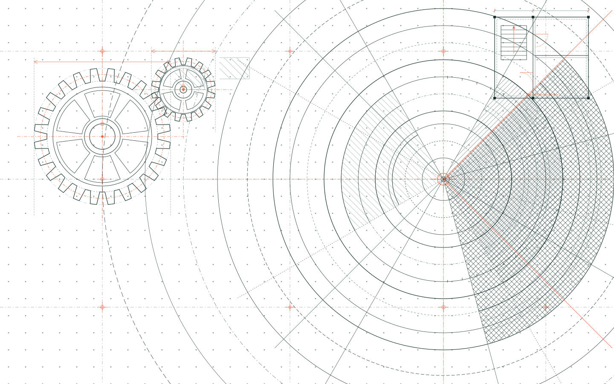
      
    

    

      <h1 id="landing-title">Một bản đồ sống cho thế giới <em>Data Engineering.</em></h1>
      

        Tập hợp những bài viết đi từ <strong>lý do một công cụ tồn tại</strong>
        đến cách nó vận hành bên trong — để chúng ta không chỉ biết dùng tool,
        mà còn biết mình đang xây điều gì.
      

      

        <a class="landing-button landing-button--primary" href="#thu-vien">
          Chọn bài để đọc ↘
        </a>
      

      

        ✦ Viết bằng tiếng Việt · Cập nhật theo hành trình học và làm
      

    

    

      

        Những bài viết nên đọc
        <svg viewBox="0 0 180 220" role="presentation">
          <path d="M5 12C55 5 78 20 84 49C92 88 108 143 157 177"></path>
          <path d="M151 165L160 179L144 182"></path>
        </svg>
      

      

        

          FIELD MAP / 001
          <i></i> ONGOING
        

        

          

            <article class="article-sheet article-sheet--airflow" data-article-title="Kiến trúc Apache Airflow" data-deck-position="current">
              

                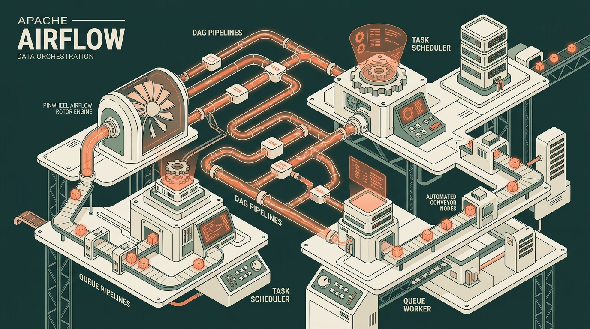
              

              
ORCHESTRATION<b>01 / 08</b>

              

                Đã xuất bản
                <h2>Hiểu kiến trúc Apache Airflow</h2>
                
Từ nhu cầu điều phối đến Scheduler, Executor và High Availability.

              

              

                Tác giả · Phong Thanh
                <a href="airflow/architecture/">Mở bài viết <b aria-hidden="true">↗</b></a>
              

            </article>

            <article class="article-sheet article-sheet--storage" data-article-title="Shared-disk vs shared-nothing" data-deck-position="next">
              

                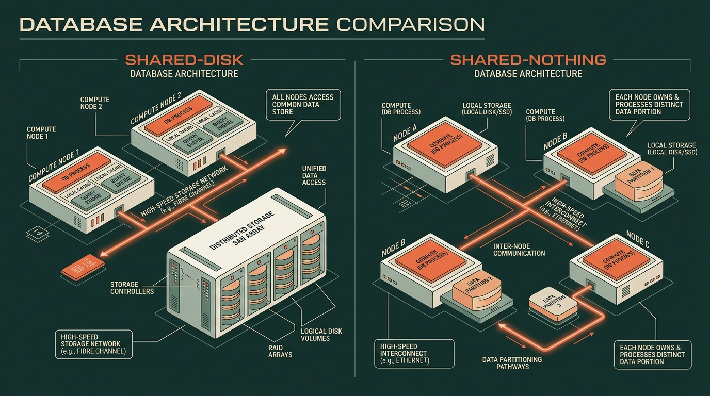
              

              
DATA ARCHITECTURE<b>02 / 08</b>

              

                Đã xuất bản
                <h2>Shared-disk vs shared-nothing</h2>
                
Chọn topology dữ liệu từ góc nhìn Data Engineer: query, shuffle và failure.

              

              

                Tác giả · AI Research
                <a href="architecture/shared-disk-vs-shared-nothing/">Mở bài viết <b aria-hidden="true">↗</b></a>
              

            </article>

            <article class="article-sheet article-sheet--index" data-article-title="Index trong cơ sở dữ liệu" data-deck-position="back">
              

                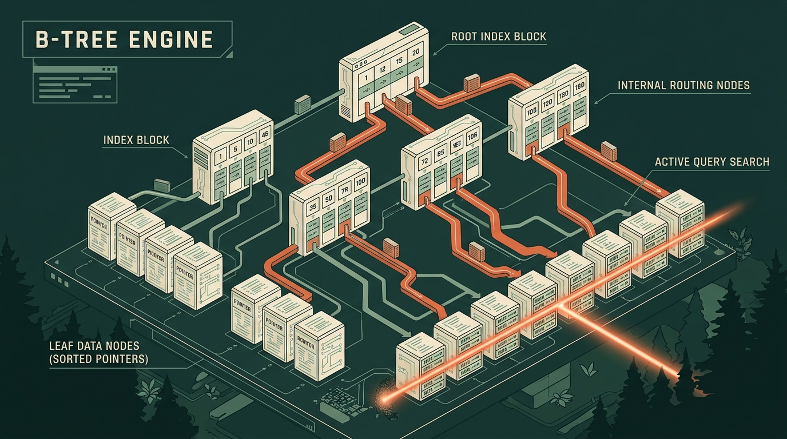
              

              
DATABASE INTERNALS<b>03 / 08</b>

              

                Đã xuất bản
                <h2>Index trong cơ sở dữ liệu</h2>
                
Từ full table scan đến cấu trúc dữ liệu giúp database tìm bản ghi nhanh hơn.

              

              

                Tác giả · Phong Thanh
                <a href="index/">Mở bài viết <b aria-hidden="true">↗</b></a>
              

            </article>

            <article class="article-sheet article-sheet--postgres" data-article-title="Phân cấp &amp; Lưu trữ PostgreSQL" data-deck-position="hidden">
              

                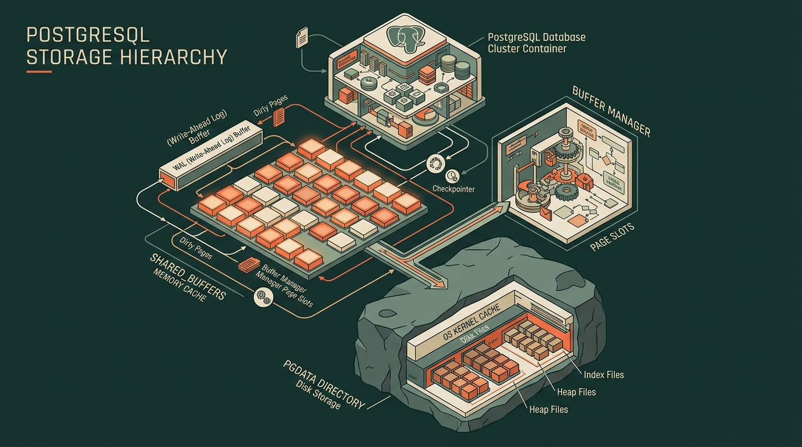
              

              
DATABASE INTERNALS<b>04 / 08</b>

              

                Bài mới nhất
                <h2>PostgreSQL Phân cấp &amp; lưu trữ</h2>
                
Database cluster, bộ đệm shared_buffers, database, schema và cấu trúc thư mục PGDATA.

              

              

                DATABASE INTERNALS
                <a href="postgres/postgres/">Mở bài viết <b aria-hidden="true">↗</b></a>
              

            </article>

            <article class="article-sheet article-sheet--planned" data-article-title="Apache Spark internals" data-deck-position="hidden">
              

                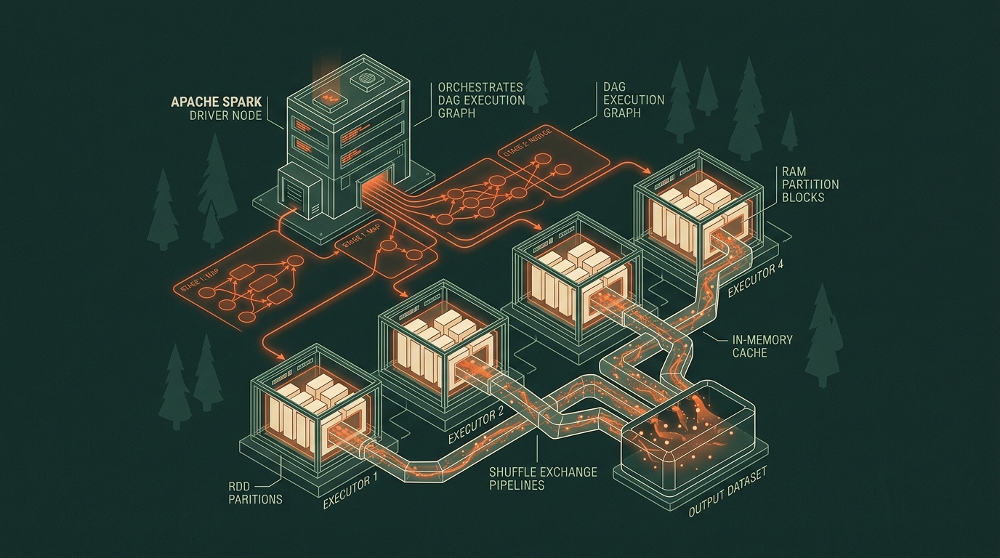
              

              
PROCESSING<b>05 / 08</b>

              

                Trong lộ trình
                <h2>Apache Spark internals</h2>
                
Partition, DAG execution, shuffle và cách một job thật sự chạy qua cluster.

              

              
Dự kiến<em>Đang lên dàn ý</em>

            </article>

            <article class="article-sheet article-sheet--planned article-sheet--clay" data-article-title="Apache Kafka internals" data-deck-position="hidden">
              

                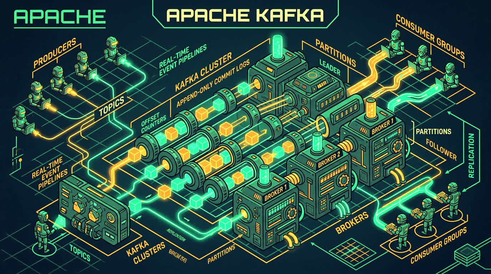
              

              
STREAMING<b>06 / 08</b>

              

                Trong lộ trình
                <h2>Apache Kafka internals</h2>
                
Log phân tán, partition ownership và những đánh đổi của delivery semantics.

              

              
Dự kiến<em>Chờ nghiên cứu</em>

            </article>

            <article class="article-sheet article-sheet--planned article-sheet--blue" data-article-title="dbt: từ SQL đến lineage" data-deck-position="hidden">
              

                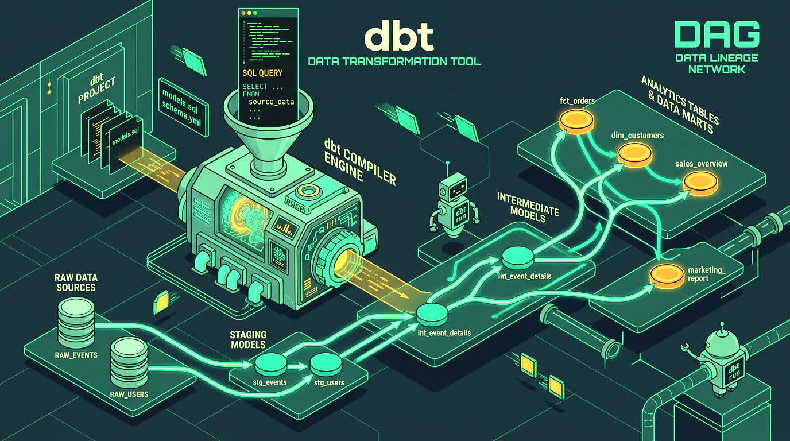
              

              
TRANSFORMATION<b>07 / 08</b>

              

                Trong lộ trình
                <h2>dbt: từ SQL đến lineage</h2>
                
Compiler, materialization và cách tổ chức transformation thành sản phẩm dữ liệu.

              

              
Dự kiến<em>Chờ nghiên cứu</em>

            </article>

            <article class="article-sheet article-sheet--planned article-sheet--ink" data-article-title="Docker và Kubernetes cho Data Engineer" data-deck-position="hidden">
              

                
              

              
INFRASTRUCTURE<b>08 / 08</b>

              

                Trong lộ trình
                <h2>Docker &amp; Kubernetes cho Data Engineer</h2>
                
Từ một container đến workload dữ liệu có thể deploy, quan sát và phục hồi.

              

              
Dự kiến<em>Chờ nghiên cứu</em>

            </article>
          

          

            <button class="article-deck__control" type="button" data-deck-action="previous" aria-label="Xem bài trước">←</button>
            
<b>Lật bài</b> bằng nút, phím mũi tên hoặc kéo sang trái

            <button class="article-deck__control" type="button" data-deck-action="next" aria-label="Xem bài tiếp theo">→</button>
          

          

        

        

          <b>04</b> bài đã mở
          <b>04</b> bài sắp tới
          <b>04</b> / 08
        

      

      
      
    

  </section>

  <section class="library-section" id="thu-vien" aria-labelledby="library-title">
    

      
    

    

      

        
THE KNOWLEDGE SHELF / 01

        <h2 id="library-title">Hôm nay bạn muốn tìm hiểu điều gì?</h2>
      

    

    

      <article class="published-article published-article--latest published-article--postgres">
        04
        

          <svg class="published-article__illustration" viewBox="0 0 360 196" fill="none" aria-hidden="true" focusable="false"><path class="diagram-route" d="M180 45V64M70 82V64H290V82M180 64V82M70 112V137M180 112V137M290 112V137"/><g class="diagram-node diagram-node--accent"><rect x="128" y="15" width="104" height="30" rx="6"/><text x="180.0" y="34">CLUSTER</text></g><g class="diagram-node"><rect x="28" y="82" width="84" height="30" rx="6"/><text x="70.0" y="101">database</text></g><g class="diagram-node"><rect x="138" y="82" width="84" height="30" rx="6"/><text x="180.0" y="101">database</text></g><g class="diagram-node"><rect x="248" y="82" width="84" height="30" rx="6"/><text x="290.0" y="101">database</text></g><g class="diagram-node"><path d="M46 146v16c0 10 48 10 48 0v-16"/><ellipse cx="70" cy="146" rx="24" ry="8"/></g><g class="diagram-node"><path d="M156 146v16c0 10 48 10 48 0v-16"/><ellipse cx="180" cy="146" rx="24" ry="8"/></g><g class="diagram-node"><path d="M266 146v16c0 10 48 10 48 0v-16"/><ellipse cx="290" cy="146" rx="24" ry="8"/></g><circle class="diagram-signal" cx="180" cy="64" r="4"/></svg>
          
DATABASE INTERNALS · ED. 04

          Bài mới nhất
        

        <h3>PostgreSQL Phân cấp &amp; lưu trữ</h3>
        
Database cluster, bộ đệm shared_buffers, database, schema và cấu trúc thư mục PGDATA.

        <a href="postgres/postgres/">Đọc bài viết <b aria-hidden="true"><svg viewBox="0 0 24 24" fill="none"><path d="M6 18 18 6M6 6h12v12"/></svg></b></a>
      </article>

      <article class="published-article published-article--index">
        03
        

          <svg class="published-article__illustration" viewBox="0 0 360 196" fill="none" aria-hidden="true" focusable="false"><path class="diagram-route" d="M180 43V63H80V82M180 63H280V82M80 112V134H38V148M80 134H125V148M280 112V134H235V148M280 134H322V148"/><path class="diagram-route diagram-route--accent" d="M180 43V63H280V82M280 112V134H235V148"/><g class="diagram-node diagram-node--accent"><rect x="149" y="13" width="62" height="30" rx="6"/><text x="180.0" y="32">42</text></g><g class="diagram-node"><rect x="49" y="82" width="62" height="30" rx="6"/><text x="80.0" y="101">18</text></g><g class="diagram-node diagram-node--accent"><rect x="249" y="82" width="62" height="30" rx="6"/><text x="280.0" y="101">67</text></g><g class="diagram-node"><rect x="8" y="148" width="60" height="30" rx="6"/><text x="38.0" y="167">08 · 12</text></g><g class="diagram-node"><rect x="95" y="148" width="60" height="30" rx="6"/><text x="125.0" y="167">24 · 36</text></g><g class="diagram-node diagram-node--accent"><rect x="205" y="148" width="60" height="30" rx="6"/><text x="235.0" y="167">51 · 58</text></g><g class="diagram-node"><rect x="292" y="148" width="60" height="30" rx="6"/><text x="322.0" y="167">73 · 91</text></g><circle class="diagram-signal" cx="235" cy="134" r="4"/></svg>
          
DATABASE INTERNALS · ED. 03

        

        <h3>Index trong cơ sở dữ liệu</h3>
        
Từ full table scan đến cấu trúc dữ liệu giúp database tìm bản ghi nhanh hơn.

        <a href="index/">Đọc bài viết <b aria-hidden="true"><svg viewBox="0 0 24 24" fill="none"><path d="M6 18 18 6M6 6h12v12"/></svg></b></a>
      </article>

      <article class="published-article published-article--airflow">
        01
        

          <svg class="published-article__illustration" viewBox="0 0 360 196" fill="none" aria-hidden="true" focusable="false"><path class="diagram-route" d="M69 94H110V40H145M110 94V148H145M215 40H249V94H289M215 148H249V94M215 94H289M110 94H145"/><g class="diagram-node diagram-node--accent"><rect x="7" y="79" width="62" height="30" rx="6"/><text x="38.0" y="98">DAG</text></g><g class="diagram-node"><rect x="145" y="25" width="70" height="30" rx="6"/><text x="180.0" y="44">extract</text></g><g class="diagram-node"><rect x="145" y="79" width="70" height="30" rx="6"/><text x="180.0" y="98">check</text></g><g class="diagram-node"><rect x="145" y="133" width="70" height="30" rx="6"/><text x="180.0" y="152">load</text></g><g class="diagram-node diagram-node--accent"><rect x="289" y="79" width="64" height="30" rx="6"/><text x="321.0" y="98">ready</text></g><circle class="diagram-signal" cx="110" cy="94" r="4"/><circle class="diagram-signal diagram-signal--late" cx="249" cy="94" r="4"/></svg>
          
ORCHESTRATION · ED. 01

        

        <h3>Hiểu kiến trúc Apache Airflow</h3>
        
Từ nhu cầu điều phối đến Scheduler, Executor và High Availability.

        <a href="airflow/architecture/">Đọc bài viết <b aria-hidden="true"><svg viewBox="0 0 24 24" fill="none"><path d="M6 18 18 6M6 6h12v12"/></svg></b></a>
      </article>

      <article class="published-article published-article--storage">
        02
        

          <svg class="published-article__illustration" viewBox="0 0 360 196" fill="none" aria-hidden="true" focusable="false"><path class="diagram-divider" d="M180 15V176"/><path class="diagram-route" d="M45 58V90H135V58M90 90V116M225 58V116M315 58V116"/><g class="diagram-node"><rect x="18" y="28" width="54" height="30" rx="6"/><text x="45.0" y="47">CPU</text></g><g class="diagram-node"><rect x="108" y="28" width="54" height="30" rx="6"/><text x="135.0" y="47">CPU</text></g><g class="diagram-node"><rect x="198" y="28" width="54" height="30" rx="6"/><text x="225.0" y="47">CPU</text></g><g class="diagram-node"><rect x="288" y="28" width="54" height="30" rx="6"/><text x="315.0" y="47">CPU</text></g><g class="diagram-node diagram-node--accent"><path d="M63 125v23c0 12 54 12 54 0v-23"/><ellipse cx="90" cy="125" rx="27" ry="9"/></g><g class="diagram-node diagram-node--accent"><path d="M198 125v23c0 12 54 12 54 0v-23"/><ellipse cx="225" cy="125" rx="27" ry="9"/></g><g class="diagram-node diagram-node--accent"><path d="M288 125v23c0 12 54 12 54 0v-23"/><ellipse cx="315" cy="125" rx="27" ry="9"/></g><text class="diagram-caption" x="90" y="181">SHARED DISK</text><text class="diagram-caption" x="270" y="181">SHARED NOTHING</text><circle class="diagram-signal" cx="90" cy="90" r="4"/></svg>
          
DATA ARCHITECTURE · ED. 02

        

        <h3>Shared-disk vs shared-nothing</h3>
        
Chọn topology dữ liệu từ góc nhìn Data Engineer: query, shuffle và failure.

        <a href="architecture/shared-disk-vs-shared-nothing/">Đọc bài viết <b aria-hidden="true"><svg viewBox="0 0 24 24" fill="none"><path d="M6 18 18 6M6 6h12v12"/></svg></b></a>
      </article>
    

  </section>

  <section class="writing-section" id="cach-viet" aria-labelledby="writing-title">
    

      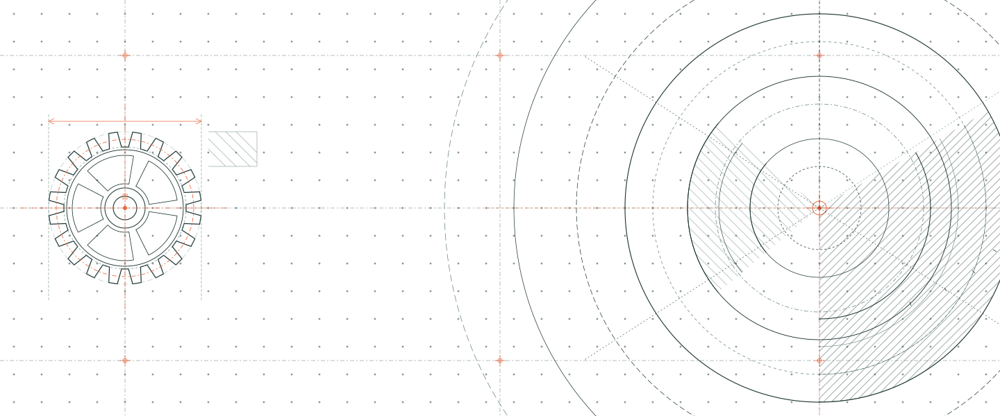
    

    

      

        

          
          
HOW THESE NOTES ARE MADE / 02

        

        <h2 id="writing-title">Không học thuộc tool. <em>Học cách nó suy nghĩ.</em></h2>
      

      

        QUY TRÌNH BIÊN SOẠN · 3 GIAI ĐOẠN
        

          Mỗi bài viết được xây như một cuộc điều tra nhỏ: bắt đầu bằng câu hỏi
          “vì sao”, đi vào phần lõi, rồi quay lại với quyết định trong thực tế.
        

      

    

    

      
SOURCE<i class="dag-portal dag-portal--source"></i>

      

      
01 · PROBLEM<i></i>

      

      
02 · INTERNALS<i></i>

      

      
03 · TRADE-OFF<i></i>

      

      
PRODUCTION<i class="dag-portal dag-portal--production"></i>

      

        

          

            
            
            
          

        

      

    

    

      <article class="writing-card" data-step-number="01" role="listitem">
        <header class="writing-card__header">
          

            <small>BƯỚC</small><b>01</b>
          

          

            ORIGIN / NGUYÊN DO
          

        </header>

        

          PROBLEM
        

        <h3 class="writing-card__title">Bắt đầu từ vấn đề</h3>
        
“Tại sao giải pháp này cần phải ra đời?”

        

          Trước mỗi component luôn là một bài toán thực tế: điểm nghẽn cổ chai,
          giới hạn mở rộng hoặc sự sụp đổ của những cách tiếp cận cũ.
        

        <footer class="writing-card__tags" aria-label="Khía cạnh phân tích">
          Root Problem
          Why it exists
          Failure Modes
        </footer>
      </article>

      <article class="writing-card" data-step-number="02" role="listitem">
        <header class="writing-card__header">
          

            <small>BƯỚC</small><b>02</b>
          

          

            INTERNALS / BÊN TRONG
          

        </header>

        

          CORE MECHANISM
        

        <h3 class="writing-card__title">Mở chiếc hộp đen</h3>
        
“Bên dưới nắp máy thật sự vận hành ra sao?”

        

          Bóc tách từng tầng kiến trúc, luồng dữ liệu (data flow) và trạng thái
          phân tán, thay vì dừng lại ở các câu lệnh cấu hình bề mặt.
        

        <footer class="writing-card__tags" aria-label="Khía cạnh phân tích">
          Architecture
          Data Flow
          State &amp; Locks
        </footer>
      </article>

      <article class="writing-card" data-step-number="03" role="listitem">
        <header class="writing-card__header">
          

            <small>BƯỚC</small><b>03</b>
          

          

            SYNTHESIS / THỰC CHIẾN
          

        </header>

        

          PRODUCTION
        

        <h3 class="writing-card__title">Nối lại với thực tế</h3>
        
“Đánh đổi điều gì khi đưa vào vận hành?”

        

          Hiểu rõ giới hạn chịu tải, chi phí vận hành và ranh giới phù hợp để
          đưa ra quyết định kiến trúc chuẩn xác cho hệ thống thực tế.
        

        <footer class="writing-card__tags" aria-label="Khía cạnh phân tích">
          Trade-offs
          Failure Modes
          Production Limits
        </footer>
      </article>
    

    
  </section>

  <section class="author-section" id="nguoi-viet" aria-labelledby="author-title">
    

      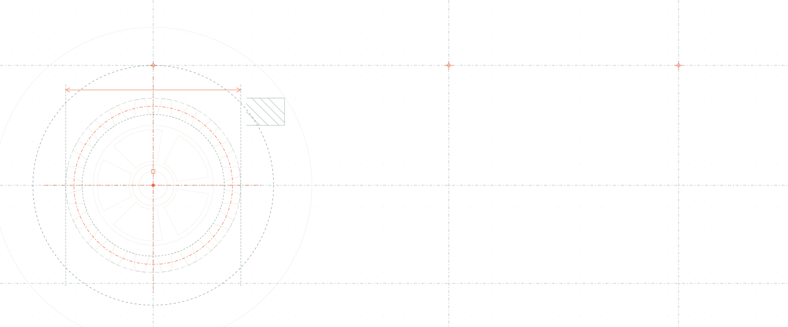
    

    

      
PERSONAL LOG / 001

      PEOPLE BEHIND THE NOTES
    

    

      TOGETHER
      <figure class="author-photo">
        

          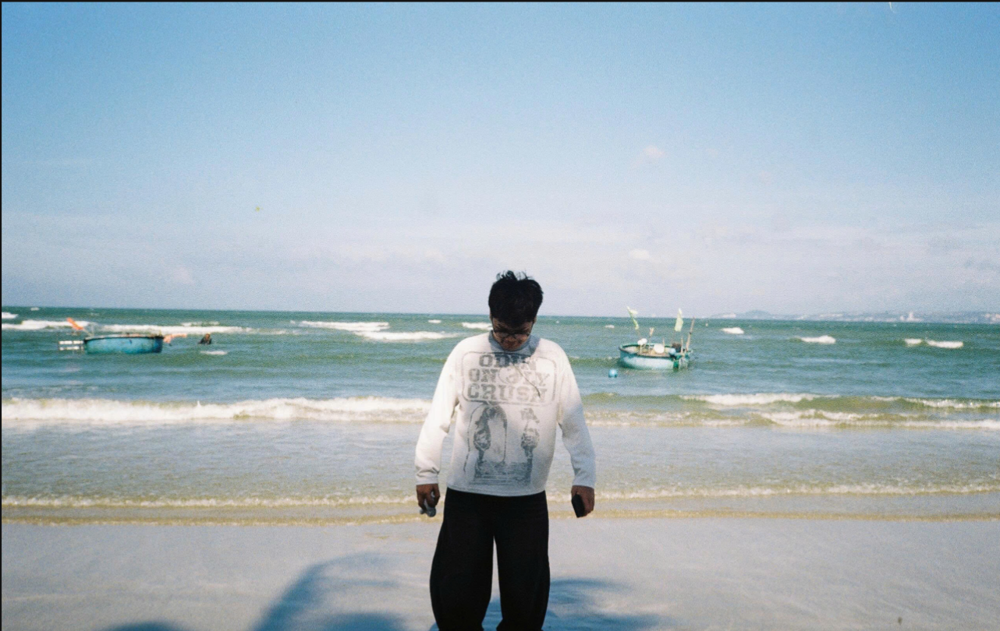
        

        <figcaption>OFFLINE / PHAN THIET© 28.08.2026</figcaption>
      </figure>

      

        
A NOTE FROM THE AUTHOR / ĐÔI LỜI

        <h2 id="author-title">Chào bạn, cảm ơn vì đã ghé qua.</h2>
        

          AUTHOR'S PRINCIPLE / 01
          Mình tin rằng <strong>hiểu sâu</strong> một công cụ là cách tốt nhất để dùng nó đơn giản hơn.
        

        

          

            Trang này bắt đầu từ một nhu cầu rất đơn giản: mình muốn lưu lại những
            lần phải đào sâu để hiểu một công cụ thực sự vận hành ra sao — không
            chỉ là vài câu lệnh đủ để nó chạy.
          

          

            Kiến thức <strong class="author-keyword">Data Engineering</strong> thường nằm rải rác giữa documentation,
            source code và những lần hệ thống gặp sự cố. Mình gom chúng lại ở đây,
            bằng thứ ngôn ngữ mà chính mình cũng muốn đọc khi mới bắt đầu.
          

          

            Thư viện bắt đầu với <strong class="author-keyword">Airflow</strong> và các nền tảng kiến trúc dữ liệu. Mình hy vọng
            mỗi lần quay lại, bạn sẽ tìm thấy thêm một mảnh ghép hữu ích cho hệ thống
            mà bạn đang xây.
          

        

        

          Author
          
<strong>Phong Thanh</strong><small>Học, làm, rồi ghi lại.</small>

        

      

    

    <article class="coauthor-card" aria-labelledby="coauthor-title">
      

        

          COLLABORATOR FILE<b>02</b>
        

        
A SECOND POINT OF VIEW / ĐỒNG TÁC GIẢ

        <h3 id="coauthor-title">Thêm một góc nhìn, thêm một lớp rõ ràng.</h3>
        

          CO-AUTHOR'S PRINCIPLE / 02
          Một ghi chú tốt không chỉ cần được <strong>viết kỹ</strong> — nó còn cần một người
          sẵn sàng hỏi lại những điều tưởng như đã hiển nhiên.
        

        

          Danh đồng hành cùng Behind the Pipeline trong vai trò đồng tác giả: trao đổi
          <strong class="author-keyword">hướng tiếp cận</strong>, rà lại mạch giải thích và giúp mỗi bài viết gần hơn
          với <strong class="author-keyword">trải nghiệm của người đọc</strong>.
        

        

          Co-author
          
<strong>Danh</strong><small>Cùng đọc, cùng chất vấn, cùng hoàn thiện.</small>

        

      

      <figure class="coauthor-card__photo">
        

          
        

        <figcaption>CO-AUTHOR PORTRAITBEHIND THE PIPELINE / 2026</figcaption>
      </figure>
    </article>
  </section>

  <footer class="landing-footer">
    
<strong>BEHIND THE</strong> <b>PIPELINE</b>

    
Built slowly. Understood deeply.

    <a href="#landing-title">Lên đầu trang ↑</a>
  </footer>

