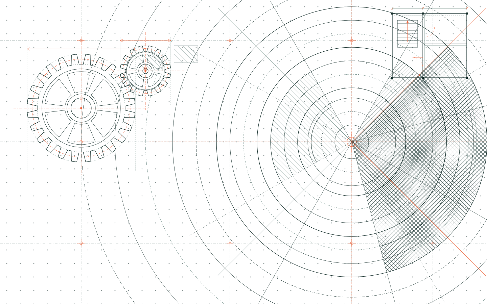
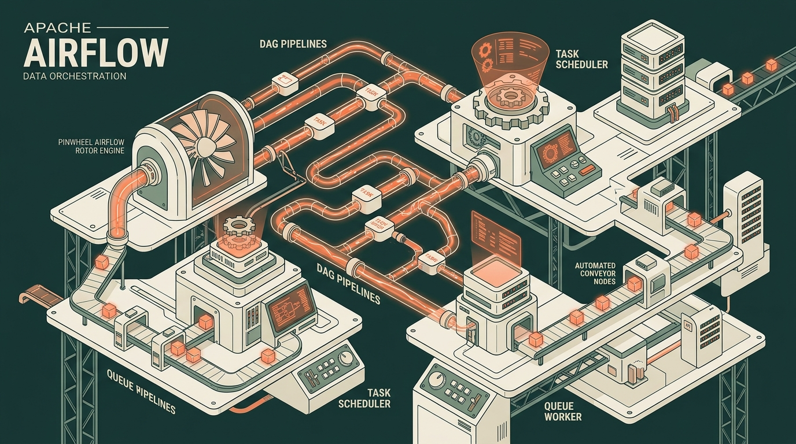
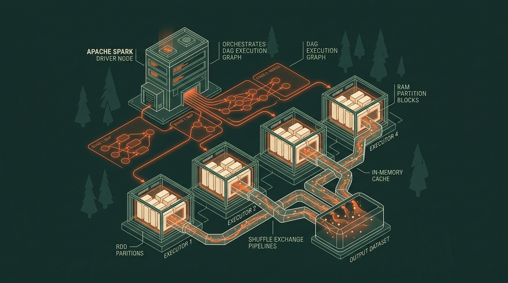
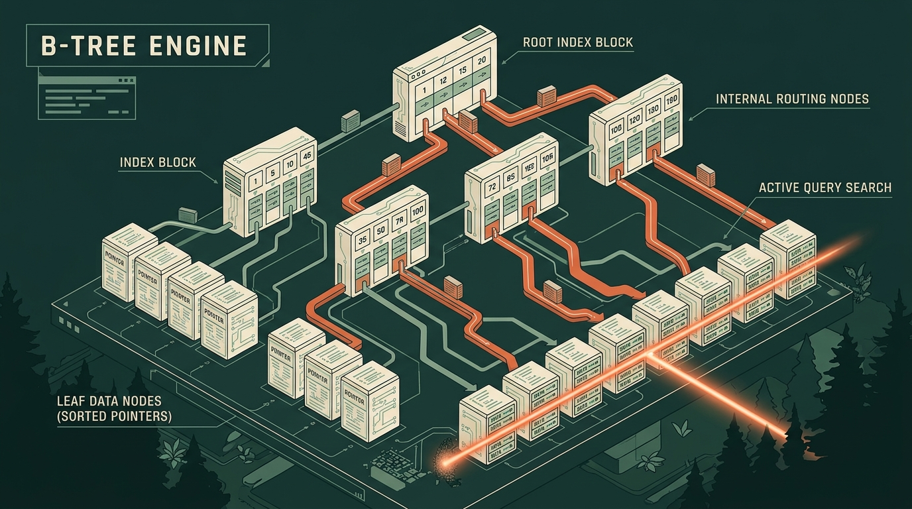
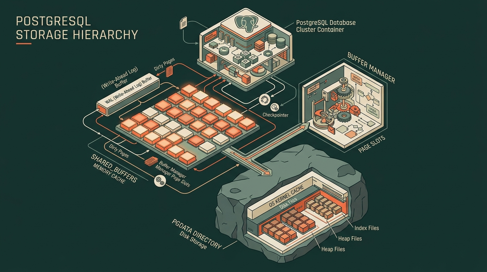
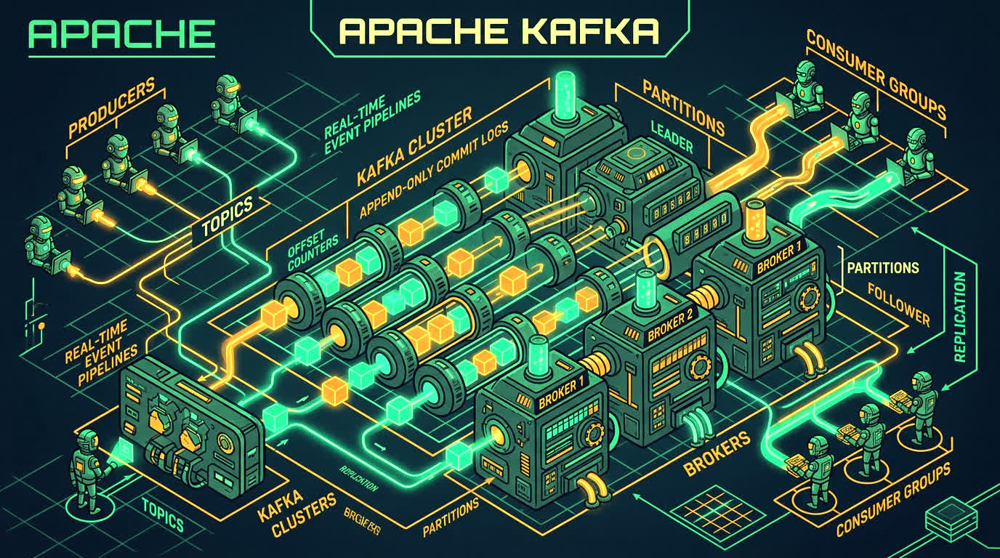
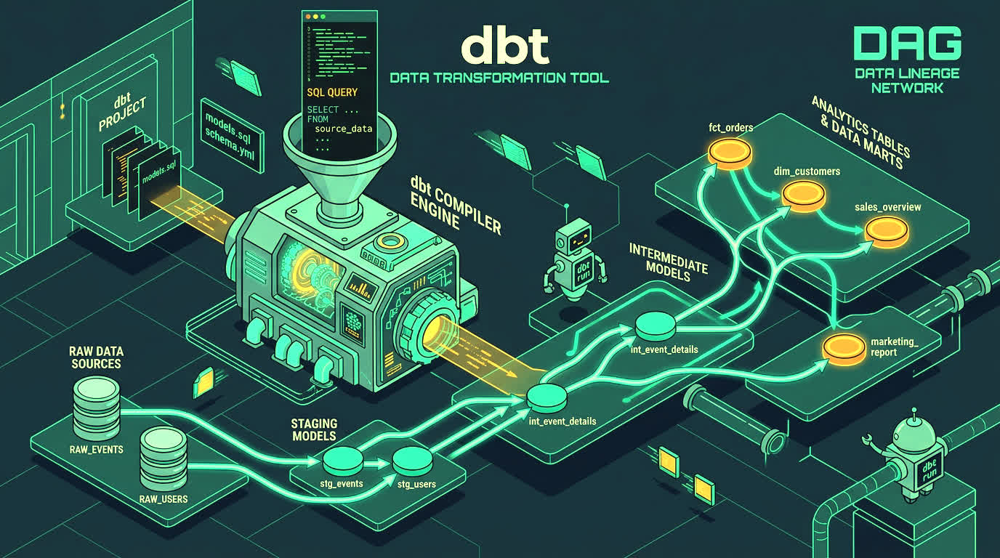
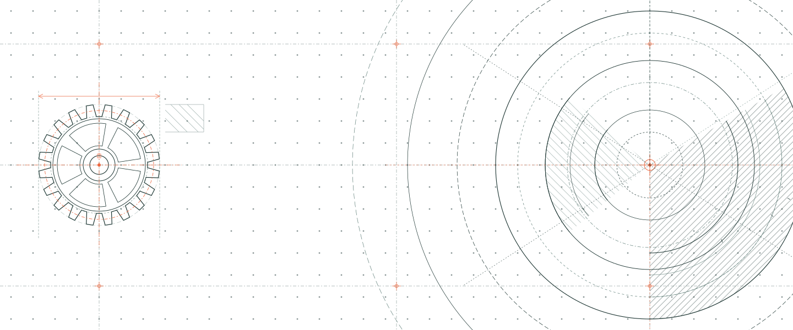
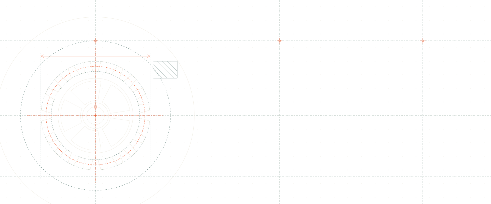
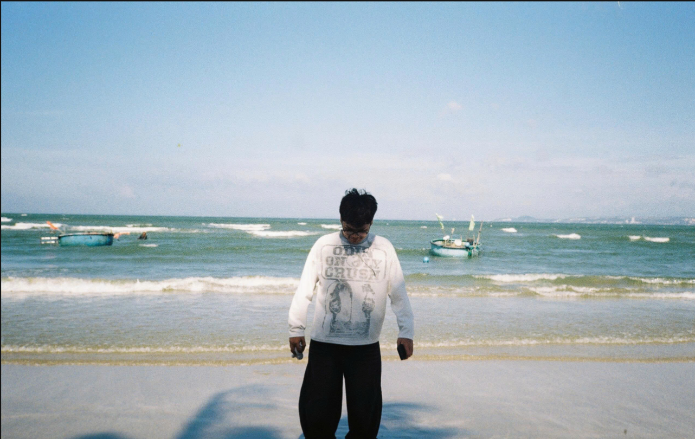

---
hide:
  - navigation
  - toc
---

  <section class="landing-hero" aria-labelledby="landing-title">
    

      
      
    

    

      <h1 id="landing-title">
        Hiểu sâu thế giới
        <em>Data Engineering.</em>
      </h1>
      

        Tập hợp những bài viết đi từ <strong>lý do một công cụ tồn tại</strong>
        đến cách nó vận hành bên trong — để chúng ta không chỉ biết dùng tool,
        mà còn biết mình đang xây điều gì.
      

      

        <a class="landing-button landing-button--primary" href="#thu-vien">
          Chọn bài để đọc ↘
        </a>
      

      

        ✦ Viết bằng tiếng Việt · Cập nhật theo hành trình học và làm
      

    

    

      

        Những bài viết nên đọc
        <svg viewBox="0 0 180 220" role="presentation">
          <path d="M5 12C55 5 78 20 84 49C92 88 108 143 157 177"></path>
          <path d="M151 165L160 179L144 182"></path>
        </svg>
      

      

        

          FIELD MAP / 001
          <i></i> ONGOING
        

        

          

            <article class="article-sheet article-sheet--airflow" data-article-title="Kiến trúc Apache Airflow" data-deck-position="current">
              

                
              

              
ORCHESTRATION<b>01 / 08</b>

              

                Đã xuất bản
                <h2>Hiểu kiến trúc Apache Airflow</h2>
                
Từ nhu cầu điều phối đến Scheduler, Executor và High Availability.

              

              

                Tác giả · Phong Thanh
                <a href="airflow/architecture/">Mở bài viết <b aria-hidden="true">↗</b></a>
              

            </article>

            <article class="article-sheet article-sheet--spark" data-article-title="Kiến trúc Apache Spark (phần 1)" data-deck-position="next">
              

                
              

              
DISTRIBUTED COMPUTING<b>02 / 08</b>

              

                Đã xuất bản
                <h2>Kiến trúc Apache Spark (phần 1)</h2>
                
Từ Driver và Executor đến luồng thực thi Job, Stage, Task và cơ chế shuffle.

              

              

                DISTRIBUTED COMPUTING
                <a href="spark/archi/">Mở bài viết <b aria-hidden="true">↗</b></a>
              

            </article>

            <article class="article-sheet article-sheet--spark" data-article-title="Kiến trúc Apache Spark (phần 2)" data-deck-position="back">
              

                
              

              
DISTRIBUTED COMPUTING<b>03 / 08</b>

              

                Đã xuất bản
                <h2>Kiến trúc Apache Spark (phần 2)</h2>
                
Các chiến lược Join, vai trò của RDD, giao tiếp PySpark và quản lý bộ nhớ Driver, Executor.

              

              

                DISTRIBUTED COMPUTING
                <a href="spark/p2/">Mở bài viết <b aria-hidden="true">↗</b></a>
              

            </article>

            <article class="article-sheet article-sheet--index" data-article-title="Index trong cơ sở dữ liệu" data-deck-position="hidden">
              

                
              

              
DATABASE INTERNALS<b>04 / 08</b>

              

                Đã xuất bản
                <h2>Index trong cơ sở dữ liệu</h2>
                
Từ full table scan đến cấu trúc dữ liệu giúp database tìm bản ghi nhanh hơn.

              

              

                Tác giả · Phong Thanh
                <a href="index/">Mở bài viết <b aria-hidden="true">↗</b></a>
              

            </article>

            <article class="article-sheet article-sheet--postgres" data-article-title="PostgreSQL (phần 1): Phân cấp, tiến trình và bộ nhớ" data-deck-position="hidden">
              

                
              

              
DATABASE INTERNALS<b>05 / 08</b>

              

                Đã xuất bản
                <h2>PostgreSQL (phần 1) Phân cấp, tiến trình &amp; bộ nhớ</h2>
                
Cluster, database, schema, kết nối, cơ chế khóa và bộ nhớ phục vụ truy vấn.

              

              

                DATABASE INTERNALS
                <a href="postgres/postgres/">Mở bài viết <b aria-hidden="true">↗</b></a>
              

            </article>

            <article class="article-sheet article-sheet--planned article-sheet--clay" data-article-title="Apache Kafka internals" data-deck-position="hidden">
              

                
              

              
STREAMING<b>06 / 08</b>

              

                Trong lộ trình
                <h2>Apache Kafka internals</h2>
                
Log phân tán, partition ownership và những đánh đổi của delivery semantics.

              

              
Dự kiến<em>Chờ nghiên cứu</em>

            </article>

            <article class="article-sheet article-sheet--planned article-sheet--blue" data-article-title="dbt: từ SQL đến lineage" data-deck-position="hidden">
              

                
              

              
TRANSFORMATION<b>07 / 08</b>

              

                Trong lộ trình
                <h2>dbt: từ SQL đến lineage</h2>
                
Compiler, materialization và cách tổ chức transformation thành sản phẩm dữ liệu.

              

              
Dự kiến<em>Chờ nghiên cứu</em>

            </article>

            <article class="article-sheet article-sheet--planned article-sheet--ink" data-article-title="Docker và Kubernetes cho Data Engineer" data-deck-position="hidden">
              

                
              

              
INFRASTRUCTURE<b>08 / 08</b>

              

                Trong lộ trình
                <h2>Docker &amp; Kubernetes cho Data Engineer</h2>
                
Từ một container đến workload dữ liệu có thể deploy, quan sát và phục hồi.

              

              
Dự kiến<em>Chờ nghiên cứu</em>

            </article>
          

          

            <button class="article-deck__control" type="button" data-deck-action="previous" aria-label="Xem bài trước">←</button>
            
<b>Lật bài</b> bằng nút, phím mũi tên hoặc kéo sang trái

            <button class="article-deck__control" type="button" data-deck-action="next" aria-label="Xem bài tiếp theo">→</button>
          

          

        

        

          <b>05</b> bài đã mở
          <b>03</b> bài sắp tới
          <b>05</b> / 08
        

      

      
      
    

  </section>

  <section class="library-section" id="thu-vien" aria-labelledby="library-title">
    

      

        
THE KNOWLEDGE SHELF / 01

        <h2 id="library-title">4 bài viết mới nhất</h2>
      

    

    

      <article class="published-article published-article--spark">
        06
        

          
DISTRIBUTED COMPUTING · ED. 06

        

        <svg class="published-article__illustration" viewBox="0 0 360 196" fill="none" aria-hidden="true" focusable="false">
          <path class="diagram-route" d="M90 65V95H180V125M270 65V95H180"/>
          <g class="diagram-node"><rect x="40" y="35" width="100" height="30" rx="6"/><text x="90" y="54">TABLE A</text></g>
          <g class="diagram-node"><rect x="220" y="35" width="100" height="30" rx="6"/><text x="270" y="54">TABLE B</text></g>
          <g class="diagram-node diagram-node--accent"><rect x="130" y="125" width="100" height="30" rx="6"/><text x="180" y="144">JOIN</text></g>
          <circle class="diagram-signal" cx="180" cy="95" r="4"/>
        </svg>
        <h3>Kiến trúc Apache Spark (phần 2)</h3>
        
Các chiến lược Join, vai trò của RDD, giao tiếp PySpark và quản lý bộ nhớ Driver, Executor.

        <a href="spark/p2/" aria-label="Đọc bài viết: Kiến trúc Apache Spark (phần 2)">Đọc bài viết <b aria-hidden="true"><svg viewBox="0 0 24 24" fill="none"><path d="M6 18 18 6M6 6h12v12"/></svg></b></a>
      </article>

      <article class="published-article published-article--spark">
        05
        

          
DISTRIBUTED COMPUTING · ED. 05

        

        <svg class="published-article__illustration" viewBox="0 0 360 196" fill="none" aria-hidden="true" focusable="false">
          <path class="diagram-route" d="M180 45V70M60 95V70H300V95M180 70V95M60 125V149M180 125V149M300 125V149"/>
          <g class="diagram-node diagram-node--accent"><rect x="132" y="15" width="96" height="30" rx="6"/><text x="180" y="34">DRIVER</text></g>
          <g class="diagram-node"><rect x="12" y="95" width="96" height="30" rx="6"/><text x="60" y="114">Executor</text></g>
          <g class="diagram-node"><rect x="132" y="95" width="96" height="30" rx="6"/><text x="180" y="114">Executor</text></g>
          <g class="diagram-node"><rect x="252" y="95" width="96" height="30" rx="6"/><text x="300" y="114">Executor</text></g>
          <g class="diagram-node diagram-node--accent"><rect x="24" y="149" width="72" height="28" rx="6"/><text x="60" y="167">TASKS</text></g>
          <g class="diagram-node diagram-node--accent"><rect x="144" y="149" width="72" height="28" rx="6"/><text x="180" y="167">TASKS</text></g>
          <g class="diagram-node diagram-node--accent"><rect x="264" y="149" width="72" height="28" rx="6"/><text x="300" y="167">TASKS</text></g>
          <circle class="diagram-signal" cx="180" cy="70" r="4"/>
        </svg>
        <h3>Kiến trúc Apache Spark (phần 1)</h3>
        
Từ Driver và Executor đến luồng thực thi Job, Stage, Task và cơ chế shuffle.

        <a href="spark/archi/" aria-label="Đọc bài viết: Kiến trúc Apache Spark (phần 1)">Đọc bài viết <b aria-hidden="true"><svg viewBox="0 0 24 24" fill="none"><path d="M6 18 18 6M6 6h12v12"/></svg></b></a>
      </article>

      <article class="published-article published-article--postgres">
        04
        

          
DATABASE INTERNALS · PHẦN 2

        

        <svg class="published-article__illustration" viewBox="0 0 360 196" fill="none" aria-hidden="true" focusable="false">
          <path class="diagram-route" d="M98 49H130M230 49H260M310 64V107H180V137"/>
          <g class="diagram-node"><rect x="8" y="34" width="90" height="30" rx="6"/><text x="53" y="53">PARSER</text></g>
          <g class="diagram-node"><rect x="130" y="34" width="100" height="30" rx="6"/><text x="180" y="53">PLANNER</text></g>
          <g class="diagram-node diagram-node--accent"><rect x="260" y="34" width="96" height="30" rx="6"/><text x="308" y="53">EXECUTOR</text></g>
          <g class="diagram-node diagram-node--accent"><rect x="118" y="137" width="124" height="30" rx="6"/><text x="180" y="156">BUFFERS / WAL</text></g>
          <circle class="diagram-signal" cx="180" cy="107" r="4"/>
        </svg>
        <h3>PostgreSQL (phần 2) Truy vấn, lưu trữ &amp; phục hồi</h3>
        
Hành trình SQL qua Parser, Planner, Executor đến bộ đệm, WAL, PGDATA và TOAST.

        <a href="postgres/p2/" aria-label="Đọc bài viết: PostgreSQL (phần 2): Truy vấn, lưu trữ và phục hồi">Đọc bài viết <b aria-hidden="true"><svg viewBox="0 0 24 24" fill="none"><path d="M6 18 18 6M6 6h12v12"/></svg></b></a>
      </article>

      <article class="published-article published-article--postgres">
        04
        

          
DATABASE INTERNALS · PHẦN 1

        

        <svg class="published-article__illustration" viewBox="0 0 360 196" fill="none" aria-hidden="true" focusable="false"><path class="diagram-route" d="M180 45V64M70 82V64H290V82M180 64V82M70 112V137M180 112V137M290 112V137"/><g class="diagram-node diagram-node--accent"><rect x="128" y="15" width="104" height="30" rx="6"/><text x="180.0" y="34">CLUSTER</text></g><g class="diagram-node"><rect x="28" y="82" width="84" height="30" rx="6"/><text x="70.0" y="101">database</text></g><g class="diagram-node"><rect x="138" y="82" width="84" height="30" rx="6"/><text x="180.0" y="101">database</text></g><g class="diagram-node"><rect x="248" y="82" width="84" height="30" rx="6"/><text x="290.0" y="101">database</text></g><g class="diagram-node"><path d="M46 146v16c0 10 48 10 48 0v-16"/><ellipse cx="70" cy="146" rx="24" ry="8"/></g><g class="diagram-node"><path d="M156 146v16c0 10 48 10 48 0v-16"/><ellipse cx="180" cy="146" rx="24" ry="8"/></g><g class="diagram-node"><path d="M266 146v16c0 10 48 10 48 0v-16"/><ellipse cx="290" cy="146" rx="24" ry="8"/></g><circle class="diagram-signal" cx="180" cy="64" r="4"/></svg>
        <h3>PostgreSQL (phần 1) Phân cấp, tiến trình &amp; bộ nhớ</h3>
        
Cluster, database, schema, kết nối, cơ chế khóa và bộ nhớ phục vụ truy vấn.

        <a href="postgres/postgres/" aria-label="Đọc bài viết: PostgreSQL (phần 1): Phân cấp, tiến trình và bộ nhớ">Đọc bài viết <b aria-hidden="true"><svg viewBox="0 0 24 24" fill="none"><path d="M6 18 18 6M6 6h12v12"/></svg></b></a>
      </article>
    

    
<a href="library/">Xem tất cả bài viết ↗</a>

  </section>

  <section class="writing-section" id="cach-viet" aria-labelledby="writing-title">
    

      
    

    

      

        

          
          
HOW THESE NOTES ARE MADE / 02

        

        <h2 id="writing-title">Không học thuộc tool. <em>Học cách nó suy nghĩ.</em></h2>
      

      

        PHƯƠNG PHÁP TRÌNH BÀY · 3 NGUYÊN TẮC
        

          Mỗi bài viết được biên soạn theo mạch truyền tải có chủ đích: khơi gợi từ câu hỏi
          bản chất, trực quan hóa luồng vận hành bên trong, và đúc kết tư duy đánh đổi thực tế.
        

      

    

    

      
ORIGIN<i class="dag-portal dag-portal--source"></i>

      

      
01 · PRINCIPLE<i></i>

      

      
02 · VISUALIZE<i></i>

      

      
03 · TRADE-OFF<i></i>

      

      
INTUITION<i class="dag-portal dag-portal--production"></i>

      

        

          

            
            
            
          

        

      

    

    

      <article class="writing-card" data-step-number="01" role="listitem">
        <header class="writing-card__header">
          

            <small>BƯỚC</small><b>01</b>
          

          

            GÓC NHÌN / ĐẶT VẤN ĐỀ
          

        </header>

        

          WHY OVER WHAT
        

        <h3 class="writing-card__title">Khởi đầu từ câu hỏi bản chất</h3>
        
“Vì sao công nghệ này bắt buộc phải tồn tại?”

        

          Thay vì liệt kê định nghĩa khô khan, bài viết luôn bắt đầu bằng bài toán thực tế
          và bối cảnh lịch sử. Đặt người đọc vào vị trí của người thiết kế để thấu hiểu
          động lực gốc rễ trước khi chạm vào cú pháp.
        

        <footer class="writing-card__tags" aria-label="Khía cạnh phân tích">
          First Principles
          Problem Context
          Design Motivation
        </footer>
      </article>

      <article class="writing-card" data-step-number="02" role="listitem">
        <header class="writing-card__header">
          

            <small>BƯỚC</small><b>02</b>
          

          

            MINH HỌA / BÓC TÁCH
          

        </header>

        

          SHOW DON'T TELL
        

        <h3 class="writing-card__title">Trực quan hóa luồng vận hành</h3>
        
“Làm sao để người đọc nhìn thấy chuyển động của dữ liệu?”

        

          Kiến trúc phức tạp được đơn giản hóa bằng sơ đồ luồng dữ liệu tự thiết kế và các phép
          ẩn dụ gần gũi. Tác giả biến những cơ chế trừu tượng thành hình ảnh mạch lạc, giúp
          người đọc nắm bắt trọn vẹn đường đi của hệ thống.
        

        <footer class="writing-card__tags" aria-label="Khía cạnh phân tích">
          Visual First
          Data Modeling
          Intuitive Diagrams
        </footer>
      </article>

      <article class="writing-card" data-step-number="03" role="listitem">
        <header class="writing-card__header">
          

            <small>BƯỚC</small><b>03</b>
          

          

            PHẢN BIỆN / ĐÁNH ĐỔI
          

        </header>

        

          NO SILVER BULLET
        

        <h3 class="writing-card__title">Đúc kết ranh giới &amp; Đánh đổi</h3>
        
“Cái giá phải trả và giới hạn thực tế là gì?”

        

          Không thần thánh hóa bất kỳ công cụ nào. Bài viết luôn khép lại bằng góc nhìn phản biện:
          chỉ rõ ranh giới phù hợp, cái giá phải trả và các điểm đánh đổi kinh điển, giúp người đọc
          tự tin ra quyết định kiến trúc độc lập.
        

        <footer class="writing-card__tags" aria-label="Khía cạnh phân tích">
          Trade-off Mindset
          Critical Thinking
          Practical Limits
        </footer>
      </article>
    

    
  </section>

  <section class="author-section" id="nguoi-viet" aria-labelledby="author-title">
    

      
    

    

      
PERSONAL LOG / 001

      PEOPLE BEHIND THE NOTES
    

    

      TOGETHER
      <figure class="author-photo">
        

          
        

        <figcaption>OFFLINE / PHAN THIET© 28.08.2026</figcaption>
      </figure>

      

        
A NOTE FROM THE AUTHOR / ĐÔI LỜI

        <h2 id="author-title">Chào bạn, cảm ơn vì đã ghé qua.</h2>
        

          AUTHOR'S PRINCIPLE / 01
          Mình tin rằng <strong>hiểu sâu</strong> một công cụ là cách tốt nhất để dùng nó đơn giản hơn.
        

        

          

            Trang này bắt đầu từ một nhu cầu rất đơn giản: mình muốn lưu lại những
            lần phải đào sâu để hiểu một công cụ thực sự vận hành ra sao — không
            chỉ là vài câu lệnh đủ để nó chạy.
          

          

            Kiến thức <strong class="author-keyword">Data Engineering</strong> thường nằm rải rác giữa documentation,
            source code và những lần hệ thống gặp sự cố. Mình gom chúng lại ở đây,
            bằng thứ ngôn ngữ mà chính mình cũng muốn đọc khi mới bắt đầu.
          

          

            Thư viện bắt đầu với <strong class="author-keyword">Airflow</strong> và các nền tảng kiến trúc dữ liệu. Mình hy vọng
            mỗi lần quay lại, bạn sẽ tìm thấy thêm một mảnh ghép hữu ích cho hệ thống
            mà bạn đang xây.
          

        

        

          Author
          
<strong>Phong Thanh</strong><small>Học, làm, rồi ghi lại.</small>

        

      

    

    <article class="coauthor-card" aria-labelledby="coauthor-title">
      

        

          COLLABORATOR FILE<b>02</b>
        

        
A SECOND POINT OF VIEW / ĐỒNG TÁC GIẢ

        <h3 id="coauthor-title">Thêm một góc nhìn, thêm một lớp rõ ràng.</h3>
        

          CO-AUTHOR'S PRINCIPLE / 02
          Một ghi chú tốt không chỉ cần được <strong>viết kỹ</strong> — nó còn cần một người
          sẵn sàng hỏi lại những điều tưởng như đã hiển nhiên.
        

        

          Danh đồng hành cùng Behind the Pipeline trong vai trò đồng tác giả: trao đổi
          <strong class="author-keyword">hướng tiếp cận</strong>, rà lại mạch giải thích và giúp mỗi bài viết gần hơn
          với <strong class="author-keyword">trải nghiệm của người đọc</strong>.
        

        

          Co-author
          
<strong>Danh</strong><small>Cùng đọc, cùng chất vấn, cùng hoàn thiện.</small>

        

      

      <figure class="coauthor-card__photo">
        

          
        

        <figcaption>CO-AUTHOR PORTRAITBEHIND THE PIPELINE / 2026</figcaption>
      </figure>
    </article>
  </section>

  <footer class="landing-footer">
    
<strong>BEHIND THE</strong> <b>PIPELINE</b>

    
Built slowly. Understood deeply.

    <a href="#landing-title">Lên đầu trang ↑</a>
  </footer>

