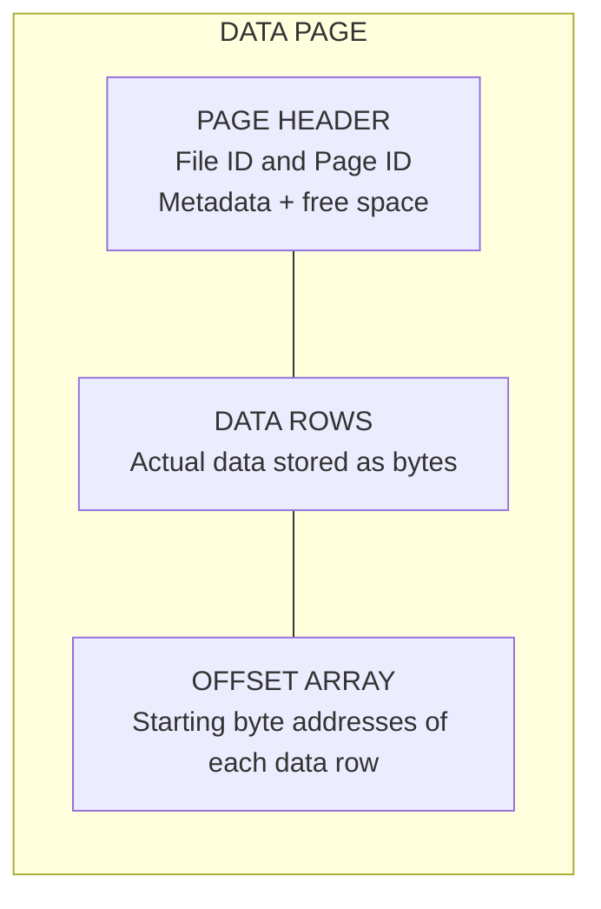
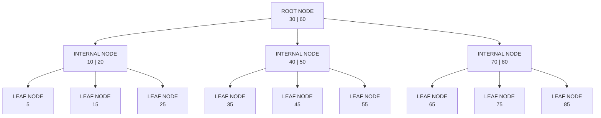

<header class="airflow-article-hero index-article-hero">
  <div class="airflow-article-hero__eyebrow">
    <a href="../../">BEHIND THE PIPELINE</a>
    <span>ARTICLE / 003</span>
  </div>
  <h1>Indexes in<br><em>Databases</em></h1>
  <p class="airflow-article-hero__dek">
    Why can the exact same query respond in a few milliseconds on a small table,
    yet take seconds when data scales to millions of rows?
  </p>
  <div class="airflow-article-hero__meta" aria-label="Article information">
    <span>DATABASE INTERNALS</span>
    <span>DEEP DIVE</span>
    <span>EDITION 03 · 2026</span>
  </div>
</header>

<figure class="airflow-opening-comic">
  
  <figcaption>
    <span>BEFORE YOU READ</span>
    <strong>A fairly long article</strong>
  </figcaption>
</figure>

## 1. How Do Databases Store Data?

To understand index concepts more easily, let us first look at **how databases store data on disk**.

When querying a database, we typically view data as rows and columns. However, at the storage layer, the DBMS does not access each row individually; instead, it **reads and writes in units called pages (or blocks)**. Depending on the database management system, each page ranges from 4 KB to 16 KB in size. Data is packed into a page as much as possible; when a page is full, the system allocates a new page to continue storing data.

### What Does a Page Contain?

Typically, a page consists of the following components:

- **Page Header:** Contains page metadata such as Page ID and free space.
- **Data Rows:** Stores actual row data as bytes.
- **Offset Array:** Stores the starting byte offset of each data row. As a result, when reading a row inside a page, the system simply looks up the Offset Array to access it directly instead of scanning the entire page.

Illustration of page structure:



### Heap and Clustered: Two Ways to Organize Data in a Page

Typically, data is organized inside pages in one of two ways:

- **Heap:** Data inside pages has no inherent order. The database writes incoming data wherever space is available, or searches for pages with sufficient free room. Because maintaining order is not required, **write operations are very fast**. In return, to find a specific row, the system must load pages into RAM one by one and scan row by row (**full table scan**), severely impacting query performance.
- **Clustered:** When a table has a clustered index (primary key), data in the database is **sorted by this key**. Writes take more time because the system must maintain that order, but **point and range queries are faster**. Because data is already sorted, the system only needs to locate the page containing the target row rather than reading every page.

## 2. What Is an Index?

Imagine you need to find a title in a very thick book. If the book **lacks a table of contents**, you must flip through it from the first page to the last until you find the right title. This approach is time-consuming, especially for a book thousands of pages long. A table of contents solves this problem by arranging titles in an order, such as alphabetical order, and listing their corresponding page numbers. To find a title, you simply **consult the table of contents and turn directly to the indicated page**.

Indexes in a database operate on the exact same idea. Instead of scanning every row to locate desired values, the system **consults the index** to quickly pinpoint the record or page holding the data, then **reads only what is necessary**.

An index is an **auxiliary data structure that accelerates lookups**. In internal nodes, it stores **separator keys and pointers** to child index pages. In leaf nodes, it stores keys with pointers or identifiers for data rows; depending on the index type, leaf nodes may contain the values themselves. The following sections explain when an index uses pointers and the roles of internal and leaf nodes. On disk, an index is usually organized into multiple **index pages**, each containing multiple **index entries**.


## 3. How Do B-tree and B+tree Work?

Index pages are not laid out flat; rather, they are linked together according to an index structure. The two most common index structures are **B-tree and B+tree**. These are **balanced multi-way search trees**, consisting of a root node, internal (intermediate) nodes, and leaf nodes. If you have studied data structures and algorithms, you can think of them as generalizations of balanced search trees like AVL or Red-Black trees. The key difference is that each node in a B-tree or B+tree can hold **multiple keys and multiple child branches**, rather than just two branches (left and right).

### High-Level Model: A Balanced B-tree



> **Note:** This diagram illustrates how keys **partition the search space** and how nodes connect. For visual clarity, the actual data rows or row pointers associated with each key are omitted. In a B-tree, every key in both internal and leaf nodes may carry row data or a row pointer; arrows in the diagram represent **child node pointers**.

### B-tree: Page Structure and Data Placement

In a B-tree, actual data or pointers to data can appear in both internal nodes and leaf nodes.

#### Internal Nodes

Each internal node contains **keys**, pointers to actual row data (**Row Identifier — RID**), and pointers to child nodes.

#### Leaf Nodes

Leaf nodes contain similar elements to internal nodes, but without child pointers. Leaf nodes are completely independent and do not maintain horizontal pointers to neighboring leaf nodes; in contrast, B+trees connect leaf nodes using a doubly linked list. Because keys in internal nodes are already paired with actual row data, those keys do not reappear in leaf nodes.

#### Range Queries and B-tree Characteristics

Because leaf nodes have no direct pointers linking them, performing a range scan forces the system to backtrack up to parent nodes and traverse down other branches repeatedly, increasing disk I/O operations.

The advantage of a B-tree is that because every node can hold row data, search operations can terminate early without always reaching a leaf node. On the other hand, because each node must store row pointers alongside search keys, fewer separator keys can fit into an individual page. As a result, the tree becomes deeper, requiring more disk reads during traversal.

**Internal page**

```text
[child ptr] [10 | Row ID] [child ptr] [20 | Row ID] [child ptr] [30 | Row ID] [child ptr]
```

**Leaf page**

```text
[5 | Row ID] [7 | Row ID] [9 | Row ID]
```

In a B-tree, **every page, including internal pages**, can hold keys with row pointers. For example, looking up key `20` can **terminate immediately at an internal page**.

### B+tree: Page Structure and Data Placement

B+tree overcomes most of the limitations found in traditional B-trees.

#### Internal Nodes

Internal nodes contain only **separator keys** and child node pointers, storing no actual row data. As a result, each node can hold more separator keys, reducing tree depth and disk I/O.

#### Leaf Nodes

All indexed keys appear in the leaf nodes. Each entry contains a key and a value; depending on the index type, the value may be a RID or the contents of the data row's columns. Leaf nodes are linked via a doubly linked list, making range queries efficient. In relational database management systems (RDBMS), B+tree and its variants have therefore become the common standard for order-preserving index structures.

**Internal page**

```text
[child0] [10] [child1] [20] [child2] [30] [child3]
```

**Leaf page**

```text
[5 | row ptr] [10 | row ptr] [15 | row ptr]
```

## 4. How Do Indexes Link to Table Data?

### Physical Pointers (RID — Row Identifier)

When the main table is stored as Heap Pages without a clustered index (such as in PostgreSQL), secondary indexes store static disk coordinates in the format `FileID:PageID:SlotNumber` to point directly to data rows.

A RID typically consists of the following components:

- **File ID:** Identifier of the data file on disk.
- **Page Number:** The sequential page number within that file.
- **Slot Number:** The specific index position within the page's Offset Array.

### Actual Data at Leaf Nodes and Clustered Indexes

A **clustered index** dictates the physical storage order of the entire table on disk. When a clustered index is built using a B+tree, the table itself is organized directly into this tree. The leaf nodes contain the actual data rows of the table, sorted and stored in the order of the clustered key. Therefore, at the leaf level, the clustered index *is* the table.

B+tree is the underlying data structure; a clustered index is the practical application of that structure to physically arrange and store the entire table on disk.

Each table can have only one clustered index because data on disk can be physically ordered in only one sequence. Columns that change frequently, such as a `status` column, should not be chosen as clustered keys because updating an index key incurs additional I/O.

Auto-incrementing columns are ideal candidates for clustered indexes because they have three properties: stability, uniqueness, and sequential growth.

### Logical Keys and the Lookup Process

When a primary table is organized via a clustered index and secondary indexes are added, secondary indexes store the value of the primary key instead of static physical disk addresses. For example, given `ID = 3`, the system uses this primary key value to traverse the clustered index tree and retrieve the full row.

> **Note:** The two models above—storing actual row data at leaf nodes versus storing logical keys—pertain specifically to B+trees.

Why do secondary indexes use logical keys—requiring traversing the tree twice (**Double Traversal**)—instead of physical RID pointers?

When data is inserted or changed, row locations may change. If secondary indexes stored physical RIDs, the system would have to update those RIDs, incurring additional I/O.


### Non-Clustered Indexes

A **non-clustered index** accelerates data retrieval without altering the physical storage order of the base table. It exists as an independent B+tree alongside the table.

By default, leaf nodes do not contain the full data row; instead, they store:

- The non-clustered index key.
- A row locator used to find the original row.
- Any `INCLUDE` columns, if configured.

The nature of the row locator depends on the table's storage model:

- **Tables with a clustered index:** Contains the clustered key.
- **Heap tables:** Contains the RID (physical row address).

Because non-clustered indexes do not alter how data is laid out on disk, a single table can support multiple non-clustered indexes.

## 5. How Do Indexes Change During Writes?

### During `INSERT` Operations

#### B-tree

The system traverses the tree to locate the target node where the value should reside. If the node has available space, the new key is inserted in proper sorted order. If the node is full, the system triggers a **page split**: it selects the middle key, splits the node into two distinct nodes, and promotes the middle key to the parent node as a routing key. If the parent node is also full, this split propagates upward recursively toward the root.

The inserted key falls into one of three cases:

1. **Smaller than the middle key:** Placed in the left child node.
2. **Greater than the middle key:** Placed in the right child node.
3. **Identical to the middle key:** Not kept in the children; promoted directly to the parent node.

For example, when inserting key `40`, the system temporarily arranges keys in sorted order:

```text
K₁ = 10 | K₂ = 20 | K₃ = 30 | K₄ = 40
```

In this example, `K₂ = 20` serves as the middle key. When the page split occurs:

1. The system promotes `K₂` (key `20` alongside its row pointer) to the parent node.
2. The left child node retains only keys preceding `K₂`, namely `[10]` (`K₁`).
3. The right child node retains keys following `K₂`, namely `[30, 40]` (`K₃` and `K₄`).

#### B+tree

Insertion in a B+tree follows a similar concept to B-trees, but traversal must always reach a leaf node because only leaf nodes hold row pointers or data. When a page split occurs, the middle key is copied (rather than moved) to the parent node, because B+tree requires all keys to remain present at the leaf level. After splitting into two nodes, the system also updates the bidirectional sibling pointers between both leaf nodes.

### During `DELETE` Operations

Deleting data is a complex process and can reduce node occupancy below the minimum threshold, causing an **underflow**.

#### B-tree

**Case 1: Key to delete resides in a leaf node**

The system deletes the key from the leaf node. If the node enters an underflow state, the system either borrows a key from an adjacent sibling or merges with that sibling.

**Borrowing a key**

The system can borrow a key from either the left or right sibling node. The separator key in the parent node is demoted into the deficient node. If borrowing from the left, the largest key in the left node is promoted to replace the parent separator; if borrowing from the right, the smallest key in the right node is promoted. This sequence preserves the ordered sorting invariant across the tree.

**State before borrowing:**

- Parent node contains `[30]`.
- Left child node contains `[10, 20]`.
- Right child node contains only `[40]` following deletion and is in underflow.

**Operations:**

1. Demote key `30` from parent to right child, forming `[30, 40]`.
2. Promote key `20` from left child to replace key `30` in the parent.

**Final state:** Parent contains `[20]`, left child contains `[10]`, right child contains `[30, 40]`. The tree is restored to balanced equilibrium.

**Merging nodes**

When borrowing is impossible because siblings hold only the minimum allowable keys, the system must merge two nodes to resolve underflow. The separator key in the parent node residing between the two children is demoted and merged with the contents of both siblings. The surplus empty node is deallocated. If removing a separator causes the parent to underflow, the borrow/merge process propagates up the tree.

For example, consider an order-5 B-tree where each node holds a minimum of 2 keys and a maximum of 4 keys.

**Initial state:**

- Parent node contains `[30, 60]`.
- Left child contains `[10, 20]`.
- Middle child contains `[40, 50]`.
- Right child contains `[70, 80]`.

**Operation: Delete key `50` from middle child.**

1. Middle child is left with only `[40]` and underflows (fewer than 2 keys).
2. Both sibling nodes `[10, 20]` and `[70, 80]` have exactly 2 keys (the minimum), leaving no spare keys to borrow.
3. The system pulls separator key `30` down from the parent between the left and middle nodes, merging them into a unified node:

    ```text
    [10, 20] + [30] + [40] = [10, 20, 30, 40]
    ```

4. The redundant middle node is freed.

**Final state:** The merged node holds `[10, 20, 30, 40]`, while parent retains `[60]`. If the parent now underflows, borrowing or merging repeats at higher levels.

**Case 2: Key to delete resides in an internal node**

Because keys in internal nodes route traversal paths, they cannot be deleted outright. The system locates the in-order predecessor or in-order successor in a leaf node, copies that key over the target key, and then deletes the duplicate from the leaf node.

**Initial state:**

- Internal node contains `[50]`, branching to left and right subtrees.
- Left subtree points to leaf node `[20, 35, 45]`.
- Right subtree points to leaf node `[60, 70]`.

**Operation: Delete key `50` from internal node.**

1. Find replacement key: The largest key in the left branch is `45` (in-order predecessor in left leaf).
2. Overwrite `50` with `45` in internal node, yielding `[45]`.
3. Delete `45` from left leaf node, leaving `[20, 35]`.
4. Check for underflow: Left leaf retains two keys, satisfying the minimum threshold.

**Final state:** Internal node holds `[45]`, left leaf holds `[20, 35]`. Deletion completes without tree rotation or node merging.

#### B+tree

Because all indexed keys reside at the leaf level, deletion always occurs in leaf nodes. If underflow occurs, standard sibling borrowing or node merging takes place.

### During `UPDATE` Operations

How indexes handle `UPDATE` statements depends entirely on whether updated columns belong to the index key:

- **Columns not part of the index key:** Updated directly without affecting index structures.
- **Columns belonging to the index key:** To maintain sort order, the system does not modify keys in place; instead, it executes a `DELETE` followed by an `INSERT`. Both operations consume additional I/O and resources, so changes to index keys should be limited.

### Maintenance Costs of Multiple Indexes

When a table has multiple non-clustered indexes, DML statements incur the following costs:

- **Multiplied write operations:** With 5 non-clustered indexes, a single `INSERT` forces 5 separate insertion operations across 5 B+trees, multiplying disk I/O and WAL logging by a factor of five.
- **Random disk writes:** Different indexes organize keys under different logical orderings. Updating a single row forces writes to distinct, widely separated disk pages, resulting in random rather than sequential disk I/O.
- **Page splits:** DML statements can cause page splits, which may propagate throughout a tree.

## 6. Hash Indexes

Besides the B-tree/B+tree family that plays a central role in RDBMSs, storage systems also use specialized structures such as Hash Indexes and GIN. This article provides only a brief overview of Hash Indexes.

### Lookup Mechanism

When a workload does not require range queries and prioritizes **point lookup** speed, a Hash Index is an option worth considering.

As the name implies, this structure utilizes a hash table, typically held permanently in memory (RAM) for optimal performance. By hashing search keys directly, average lookup complexity reaches the theoretical ideal of `O(1)`.

### Limitations of Hash Indexes

Despite good lookup performance, Hash Indexes have several notable drawbacks:

- **No support for range queries:** A hash function aims to distribute data randomly and evenly to minimize collisions, where different keys end up in the same bucket. As a result, two adjacent hash values may be stored on data pages far apart.
- **Unsuitable for tiny tables:** Scanning a tiny table sequentially is often faster than computing hashes and traversing buckets.
- **Dependent on RAM capacity:** For maximum performance, the hash table is kept in RAM. If it exceeds available RAM, system performance drops sharply. If the system loses power or fails, this hash table is lost and must be restored when the system starts again.

### Why Hash Functions Must Minimize Collisions

Hash functions must minimize collisions for the following reasons:

- Prevent **data skew**, where one bucket contains too many keys while another contains none.
- When too many keys cluster in one bucket, the system must search sequentially inside that bucket, erasing the `O(1)` speed advantage.
- When bucket capacity is exhausted, the system must allocate **overflow pages** chained via linked list pointers. Every overflow page access requires additional disk I/O; excessive I/O degrades overall system throughput.

### Why Hash Tables Exceeding RAM Degrade Performance

When a hash table exceeds RAM capacity, part of its data must be moved to disk. Because a hash function distributes data randomly, a query can easily target the disk-resident portion (**cache miss**), turning an in-memory lookup into a much slower random disk read (**Random I/O**).


### Process of Building an In-Memory Hash Table

Building a Hash Index / Hash Map in RAM in a database management system involves:

1. Sequentially scanning the entire log file on disk.
2. Identifying the physical disk location of each data record.
3. Hashing the key and loading it into RAM.

> **Note:** If RAM already contains a record location but a newer coordinate is encountered, the in-memory entry is updated. If a record is flagged as deleted, it is removed from the in-memory hash table.

## 7. Composite Indexes

### Multi-Column Filtering and Index Intersections

For a query with multiple `AND` conditions where each column has a separate secondary index, the system must perform an index intersection—an expensive operation.

**Index intersection** combines distinct indexes to filter data. For example, given `idx_customer(customer_id)` and `idx_status(status)`:

```sql
SELECT * FROM Orders
WHERE customer_id = 1205 AND status = 'COMPLETED';
```

When choosing index intersection, the system:

1. Scans `idx_customer`: Obtains row pointer set A where `customer_id = 1205`.
2. Scans `idx_status`: Obtains row pointer set B where `status = 'COMPLETED'`.
3. Computes intersection A ∩ B: Retains pointers common to both sets using list intersection or bitmap `AND`.
4. Accesses the table: Uses surviving pointers to retrieve full table rows.

> **Note:** The absence of a composite index does not guarantee the optimizer will choose an index intersection. Optimizers select plans based on cost estimates and engine capabilities.

Index intersection introduces several notable costs:

- **I/O overhead:** Traversing multiple B+trees increases total disk reads.
- **RAM and CPU consumption:** Buffers must be allocated to hold pointer lists, and CPU cycles are consumed sorting and intersecting sets.
- **Redundant retrieval:** Both indexes load candidate pointers that are ultimately discarded.

### Structure of Composite Keys

To reduce costs when queries often filter on multiple columns together, you can create a **composite index (compound index)**. It combines multiple columns in a single B+tree.

A composite B+tree shares the same structural framework as standard B+trees, but each key consists of a tuple of values rather than a single attribute. For instance, in an index on `(age, sex)`, a single key might be `(21, male)`.

Keys are sorted hierarchically: first by the leftmost column, then by the second column within ties of the first, then by the third column within ties of the second, and so on.

```text
                     [ ('Dev', 28)  |  ('HR', 30) ]
                    /               |              \
                   ▼                ▼               ▼
         [ ('Dev', 20) ]     [ ('Dev', 28) ]     [ ('HR', 30) ]
         [ ('Dev', 22) ] <-> [ ('HR', 25)  ] <-> [ ('HR', 32) ]
```

In the diagram above:

- Searching for employee `('HR', 25)`: The system notes this key is greater than `('Dev', 28)` but smaller than `('HR', 30)` (same HR department, `25 < 30`), traversing down the center branch.
- Searching for employee `('HR', 35)`: This key is greater than `('HR', 30)`, directing traversal to the rightmost branch.

### Leftmost Prefix Rule

Composite indexes follow the **Leftmost Prefix Rule**: they support queries that filter on a contiguous sequence of columns starting with the leftmost column.

Given an index on three columns `(A, B, C)`, queries utilize the index effectively only when filtering includes leading column `A`—for example, `WHERE a AND b`, `a AND c`, or `a AND b AND c`.

Why must queries start with the leftmost column? In composite index `(a, b)`, records are ordered primarily by `a`. Only within rows sharing identical values of `a` are records ordered by `b`.

When a query filters on `a`, the system quickly zeroes in on a continuous range. Within that range, `b` is already ordered, enabling rapid traversal:

```sql
WHERE a = 10 AND b = 20
```

Conversely, if `a` is omitted and the query filters only on `b`:

```sql
WHERE b = 20
```

Target values of `b` lie scattered across distinct groups of `a` throughout the index. The database must scan wide swaths—or the entirety—of the index, failing to leverage the B+tree's logarithmic search capabilities.

### Key Considerations When Choosing Column Order

- **Mixing equality and range conditions:** Place columns with equality (`=`) first and range conditions (`>`, `<`, `BETWEEN`) after. Equality conditions narrow traversal to a specific sub-range, within which subsequent columns remain ordered for efficient range processing.
- **Multiple equality columns in `WHERE`:** Prioritize columns with highest selectivity. High-selectivity columns possess fewer duplicate values (e.g., `user_id`), eliminating non-matching records early.
- **Queries with `ORDER BY`:** Place the column to be sorted last in the composite index.

## 8. Covering Indexes

### Cost of Table Lookups

In non-clustered indexes, B+tree leaf nodes typically store the index key alongside a pointer or primary key identifying rows in the base table.

If a query needs additional columns that are not in the index, the DBMS must use this pointer or primary key to access the main table again.

#### When the Index Contains Pointers to the Main Table

Data rows in the base table are not physically arranged according to secondary index keys. Consequently, when a key matches multiple rows and the query needs extra columns, the DBMS must issue multiple random disk reads against the base table.

Illustration:

```text
    INDEX disk page                          PRIMARY TABLE disk pages
┌─────────────────────────┐               ┌────────────────────────────────┐
│ ('IT', Pointer #10)  ───┼──────────────>│ Disk page 2:  Row #10 ('IT')   │
│ ('IT', Pointer #500) ───┼──┐            └────────────────────────────────┘
│ ('IT', Pointer #80)  ───┼──┼──┐         ┌────────────────────────────────┐
└─────────────────────────┘  │  └────────>│ Disk page 15: Row #80 ('IT')  │
     (Sequential read)       │            └────────────────────────────────┘
                             │            ┌────────────────────────────────┐
                             └───────────>│ Disk page 89: Row #500 ('IT') │
                                          └────────────────────────────────┘
                                                (Random disk jump)
```

#### When the Index Contains a Clustered Key

In clustered table architectures, the clustered key serves as the row locator. If a query requests attributes not stored in the secondary index, the DBMS uses the clustered key to query the clustered index tree.

For each matching row, the DBMS usually traverses the Clustered B+tree from root to leaf to retrieve the data. This is a **Key Lookup**.

Each lookup costs approximately `O(log N)`. If a query returns many rows, the large number of lookups can cause many random accesses.

Example:

```text
[STEP 1: Scan Secondary Index]
Traverse secondary B+Tree (idx_dept)
Found 'IT' rows:
 ├── ('IT', PK = 10)
 ├── ('IT', PK = 500)
 └── ('IT', PK = 80)

[STEP 2: Key Lookup into Clustered Index]
For EACH PK found, traverse the primary B+Tree:
 • Take PK = 10  ──> Traverse Clustered B+Tree Root -> Branch -> Leaf ──> Fetch name, salary (#10)
 • Take PK = 500 ──> Traverse Clustered B+Tree Root -> Branch -> Leaf ──> Fetch name, salary (#500)
 • Take PK = 80  ──> Traverse Clustered B+Tree Root -> Branch -> Leaf ──> Fetch name, salary (#80)
```

### When Does an Index Cover a Query?

A covering index addresses the table lookup costs described above. It is not a fixed index type defined when a table is created; whether an index covers a query depends on that specific query.

Suppose we have an index `idx_emp (dept_id, salary)`.

#### Example 1: Index Contains All Required Columns

```sql
SELECT salary FROM Employees WHERE dept_id = 10;
```

For this query, `idx_emp` acts as a covering index because it satisfies both `dept_id` and `salary`. The engine performs an index-only scan.

#### Example 2: Query Requires Additional Columns Outside the Index

```sql
SELECT salary, full_name FROM Employees WHERE dept_id = 10;
```

With the exact same index, `idx_emp` is no longer covering because it lacks `full_name`. The engine must fall back to table lookups.

### Index-Only Scan

When it identifies a suitable covering index, the system performs an **index-only scan**. The Query Optimizer selects this execution plan: the database only needs to reach the index tree's leaf nodes to retrieve all required data, without accessing the main table (Data Pages, Heap, or Clustered Index).

### Key Expansion Trade-offs and the Role of INCLUDE

One way to design a covering index is to add all required columns to a composite index. However, this has storage trade-offs:

- **Reduced branching factor (fan-out):** Wider keys mean fewer separator keys fit inside each internal page. Fan-out drops, tree depth grows, and more pages must be read on every search.
- **Increased page split frequency:** Larger keys cause pages to fill faster.

To address these limitations, database management systems support the `INCLUDE` clause. It attaches additional data columns (payload columns) only at the leaf level of the B+tree. Internal nodes therefore remain small and maintain a suitable branching factor, while the leaf nodes still contain all data required for an index-only scan.

## 9. Partial Indexes

### Indexing a Data Subset

Instead of building a B+tree containing every row in a table, a **Partial Index** (conditional index) uses a logical condition to include only required rows.

Suppose an `orders` table contains 99% completed orders and only 1% `active` orders. If the workload frequently searches for active orders, a full index would also store the 99% of rows that are not queried. A Partial Index narrows the structure to the required data set:

```sql
CREATE INDEX idx_active_orders
ON orders (customer_id)
WHERE status = 'active';
```

When a query has a matching condition, the database scans only active-order entries. Because the index is smaller, storage, page-read, and index-maintenance costs also decrease.

### When Should You Use It?

- When a table has a small subset that is queried frequently, such as `active`, `pending`, or undeleted records.
- When filter predicates are stable and clearly defined across major application queries.
- When the cost of a full index exceeds the benefit it provides for rarely read rows.

The optimizer uses a Partial Index only when it can prove that the query condition implies the index predicate. Thus, `WHERE status = 'active'` can use the index above, while an unrelated condition cannot.

### Trade-offs

Partial indexes are not universally superior to full indexes:

- A predicate that changes frequently can make the index less useful or complicate maintenance.
- Any `INSERT` or `UPDATE` transitioning rows into or out of the filtered subset still requires index maintenance.
- Syntax and support vary across database management systems; check the documentation for the DBMS in use.


---

## Conclusion

<figure class="airflow-closing-comic" id="loi-ket">
  
  <figcaption>
    <span>CONCLUSION</span>
    <div>
      <strong>Thank you for reading all the way through!</strong>
      <p>Hopefully, this article helps you understand Indexes better. See you in future posts.</p>
    </div>
  </figcaption>
</figure>


<footer class="airflow-article-end index-article-end">
  <div>
    <span>BEHIND THE PIPELINE / 003</span>
    <strong>Understanding the system,<br>not just syntax.</strong>
  </div>
  <a href="../../">Return to library <span aria-hidden="true">→</span></a>
</footer>
