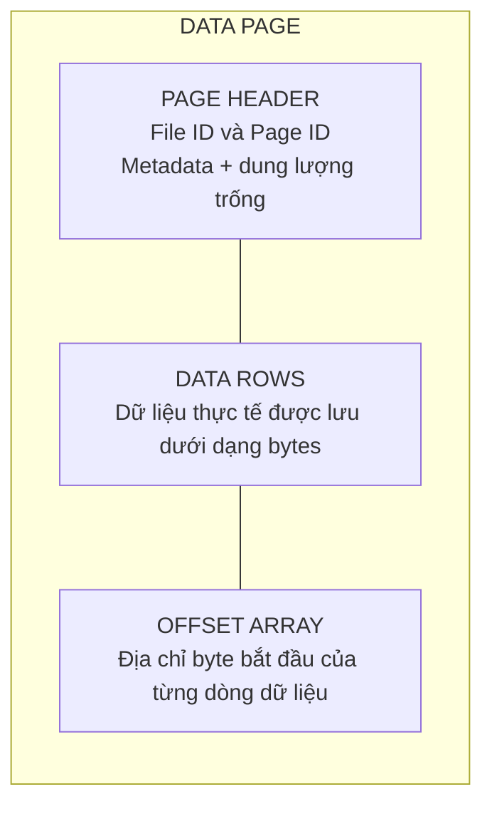
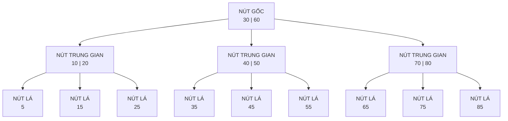

---
hide:
  - navigation
---

<header class="airflow-article-hero">
  <div class="airflow-article-hero__eyebrow">
    <a href="../">BEHIND THE PIPELINE</a>
    <span>ARTICLE / 003</span>
  </div>
  <h1>Index trong<br><em>cơ sở dữ liệu</em></h1>
  <p class="airflow-article-hero__dek">
    Vì sao cùng một câu truy vấn có thể phản hồi trong vài mili giây trên bảng nhỏ,
    nhưng lại mất nhiều giây khi dữ liệu tăng lên hàng triệu bản ghi?
  </p>
  <div class="airflow-article-hero__meta" aria-label="Thông tin bài viết">
    <span>DATABASE INTERNALS</span>
    <span>DEEP DIVE</span>
    <span>EDITION 03 · 2026</span>
  </div>
</header>

<figure class="airflow-opening-comic">
  
  <figcaption>
    <span>LƯU Ý TRƯỚC KHI ĐỌC</span>
    <strong>Một bài viết khá dài</strong>
  </figcaption>
</figure>

## Page: đơn vị đọc và ghi dữ liệu của database

Để hiểu khái niệm index dễ hơn, trước hết hãy xem **database lưu trữ dữ liệu trên ổ đĩa** như thế nào.

Khi truy vấn database, chúng ta thường thấy dữ liệu ở dạng hàng và cột. Tuy nhiên, tại tầng lưu trữ, DBMS không truy cập riêng lẻ từng hàng mà thường **đọc và ghi theo đơn vị gọi là page (hoặc block)**. Tùy hệ quản trị cơ sở dữ liệu, mỗi page có kích thước từ 4 KB đến 16 KB. Dữ liệu được đưa vào một page nhiều nhất có thể; khi page đã đầy, hệ thống tạo page mới để tiếp tục lưu trữ.

### Một page gồm những gì?

Thông thường, một page gồm các phần sau:

- **Page Header:** Chứa metadata của page như Page ID, dung lượng trống,...
- **Data Rows:** Lưu dữ liệu thực tế dưới dạng byte.
- **Offset Array:** Lưu địa chỉ byte bắt đầu của từng dòng dữ liệu. Nhờ đó, khi cần đọc một dòng trong page, hệ thống chỉ việc tra Offset Array để truy cập trực tiếp thay vì quét toàn bộ page.

Minh họa cấu trúc page:



### Heap và Clustered: hai cách tổ chức dữ liệu trong page

Thông thường, dữ liệu được lưu trong page theo hai cách:

- **Heap:** Dữ liệu trong page hoàn toàn không có thứ tự. Database ghi dữ liệu đến đâu thì đưa vào page đến đó, hoặc tìm page vẫn còn chỗ trống. Vì không phải quan tâm đến thứ tự nên **tốc độ ghi rất nhanh**. Đổi lại, để tìm một dòng dữ liệu, hệ thống phải lần lượt đưa các page vào RAM rồi quét từng dòng trong từng page (**full table scan**), gây ảnh hưởng lớn đến hiệu suất truy vấn.
- **Clustered:** Khi bảng có clustered index (primary key), dữ liệu trong database **được sắp xếp theo khóa này**. Việc ghi mất nhiều thời gian hơn vì hệ thống phải duy trì thứ tự, nhưng **truy vấn theo dòng hoặc theo khoảng sẽ nhanh hơn**. Do dữ liệu đã được sắp xếp, hệ thống chỉ cần xác định page chứa dòng cần tìm thay vì đọc toàn bộ các page.

## Index là gì và nó lưu những gì?

Hãy hình dung bạn cần tìm một tựa sách trong một cuốn sách rất dày. Nếu cuốn sách **không có mục lục**, bạn phải lật lần lượt từ trang đầu đến trang cuối cho đến khi thấy đúng tựa sách. Cách này rất tốn thời gian, nhất là khi cuốn sách dài hàng nghìn trang. Mục lục giải quyết vấn đề bằng cách sắp xếp các tựa sách theo một thứ tự, chẳng hạn thứ tự chữ cái, rồi ghi kèm số trang tương ứng. Muốn tìm một tựa đề, bạn chỉ cần **tra mục lục và mở thẳng đến trang được chỉ dẫn**.

Index trong cơ sở dữ liệu vận hành theo ý tưởng tương tự. Thay vì duyệt từng dòng để tìm giá trị mong muốn, hệ thống **tra index** để nhanh chóng xác định bản ghi hoặc page chứa dữ liệu, sau đó **chỉ đọc phần cần thiết**.

Index là một **cấu trúc phụ giúp tăng tốc tìm kiếm**. Ở node trung gian,index lưu **key phân tách và con trỏ**, trỏ đến index page con. Ở node lá, index lưu key cùng con trỏ hoặc dịnh danh đến bản ghi; tùy loại index thì node lá có thể chứa luôn giá trị. trường hợp nào dùng con trỏ và tại sao lại có node trung gian và nút lá, ta sẽ được tìm hiểu sau. Trên đĩa, index thường được tổ chức thành nhiều **index page**; mỗi index page gồm nhiều **index entry**.


## Cấu trúc index: B-tree và B+tree

Các index page thường không được trải phẳng mà liên kết với nhau theo một cấu trúc index. Hai cấu trúc index phổ biến là **B-tree và B+tree**. Đây là những **cây tìm kiếm đa nhánh cân bằng**, gồm nút gốc, các nút trung gian và các nút lá. Nếu đã học cấu trúc dữ liệu và giải thuật, bạn có thể hình dung chúng tương tự các cây tìm kiếm cân bằng như AVL hoặc Red-Black tree. Điểm khác biệt là mỗi node của B-tree/B+tree có thể chứa **nhiều key và nhiều nhánh con**, thay vì chỉ có hai nhánh trái và phải.

### Mô hình tổng quan: một B-tree cân bằng



> **Lưu ý:** Sơ đồ này chỉ minh họa cách các key **phân chia khoảng tìm kiếm** và cách các node liên kết với nhau. Để dễ quan sát, phần dữ liệu thực tế hoặc con trỏ đến dữ liệu đi kèm từng key không được hiển thị. Trong B-tree, mỗi key ở node trung gian và node lá đều có thể đi kèm dữ liệu hoặc con trỏ đến dữ liệu; các mũi tên trong sơ đồ biểu diễn **con trỏ đến node con**.

### B-tree: cấu trúc page và vị trí dữ liệu

Trong B-tree, dữ liệu thực tế hoặc con trỏ đến dữ liệu có thể xuất hiện ở cả nút trung gian và nút lá.

#### Nút trung gian

Mỗi nút trung gian gồm các **key**, con trỏ đến dữ liệu thực tế (**Row Identifier — RID**) và con trỏ đến các node con. Một RID thường gồm các thành phần sau:

- **File ID:** Mã định danh của file chứa dữ liệu trên ổ đĩa.
- **Page Number:** Số thứ tự của page trong file.
- **Slot Number:** Vị trí của dữ liệu trong Offset Array.

#### Nút lá

Nút lá chứa các thành phần tương tự nút trung gian, nhưng không có con trỏ đến node con. Các node lá độc lập với nhau và không có con trỏ nối sang node lá bên cạnh; trong khi đó, B+tree sử dụng danh sách liên kết đôi. Vì key tại nút trung gian đã gắn với dữ liệu thực tế nên các key này không xuất hiện lại tại nút lá.

#### Truy vấn khoảng và đặc điểm của B-tree

Do các node lá không có con trỏ nối với nhau, khi duyệt khoảng, hệ thống phải quay lại node cha rồi đi xuống các node khác, làm tăng số lần I/O.

Ưu điểm của B-tree là mỗi node đều có thể gắn với dữ liệu thực tế, vì vậy quá trình tìm kiếm có thể dừng sớm hơn so với B+tree. Mặt khác, do mỗi node phải chứa thêm con trỏ đến dữ liệu thực tế nên số key phân tách lưu được sẽ ít hơn. Cây vì thế sâu hơn và cần nhiều lần đọc ổ đĩa hơn.

**Internal page**

```text
[child ptr] [10 | Row ID] [child ptr] [20 | Row ID] [child ptr] [30 | Row ID] [child ptr]
```

**Leaf page**

```text
[5 | Row ID] [7 | Row ID] [9 | Row ID]
```

Trong B-tree, **mọi page, kể cả page trung gian**, đều có thể chứa key cùng row pointer. Ví dụ, quá trình tìm key `20` có thể **dừng ngay tại page trung gian**.

### B+tree: cấu trúc page và vị trí dữ liệu

B+tree khắc phục phần lớn những hạn chế của B-tree.

#### Nút trung gian

Nút trung gian chỉ chứa các **key phân tách** và con trỏ đến các node con, không chứa dữ liệu thực tế. Nhờ đó, mỗi node có thể chứa nhiều key phân tách hơn, giúp giảm độ sâu của cây và giảm số lần I/O trên ổ đĩa.

#### Nút lá

Tất cả key được đánh index đều xuất hiện tại nút lá. Mỗi entry chứa key và value; tùy loại index, value có thể là RID hoặc toàn bộ nội dung của các cột trong hàng dữ liệu. Các node lá được liên kết bằng danh sách liên kết đôi nên tối ưu cho truy vấn khoảng. Vì vậy, trong các hệ quản trị cơ sở dữ liệu quan hệ (RDBMS), B+tree và các biến thể của nó đã trở thành tiêu chuẩn phổ biến cho cấu trúc chỉ mục bảo toàn thứ tự.

**Internal page**

```text
[child0] [10] [child1] [20] [child2] [30] [child3]
```

**Leaf page**

```text
[5 | row ptr] [10 | row ptr] [15 | row ptr]
```

### Các mô hình lưu trữ tại nút lá của Index

Con trỏ dữ liệu trong B-tree và nút lá của B+tree có thể thuộc hai trường hợp.

#### Trường hợp 1: Con trỏ vật lý (RID — Row Identifier)

- **Áp dụng:** Khi bảng dữ liệu chính được lưu dưới dạng Heap Pages, không có Clustered Index, ví dụ PostgreSQL.
- **Nội dung:** Lưu tọa độ đĩa tĩnh `FileID:PageID:SlotNumber`, trỏ thẳng đến dòng dữ liệu.

 Trường hợp 2: chứa dữ liệu thực tế
 Khi dùng clustered index đối với cây B+ tree thì lúc này dữ liệu của các nút lá của nó chính là các dòng dữ liệu thực tế. Toàn bộ bản dữ liệu thực tế chính là cây B+tree.

#### Trường hợp 3: Khóa logic (Clustered Key / Primary Key)

- **Áp dụng:** Khi bảng chính được lưu theo Clustered Index và có thêm chỉ mục phụ (Secondary Index).
- **Nội dung:** Không lưu địa chỉ đĩa tĩnh mà lưu giá trị của Primary Key (giá trị của các nút ở cây chính), ví dụ `ID = 3`, để sau đó duyệt cây Clustered Index và lấy dữ liệu dòng.
 Trường hợp 3: chứa dữ liệu thực tế
 Khi dùng clustered index đối với cây B+ tree thì lúc này dữ liệu của các nút lá của nó chính là các dòng dữ liệu thực tế. Toàn bộ bản dữ liệu thực tế chính là cây B+tree.

 Lưu ý là trường hợp 2 và 3 dành cho B+tree

 Câu hỏi đặt ra: Tại sao ở Trường hợp 2 (Clustered Table), người ta không dùng con trỏ vật lý RID cho nhanh, mà lại dùng Khóa logic để rồi phải bị phạt duyệt cây 2 lần (Double Traversal).
 Đó là bởi vì nếu các cây chỉ mục phụ lưu cả RID thì khi người dùng thay đổi các dòng dữ liệu hoặc thêm dữ liệu vào dữ liệu có thể bị thay đổi vị trí. Dẫn đến phải cập nhật lại các RID của cây gây lãng phí I/O.

#### Hình ảnh minh họa


## Một số cấu trúc index chuyên biệt khác

Ngoài họ cấu trúc B-tree/B+tree giữ vai trò chủ đạo trong RDBMS, thế giới lưu trữ còn có các cấu trúc chuyên biệt khác như Hash Index, GIN,... Nhưng trong khuôn khổ bài viết này ta sẽ chỉ tìm hiểu sơ lược thêm về Hash Index.

### Hash Index

Nếu nghiệp vụ không yêu cầu truy vấn khoảng mà ưu tiên tối đa tốc độ tra cứu điểm (**point lookup**), Hash Index là một lựa chọn có thể cân nhắc.

Đúng như tên gọi, cấu trúc này sử dụng một bảng băm, thường được duy trì thường trực trên RAM để tối ưu hiệu năng. Nhờ cơ chế băm trực tiếp key tìm kiếm, độ phức tạp trung bình khi truy xuất một giá trị đạt mức lý tưởng là `O(1)`.

#### Hạn chế của Hash Index

Mặc dù có tốc độ đọc tốt, Hash Index vẫn tồn tại một số nhược điểm đáng kể:

- **Không hỗ trợ truy vấn khoảng:** Mục tiêu của hàm băm là phân tán dữ liệu ngẫu nhiên và đồng đều để tránh xung đột, tức các key khác nhau nhưng nằm trong cùng một bucket. Do đó, hai mã băm có giá trị liền kề có thể nằm trên hai data page cách xa nhau.
- **Không phù hợp với bảng quá nhỏ:** Sử dụng bảng băm có thể chậm hơn cả việc quét toàn bộ bảng.
- **Phụ thuộc vào dung lượng RAM:** Để đạt hiệu năng tối đa, bảng băm được lưu trên RAM. Nếu kích thước bảng băm vượt quá dung lượng RAM hiện có, hiệu năng hệ thống sẽ giảm mạnh. Khi hệ thống mất điện hoặc gặp sự cố, bảng băm này cũng bị mất và phải được khôi phục khi hệ thống hoạt động trở lại.

#### Vì sao bảng băm lớn hơn RAM làm giảm hiệu năng?

Khi bảng băm vượt quá dung lượng RAM, một phần dữ liệu buộc phải được đẩy xuống ổ đĩa. Do tính chất phân tán ngẫu nhiên của hàm băm, mỗi lượt truy vấn rất dễ rơi vào phần nằm trên đĩa (**cache miss**), biến thao tác tra cứu trên RAM thành thao tác đọc đĩa ngẫu nhiên (**Random I/O**) rất chậm.


#### Vì sao hàm băm cần hạn chế xung đột?

Hàm băm cần hạn chế tối đa tình trạng xung đột vì các nguyên nhân sau:

- Tránh tình trạng **data skew**, trong đó một bucket chứa quá nhiều key còn bucket khác không chứa key nào.
- Khi quá nhiều key nằm trong cùng một bucket, hệ thống phải truy cập bucket rồi tiếp tục tìm key cần thiết, làm mất lợi thế tốc độ `O(1)` của Hash Index.
- Khi quá nhiều key nằm trong cùng một bucket khiến bucket hết dung lượng, hệ thống phải tạo thêm **overflow page** và dùng con trỏ của danh sách liên kết để nối page này vào cuối bucket hiện có. Mỗi lần đọc overflow page cần thêm một lần I/O; quá nhiều I/O sẽ làm chậm hệ thống.

#### Quy trình hình thành bảng băm trên RAM

Quy trình hình thành bảng băm (Hash Index/Hash Map) trên RAM trong hệ quản trị cơ sở dữ liệu gồm các bước sau:

1. Hệ thống quét tuần tự toàn bộ file log trên ổ đĩa.
2. Xác định vị trí của từng dòng dữ liệu trên ổ đĩa.
3. Tính mã băm của key và nạp vào RAM.

> **Lưu ý:** Nếu RAM đã lưu vị trí của một dòng dữ liệu nhưng hệ thống quét được vị trí mới hơn, hệ thống sẽ cập nhật vị trí mới vào RAM. Nếu dòng dữ liệu được đánh dấu là đã xóa, hệ thống sẽ xóa dữ liệu đó khỏi bảng băm trên RAM.

Index xử lí như thế nào khi ta sử dụng các câu lệnh DML (INSERT, UPDATE hay DELETE)?

Khi ta INSERT dữ liệu:
  - B tree: hệ thống duyệt từ đầu đến cuối để tìm nút có thể chèn giá trị vào. Nếu như nút còn chỗ thì nó sẽ được chèn vào nút đó theo thứ tự sắp xếp. Nếu như nút hết chỗ, sẽ xẫy ra tình trạng page split. Lúc này hệ thống sẽ lấy middle key, rồi phân tách thành 2 nút riêng biệt, middle key sẽ được đưa lên nút cha để làm key dẫn đường. Nếu nút cha cũng bị đầy thì sẽ thực thi quá trình tương tự lên trên các nút cha khác. khóa mới bạn vừa chèn sẽ rơi vào 1 trong 3 trường hợp:

Trường hợp 1 (Nhỏ hơn Middle Key): Khóa mới sẽ nằm ở nút con bên trái.

Trường hợp 2 (Lớn hơn Middle Key): Khóa mới sẽ nằm ở nút con bên phải.

Trường hợp 3 (Khóa mới chính là Middle Key): Khóa mới sẽ không nằm ở cả hai nút con, mà chính nó sẽ là phần tử được bốc thẳng lên nút cha.

Ví dụ: Khi bạn muốn chèn khóa 40, hệ thống sẽ tạm thời đưa khóa 40 vào nút $K_1 = 10$$K_2 = 20$ (đây là khóa nằm ở vị trí chính giữa)$K_3 = 30$$K_4 = 40$Khi xảy ra cơ chế tách trang (Page Split):Hệ thống bốc đúng 1 giá trị duy nhất là $K_2$ (tức là con số 20 cùng con trỏ dữ liệu của số 20) đưa hẳn lên nút cha phía trên.Nút bị đầy ban đầu được chẻ đôi thành 2 nút con:Nút con bên trái: Chỉ giữ các giá trị đứng trước $K_2$, tức là [10] (chính là $K_1$).Nút con bên phải: Chỉ giữ các giá trị đứng sau $K_2$, tức là [30, 40] (chính là $K_3$ và $K_4$).

  - B+tree: Tương tự với B tree, nhưng sẽ khác là hệ thống phải duyệt xuống tận nút lá, vì chỉ có nút là mới chứa con trỏ/dữ liệu và khi bắt đầu phân tách trang, nút ở giữa sẽ được sao chép lên nút cha, vì B+tree bắt buộc các key phải nằm ở nút lá đồng thời khi phân tách thành 2 nút khác, hệ thống cũng cần phải cập nhật lại con trỏ liên kết đôi cho cả 2 nút.

Đối với thao tác delete:
  Xóa dữ liệu là một quá trình rất phức tạp, có thể gây mật độ dữ liệu của các nút xuống dưới ngưỡng (Underflow) 

  - B tree: 
    -Th1: nếu key bị xóa nằm ở nút lá, hệ thống xóa khóa đó bình thường, nếu gặp tình trạng underflow, hệ thống sẽ mượn khóa hoặc gộp nút từ các nút anh em, nút bên phải hoặc nút bên trái của nút có khóa bị xóa.

  Bonus:
    Quá trình mượn khóa là: hệ thống có thể mượn khóa ở các nút bên trái hoặc bên phải. Quá trình mượn khóa như sau: 
    Nếu mượn từ nút bên trái/phải:
      Lấy khóa phân tách ở nút cha, đưa xuống làm khóa phân tách ở nút bị thiếu. Sau đó khóa lớn nhất ở nút bên trái/phải sẽ được đưa lên làm khóa phân tách ở nút cha. Nhờ vào quy trình như vậy ta có thể đảm bảo được thứ tự sắp xếp của các khóa trong cây.

Ví dụ: Nút cha có khóa [30].

Nút con trái có [10, 20], nút con phải vừa bị xóa chỉ còn [40] (bị underflow).

Nút phải mượn từ nút trái: Khóa 30 ở cha hạ xuống nút phải thành [30, 40]; khóa 20 từ nút trái nhảy lên thế chỗ 30 ở nút cha. Cây trở lại trạng thái cân bằng.

  Quá trình gộp nút là: khi ta không thể mượn nút từ các nút anh em bên cạnh, khi đó hệ thống buộc phải gộp cả 2 nút lại để tránh trạng thái underflow.
    Cách thức thực hiện như sau: kéo khóa phân tách của nút cha nằm giữa 2 nút con xuống, sau đó gộp chung vào dữ liệu của nút bị thiếu và dữ liệu của nút anh em. Sau đó xóa bỏ đi nút dư thừa. Nếu khi ta lấy mất một khóa trên nút cha dẫn đến nút cha bị underflow, quy trình cũng sẽ được lặp lại đối với nút cha. Khi đó nút cha có thể mượn khóa hoặc gộp nút.
    
    Viewed index.md:240-286
Searched web: "B tree delete node merge underflow example"

Để giúp người đọc dễ hình dung nhất về **quá trình gộp nút (Merge / Coalesce)** khi xóa dữ liệu trong B-Tree, chúng ta có thể tiếp cận theo 3 phần: **Hình ảnh ẩn dụ đời thực**, **Ví dụ trực quan từng bước (kèm sơ đồ ASCII)** và **Hiệu ứng dây chuyền (Domino)**.

---

### 1. Hình ảnh ẩn dụ đời thực (Rất dễ tưởng tượng)

> Hãy tưởng tượng **nút cha** là **bức tường ngăn cách** giữa hai phòng trọ: **phòng anh em** và **phòng của bạn** (hai nút con). 
> - Quy định của xóm trọ: *Mỗi phòng phải có ít nhất 2 người* (ngưỡng tối thiểu để không bị underflow).
> - Một người ở phòng bạn chuyển đi, phòng bạn chỉ còn 1 người $\rightarrow$ **Bị thiếu người (Underflow)**.
> - Bạn ngó sang phòng hàng xóm (nút anh em) định rủ 1 người qua ở cùng (mượn khóa). Nhưng ngặt nỗi phòng hàng xóm cũng **chỉ có đúng 2 người** (vừa đủ mức tối thiểu), nếu họ cho bạn mượn thì phòng họ lại bị vi phạm!
> - **Giải pháp**: Chủ trọ quyết định **đập bỏ bức tường ngăn cách** (kéo khóa phân tách ở nút cha xuống), gom người của phòng bạn + gạch của bức tường + người của phòng hàng xóm lại thành **MỘT PHÒNG DUY NHẤT LỚN HƠN**. 
> - Bức tường ở tầng trên biến mất, số phòng ở tầng trên bớt đi một.

---

### 2. Ví dụ trực quan với các con số cụ thể

Giả sử ta có một **B-Tree bậc 5 (Order 5)**:
- **Tối đa**: Mỗi nút chứa tối đa $5 - 1 = 4$ khóa.
- **Tối thiểu**: Mỗi nút (trừ nút gốc) phải chứa ít nhất $\lceil 5/2 \rceil - 1 = \mathbf{2\ \text{khóa}}$.
- Nếu nút nào chỉ còn **1 khóa** $\rightarrow$ Rơi vào trạng thái **Underflow**.

---

#### Bước 1: Trạng thái ban đầu của cây
Nút cha có khóa `[30, 60]`. Nút con giữa có `[40, 50]` (vừa đủ 2 khóa).

```text
                  [ 30  |  60 ]            <-- Nút cha
                 /      |      \
        [ 10 | 20 ]  [ 40 | 50 ]  [ 70 | 80 ]  <-- Các nút con (đều có 2 khóa)
        (Nút trái)   (Nút giữa)   (Nút phải)
```

---

#### Bước 2: Thao tác xóa gây Underflow và không thể mượn
Ta thực hiện lệnh xóa khóa **`50`**:
- Nút giữa chỉ còn lại duy nhất khóa **`[40]`** $\rightarrow$ **Bị Underflow** (vì quy định tối thiểu là 2 khóa).
- **Kiểm tra mượn**:
  - Nhìn sang nút trái `[10, 20]`: Chỉ có đúng 2 khóa (mức tối thiểu), không có khóa dư để cho mượn.
  - Nhìn sang nút phải `[70, 80]`: Cũng chỉ có đúng 2 khóa, không thể cho mượn.
- $\Rightarrow$ Cả 2 anh em đều "nghèo", **bắt buộc phải gộp nút**!

---

#### Bước 3: Thực hiện gộp nút (Merge)
Ta chọn gộp **Nút giữa** với **Nút trái** thông qua khóa phân tách ở giữa chúng trên nút cha là số **`30`**:

1. **Hạ khóa `30` từ nút cha xuống**: Số 30 nằm kẹp giữa 20 và 40.
2. **Hợp nhất dữ liệu**: 
   $$\text{Nút mới} = [10, 20] \ (\text{nút trái}) + [30] \ (\text{từ cha}) + [40] \ (\text{nút giữa}) = \mathbf{[10, 20, 30, 40]}$$
3. **Xóa nút dư thừa**: Nút giữa cũ bị giải phóng.

```text
               [ 60 ]                   <-- Nút cha (mất đi khóa 30)
              /      \
    [ 10 | 20 | 30 | 40 ]   [ 70 | 80 ] <-- Nút gộp mới (4 khóa <= tối đa 4)
```

> **Tại sao thứ tự vẫn bảo toàn?**
> Vì trong B-Tree: `Nút trái < Khóa phân tách của cha < Nút phải`. 
> Do đó khi kéo khóa cha xuống đặt vào giữa: `[10, 20] < 30 < [40]` $\rightarrow$ Dãy số `[10, 20, 30, 40]` luôn luôn được sắp xếp tăng dần hoàn hảo!

---

### 3. Điều gì xảy ra tiếp theo với nút cha? (Underflow lan truyền)

Sau khi khóa `30` bị kéo xuống, nút cha chỉ còn lại `[60]`. Lúc này xảy ra 2 trường hợp:

1. **Nếu nút cha là nút gốc (Root):**
   - Nút gốc có đặc quyền: Chỉ cần có ít nhất 1 khóa là hợp lệ.
   - Do đó nút cha `[60]` vẫn hợp lệ $\rightarrow$ Quá trình kết thúc.
   - *(Trường hợp đặc biệt: Nếu nút gốc ban đầu chỉ có duy nhất 1 khóa là `[30]`, khi kéo `30` xuống thì nút gốc thành rỗng. Lúc này nút mới gộp `[10, 20, 30, 40]` sẽ nhảy lên làm **Nút gốc mới** $\rightarrow$ **Chiều cao của toàn bộ cây giảm đi 1 tầng**).*

2. **Nếu nút cha là một nút trung gian:**
   - Nút cha bây giờ chỉ có 1 khóa `[60]` $\rightarrow$ Nút cha lại bị **Underflow**!
   - Nút cha lại tiếp tục quá trình: nhìn sang anh em của nó ở tầng trên để **mượn khóa**. Nếu không mượn được, nó lại **kéo khóa của ông nội xuống để gộp nút**. Quy trình cứ thế đệ quy dồn ngược lên trên (Cascading merge).

---

### 4. Đoạn nội dung đề xuất để bạn bổ sung trực tiếp vào `index.md`

Bạn có thể thay thế hoặc viết tiếp vào dưới dòng 284 trong file [index.md](file:///home/phongthanh/architecture-notes/docs/index/index.md#L282-L285) như sau:

```markdown
  Quá trình gộp nút là: khi ta không thể mượn nút từ các nút anh em bên cạnh (do các nút anh em cũng chỉ có số khóa ở mức tối thiểu), hệ thống buộc phải gộp cả 2 nút lại để tránh trạng thái underflow.
    Cách thức thực hiện như sau: kéo khóa phân tách của nút cha nằm giữa 2 nút con xuống, sau đó gộp chung vào dữ liệu của nút bị thiếu và dữ liệu của nút anh em. Sau đó xóa bỏ đi nút dư thừa. Nếu việc lấy mất một khóa trên nút cha dẫn đến nút cha bị underflow, quy trình cũng sẽ được lặp lại đối với nút cha.

Ví dụ: Cây B-Tree bậc 5 (mỗi nút có tối thiểu 2 khóa, tối đa 4 khóa).
- Nút cha có khóa [30, 60].
- Nút con trái có [10, 20], nút con giữa có [40, 50], nút con phải có [70, 80].

Khi ta xóa khóa 50 ở nút con giữa:
1. Nút con giữa chỉ còn [40] (bị underflow vì < 2 khóa).
2. Nút giữa kiểm tra hai nút anh em bên cạnh: cả [10, 20] và [70, 80] đều chỉ có đúng 2 khóa (đạt mức tối thiểu), không có khóa dôi dư để cho mượn.
3. Bắt buộc gộp nút: Khóa phân tách 30 ở nút cha được kéo xuống kẹp vào giữa nút trái và nút giữa:
   [10, 20] + [30] + [40] -> gộp thành nút mới [10, 20, 30, 40].
4. Nút giữa cũ được giải phóng. Nút cha lúc này chỉ còn [60]. Nếu nút cha bị thiếu khóa, quy trình mượn hoặc gộp sẽ tiếp tục lan truyền lên tầng trên.
``` 
    -Th2: khóa cần xóa nằm ở nút trung gian: như bạn dã biết thì một khóa ở khóa ở nút trung gian vừa dùng để định hướng dữ liệu
