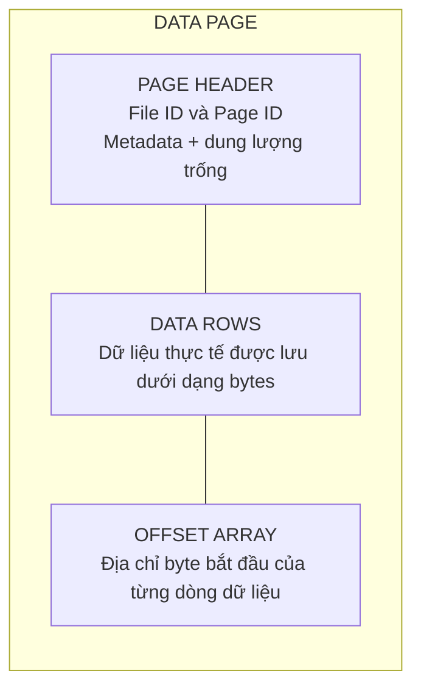
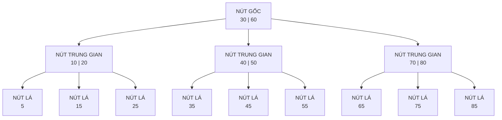

---
hide:
  - navigation
---

<header class="airflow-article-hero">
  <div class="airflow-article-hero__eyebrow">
    <a href="../">BEHIND THE PIPELINE</a>
    <span>ARTICLE / 003</span>
  </div>
  <h1>Index trong<br><em>cơ sở dữ liệu</em></h1>
  <p class="airflow-article-hero__dek">
    Vì sao cùng một câu truy vấn có thể phản hồi trong vài mili giây trên bảng nhỏ,
    nhưng lại mất nhiều giây khi dữ liệu tăng lên hàng triệu bản ghi?
  </p>
  <div class="airflow-article-hero__meta" aria-label="Thông tin bài viết">
    <span>DATABASE INTERNALS</span>
    <span>DEEP DIVE</span>
    <span>EDITION 03 · 2026</span>
  </div>
</header>

<figure class="airflow-opening-comic">
  
  <figcaption>
    <span>LƯU Ý TRƯỚC KHI ĐỌC</span>
    <strong>Một bài viết khá dài</strong>
  </figcaption>
</figure>

## Page: đơn vị đọc và ghi dữ liệu của database

Để hiểu khái niệm index dễ hơn, trước hết hãy xem **database lưu trữ dữ liệu trên ổ đĩa** như thế nào.

Khi truy vấn database, chúng ta thường thấy dữ liệu ở dạng hàng và cột. Tuy nhiên, tại tầng lưu trữ, DBMS không truy cập riêng lẻ từng hàng mà thường **đọc và ghi theo đơn vị gọi là page (hoặc block)**. Tùy hệ quản trị cơ sở dữ liệu, mỗi page có kích thước từ 4 KB đến 16 KB. Dữ liệu được đưa vào một page nhiều nhất có thể; khi page đã đầy, hệ thống tạo page mới để tiếp tục lưu trữ.

### Một page gồm những gì?

Thông thường, một page gồm các phần sau:

- **Page Header:** Chứa metadata của page như Page ID, dung lượng trống,...
- **Data Rows:** Lưu dữ liệu thực tế dưới dạng byte.
- **Offset Array:** Lưu địa chỉ byte bắt đầu của từng dòng dữ liệu. Nhờ đó, khi cần đọc một dòng trong page, hệ thống chỉ việc tra Offset Array để truy cập trực tiếp thay vì quét toàn bộ page.

Minh họa cấu trúc page:



### Heap và Clustered: hai cách tổ chức dữ liệu trong page

Thông thường, dữ liệu được lưu trong page theo hai cách:

- **Heap:** Dữ liệu trong page hoàn toàn không có thứ tự. Database ghi dữ liệu đến đâu thì đưa vào page đến đó, hoặc tìm page vẫn còn chỗ trống. Vì không phải quan tâm đến thứ tự nên **tốc độ ghi rất nhanh**. Đổi lại, để tìm một dòng dữ liệu, hệ thống phải lần lượt đưa các page vào RAM rồi quét từng dòng trong từng page (**full table scan**), gây ảnh hưởng lớn đến hiệu suất truy vấn.
- **Clustered:** Khi bảng có clustered index (primary key), dữ liệu trong database **được sắp xếp theo khóa này**. Việc ghi mất nhiều thời gian hơn vì hệ thống phải duy trì thứ tự, nhưng **truy vấn theo dòng hoặc theo khoảng sẽ nhanh hơn**. Do dữ liệu đã được sắp xếp, hệ thống chỉ cần xác định page chứa dòng cần tìm thay vì đọc toàn bộ các page.

## Index là gì và nó lưu những gì?

Hãy hình dung bạn cần tìm một tựa sách trong một cuốn sách rất dày. Nếu cuốn sách **không có mục lục**, bạn phải lật lần lượt từ trang đầu đến trang cuối cho đến khi thấy đúng tựa sách. Cách này rất tốn thời gian, nhất là khi cuốn sách dài hàng nghìn trang. Mục lục giải quyết vấn đề bằng cách sắp xếp các tựa sách theo một thứ tự, chẳng hạn thứ tự chữ cái, rồi ghi kèm số trang tương ứng. Muốn tìm một tựa đề, bạn chỉ cần **tra mục lục và mở thẳng đến trang được chỉ dẫn**.

Index trong cơ sở dữ liệu vận hành theo ý tưởng tương tự. Thay vì duyệt từng dòng để tìm giá trị mong muốn, hệ thống **tra index** để nhanh chóng xác định bản ghi hoặc page chứa dữ liệu, sau đó **chỉ đọc phần cần thiết**.

Index là một **cấu trúc phụ giúp tăng tốc tìm kiếm**. Ở node trung gian,index lưu **key phân tách và con trỏ**, trỏ đến index page con. Ở node lá, index lưu key cùng con trỏ hoặc dịnh danh đến bản ghi; tùy loại index thì node lá có thể chứa luôn giá trị. trường hợp nào dùng con trỏ và tại sao lại có node trung gian và nút lá, ta sẽ được tìm hiểu sau. Trên đĩa, index thường được tổ chức thành nhiều **index page**; mỗi index page gồm nhiều **index entry**.


## Cấu trúc index: B-tree và B+tree

Các index page thường không được trải phẳng mà liên kết với nhau theo một cấu trúc index. Hai cấu trúc index phổ biến là **B-tree và B+tree**. Đây là những **cây tìm kiếm đa nhánh cân bằng**, gồm nút gốc, các nút trung gian và các nút lá. Nếu đã học cấu trúc dữ liệu và giải thuật, bạn có thể hình dung chúng tương tự các cây tìm kiếm cân bằng như AVL hoặc Red-Black tree. Điểm khác biệt là mỗi node của B-tree/B+tree có thể chứa **nhiều key và nhiều nhánh con**, thay vì chỉ có hai nhánh trái và phải.

### Mô hình tổng quan: một B-tree cân bằng



> **Lưu ý:** Sơ đồ này chỉ minh họa cách các key **phân chia khoảng tìm kiếm** và cách các node liên kết với nhau. Để dễ quan sát, phần dữ liệu thực tế hoặc con trỏ đến dữ liệu đi kèm từng key không được hiển thị. Trong B-tree, mỗi key ở node trung gian và node lá đều có thể đi kèm dữ liệu hoặc con trỏ đến dữ liệu; các mũi tên trong sơ đồ biểu diễn **con trỏ đến node con**.

### B-tree: cấu trúc page và vị trí dữ liệu

Trong B-tree, dữ liệu thực tế hoặc con trỏ đến dữ liệu có thể xuất hiện ở cả nút trung gian và nút lá.

#### Nút trung gian

Mỗi nút trung gian gồm các **key**, con trỏ đến dữ liệu thực tế (**Row Identifier — RID**) và con trỏ đến các node con. Một RID thường gồm các thành phần sau:

- **File ID:** Mã định danh của file chứa dữ liệu trên ổ đĩa.
- **Page Number:** Số thứ tự của page trong file.
- **Slot Number:** Vị trí của dữ liệu trong Offset Array.

#### Nút lá

Nút lá chứa các thành phần tương tự nút trung gian, nhưng không có con trỏ đến node con. Các node lá độc lập với nhau và không có con trỏ nối sang node lá bên cạnh; trong khi đó, B+tree sử dụng danh sách liên kết đôi. Vì key tại nút trung gian đã gắn với dữ liệu thực tế nên các key này không xuất hiện lại tại nút lá.

#### Truy vấn khoảng và đặc điểm của B-tree

Do các node lá không có con trỏ nối với nhau, khi duyệt khoảng, hệ thống phải quay lại node cha rồi đi xuống các node khác, làm tăng số lần I/O.

Ưu điểm của B-tree là mỗi node đều có thể gắn với dữ liệu thực tế, vì vậy quá trình tìm kiếm có thể dừng sớm hơn so với B+tree. Mặt khác, do mỗi node phải chứa thêm con trỏ đến dữ liệu thực tế nên số key phân tách lưu được sẽ ít hơn. Cây vì thế sâu hơn và cần nhiều lần đọc ổ đĩa hơn.

**Internal page**

```text
[child ptr] [10 | Row ID] [child ptr] [20 | Row ID] [child ptr] [30 | Row ID] [child ptr]
```

**Leaf page**

```text
[5 | Row ID] [7 | Row ID] [9 | Row ID]
```

Trong B-tree, **mọi page, kể cả page trung gian**, đều có thể chứa key cùng row pointer. Ví dụ, quá trình tìm key `20` có thể **dừng ngay tại page trung gian**.

### B+tree: cấu trúc page và vị trí dữ liệu

B+tree khắc phục phần lớn những hạn chế của B-tree.

#### Nút trung gian

Nút trung gian chỉ chứa các **key phân tách** và con trỏ đến các node con, không chứa dữ liệu thực tế. Nhờ đó, mỗi node có thể chứa nhiều key phân tách hơn, giúp giảm độ sâu của cây và giảm số lần I/O trên ổ đĩa.

#### Nút lá

Tất cả key được đánh index đều xuất hiện tại nút lá. Mỗi entry chứa key và value; tùy loại index, value có thể là RID hoặc toàn bộ nội dung của các cột trong hàng dữ liệu. Các node lá được liên kết bằng danh sách liên kết đôi nên tối ưu cho truy vấn khoảng. Vì vậy, trong các hệ quản trị cơ sở dữ liệu quan hệ (RDBMS), B+tree và các biến thể của nó đã trở thành tiêu chuẩn phổ biến cho cấu trúc chỉ mục bảo toàn thứ tự.

**Internal page**

```text
[child0] [10] [child1] [20] [child2] [30] [child3]
```

**Leaf page**

```text
[5 | row ptr] [10 | row ptr] [15 | row ptr]
```

### Các loại con trỏ dữ liệu

Con trỏ dữ liệu trong B-tree và nút lá của B+tree có thể thuộc hai trường hợp.

#### Trường hợp 1: Con trỏ vật lý (RID — Row Identifier)

- **Áp dụng:** Khi bảng dữ liệu chính được lưu dưới dạng Heap Pages, không có Clustered Index, ví dụ PostgreSQL.
- **Nội dung:** Lưu tọa độ đĩa tĩnh `FileID:PageID:SlotNumber`, trỏ thẳng đến dòng dữ liệu.

#### Trường hợp 2: Khóa logic (Clustered Key / Primary Key)

- **Áp dụng:** Khi bảng chính được lưu theo Clustered Index và có thêm chỉ mục phụ (Secondary Index).
- **Nội dung:** Không lưu địa chỉ đĩa tĩnh mà lưu giá trị của Primary Key, ví dụ `ID = 3`, để sau đó duyệt cây Clustered Index và lấy dữ liệu dòng.

#### Hình ảnh minh họa


## Database tạo B-tree và B+tree như thế nào?

Khi tạo index, database **quét bảng dữ liệu trên đĩa** và lấy ra các cặp như key `10` cùng vị trí mà key này trỏ đến, rồi thực hiện tương tự với key `11` và các key còn lại. Sau đó, database **sắp xếp các key và lần lượt đưa chúng vào các leaf index page** cho đến khi đầy. Khi các leaf page đã được tạo, database dựa vào ranh giới của từng page để lấy **separator key**, thường là key nhỏ nhất của page bên phải, rồi xây dựng các **internal index page và root index page** phía trên.

## Một số cấu trúc index chuyên biệt khác

Ngoài họ cấu trúc B-tree/B+tree giữ vai trò chủ đạo trong RDBMS, thế giới lưu trữ còn có các cấu trúc chuyên biệt khác như Hash Index, tối ưu cho tra cứu điểm, hay LSM-Tree, tối ưu cho tốc độ ghi cao. Trong khuôn khổ bài viết này, chúng ta chỉ điểm qua sơ lược hai cấu trúc này để mở rộng góc nhìn.

### Hash Index

Nếu nghiệp vụ không yêu cầu truy vấn khoảng mà ưu tiên tối đa tốc độ tra cứu điểm (**point lookup**), Hash Index là một lựa chọn có thể cân nhắc.

Đúng như tên gọi, cấu trúc này sử dụng một bảng băm, thường được duy trì thường trực trên RAM để tối ưu hiệu năng. Nhờ cơ chế băm trực tiếp key tìm kiếm, độ phức tạp trung bình khi truy xuất một giá trị đạt mức lý tưởng là `O(1)`.

#### Hạn chế của Hash Index

Mặc dù có tốc độ đọc tốt, Hash Index vẫn tồn tại một số nhược điểm đáng kể:

- **Không hỗ trợ truy vấn khoảng:** Mục tiêu của hàm băm là phân tán dữ liệu ngẫu nhiên và đồng đều để tránh xung đột, tức các key khác nhau nhưng nằm trong cùng một bucket. Do đó, hai mã băm có giá trị liền kề có thể nằm trên hai data page cách xa nhau.
- **Không phù hợp với bảng quá nhỏ:** Sử dụng bảng băm có thể chậm hơn cả việc quét toàn bộ bảng.
- **Phụ thuộc vào dung lượng RAM:** Để đạt hiệu năng tối đa, bảng băm được lưu trên RAM. Nếu kích thước bảng băm vượt quá dung lượng RAM hiện có, hiệu năng hệ thống sẽ giảm mạnh. Khi hệ thống mất điện hoặc gặp sự cố, bảng băm này cũng bị mất và phải được khôi phục khi hệ thống hoạt động trở lại.

#### Vì sao bảng băm lớn hơn RAM làm giảm hiệu năng?

Khi bảng băm vượt quá dung lượng RAM, một phần dữ liệu buộc phải được đẩy xuống ổ đĩa. Do tính chất phân tán ngẫu nhiên của hàm băm, mỗi lượt truy vấn rất dễ rơi vào phần nằm trên đĩa (**cache miss**), biến thao tác tra cứu trên RAM thành thao tác đọc đĩa ngẫu nhiên (**Random I/O**) rất chậm.


#### Vì sao hàm băm cần hạn chế xung đột?

Hàm băm cần hạn chế tối đa tình trạng xung đột vì các nguyên nhân sau:

- Tránh tình trạng **data skew**, trong đó một bucket chứa quá nhiều key còn bucket khác không chứa key nào.
- Khi quá nhiều key nằm trong cùng một bucket, hệ thống phải truy cập bucket rồi tiếp tục tìm key cần thiết, làm mất lợi thế tốc độ `O(1)` của Hash Index.
- Khi quá nhiều key nằm trong cùng một bucket khiến bucket hết dung lượng, hệ thống phải tạo thêm **overflow page** và dùng con trỏ của danh sách liên kết để nối page này vào cuối bucket hiện có. Mỗi lần đọc overflow page cần thêm một lần I/O; quá nhiều I/O sẽ làm chậm hệ thống.

#### Quy trình hình thành bảng băm trên RAM

Quy trình hình thành bảng băm (Hash Index/Hash Map) trên RAM trong hệ quản trị cơ sở dữ liệu gồm các bước sau:

1. Hệ thống quét tuần tự toàn bộ file log trên ổ đĩa.
2. Xác định vị trí của từng dòng dữ liệu trên ổ đĩa.
3. Tính mã băm của key và nạp vào RAM.

> **Lưu ý:** Nếu RAM đã lưu vị trí của một dòng dữ liệu nhưng hệ thống quét được vị trí mới hơn, hệ thống sẽ cập nhật vị trí mới vào RAM. Nếu dòng dữ liệu được đánh dấu là đã xóa, hệ thống sẽ xóa dữ liệu đó khỏi bảng băm trên RAM.
