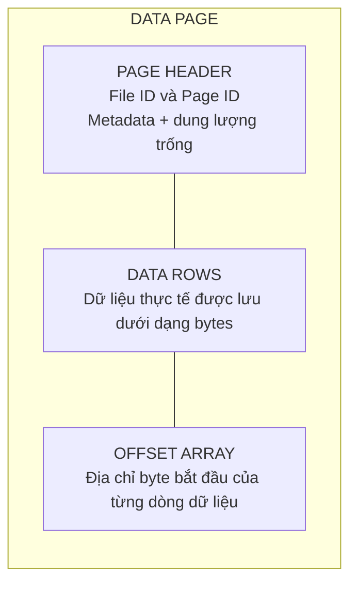
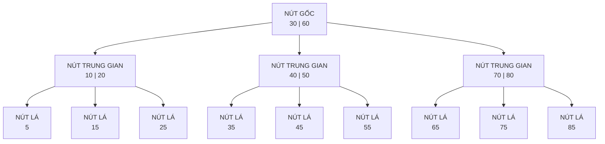

---
hide:
  - navigation
---

<header class="airflow-article-hero">
  <div class="airflow-article-hero__eyebrow">
    <a href="../">BEHIND THE PIPELINE</a>
    <span>ARTICLE / 003</span>
  </div>
  <h1>Index trong<br><em>cơ sở dữ liệu</em></h1>
  <p class="airflow-article-hero__dek">
    Vì sao cùng một câu truy vấn có thể phản hồi trong vài mili giây trên bảng nhỏ,
    nhưng lại mất nhiều giây khi dữ liệu tăng lên hàng triệu bản ghi?
  </p>
  <div class="airflow-article-hero__meta" aria-label="Thông tin bài viết">
    <span>DATABASE INTERNALS</span>
    <span>DEEP DIVE</span>
    <span>EDITION 03 · 2026</span>
  </div>
</header>

<figure class="airflow-opening-comic">
  
  <figcaption>
    <span>LƯU Ý TRƯỚC KHI ĐỌC</span>
    <strong>Một bài viết khá dài</strong>
  </figcaption>
</figure>

## Page: đơn vị đọc và ghi dữ liệu của database

Để hiểu khái niệm index dễ hơn, trước hết hãy xem **database lưu trữ dữ liệu trên ổ đĩa** như thế nào.

Khi truy vấn database, chúng ta thường thấy dữ liệu ở dạng hàng và cột. Tuy nhiên, tại tầng lưu trữ, DBMS không truy cập riêng lẻ từng hàng mà thường **đọc và ghi theo đơn vị gọi là page (hoặc block)**. Tùy hệ quản trị cơ sở dữ liệu, mỗi page có kích thước từ 4 KB đến 16 KB. Dữ liệu được đưa vào một page nhiều nhất có thể; khi page đã đầy, hệ thống tạo page mới để tiếp tục lưu trữ.

### Một page gồm những gì?

Thông thường, một page gồm các phần sau:

- **Page Header:** Chứa metadata của page như Page ID, dung lượng trống,...
- **Data Rows:** Lưu dữ liệu thực tế dưới dạng byte.
- **Offset Array:** Lưu địa chỉ byte bắt đầu của từng dòng dữ liệu. Nhờ đó, khi cần đọc một dòng trong page, hệ thống chỉ việc tra Offset Array để truy cập trực tiếp thay vì quét toàn bộ page.

Minh họa cấu trúc page:



### Heap và Clustered: hai cách tổ chức dữ liệu trong page

Thông thường, dữ liệu được lưu trong page theo hai cách:

- **Heap:** Dữ liệu trong page hoàn toàn không có thứ tự. Database ghi dữ liệu đến đâu thì đưa vào page đến đó, hoặc tìm page vẫn còn chỗ trống. Vì không phải quan tâm đến thứ tự nên **tốc độ ghi rất nhanh**. Đổi lại, để tìm một dòng dữ liệu, hệ thống phải lần lượt đưa các page vào RAM rồi quét từng dòng trong từng page (**full table scan**), gây ảnh hưởng lớn đến hiệu suất truy vấn.
- **Clustered:** Khi bảng có clustered index (primary key), dữ liệu trong database **được sắp xếp theo khóa này**. Việc ghi mất nhiều thời gian hơn vì hệ thống phải duy trì thứ tự, nhưng **truy vấn theo dòng hoặc theo khoảng sẽ nhanh hơn**. Do dữ liệu đã được sắp xếp, hệ thống chỉ cần xác định page chứa dòng cần tìm thay vì đọc toàn bộ các page.

## Index là gì và nó lưu những gì?

Hãy hình dung bạn cần tìm một tựa sách trong một cuốn sách rất dày. Nếu cuốn sách **không có mục lục**, bạn phải lật lần lượt từ trang đầu đến trang cuối cho đến khi thấy đúng tựa sách. Cách này rất tốn thời gian, nhất là khi cuốn sách dài hàng nghìn trang. Mục lục giải quyết vấn đề bằng cách sắp xếp các tựa sách theo một thứ tự, chẳng hạn thứ tự chữ cái, rồi ghi kèm số trang tương ứng. Muốn tìm một tựa đề, bạn chỉ cần **tra mục lục và mở thẳng đến trang được chỉ dẫn**.

Index trong cơ sở dữ liệu vận hành theo ý tưởng tương tự. Thay vì duyệt từng dòng để tìm giá trị mong muốn, hệ thống **tra index** để nhanh chóng xác định bản ghi hoặc page chứa dữ liệu, sau đó **chỉ đọc phần cần thiết**.

Index là một **cấu trúc phụ giúp tăng tốc tìm kiếm**. Ở node trung gian,index lưu **key phân tách và con trỏ**, trỏ đến index page con. Ở node lá, index lưu key cùng con trỏ hoặc dịnh danh đến bản ghi; tùy loại index thì node lá có thể chứa luôn giá trị. trường hợp nào dùng con trỏ và tại sao lại có node trung gian và nút lá, ta sẽ được tìm hiểu sau. Trên đĩa, index thường được tổ chức thành nhiều **index page**; mỗi index page gồm nhiều **index entry**.


## Cấu trúc index: B-tree và B+tree

Các index page thường không được trải phẳng mà liên kết với nhau theo một cấu trúc index. Hai cấu trúc index phổ biến là **B-tree và B+tree**. Đây là những **cây tìm kiếm đa nhánh cân bằng**, gồm nút gốc, các nút trung gian và các nút lá. Nếu đã học cấu trúc dữ liệu và giải thuật, bạn có thể hình dung chúng tương tự các cây tìm kiếm cân bằng như AVL hoặc Red-Black tree. Điểm khác biệt là mỗi node của B-tree/B+tree có thể chứa **nhiều key và nhiều nhánh con**, thay vì chỉ có hai nhánh trái và phải.

### Mô hình tổng quan: một B-tree cân bằng



> **Lưu ý:** Sơ đồ này chỉ minh họa cách các key **phân chia khoảng tìm kiếm** và cách các node liên kết với nhau. Để dễ quan sát, phần dữ liệu thực tế hoặc con trỏ đến dữ liệu đi kèm từng key không được hiển thị. Trong B-tree, mỗi key ở node trung gian và node lá đều có thể đi kèm dữ liệu hoặc con trỏ đến dữ liệu; các mũi tên trong sơ đồ biểu diễn **con trỏ đến node con**.

### B-tree: cấu trúc page và vị trí dữ liệu

Trong B-tree, dữ liệu thực tế hoặc con trỏ đến dữ liệu có thể xuất hiện ở cả nút trung gian và nút lá.

#### Nút trung gian

Mỗi nút trung gian gồm các **key**, con trỏ đến dữ liệu thực tế (**Row Identifier — RID**) và con trỏ đến các node con. Một RID thường gồm các thành phần sau:

- **File ID:** Mã định danh của file chứa dữ liệu trên ổ đĩa.
- **Page Number:** Số thứ tự của page trong file.
- **Slot Number:** Vị trí của dữ liệu trong Offset Array.

#### Nút lá

Nút lá chứa các thành phần tương tự nút trung gian, nhưng không có con trỏ đến node con. Các node lá độc lập với nhau và không có con trỏ nối sang node lá bên cạnh; trong khi đó, B+tree sử dụng danh sách liên kết đôi. Vì key tại nút trung gian đã gắn với dữ liệu thực tế nên các key này không xuất hiện lại tại nút lá.

#### Truy vấn khoảng và đặc điểm của B-tree

Do các node lá không có con trỏ nối với nhau, khi duyệt khoảng, hệ thống phải quay lại node cha rồi đi xuống các node khác, làm tăng số lần I/O.

Ưu điểm của B-tree là mỗi node đều có thể gắn với dữ liệu thực tế, vì vậy quá trình tìm kiếm có thể dừng sớm hơn so với B+tree. Mặt khác, do mỗi node phải chứa thêm con trỏ đến dữ liệu thực tế nên số key phân tách lưu được sẽ ít hơn. Cây vì thế sâu hơn và cần nhiều lần đọc ổ đĩa hơn.

**Internal page**

```text
[child ptr] [10 | Row ID] [child ptr] [20 | Row ID] [child ptr] [30 | Row ID] [child ptr]
```

**Leaf page**

```text
[5 | Row ID] [7 | Row ID] [9 | Row ID]
```

Trong B-tree, **mọi page, kể cả page trung gian**, đều có thể chứa key cùng row pointer. Ví dụ, quá trình tìm key `20` có thể **dừng ngay tại page trung gian**.

### B+tree: cấu trúc page và vị trí dữ liệu

B+tree khắc phục phần lớn những hạn chế của B-tree.

#### Nút trung gian

Nút trung gian chỉ chứa các **key phân tách** và con trỏ đến các node con, không chứa dữ liệu thực tế. Nhờ đó, mỗi node có thể chứa nhiều key phân tách hơn, giúp giảm độ sâu của cây và giảm số lần I/O trên ổ đĩa.

#### Nút lá

Tất cả key được đánh index đều xuất hiện tại nút lá. Mỗi entry chứa key và value; tùy loại index, value có thể là RID hoặc toàn bộ nội dung của các cột trong hàng dữ liệu. Các node lá được liên kết bằng danh sách liên kết đôi nên tối ưu cho truy vấn khoảng. Vì vậy, trong các hệ quản trị cơ sở dữ liệu quan hệ (RDBMS), B+tree và các biến thể của nó đã trở thành tiêu chuẩn phổ biến cho cấu trúc chỉ mục bảo toàn thứ tự.

**Internal page**

```text
[child0] [10] [child1] [20] [child2] [30] [child3]
```

**Leaf page**

```text
[5 | row ptr] [10 | row ptr] [15 | row ptr]
```

### Các mô hình lưu trữ tại nút lá của Index

Con trỏ dữ liệu trong B-tree và nút lá của B+tree có thể thuộc hai trường hợp.

#### Trường hợp 1: Con trỏ vật lý (RID — Row Identifier)

- **Áp dụng:** Khi bảng dữ liệu chính được lưu dưới dạng Heap Pages, không có Clustered Index, ví dụ PostgreSQL.
- **Nội dung:** Lưu tọa độ đĩa tĩnh `FileID:PageID:SlotNumber`, trỏ thẳng đến dòng dữ liệu.

#### Trường hợp 2: chứa dữ liệu thực tế

Khi dùng clustered index đối với cây B+ tree thì lúc này dữ liệu của các nút lá của nó chính là các dòng dữ liệu thực tế. Toàn bộ bản dữ liệu thực tế chính là cây B+tree.

#### Trường hợp 3: Khóa logic (Clustered Key / Primary Key)

- **Áp dụng:** Khi bảng chính được lưu theo Clustered Index và có thêm chỉ mục phụ (Secondary Index).
- **Nội dung:** Không lưu địa chỉ đĩa tĩnh mà lưu giá trị của Primary Key (giá trị của các nút ở cây chính), ví dụ `ID = 3`, để sau đó duyệt cây Clustered Index và lấy dữ liệu dòng.

#### Trường hợp 3: chứa dữ liệu thực tế

Khi dùng clustered index đối với cây B+ tree thì lúc này dữ liệu của các nút lá của nó chính là các dòng dữ liệu thực tế. Toàn bộ bản dữ liệu thực tế chính là cây B+tree.

> Lưu ý là trường hợp 2 và 3 dành cho B+tree

**Câu hỏi đặt ra:** Tại sao ở Trường hợp 2 (Clustered Table), người ta không dùng con trỏ vật lý RID cho nhanh, mà lại dùng Khóa logic để rồi phải bị phạt duyệt cây 2 lần (Double Traversal).

Đó là bởi vì nếu các cây chỉ mục phụ lưu cả RID thì khi người dùng thay đổi các dòng dữ liệu hoặc thêm dữ liệu vào dữ liệu có thể bị thay đổi vị trí. Dẫn đến phải cập nhật lại các RID của cây gây lãng phí I/O.

#### Hình ảnh minh họa


## Một số cấu trúc index chuyên biệt khác

Ngoài họ cấu trúc B-tree/B+tree giữ vai trò chủ đạo trong RDBMS, thế giới lưu trữ còn có các cấu trúc chuyên biệt khác như Hash Index, GIN,... Nhưng trong khuôn khổ bài viết này ta sẽ chỉ tìm hiểu sơ lược thêm về Hash Index.

### Hash Index

Nếu nghiệp vụ không yêu cầu truy vấn khoảng mà ưu tiên tối đa tốc độ tra cứu điểm (**point lookup**), Hash Index là một lựa chọn có thể cân nhắc.

Đúng như tên gọi, cấu trúc này sử dụng một bảng băm, thường được duy trì thường trực trên RAM để tối ưu hiệu năng. Nhờ cơ chế băm trực tiếp key tìm kiếm, độ phức tạp trung bình khi truy xuất một giá trị đạt mức lý tưởng là `O(1)`.

#### Hạn chế của Hash Index

Mặc dù có tốc độ đọc tốt, Hash Index vẫn tồn tại một số nhược điểm đáng kể:

- **Không hỗ trợ truy vấn khoảng:** Mục tiêu của hàm băm là phân tán dữ liệu ngẫu nhiên và đồng đều để tránh xung đột, tức các key khác nhau nhưng nằm trong cùng một bucket. Do đó, hai mã băm có giá trị liền kề có thể nằm trên hai data page cách xa nhau.
- **Không phù hợp với bảng quá nhỏ:** Sử dụng bảng băm có thể chậm hơn cả việc quét toàn bộ bảng.
- **Phụ thuộc vào dung lượng RAM:** Để đạt hiệu năng tối đa, bảng băm được lưu trên RAM. Nếu kích thước bảng băm vượt quá dung lượng RAM hiện có, hiệu năng hệ thống sẽ giảm mạnh. Khi hệ thống mất điện hoặc gặp sự cố, bảng băm này cũng bị mất và phải được khôi phục khi hệ thống hoạt động trở lại.

#### Vì sao bảng băm lớn hơn RAM làm giảm hiệu năng?

Khi bảng băm vượt quá dung lượng RAM, một phần dữ liệu buộc phải được đẩy xuống ổ đĩa. Do tính chất phân tán ngẫu nhiên của hàm băm, mỗi lượt truy vấn rất dễ rơi vào phần nằm trên đĩa (**cache miss**), biến thao tác tra cứu trên RAM thành thao tác đọc đĩa ngẫu nhiên (**Random I/O**) rất chậm.


#### Vì sao hàm băm cần hạn chế xung đột?

Hàm băm cần hạn chế tối đa tình trạng xung đột vì các nguyên nhân sau:

- Tránh tình trạng **data skew**, trong đó một bucket chứa quá nhiều key còn bucket khác không chứa key nào.
- Khi quá nhiều key nằm trong cùng một bucket, hệ thống phải truy cập bucket rồi tiếp tục tìm key cần thiết, làm mất lợi thế tốc độ `O(1)` của Hash Index.
- Khi quá nhiều key nằm trong cùng một bucket khiến bucket hết dung lượng, hệ thống phải tạo thêm **overflow page** và dùng con trỏ của danh sách liên kết để nối page này vào cuối bucket hiện có. Mỗi lần đọc overflow page cần thêm một lần I/O; quá nhiều I/O sẽ làm chậm hệ thống.

#### Quy trình hình thành bảng băm trên RAM

Quy trình hình thành bảng băm (Hash Index/Hash Map) trên RAM trong hệ quản trị cơ sở dữ liệu gồm các bước sau:

1. Hệ thống quét tuần tự toàn bộ file log trên ổ đĩa.
2. Xác định vị trí của từng dòng dữ liệu trên ổ đĩa.
3. Tính mã băm của key và nạp vào RAM.

> **Lưu ý:** Nếu RAM đã lưu vị trí của một dòng dữ liệu nhưng hệ thống quét được vị trí mới hơn, hệ thống sẽ cập nhật vị trí mới vào RAM. Nếu dòng dữ liệu được đánh dấu là đã xóa, hệ thống sẽ xóa dữ liệu đó khỏi bảng băm trên RAM.

## Index xử lý các lệnh DML (`INSERT`, `UPDATE`, `DELETE`) như thế nào?

### Khi `INSERT` dữ liệu

#### B-tree

Hệ thống duyệt cây để tìm node có thể chèn giá trị. Nếu node còn chỗ, key mới được chèn vào đúng vị trí theo thứ tự sắp xếp. Nếu node đã đầy, hệ thống thực hiện **page split**: chọn middle key, tách node thành hai node riêng và đưa middle key lên node cha để làm key dẫn đường. Nếu node cha cũng đầy, quá trình này tiếp tục lan lên các node cha phía trên.

Key mới được chèn sẽ thuộc một trong ba trường hợp:

1. **Nhỏ hơn middle key:** Key mới nằm trong node con bên trái.
2. **Lớn hơn middle key:** Key mới nằm trong node con bên phải.
3. **Chính là middle key:** Key mới không nằm trong hai node con mà được đưa lên node cha.

Ví dụ, khi chèn key `40`, hệ thống tạm thời đưa key này vào node theo thứ tự:

```text
K₁ = 10 | K₂ = 20 | K₃ = 30 | K₄ = 40
```

Trong ví dụ này, `K₂ = 20` là middle key. Khi page split xảy ra:

1. Hệ thống đưa `K₂`, tức key `20` cùng con trỏ dữ liệu của nó, lên node cha.
2. Node con bên trái chỉ giữ những giá trị đứng trước `K₂`, tức `[10]` (`K₁`).
3. Node con bên phải giữ những giá trị đứng sau `K₂`, tức `[30, 40]` (`K₃` và `K₄`).

#### B+tree

Quá trình chèn trong B+tree tương tự B-tree, nhưng hệ thống phải duyệt đến node lá vì chỉ node lá mới chứa con trỏ hoặc dữ liệu. Khi page split bắt đầu, key ở giữa được sao chép lên node cha vì B+tree yêu cầu các key vẫn phải nằm tại node lá. Sau khi tách thành hai node, hệ thống cũng cập nhật lại các con trỏ liên kết đôi của cả hai node.

### Khi `DELETE` dữ liệu

Xóa dữ liệu là quá trình phức tạp và có thể khiến mật độ dữ liệu trong node giảm xuống dưới ngưỡng tối thiểu, gây ra **underflow**.

#### B-tree

**Trường hợp 1: Key cần xóa nằm ở node lá**

Hệ thống xóa key khỏi node lá. Nếu node rơi vào trạng thái underflow, hệ thống sẽ mượn key hoặc gộp node với node anh em bên trái hoặc bên phải.

**Mượn key**

Hệ thống có thể mượn key từ node anh em bên trái hoặc bên phải. Key phân tách tại node cha được đưa xuống node đang thiếu. Nếu mượn từ bên trái, key lớn nhất của node trái được đưa lên thay key phân tách tại node cha; nếu mượn từ bên phải, key nhỏ nhất của node phải được đưa lên. Quy trình này duy trì thứ tự sắp xếp của các key trong cây.

Ví dụ:

- Node cha chứa key `[30]`.
- Node con trái chứa `[10, 20]`.
- Node con phải chỉ còn `[40]` sau khi xóa và bị underflow.

Node phải mượn key từ node trái. Key `30` tại node cha được đưa xuống node phải, tạo thành `[30, 40]`; key `20` từ node trái được đưa lên thay vị trí của key `30` tại node cha. Cây trở lại trạng thái cân bằng.

**Gộp node**

Khi không thể mượn key vì các node anh em chỉ có số key tối thiểu, hệ thống buộc phải gộp hai node để xử lý underflow. Key phân tách tại node cha, nằm giữa hai node con, được đưa xuống và gộp cùng dữ liệu của node đang thiếu và node anh em. Node dư thừa sau đó được xóa. Nếu việc mất một key khiến node cha bị underflow, quy trình mượn hoặc gộp tiếp tục được áp dụng cho node cha.

Ví dụ với cây B-tree bậc 5, trong đó mỗi node chứa tối thiểu 2 key và tối đa 4 key:

- Node cha chứa `[30, 60]`.
- Node con trái chứa `[10, 20]`.
- Node con giữa chứa `[40, 50]`.
- Node con phải chứa `[70, 80]`.

Khi xóa key `50` khỏi node con giữa:

1. Node con giữa chỉ còn `[40]` và bị underflow vì có ít hơn 2 key.
2. Hai node anh em `[10, 20]` và `[70, 80]` đều chỉ có đúng 2 key, đạt mức tối thiểu nên không có key dư để cho mượn.
3. Hệ thống kéo key phân tách `30` từ node cha xuống giữa node trái và node giữa, rồi gộp thành node mới:

    ```text
    [10, 20] + [30] + [40] = [10, 20, 30, 40]
    ```

4. Node giữa cũ được giải phóng. Node cha lúc này chỉ còn `[60]`. Nếu node cha bị thiếu key, quá trình mượn hoặc gộp tiếp tục lan lên tầng trên.

**Trường hợp 2: key cần xóa nằm ở nút trung gian,** vì khóa này nắm vai trò để phân tách địch tuyến nên hệ thống không thể đơn giản xóa bỏ nó. Khi đó hệ thống tìm các khóa thế thân ở các nút lá, có thể là khóa liền trước hoặc khóa liền sau. Sau khi tìm được khóa thế thân, hệ thống copy khóa thế thân đó và thay thế với khóa ta cần xóa, sau đó xóa khóa thế thân ở nút lá đi. Ví dụ: Giả sử một phần của cây có cấu trúc:

**Nút trung gian:** [ 50 ] (có 2 con trỏ rẽ nhánh trái và phải)

**Cây con bên trái trỏ xuống nút lá:** [ 20 , 35 , 45 ]

**Cây con bên phải trỏ xuống nút lá:** [ 60 , 70 ]

**Yêu cầu:** Xóa khóa 50 ở nút trung gian.

**Bước 1: Tìm khóa thế thân**

Nhánh trái có khóa lớn nhất là 45 (In-order Predecessor ở nút lá bên trái).

**Bước 2: Ghi đè khóa**

Copy 45 lên thế chỗ của 50. Nút trung gian lúc này trở thành [ 45 ].

**Bước 3: Xóa khóa thế thân ở nút lá**

Xóa phần tử 45 ở nút lá bên trái.

Nút lá bên trái còn lại: [ 20 , 35 ].

**Bước 4: Kiểm tra Underflow**

Nút lá bên trái còn 2 khóa, vẫn thỏa mãn số khóa tối thiểu là 2. Quá trình xóa kết thúc hoàn tất mà không cần gộp hay xoay cây.

#### Đối với B+tree:

Vì mọi khóa đều nằm ở nút lá nên hệ thống chỉ đơn giản là xóa khóa ở nút lá đi thôi, nếu nút bị underflow sẽ thực thi quy trình gộp node hoặc mượn key.

### Thao tác update:

Cách chỉ mục xử lý câu lệnh UPDATE phụ thuộc hoàn toàn vào việc cột dữ liệu bị thay đổi có nằm trong chỉ mục hay không:

- **Th1:** nếu cột bị update không nằm trong khóa chỉ mục, lúc này cột đó update bình thường, không làm ảnh hưởng đến index
- **Th2:** nếu cột bị update nằm trong khóa chỉ mục, để đảm bảo tính sắp xếp, hệ thống không bao giờ được sửa đổi trực tiếp khóa. Mà 2 hệ thống sẽ lần lượt làm 2 bước đó là DELETE và INSERT. Vì để update dữ liệu của khóa chỉ mục hệ thống phải làm cả 2 bước đó nên tiêu tốn I/O và tài nguyên rất nhiều. Nên thông thường ta nên hạn chế thay đổi các khóa chỉ mục.

## Lúc trước ta đã từng nhắc đến clustered index và non clustered index (secondary index), vậy thực ra nó là gì?

**Clustered Index** không đơn thuần là một công cụ tìm kiếm, mà nó chính là thiết kế định hình cấu trúc sắp xếp vật lý của toàn bộ bảng dữ liệu dưới ổ đĩa. Khi dùng Clustered Index, bảng dữ liệu được tổ chức trực tiếp dưới dạng một cây B+Tree, qua đó các dòng dữ liệu ở tầng nút lá bắt buộc phải được sắp xếp và lưu trữ theo thứ tự của Clustered Key. Đồng thười thì mức lá chứa chính các hàng dữ liệu của bảng; vì vậy clustered index, xét ở mức lá, chính là bảng dữ liệu.

**Nói tóm lại B+Tree:** Là bản thiết kế cấu trúc dữ liệu (Data Structure).

**Clustered Index:** Là ứng dụng thực tế của bản thiết kế đó để tổ chức và sắp xếp vật lý toàn bộ bảng dữ liệu dưới ổ đĩa.

Lưu ý là khi bạn tạo clustered index thì bạn chỉ được tạo duy nhất 1 cái, vì dữ liệu dưới đĩa chỉ được sắp xếp theo 1 thứ tự duy nhất. Đồng thời bạn cũng không nên tạo clustered index ở các cột dễ biến động, các keys dễ bị update ví dụ như cột status. Như bạn đã biết thì việc update đối với cột dữ liệu được đánh index rất gây tốn I/O.

**Bonus:** các cột tự tăng là ứng viên hoàn hảo cho clustered index vì nó đảm bảo 3 thuộc tính: ổn định, duy nhất và tăng dần tuần tự.

**Non clustered index:** được thiết kế để tăng tốc độ truy xuất dữ liệu mà không làm thay đổi hay định đoạt thứ tự sắp xếp vật lý của bảng dữ liệu gốc dưới đĩa. Nếu như clustered index chính là bản thân bảng dữ liệu thì non clustered index là một cây B+tree hoàn toàn độc lập và nằm song song bên cạnh. khi bạn sử dụng non clustered index, Lúc này hệ thống sẽ tạo ra một cây B+tree độc lập. Qua đó hiệu suất truy vấn. Nút lá của nó không chứa toàn bộ hàng theo mặc định. Nó chứa:

- Khóa nonclustered index.
- Row locator để tìm hàng gốc.
- Cột INCLUDE, nếu có.

**Row locator:**

- Bảng có clustered index: chứa clustered key.
- Bảng heap: chứa RID, tức vị trí hàng.

Vì non clustered index không làm thay đổi cách hệ thống lưu dữ liệu bên dưới đĩa nên bạn có thể tạo nhiều non clustered index. Nhưng đổi lại khi bạn dùng các câu lệnh DML, điều này sẽ gây ra 4 vấn đề sau:

- **Nhân số lượt ghi:** khi bạn có 5 non clustered index, khi bạn insert dữ liệu, hệ thống buộc phải thực hiện cả 5 thao tác chèn vào 5 câu B+tree này. Nhân 5 lần ghi ổ đĩa. Qua đó cũng gây gia tăng lượt ghi vào WAl.
- **Ghi ngẫu nhiên trên đĩa:** Khi bạn cập nhật một dòng dữ liệu, vì các key trên các index sẽ khác nhau và không chung một thứ tự logic, nên khi bạn cập nhật các nút của các index sẽ khác nhau, lúc này hệ thống sẽ phải ghi ngẫu nhiên chứ không ghi tuần tự
- **Tình trạng data split:** khi bạn thực hiện các lệnh DMl, có nguy cơ gây phân tách trang, điều này có thể dẫn đến một chuỗi phân tách trang trên toàn bộ cây,
