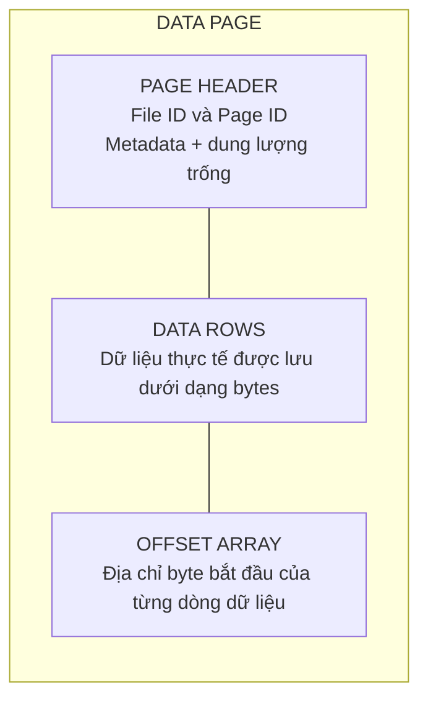
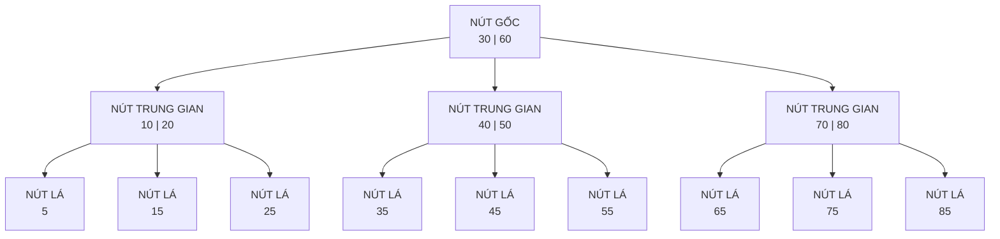
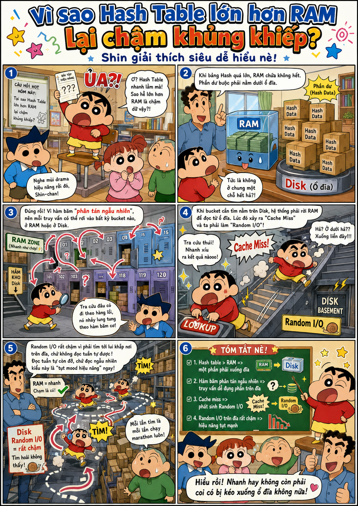

---
hide:
  - navigation
---

<header class="airflow-article-hero">
  <div class="airflow-article-hero__eyebrow">
    <a href="../">BEHIND THE PIPELINE</a>
    <span>ARTICLE / 003</span>
  </div>
  <h1>Index trong<br><em>cơ sở dữ liệu</em></h1>
  <p class="airflow-article-hero__dek">
    Vì sao cùng một câu truy vấn có thể phản hồi trong vài mili giây trên bảng nhỏ,
    nhưng lại mất nhiều giây khi dữ liệu tăng lên hàng triệu bản ghi?
  </p>
  <div class="airflow-article-hero__meta" aria-label="Thông tin bài viết">
    <span>DATABASE INTERNALS</span>
    <span>DEEP DIVE</span>
    <span>EDITION 03 · 2026</span>
  </div>
</header>

<figure class="airflow-opening-comic">
  
  <figcaption>
    <span>LƯU Ý TRƯỚC KHI ĐỌC</span>
    <strong>Một bài viết khá dài</strong>
  </figcaption>
</figure>

## 1. Database lưu trữ dữ liệu như thế nào?

Để hiểu khái niệm index dễ hơn, trước hết hãy xem **database lưu trữ dữ liệu trên ổ đĩa** như thế nào.

Khi truy vấn database, chúng ta thường thấy dữ liệu ở dạng hàng và cột. Tuy nhiên, tại tầng lưu trữ, DBMS không truy cập riêng lẻ từng hàng mà thường **đọc và ghi theo đơn vị gọi là page (hoặc block)**. Tùy hệ quản trị cơ sở dữ liệu, mỗi page có kích thước từ 4 KB đến 16 KB. Dữ liệu được đưa vào một page nhiều nhất có thể; khi page đã đầy, hệ thống tạo page mới để tiếp tục lưu trữ.

### Một page gồm những gì?

Thông thường, một page gồm các phần sau:

- **Page Header:** Chứa metadata của page như Page ID, dung lượng trống,...
- **Data Rows:** Lưu dữ liệu thực tế dưới dạng byte.
- **Offset Array:** Lưu địa chỉ byte bắt đầu của từng dòng dữ liệu. Nhờ đó, khi cần đọc một dòng trong page, hệ thống chỉ việc tra Offset Array để truy cập trực tiếp thay vì quét toàn bộ page.

Minh họa cấu trúc page:



### Heap và Clustered: hai cách tổ chức dữ liệu trong page

Thông thường, dữ liệu được lưu trong page theo hai cách:

- **Heap:** Dữ liệu trong page hoàn toàn không có thứ tự. Database ghi dữ liệu đến đâu thì đưa vào page đến đó, hoặc tìm page vẫn còn chỗ trống. Vì không phải quan tâm đến thứ tự nên **tốc độ ghi rất nhanh**. Đổi lại, để tìm một dòng dữ liệu, hệ thống phải lần lượt đưa các page vào RAM rồi quét từng dòng trong từng page (**full table scan**), gây ảnh hưởng lớn đến hiệu suất truy vấn.
- **Clustered:** Khi bảng có clustered index (primary key), dữ liệu trong database **được sắp xếp theo khóa này**. Việc ghi mất nhiều thời gian hơn vì hệ thống phải duy trì thứ tự, nhưng **truy vấn theo dòng hoặc theo khoảng sẽ nhanh hơn**. Do dữ liệu đã được sắp xếp, hệ thống chỉ cần xác định page chứa dòng cần tìm thay vì đọc toàn bộ các page.

## 2. Index là gì?

Hãy hình dung bạn cần tìm một tựa sách trong một cuốn sách rất dày. Nếu cuốn sách **không có mục lục**, bạn phải lật lần lượt từ trang đầu đến trang cuối cho đến khi thấy đúng tựa sách. Cách này rất tốn thời gian, nhất là khi cuốn sách dài hàng nghìn trang. Mục lục giải quyết vấn đề bằng cách sắp xếp các tựa sách theo một thứ tự, chẳng hạn thứ tự chữ cái, rồi ghi kèm số trang tương ứng. Muốn tìm một tựa đề, bạn chỉ cần **tra mục lục và mở thẳng đến trang được chỉ dẫn**.

Index trong cơ sở dữ liệu vận hành theo ý tưởng tương tự. Thay vì duyệt từng dòng để tìm giá trị mong muốn, hệ thống **tra index** để nhanh chóng xác định bản ghi hoặc page chứa dữ liệu, sau đó **chỉ đọc phần cần thiết**.

Index là một **cấu trúc phụ giúp tăng tốc tìm kiếm**. Ở nút trung gian, index lưu **key phân tách và con trỏ**, trỏ đến index page con. Ở nút lá, index lưu key cùng con trỏ hoặc định danh đến bản ghi; tùy loại index, nút lá có thể chứa luôn giá trị. Các phần tiếp theo sẽ giải thích khi nào index dùng con trỏ, cũng như vai trò của nút trung gian và nút lá. Trên đĩa, index thường được tổ chức thành nhiều **index page**; mỗi index page gồm nhiều **index entry**.


## 3. B-tree và B+tree hoạt động như thế nào?

Các index page thường không được trải phẳng mà liên kết với nhau theo một cấu trúc index. Hai cấu trúc index phổ biến là **B-tree và B+tree**. Đây là những **cây tìm kiếm đa nhánh cân bằng**, gồm nút gốc, các nút trung gian và các nút lá. Nếu đã học cấu trúc dữ liệu và giải thuật, bạn có thể hình dung chúng tương tự các cây tìm kiếm cân bằng như AVL hoặc Red-Black tree. Điểm khác biệt là mỗi node của B-tree/B+tree có thể chứa **nhiều key và nhiều nhánh con**, thay vì chỉ có hai nhánh trái và phải.

### Mô hình tổng quan: một B-tree cân bằng



> **Lưu ý:** Sơ đồ này chỉ minh họa cách các key **phân chia khoảng tìm kiếm** và cách các node liên kết với nhau. Để dễ quan sát, phần dữ liệu thực tế hoặc con trỏ đến dữ liệu đi kèm từng key không được hiển thị. Trong B-tree, mỗi key ở node trung gian và node lá đều có thể đi kèm dữ liệu hoặc con trỏ đến dữ liệu; các mũi tên trong sơ đồ biểu diễn **con trỏ đến node con**.

### B-tree: cấu trúc page và vị trí dữ liệu

Trong B-tree, dữ liệu thực tế hoặc con trỏ đến dữ liệu có thể xuất hiện ở cả nút trung gian và nút lá.

#### Nút trung gian

Mỗi nút trung gian gồm các **key**, con trỏ đến dữ liệu thực tế (**Row Identifier — RID**) và con trỏ đến các node con.

#### Nút lá

Nút lá chứa các thành phần tương tự nút trung gian, nhưng không có con trỏ đến node con. Các node lá độc lập với nhau và không có con trỏ nối sang node lá bên cạnh; trong khi đó, B+tree sử dụng danh sách liên kết đôi. Vì key tại nút trung gian đã gắn với dữ liệu thực tế nên các key này không xuất hiện lại tại nút lá.

#### Truy vấn khoảng và đặc điểm của B-tree

Do các node lá không có con trỏ nối với nhau, khi duyệt khoảng, hệ thống phải quay lại node cha rồi đi xuống các node khác, làm tăng số lần I/O.

Ưu điểm của B-tree là mỗi node đều có thể gắn với dữ liệu thực tế, vì vậy quá trình tìm kiếm có thể dừng sớm hơn so với B+tree. Mặt khác, do mỗi node phải chứa thêm con trỏ đến dữ liệu thực tế nên số key phân tách lưu được sẽ ít hơn. Cây vì thế sâu hơn và cần nhiều lần đọc ổ đĩa hơn.

**Internal page**

```text
[child ptr] [10 | Row ID] [child ptr] [20 | Row ID] [child ptr] [30 | Row ID] [child ptr]
```

**Leaf page**

```text
[5 | Row ID] [7 | Row ID] [9 | Row ID]
```

Trong B-tree, **mọi page, kể cả page trung gian**, đều có thể chứa key cùng row pointer. Ví dụ, quá trình tìm key `20` có thể **dừng ngay tại page trung gian**.

### B+tree: cấu trúc page và vị trí dữ liệu

B+tree khắc phục phần lớn những hạn chế của B-tree.

#### Nút trung gian

Nút trung gian chỉ chứa các **key phân tách** và con trỏ đến các node con, không chứa dữ liệu thực tế. Nhờ đó, mỗi node có thể chứa nhiều key phân tách hơn, giúp giảm độ sâu của cây và giảm số lần I/O trên ổ đĩa.

#### Nút lá

Tất cả key được đánh index đều xuất hiện tại nút lá. Mỗi entry chứa key và value; tùy loại index, value có thể là RID hoặc toàn bộ nội dung của các cột trong hàng dữ liệu. Các node lá được liên kết bằng danh sách liên kết đôi nên tối ưu cho truy vấn khoảng. Vì vậy, trong các hệ quản trị cơ sở dữ liệu quan hệ (RDBMS), B+tree và các biến thể của nó đã trở thành tiêu chuẩn phổ biến cho cấu trúc chỉ mục bảo toàn thứ tự.

**Internal page**

```text
[child0] [10] [child1] [20] [child2] [30] [child3]
```

**Leaf page**

```text
[5 | row ptr] [10 | row ptr] [15 | row ptr]
```

## 4. Index liên kết với dữ liệu trong bảng như thế nào?

### Con trỏ vật lý (RID — Row Identifier)

Khi bảng dữ liệu chính được lưu dưới dạng Heap Pages, không có clustered index, ví dụ PostgreSQL, index lưu tọa độ đĩa tĩnh `FileID:PageID:SlotNumber` để trỏ thẳng đến dòng dữ liệu.

Một RID thường gồm các thành phần sau:

- **File ID:** Mã định danh của file chứa dữ liệu trên ổ đĩa.
- **Page Number:** Số thứ tự của page trong file.
- **Slot Number:** Vị trí của dữ liệu trong Offset Array.

### Dữ liệu thực tế tại nút lá và clustered index

**Clustered index** định hình cấu trúc sắp xếp vật lý của toàn bộ bảng dữ liệu trên ổ đĩa. Khi dùng clustered index với B+tree, bảng dữ liệu được tổ chức trực tiếp thành cây này. Các nút lá chứa chính các hàng dữ liệu của bảng, được sắp xếp và lưu trữ theo thứ tự của clustered key. Vì vậy, xét ở mức lá, clustered index chính là bảng dữ liệu.

B+tree là cấu trúc dữ liệu; clustered index là ứng dụng của cấu trúc đó để tổ chức và sắp xếp vật lý toàn bộ bảng trên ổ đĩa.

Mỗi bảng chỉ có thể có một clustered index vì dữ liệu trên đĩa chỉ được sắp xếp theo một thứ tự duy nhất. Không nên chọn các cột dễ biến động, thường xuyên được cập nhật, chẳng hạn cột `status`, vì cập nhật khóa chỉ mục gây tốn I/O.

Các cột tự tăng là ứng viên hoàn hảo cho clustered index vì đảm bảo ba thuộc tính: ổn định, duy nhất và tăng dần tuần tự.

### Khóa logic và quá trình tra cứu

Khi bảng chính được lưu theo clustered index và có thêm chỉ mục phụ (secondary index), chỉ mục phụ lưu giá trị của primary key thay cho địa chỉ đĩa tĩnh. Ví dụ, với `ID = 3`, hệ thống dùng giá trị này để duyệt cây clustered index và lấy dữ liệu dòng.

> **Lưu ý:** Hai mô hình chứa dữ liệu thực tế tại nút lá và lưu khóa logic ở trên dành cho B+tree.

Vì sao chỉ mục phụ dùng khóa logic, dù phải duyệt cây hai lần (**Double Traversal**), thay vì dùng con trỏ vật lý RID?

Khi thêm hoặc thay đổi dữ liệu, vị trí của các dòng có thể thay đổi. Nếu các chỉ mục phụ lưu RID, hệ thống phải cập nhật lại những RID này, gây tốn I/O.


### Non-clustered index

**Non-clustered index** tăng tốc độ truy xuất mà không thay đổi thứ tự sắp xếp vật lý của bảng dữ liệu gốc. Đây là một cây B+tree độc lập, tồn tại bên cạnh bảng dữ liệu.

Theo mặc định, nút lá không chứa toàn bộ hàng mà chứa:

- Khóa non-clustered index.
- Row locator để tìm hàng gốc.
- Cột `INCLUDE`, nếu có.

Row locator phụ thuộc vào cách tổ chức bảng:

- **Bảng có clustered index:** Chứa clustered key.
- **Bảng heap:** Chứa RID, tức vị trí hàng.

Vì non-clustered index không thay đổi cách lưu dữ liệu trên đĩa, một bảng có thể có nhiều non-clustered index.

## 5. Index thay đổi như thế nào khi ghi dữ liệu?

### Khi `INSERT` dữ liệu

#### B-tree

Hệ thống duyệt cây để tìm node có thể chèn giá trị. Nếu node còn chỗ, key mới được chèn vào đúng vị trí theo thứ tự sắp xếp. Nếu node đã đầy, hệ thống thực hiện **page split**: chọn middle key, tách node thành hai node riêng và đưa middle key lên node cha để làm key dẫn đường. Nếu node cha cũng đầy, quá trình này tiếp tục lan lên các node cha phía trên.

Key mới được chèn sẽ thuộc một trong ba trường hợp:

1. **Nhỏ hơn middle key:** Key mới nằm trong node con bên trái.
2. **Lớn hơn middle key:** Key mới nằm trong node con bên phải.
3. **Chính là middle key:** Key mới không nằm trong hai node con mà được đưa lên node cha.

Ví dụ, khi chèn key `40`, hệ thống tạm thời đưa key này vào node theo thứ tự:

```text
K₁ = 10 | K₂ = 20 | K₃ = 30 | K₄ = 40
```

Trong ví dụ này, `K₂ = 20` là middle key. Khi page split xảy ra:

1. Hệ thống đưa `K₂`, tức key `20` cùng con trỏ dữ liệu của nó, lên node cha.
2. Node con bên trái chỉ giữ những giá trị đứng trước `K₂`, tức `[10]` (`K₁`).
3. Node con bên phải giữ những giá trị đứng sau `K₂`, tức `[30, 40]` (`K₃` và `K₄`).

#### B+tree

Quá trình chèn trong B+tree tương tự B-tree, nhưng hệ thống phải duyệt đến node lá vì chỉ node lá mới chứa con trỏ hoặc dữ liệu. Khi page split bắt đầu, key ở giữa được sao chép lên node cha vì B+tree yêu cầu các key vẫn phải nằm tại node lá. Sau khi tách thành hai node, hệ thống cũng cập nhật lại các con trỏ liên kết đôi của cả hai node.

### Khi `DELETE` dữ liệu

Xóa dữ liệu là quá trình phức tạp và có thể khiến mật độ dữ liệu trong node giảm xuống dưới ngưỡng tối thiểu, gây ra **underflow**.

#### B-tree

**Trường hợp 1: Key cần xóa nằm ở node lá**

Hệ thống xóa key khỏi node lá. Nếu node rơi vào trạng thái underflow, hệ thống sẽ mượn key hoặc gộp node với node anh em bên trái hoặc bên phải.

**Mượn key**

Hệ thống có thể mượn key từ node anh em bên trái hoặc bên phải. Key phân tách tại node cha được đưa xuống node đang thiếu. Nếu mượn từ bên trái, key lớn nhất của node trái được đưa lên thay key phân tách tại node cha; nếu mượn từ bên phải, key nhỏ nhất của node phải được đưa lên. Quy trình này duy trì thứ tự sắp xếp của các key trong cây.

**Trạng thái trước khi mượn key:**

- Node cha chứa key `[30]`.
- Node con trái chứa `[10, 20]`.
- Node con phải chỉ còn `[40]` sau khi xóa và bị underflow.

**Thao tác:**

1. Đưa key `30` tại node cha xuống node phải, tạo thành `[30, 40]`.
2. Đưa key `20` từ node trái lên thay key `30` tại node cha.

**Trạng thái sau cùng:** Node cha chứa `[20]`, node trái chứa `[10]`, node phải chứa `[30, 40]`. Cây trở lại trạng thái cân bằng.

**Gộp node**

Khi không thể mượn key vì các node anh em chỉ có số key tối thiểu, hệ thống buộc phải gộp hai node để xử lý underflow. Key phân tách tại node cha, nằm giữa hai node con, được đưa xuống và gộp cùng dữ liệu của node đang thiếu và node anh em. Node dư thừa sau đó được xóa. Nếu việc mất một key khiến node cha bị underflow, quy trình mượn hoặc gộp tiếp tục được áp dụng cho node cha.

Ví dụ với cây B-tree bậc 5, mỗi node chứa tối thiểu 2 key và tối đa 4 key.

**Trạng thái ban đầu:**

- Node cha chứa `[30, 60]`.
- Node con trái chứa `[10, 20]`.
- Node con giữa chứa `[40, 50]`.
- Node con phải chứa `[70, 80]`.

**Thao tác: Xóa key `50` khỏi node con giữa.**

1. Node con giữa chỉ còn `[40]` và bị underflow vì có ít hơn 2 key.
2. Hai node anh em `[10, 20]` và `[70, 80]` đều chỉ có đúng 2 key, đạt mức tối thiểu nên không có key dư để cho mượn.
3. Hệ thống kéo key phân tách `30` từ node cha xuống giữa node trái và node giữa, rồi gộp thành node mới:

    ```text
    [10, 20] + [30] + [40] = [10, 20, 30, 40]
    ```

4. Giải phóng node giữa cũ.

**Trạng thái sau cùng:** Node đã gộp chứa `[10, 20, 30, 40]`, node cha còn `[60]`. Nếu node cha bị thiếu key, quá trình mượn hoặc gộp tiếp tục lan lên tầng trên.

**Trường hợp 2: Key cần xóa nằm ở nút trung gian**

Khóa ở nút trung gian có vai trò phân tách và định tuyến nên hệ thống không thể xóa trực tiếp. Hệ thống tìm khóa liền trước hoặc liền sau ở nút lá, sao chép khóa đó để thay thế khóa cần xóa, rồi xóa khóa thế thân ở nút lá.

**Trạng thái ban đầu:**

- Nút trung gian chứa `[50]`, có hai con trỏ rẽ nhánh trái và phải.
- Cây con bên trái trỏ xuống nút lá `[20, 35, 45]`.
- Cây con bên phải trỏ xuống nút lá `[60, 70]`.

**Thao tác: Xóa khóa `50` ở nút trung gian.**

1. Tìm khóa thế thân: Khóa lớn nhất ở nhánh trái là `45` (In-order Predecessor ở nút lá bên trái).
2. Sao chép `45` lên thay `50`. Nút trung gian trở thành `[45]`.
3. Xóa `45` ở nút lá bên trái. Nút này còn `[20, 35]`.
4. Kiểm tra underflow: Nút lá bên trái còn hai khóa, vẫn thỏa mãn số khóa tối thiểu là hai.

**Trạng thái sau cùng:** Nút trung gian chứa `[45]`, nút lá bên trái chứa `[20, 35]`. Quá trình xóa kết thúc mà không cần gộp hay xoay cây.

#### B+tree

Vì mọi khóa đều nằm ở nút lá, hệ thống xóa khóa tại nút lá. Nếu nút bị underflow, hệ thống thực hiện quy trình gộp nút hoặc mượn khóa.

### Khi `UPDATE` dữ liệu

Cách chỉ mục xử lý câu lệnh `UPDATE` phụ thuộc vào việc cột được cập nhật có nằm trong khóa chỉ mục hay không:

- **Cột không nằm trong khóa chỉ mục:** Cột được cập nhật bình thường, không ảnh hưởng đến index.
- **Cột nằm trong khóa chỉ mục:** Để duy trì thứ tự sắp xếp, hệ thống không sửa trực tiếp khóa mà lần lượt thực hiện `DELETE` rồi `INSERT`. Việc thực hiện cả hai thao tác tiêu tốn nhiều I/O và tài nguyên, vì vậy nên hạn chế thay đổi khóa chỉ mục.

### Chi phí duy trì nhiều index

Khi bảng có nhiều non-clustered index, các câu lệnh DML kéo theo các chi phí sau:

- **Nhân số lượt ghi:** Với 5 non-clustered index, một lần `INSERT` buộc hệ thống thực hiện 5 thao tác chèn vào 5 cây B+tree, nhân 5 lần ghi ổ đĩa và tăng số lượt ghi vào WAL.
- **Ghi ngẫu nhiên trên đĩa:** Các index có key khác nhau và không cùng thứ tự logic. Khi cập nhật một dòng dữ liệu, các nút cần cập nhật nằm ở những vị trí khác nhau, khiến hệ thống phải ghi ngẫu nhiên thay vì ghi tuần tự.
- **Phân tách page:** Các lệnh DML có thể gây phân tách page, kéo theo một chuỗi phân tách trên toàn bộ cây.

## 6. Hash Index

Ngoài họ cấu trúc B-tree/B+tree giữ vai trò chủ đạo trong RDBMS, thế giới lưu trữ còn có các cấu trúc chuyên biệt khác như Hash Index, GIN,... Nhưng trong khuôn khổ bài viết này ta sẽ chỉ tìm hiểu sơ lược thêm về Hash Index.

### Cơ chế tra cứu

Nếu nghiệp vụ không yêu cầu truy vấn khoảng mà ưu tiên tối đa tốc độ tra cứu điểm (**point lookup**), Hash Index là một lựa chọn có thể cân nhắc.

Đúng như tên gọi, cấu trúc này sử dụng một bảng băm, thường được duy trì thường trực trên RAM để tối ưu hiệu năng. Nhờ cơ chế băm trực tiếp key tìm kiếm, độ phức tạp trung bình khi truy xuất một giá trị đạt mức lý tưởng là `O(1)`.

### Hạn chế của Hash Index

Mặc dù có tốc độ đọc tốt, Hash Index vẫn tồn tại một số nhược điểm đáng kể:

- **Không hỗ trợ truy vấn khoảng:** Mục tiêu của hàm băm là phân tán dữ liệu ngẫu nhiên và đồng đều để tránh xung đột, tức các key khác nhau nhưng nằm trong cùng một bucket. Do đó, hai mã băm có giá trị liền kề có thể nằm trên hai data page cách xa nhau.
- **Không phù hợp với bảng quá nhỏ:** Sử dụng bảng băm có thể chậm hơn cả việc quét toàn bộ bảng.
- **Phụ thuộc vào dung lượng RAM:** Để đạt hiệu năng tối đa, bảng băm được lưu trên RAM. Nếu kích thước bảng băm vượt quá dung lượng RAM hiện có, hiệu năng hệ thống sẽ giảm mạnh. Khi hệ thống mất điện hoặc gặp sự cố, bảng băm này cũng bị mất và phải được khôi phục khi hệ thống hoạt động trở lại.

### Vì sao hàm băm cần hạn chế xung đột?

Hàm băm cần hạn chế tối đa tình trạng xung đột vì các nguyên nhân sau:

- Tránh tình trạng **data skew**, trong đó một bucket chứa quá nhiều key còn bucket khác không chứa key nào.
- Khi quá nhiều key nằm trong cùng một bucket, hệ thống phải truy cập bucket rồi tiếp tục tìm key cần thiết, làm mất lợi thế tốc độ `O(1)` của Hash Index.
- Khi quá nhiều key nằm trong cùng một bucket khiến bucket hết dung lượng, hệ thống phải tạo thêm **overflow page** và dùng con trỏ của danh sách liên kết để nối page này vào cuối bucket hiện có. Mỗi lần đọc overflow page cần thêm một lần I/O; quá nhiều I/O sẽ làm chậm hệ thống.

### Vì sao bảng băm lớn hơn RAM làm giảm hiệu năng?

Khi bảng băm vượt quá dung lượng RAM, một phần dữ liệu buộc phải được đẩy xuống ổ đĩa. Do tính chất phân tán ngẫu nhiên của hàm băm, mỗi lượt truy vấn rất dễ rơi vào phần nằm trên đĩa (**cache miss**), biến thao tác tra cứu trên RAM thành thao tác đọc đĩa ngẫu nhiên (**Random I/O**) rất chậm.



### Quy trình hình thành bảng băm trên RAM

Quy trình hình thành bảng băm (Hash Index/Hash Map) trên RAM trong hệ quản trị cơ sở dữ liệu gồm các bước sau:

1. Hệ thống quét tuần tự toàn bộ file log trên ổ đĩa.
2. Xác định vị trí của từng dòng dữ liệu trên ổ đĩa.
3. Tính mã băm của key và nạp vào RAM.

> **Lưu ý:** Nếu RAM đã lưu vị trí của một dòng dữ liệu nhưng hệ thống quét được vị trí mới hơn, hệ thống sẽ cập nhật vị trí mới vào RAM. Nếu dòng dữ liệu được đánh dấu là đã xóa, hệ thống sẽ xóa dữ liệu đó khỏi bảng băm trên RAM.

## 7. Composite Index

### Lọc theo nhiều cột và phép giao chỉ mục

Với truy vấn có nhiều điều kiện `AND` và mỗi cột đều có chỉ mục phụ, hệ thống phải thực hiện phép giao chỉ mục — một quá trình tốn kém.

**Phép giao chỉ mục** là kỹ thuật kết hợp nhiều chỉ mục riêng biệt để lọc dữ liệu. Ví dụ, với `idx_customer(customer_id)` và `idx_status(status)`:

```sql
SELECT * FROM Orders
WHERE customer_id = 1205 AND status = 'COMPLETED';
```

Nếu chọn phép giao chỉ mục, hệ thống sẽ:

1. Quét `idx_customer`: Lấy tập con trỏ dòng A có `customer_id = 1205`.
2. Quét `idx_status`: Lấy tập con trỏ dòng B có `status = 'COMPLETED'`.
3. Lấy giao A ∩ B: Giữ các con trỏ xuất hiện trong cả hai tập, bằng phép giao danh sách hoặc `AND` bitmap.
4. Truy cập bảng: Dùng các con trỏ còn lại để lấy đầy đủ dữ liệu dòng.

> **Lưu ý:** Không có chỉ mục hỗn hợp không đồng nghĩa với việc luôn dùng phép giao chỉ mục. Bộ tối ưu chọn phương án dựa trên chi phí ước tính và khả năng của hệ quản trị.

Phép giao chỉ mục có các chi phí sau:

- **I/O:** Duyệt nhiều cây B+tree làm tăng số lần đọc đĩa.
- **RAM và CPU:** Hệ thống phải cấp phát bộ nhớ đệm để giữ hai danh sách con trỏ, rồi dùng CPU để sắp xếp và thực hiện phép giao tập hợp.
- **Dữ liệu dư thừa:** Cả hai chỉ mục đều phải nạp những con trỏ có thể bị loại bỏ.

### Cấu trúc khóa ghép

Để giảm chi phí khi truy vấn thường lọc đồng thời theo nhiều cột, có thể tạo **composite index (chỉ mục hỗn hợp)**. Chỉ mục này gộp nhiều cột vào một cây B+tree duy nhất.

Cây B+tree của composite index có cấu trúc tương tự cây B+tree thông thường, nhưng mỗi khóa là một khóa ghép thay vì một giá trị đơn lẻ. Ví dụ, với index `(age, sex)`, một khóa có thể mang giá trị `(21,male)`.

Hệ thống sắp xếp khóa theo thứ tự phân cấp: trước hết theo cột ngoài cùng bên trái, sau đó theo cột thứ hai trong từng nhóm có cùng giá trị cột thứ nhất, rồi đến cột thứ ba trong từng nhóm của cột thứ hai, và tiếp tục như vậy.

```text
                     [ ('Dev', 28)  |  ('HR', 30) ]
                    /               |              \
                   ▼                ▼               ▼
         [ ('Dev', 20) ]     [ ('Dev', 28) ]     [ ('HR', 30) ]
         [ ('Dev', 22) ] <-> [ ('HR', 25)  ] <-> [ ('HR', 32) ]
```

Với sơ đồ trên:

- Khi tìm nhân viên `('HR', 25)`, hệ thống xác định khóa này lớn hơn `('Dev', 28)` nhưng nhỏ hơn `('HR', 30)` vì cùng phòng HR và `25 < 30`. Hệ thống đi vào nhánh giữa.
- Khi tìm nhân viên `('HR', 35)`, khóa này lớn hơn `('HR', 30)`, nên hệ thống đi vào nhánh ngoài cùng bên phải.

### Quy tắc tiền tố trái

Chỉ mục hỗn hợp tuân theo **quy tắc tiền tố trái**: chỉ hỗ trợ truy vấn lọc theo một chuỗi cột liên tục bắt đầu từ cột đầu tiên bên trái.

Với chỉ mục trên ba cột `(A,B,C)`, truy vấn chỉ sử dụng chỉ mục hiệu quả khi bắt đầu từ cột `A`. Ví dụ: `where a and b`, `a and c`, `a and b and c`.

Vì sao cần bắt đầu từ cột ngoài cùng bên trái? Với composite index `(a, b)`, các bản ghi được sắp xếp theo `a` trước. Trong mỗi nhóm có cùng giá trị `a`, các bản ghi mới tiếp tục được sắp xếp theo `b`.

Khi truy vấn có điều kiện trên `a`, hệ thống có thể nhanh chóng xác định vùng dữ liệu cần tìm. Trong vùng đó, `b` đã được sắp xếp nên hệ thống có thể tiếp tục tìm kiếm hiệu quả:

```sql
WHERE a = 10 AND b = 20
```

Nếu bỏ qua `a` và chỉ tìm theo `b`:

```sql
WHERE b = 20
```

Các giá trị `b` nằm rải rác trong nhiều nhóm `a`, không được sắp xếp liên tục trên toàn bộ index. Hệ thống thường phải quét nhiều phần, thậm chí toàn bộ index, nên không tận dụng tốt khả năng tìm kiếm của B+tree.

### Lưu ý khi chọn thứ tự cột

- **Có cả điều kiện bằng và điều kiện phạm vi:** Thường đặt cột dùng `=` trước, cột dùng phạm vi sau. Điều kiện bằng giúp DBMS thu hẹp đến một vùng dữ liệu xác định; trong vùng đó, các cột kế tiếp vẫn được sắp xếp nên điều kiện phạm vi được xử lý hiệu quả.
- **Nhiều cột cùng dùng phép so sánh bằng trong `WHERE`:** Ưu tiên cột có độ chọn lọc cao nhất (selectivity). Cột có độ chọn lọc cao có tỉ lệ giá trị trùng lặp thấp, chẳng hạn `userid`, giúp loại bỏ tối đa các điều kiện không thỏa mãn ngay từ những bước đầu.
- **Có mệnh đề `ORDER BY`:** Đặt cột cần sắp xếp ở vị trí cuối cùng của chỉ mục hỗn hợp.

## 8. Covering Index

### Chi phí truy cập lại bảng

Khi tạo non-clustered index, nút lá của B+Tree thường lưu giá trị của index key và con trỏ hoặc khóa chính dùng để xác định dòng dữ liệu trong bảng chính.

Nếu truy vấn cần lấy thêm các cột không có trong index, DBMS phải dùng con trỏ hoặc khóa chính này để truy cập lại bảng chính.

#### Khi index chứa con trỏ đến bảng chính

Dữ liệu trong bảng chính không được sắp xếp theo non-clustered index key. Vì vậy, khi một giá trị key khớp với nhiều dòng và truy vấn cần lấy các cột khác, DBMS phải thực hiện nhiều lần truy cập ngẫu nhiên để lấy dữ liệu từ bảng chính.

Ví dụ minh họa:

```text
    Trang đĩa của INDEX                      Các trang đĩa của BẢNG CHÍNH
┌─────────────────────────┐               ┌────────────────────────────────┐
│ ('IT', Con trỏ #10)  ───┼──────────────>│ Trang đĩa 2:  Dòng #10 ('IT')   │
│ ('IT', Con trỏ #500) ───┼──┐            └────────────────────────────────┘
│ ('IT', Con trỏ #80)  ───┼──┼──┐         ┌────────────────────────────────┐
└─────────────────────────┘  │  └────────>│ Trang đĩa 15: Dòng #80 ('IT')  │
     (Đọc tuần tự)           │            └────────────────────────────────┘
                             │            ┌────────────────────────────────┐
                             └───────────>│ Trang đĩa 89: Dòng #500 ('IT') │
                                          └────────────────────────────────┘
                                                (Nhảy đĩa ngẫu nhiên)
```

#### Khi index chứa clustered key

Clustered key đóng vai trò row locator. Nếu truy vấn cần cột không có trong non-clustered index, DBMS dùng clustered key tìm được để tra cứu lại clustered index.

Với mỗi dòng khớp điều kiện, DBMS thường phải duyệt một đường đi trong Clustered B+Tree từ nút gốc đến nút lá để lấy dữ liệu. Đây là **Key Lookup**.

Mỗi lần lookup có chi phí xấp xỉ `O(log N)`. Nếu truy vấn trả về nhiều dòng, số lần lookup lớn và có thể gây nhiều truy cập ngẫu nhiên.

Ví dụ:

```text
[BƯỚC 1: Quét Secondary Index]
Duyệt cây B+Tree phụ (idx_dept)
Tìm thấy các dòng 'IT':
 ├── ('IT', PK = 10)
 ├── ('IT', PK = 500)
 └── ('IT', PK = 80)

[BƯỚC 2: Key Lookup vào Clustered Index]
Với MỖI giá trị PK tìm được, hệ thống phải duyệt lại cây B+Tree chính:
 • Cầm PK = 10  ──> Duyệt cây Clustered B+Tree từ Gốc -> Nhánh -> Lá ──> Lấy name, salary (#10)
 • Cầm PK = 500 ──> Duyệt cây Clustered B+Tree từ Gốc -> Nhánh -> Lá ──> Lấy name, salary (#500)
 • Cầm PK = 80  ──> Duyệt cây Clustered B+Tree từ Gốc -> Nhánh -> Lá ──> Lấy name, salary (#80)
```

### Khi nào index bao phủ một truy vấn?

Covering index giúp khắc phục các chi phí truy cập lại bảng ở trên. Đây không phải một kiểu index cố định khi tạo bảng; một index có bao phủ hay không phụ thuộc vào truy vấn cụ thể.

Giả sử có index `idx_emp (dept_id, salary)`.

#### Ví dụ 1: Index chứa đủ các cột truy vấn cần

```sql
SELECT salary FROM Employees WHERE dept_id = 10;
```

Với truy vấn này, `idx_emp` là covering index vì chứa đủ cả `dept_id` và `salary`. Hệ thống thực hiện index-only scan.

#### Ví dụ 2: Truy vấn cần thêm cột ngoài index

```sql
SELECT salary, full_name FROM Employees WHERE dept_id = 10;
```

Vẫn là index đó, nhưng với truy vấn này, `idx_emp` không còn là covering index vì thiếu cột `full_name`. Hệ thống phải thực hiện lookup vào bảng chính.

### Index-only scan

Khi nhận diện được covering index phù hợp, hệ thống thực hiện **index-only scan**. Đây là kế hoạch thực thi truy vấn do Query Optimizer lựa chọn: database chỉ cần duyệt đến nút lá của cây chỉ mục để lấy đầy đủ dữ liệu cần thiết, không cần truy cập bảng dữ liệu chính (Data Pages/Heap/Clustered Index).

### Chi phí mở rộng khóa và vai trò của INCLUDE

Một cách thiết kế covering index là đưa tất cả các cột cần truy vấn vào composite index. Tuy nhiên, cách này có những đánh đổi về lưu trữ:

- **Giảm hệ số rẽ nhánh:** Khóa lớn hơn khiến mỗi nút chứa được ít khóa phân tách hơn. Hệ số rẽ nhánh giảm, cây sâu hơn và số page cần đọc tăng lên.
- **Tăng tần suất page split:** Khóa có dung lượng lớn khiến page nhanh đầy hơn.

Để giải quyết những hạn chế này, các hệ quản trị cơ sở dữ liệu hỗ trợ mệnh đề `INCLUDE`. Mệnh đề này cho phép đính kèm các cột dữ liệu lấy thêm (payload columns) chỉ ở tầng nút lá của cây B+tree. Nhờ đó, các nút trung gian vẫn nhẹ, duy trì hệ số rẽ nhánh phù hợp, đồng thời vẫn đáp ứng index-only scan vì dữ liệu cần truy vấn đã có đầy đủ tại nút lá.

## 9. Partial Index

### Chỉ mục trên một tập con dữ liệu

Thay vì xây dựng một B+Tree chứa toàn bộ dòng trong bảng, **Partial Index** (hay conditional index) dùng một điều kiện logic để chỉ đưa những dòng cần thiết vào chỉ mục.

Giả sử bảng `orders` có 99% đơn hàng đã hoàn thành và chỉ 1% còn ở trạng thái `active`. Nếu workload thường xuyên tìm các đơn hàng đang hoạt động, một index đầy đủ sẽ phải lưu cả 99% dòng không được truy vấn. Partial Index cho phép thu hẹp cấu trúc này xuống đúng tập dữ liệu cần dùng:

```sql
CREATE INDEX idx_active_orders
ON orders (customer_id)
WHERE status = 'active';
```

Khi truy vấn có điều kiện phù hợp, database chỉ duyệt những entry của đơn hàng đang hoạt động. Nhờ index nhỏ hơn, chi phí lưu trữ, đọc page và duy trì index cũng giảm theo.

### Khi nào nên dùng?

- Bảng có một tập con nhỏ nhưng được truy vấn thường xuyên, chẳng hạn bản ghi `active`, `pending` hoặc chưa bị xóa.
- Điều kiện lọc ổn định và xuất hiện rõ trong các truy vấn chính.
- Chi phí của index đầy đủ lớn hơn lợi ích mà nó mang lại cho các dòng ít khi được đọc.

Optimizer chỉ dùng Partial Index khi có thể chứng minh điều kiện của truy vấn bao hàm predicate của index. Vì vậy, `WHERE status = 'active'` có thể dùng index ở trên, còn một điều kiện không liên quan đến `status` thì không.

### Đánh đổi

Partial Index không phải lúc nào cũng tốt hơn index đầy đủ:

- Predicate thay đổi thường xuyên có thể làm index mất lợi thế hoặc khiến việc bảo trì phức tạp hơn.
- Mỗi lần `INSERT` hoặc `UPDATE` làm dòng dữ liệu đi vào hoặc ra khỏi tập con, database vẫn phải cập nhật index.
- Cú pháp và mức hỗ trợ khác nhau giữa các hệ quản trị cơ sở dữ liệu; cần kiểm tra tài liệu của DBMS đang dùng.


---

## Lời kết

<figure class="airflow-closing-comic" id="loi-ket">
  
  <figcaption>
    <span>LỜI KẾT</span>
    <div>
      <strong>Cảm ơn bạn đã đọc đến cuối!</strong>
      <p>Hy vọng bài viết giúp bạn hiểu Index rõ hơn. Hẹn gặp lại ở những bài viết tiếp theo.</p>
    </div>
  </figcaption>
</figure>


<footer class="airflow-article-end">
  <div>
    <span>BEHIND THE PIPELINE / 003</span>
    <strong>Hiểu hệ thống,<br>không chỉ cú pháp.</strong>
  </div>
  <a href="../../">Trở về thư viện <span aria-hidden="true">→</span></a>
</footer>
