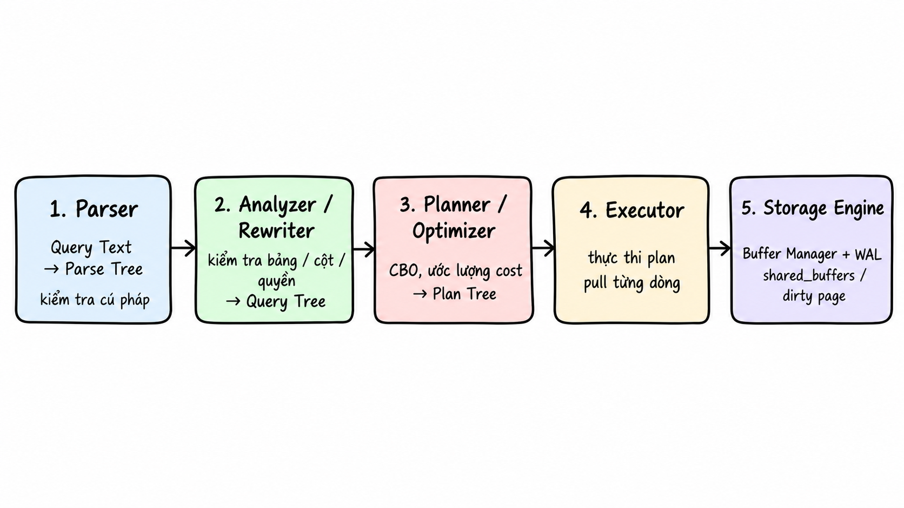
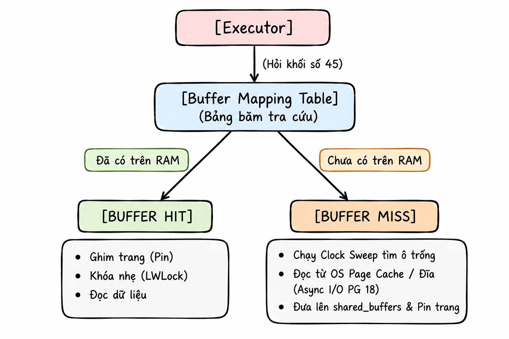
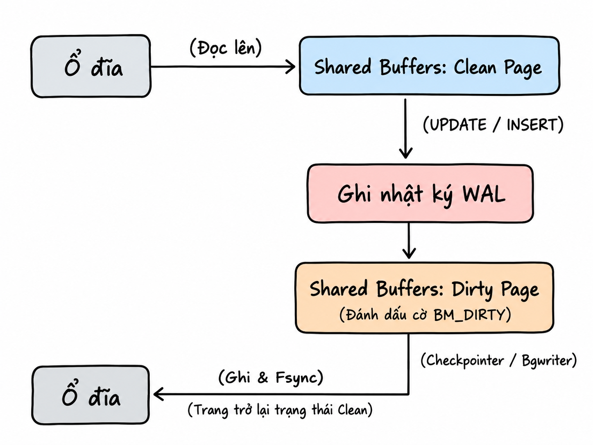
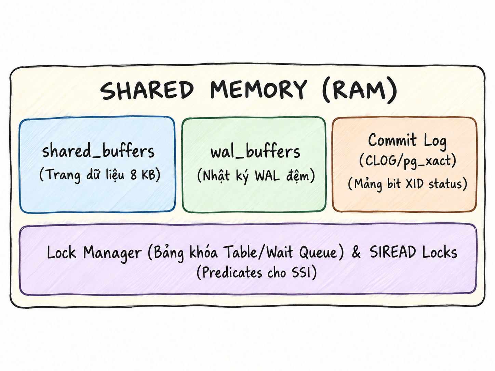
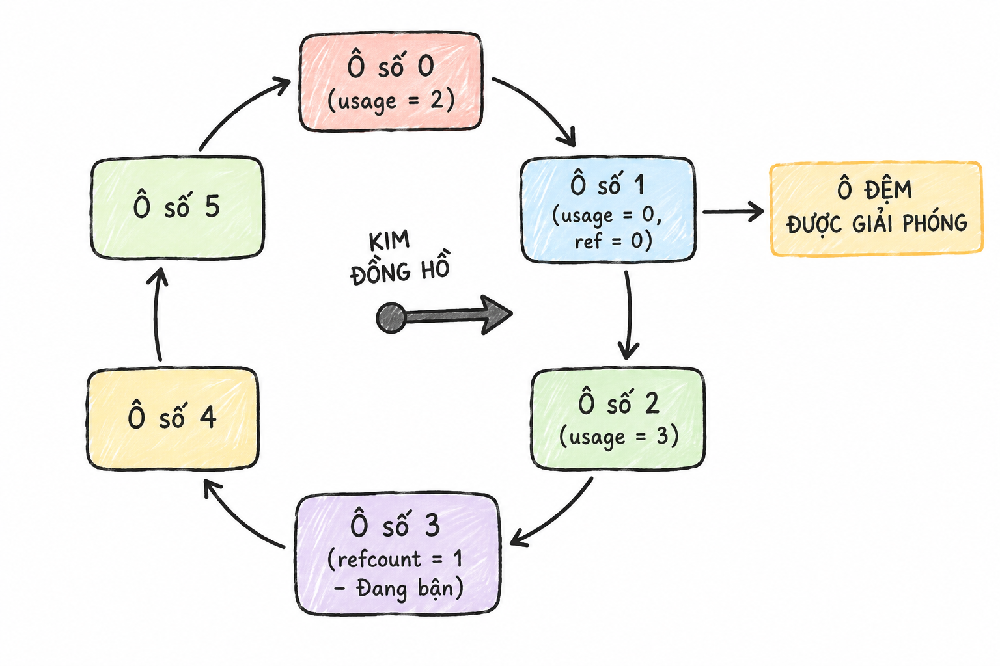

<header class="airflow-article-hero postgres-article-hero">
  <div class="airflow-article-hero__eyebrow">
    <a href="../../">BEHIND THE PIPELINE</a>
    <span>ARTICLE / 004 · PART 2</span>
  </div>
  <h1>PostgreSQL<br><em>Query processing,<br>storage &amp; recovery</em></h1>
  <div class="airflow-article-hero__meta" aria-label="Article information">
    <span>DATABASE INTERNALS</span>
    <span>PART 2 / 2 · 2026</span>
  </div>
</header>

In [Part 1 — Hierarchy, processes, and memory](postgres.en.md), we explored PostgreSQL’s logical hierarchy and connection model. Each client connection is handled by a backend process, which uses private query memory and accesses shared pages through `shared_buffers`.

This second article follows a query through the SQL engine, shared buffers, transactions, and physical storage. These correspond to layers 2, 3, and 4 in the architectural overview; layer 1 covers client connections and processes.

**In this series:** [Part 1 — Hierarchy, processes, and memory](postgres.en.md) · Part 2 — Query processing, storage, and recovery.

**The four architectural layers:**

- [Layer 1 — Processes, connections, and memory](postgres.en.md#tang-1-tien-trinh-ket-noi-va-bo-nho) · Part 1.
- [Layer 2 — Query processing](p2.en.md#tang-2-xu-ly-truy-van) · Part 2.
- [Layer 3 — Buffer management and transactions](p2.en.md#tang-3-bo-nho-em-va-giao-dich) · Part 2.
- [Layer 4 — Physical storage and recovery](p2.en.md#tang-4-luu-tru-vat-ly-va-phuc-hoi-tham-hoa) · Part 2.

## Layer 2: Query Processing

**Layer 2 (SQL Engine / Query Processing Layer)** handles PostgreSQL’s query logic. It turns declarative SQL text, such as `SELECT * FROM table`, into a physical execution plan selected using estimated costs.

Query compilation and execution proceed through these stages:

{ loading=lazy }

### Stage 1: Parser (Raw Parsing)

This stage converts raw SQL text into an in-memory tree structure called a **Parse Tree**.

> **Note:** At this stage, the Parser only validates syntax and command order, not whether the referenced table exists. For example, when parsing the sentence "The green dragon is flying over the moon", the Parser only knows the sentence is grammatically correct, but it has no knowledge of whether "green dragon" actually exists.

The Parser operates independently of the actual data for speed and **separation of concerns**. The validation of table existence, column data types, and user access privileges is fully delegated to the second stage: Rewriter / Analyzer.

This is an example of a Parse Tree:

```text
SelectStmt
├── targetList (List of columns to retrieve)
│   ├── ResTarget -> ColumnRef ("name")
│   └── ResTarget -> ColumnRef ("age")
├── fromClause (Data source)
│   └── RangeVar (relname = "users")
└── whereClause (Filter condition)
    └── A_Expr (operator ">")
        ├── lexpr -> ColumnRef ("age")
        └── rexpr -> A_Const (integer value = 18)
```

### Stage 2: Rewriter / Analyzer (Semantic Analysis and Query Rewriting)

At this stage, the system checks that referenced tables and columns exist, validates data types, and checks access privileges against system catalogs such as `pg_class`, `pg_attribute`, and `pg_constraint`. The Parse Tree becomes a **Query Tree**.

Next, the system applies transformation rules to adjust the Query Tree structure if the query accesses a view. This stage also handles Row-Level Security (RLS) and DML rewrite rules.

### Stage 3: Planner / Optimizer

At this stage, the Query Tree is transformed into a physical execution plan (**Plan Tree**) with the lowest estimated cost. PostgreSQL operates using a **Cost-Based Optimizer (CBO)** model, rather than applying rigid rules such as always using an index when one exists.

What is "cost" here? Cost reflects the amount of resources consumed by a query, including disk I/O and CPU processing—rather than time. For a given query, the Planner generates multiple execution strategies and estimates the resource consumption of each. The strategy with the lowest resource consumption is selected as the Plan Tree.

Based on statistical data from the Analyzer, the Planner first estimates the number of rows returned by each expression. Then, the Planner uses dynamic programming to generate strategies, compute costs, and immediately eliminate suboptimal branches. Finally, the Planner selects the strategy with the most appropriate Total Cost or Startup Cost, depending on whether a `LIMIT` or `CURSOR` is present, and passes the resulting Plan Tree to the Executor.

- **Total Cost:** Cost to return all data from the entire table.
- **Startup Cost:** Cost to begin returning the first data row.

What does a Plan Tree look like? Suppose you run a simple query:

```sql
SELECT name FROM users WHERE age > 18 LIMIT 2;
```

PostgreSQL transforms this command into a chain of three nodes stacked vertically:

```text
[Node 3: LIMIT (Returns exactly 2 people)]        <-- Top node (Parent node)
                       ↑
       [Node 2: FILTER (Checks age > 18)]      <-- Middle node
                       ↑
       [Node 1: SEQ SCAN (Reads each row from users table)] <-- Bottom node (Child node)
```

### Stage 4: Executor (Plan Execution)

A common misconception is that Node 1 first reads a million rows and passes them all to Node 2, which filters them and sends every result to Node 3 just to return two people.

PostgreSQL instead passes rows through a **pull-based execution model**: a parent node requests rows from its child. For example:

The client asks the LIMIT node for results. LIMIT asks FILTER: “I need two people. Give me the first one.”

FILTER has no data yet, so it asks SEQ SCAN for one row. SEQ SCAN reads the first row, Nam with `age = 15`, and passes it to FILTER.

FILTER sees that `15 < 18`, rejects the row, and asks SEQ SCAN for the next one.

SEQ SCAN reads the second row, Lan with `age = 20`, and passes it to FILTER. Since `20 > 18`, FILTER passes Lan’s row to LIMIT.

LIMIT now has one person and requests another from FILTER. The process repeats until LIMIT receives a second person, such as Hùng with `age = 22`.

Once LIMIT has two people, execution stops. As rows are read, the Executor also checks tuple header metadata to determine their visibility.

### Stage 5: Buffer Management and Physical Storage (Storage Engine)

At this stage, when nodes require data access, the Executor never directly interacts with disk but instead sends requests to the **Buffer Manager**. The Buffer Manager queries a hash table (**Buffer Mapping Hash Table**). If the data is already in RAM, the Executor directly extracts and returns the data to the parent node. Having data in RAM reduces disk I/O costs.

When the data is not present in RAM (**Buffer Miss**), the Buffer Manager must load a page from disk into `shared_buffers`. Then, the Executor reads the data from there.

When writing data, changes are made in RAM, and the corresponding pages are marked as Dirty Pages. Immediately upon modifying data in RAM, PostgreSQL generates a **WAL record** and stores it in `wal_buffers` in RAM.

When a user executes `COMMIT`, the system does not immediately write Dirty Pages to disk. Instead, it first writes the content of `wal_buffers` to disk, following a fundamental principle of databases: **A dirty page must not be written to disk until the WAL record describing its changes has been safely persisted.**

Dirty Pages remain in `shared_buffers` in RAM so that background processes such as Checkpointer or `bgwriter` can gradually write them to disk later. PostgreSQL acknowledges `COMMIT` to the client only after receiving confirmation that the WAL records have been safely persisted to physical storage.

{ loading=lazy }

#### Concepts to understand at this stage

To better understand this stage, let's explore the following concepts:

**Dirty Page:** A page in RAM that has been modified. A **clean page** matches its on-disk copy exactly. A **dirty page** contains the **latest version** in RAM, while the disk still holds the **older version**.

The lifecycle of a dirty page:

{ loading=lazy }

##### Which component is responsible for cleaning Dirty Pages?

- **Checkpointer:** Scans the entire `shared_buffers`, identifies all Dirty Pages, and forces them to be written to disk. The Checkpointer marks a checkpoint in the WAL file to record recovery progress.
- **Background Writer (`bgwriter`):** Identifies a small number of less-used Dirty Pages and writes them to disk before a checkpoint occurs.
- **Backend (client process):** When a new buffer needs to be loaded but the selected buffer for reuse is a Dirty Page, the backend can write that buffer to disk before using it.

A checkpoint can be triggered by elapsed time or WAL volume. The Checkpointer writes the necessary Dirty Pages to disk, records a checkpoint in WAL, and updates checkpoint information in `pg_control`. The Background Writer prepares clean buffers for backends to reuse, reducing the need for backends to flush dirty buffers when they need new ones. A backend can write any dirty buffer selected for replacement, even one it did not modify itself.

## Layer 3: Buffer Management and Transactions

Shared Memory consists of the following components:

{ loading=lazy }

### The `shared_buffers` Cache

`shared_buffers` is the largest shared memory region in PostgreSQL, serving as an intermediate cache for reading and writing 8 KB data blocks of tables and indexes. It acts as a **read cache** for pages loaded from disk and as the place where pages are modified. These modified pages become **dirty pages** until they are written to disk.

PostgreSQL combines `shared_buffers` with the Linux kernel's OS Page Cache. This combination is known as **double buffering**.

When `shared_buffers` is full and a new query requires loading additional 8 KB pages from disk into RAM, the system uses **Clock Sweep** to find buffer space to reuse. `shared_buffers` is divided into an array of **buffer frames** of fixed size 8 KB. Each buffer frame contains two values:

- **`refcount`:** The number of processes currently using the buffer frame. If `refcount > 0`, the buffer frame cannot be released; if `refcount = 0`, the system may consider releasing the frame and writing data to disk.
- **`usage_count` (0–5):** A higher value indicates the data has been used more frequently.

How Clock Sweep operates:

{ loading=lazy }

Clock Sweep scans buffer frames in a circle to find one that can be reused. This mechanism only considers frames with `refcount = 0`; each time a frame is examined, `usage_count` is decremented by one. The process continues until a reusable frame is found.

`shared_buffers` keeps 8 KB pages in RAM so they can be reused without another disk read. But what happens when a query scans a very large table?

When PostgreSQL detects a large table scan, it limits how much of `shared_buffers` that operation uses. The system allocates only a small number of buffer frames, depending on the operation type, to form a **Buffer Ring** within `shared_buffers`.

At the start of the query, it uses 32 buffer frames from `shared_buffers`. When scanning reaches page 33, instead of using Clock Sweep to find new frames across the entire RAM, the system returns to frame 1 within the 32-frame ring, discards the old data, and loads page 33.

- **For small tables:** PostgreSQL still loads directly into the shared cache.
- **`BAS_BULKREAD`:** When scanning a large table (estimated table size greater than 25% of total `shared_buffers`), the Buffer Ring consists of 32 pages of 8 KB.
- **`BAS_VACUUM`:** Enables Autovacuum to scan large tables to clean Dead Tuples; the Buffer Ring consists of 32 pages of 8 KB.
- **`BAS_BULKWRITE`:** When loading a large amount of data, the Buffer Ring consists of 32 pages of 8 KB.

A problem arises when this RAM region must serve a very large table scan.

### The `wal_buffers` Buffer

`wal_buffers` contains WAL records generated when a data page modification occurs in RAM. The data in this buffer is written to the physical file (`pg_wal`) when the system receives a `COMMIT` command.

### Commit Log (CLOG / `pg_xact`)

The Commit Log is a compact bit array that stores the status of each transaction ID. On disk, this data is stored in the `pg_clog` directory; in RAM, it is stored in the **SLRU Buffer**.

The Commit Log tracks transaction states, such as committed or in progress, using two bits per transaction to save memory. When the SLRU Buffer in RAM fills up, the system pushes Transaction IDs that have not been used for a long time to disk via the **LRU** mechanism.

### How This Layer Handles Concurrent Transactions

How does PostgreSQL handle a query that runs for 10 minutes while thousands of `UPDATE` and `DELETE` commands execute alongside it?

First, let's understand **MVCC (Multi-Version Concurrency Control)**, which allows multiple readers and writers to operate simultaneously without blocking each other. The MVCC rule is: "Reads do not block writes, and writes do not block reads."

For data modification operations, the system makes the following changes:

- **`INSERT`:** `t_xmin = current XID`, `t_xmax = 0`.
- **`DELETE`:** `t_xmax = current XID`.
- **`UPDATE`:** Creates a new row that the old row points to. The old row has `t_xmax = current XID`; the new row has `t_xmin = current XID` and `t_xmax = 0`.

When executing a query, the system captures a snapshot of the current state called a **Transaction Snapshot**. When the Executor reads a row, it compares the row's `t_xmax` and `t_xmin` with the snapshot:

- **Visible:** `xmin` belongs to a transaction that committed before the snapshot was created, and `xmax` is not set or belongs to a transaction executed after the snapshot.
- **Hidden:** The row was created by a transaction still in progress or by a transaction executed after the snapshot.

Thanks to the snapshot, if you run a reporting query for 10 minutes, its results remain consistent with the state at the start of the query, regardless of thousands of `UPDATE` or `DELETE` commands executed during that time. If every running `UPDATE` or `INSERT` locked its corresponding data row, the system would return to the traditional two-way blocking model. MVCC uses snapshots to let writes run alongside reads without interfering with each other.

A Transaction Snapshot contains three parameters:

- **`xmin`:** The XID of the oldest transaction still running.
- **`xmax`:** The first XID not yet assigned; all XIDs >= `xmax` are not visible.
- **`xip_list`:** An array containing a list of active XIDs at the time of snapshot capture.

Next, let’s look at **Serializable Snapshot Isolation (SSI)** and **SIREAD locks**.

**Serializable** means that concurrent transactions produce a result equivalent to some serial execution, with each transaction finishing before the next begins.

A common issue is the **doctors-on-call problem**. The hospital requires at least one doctor on duty. Currently, doctors A and B are both on duty (`on_call = true`). Both doctors simultaneously submit requests to take time off through parallel transactions (T1 and T2):

- **T1 (Doctor A):** Reads the table and counts the number of doctors on duty using the command `SELECT count(*) FROM doctors WHERE on_call = true;`. The result returned is 2. Since the result is greater than 1, T1 updates Doctor A's status to `false`.
- **T2 (Doctor B):** Runs in parallel and performs a similar count. The result is still 2 because T1 has not yet committed. Since the result is greater than 1, T2 updates Doctor B's status to `false`.

Both T1 and T2 successfully `COMMIT`. The hospital is left with no doctor on duty, violating its business rule.

To resolve this situation, PostgreSQL uses the **SSI algorithm via SIREAD Locks**. SIREAD Lock is not a physical lock but a **tag** stored in **Shared Memory** to indicate that T1 has previously read this data row. When a query reads multiple data rows, the system can aggregate SIREAD Locks from the row level to the page level, and then from multiple pages to the table level.

Aggregating SIREAD Locks only expands the monitoring scope and avoids **RAM exhaustion**, without physically locking tables.

An **rw-antidependency**, also called an **rw-conflict**, occurs when a transaction T1 reads a set of data, and then transaction T2 writes or modifies that data, making the data T1 read outdated. This relationship is represented by an edge on a graph: T1 ──(rw)──► T2.

The anomaly **Write Skew (non-serializable execution)** only occurs when the graph contains two consecutive rw edges: T1 ──(rw)──► T2 ──(rw)──► T3. In this case, T1 and T3 may be the same transaction, forming a cycle. In the above example, T1 reads data from a shared table while T2 modifies a row in that table, causing the data T1 read to become incorrect. When the system detects Write Skew, it **aborts** the transaction attempting to `COMMIT` last to preserve data integrity.

When building a B-tree, the data in the tree **does not contain** transaction version metadata (MVCC metadata) such as `t_xmin`, `t_xmax`, and `t_infomask`. This information is only stored in the table's main record. Therefore, when using a **covering index**, the system navigates to the index entry containing valid data, checks the page number that holds the row, and then checks the `all-visible` bit of the page in the `_vm` file in RAM.

The `_vm` file represents a bit array used to track data pages. Each heap page is associated with two bits in the `_vm` file: `all-visible` and `all-frozen`. Since the `_vm` file is typically small, the system rarely writes it to disk.

If `all-visible = 1`, all rows on the page are considered visible, including to the current snapshot. The system does not need to read the heap page from disk to check `t_xmin` and `t_xmax`, thus avoiding random disk reads. If `all-visible = 0`, the system cannot definitively determine whether the row is visible to the current snapshot, so it must read from disk to verify, increasing I/O cost.

This phenomenon of requiring disk reads for verification is called **Heap Fetches**. Heap Fetches increase when a large amount of data is updated and Autovacuum has not yet scanned it. In such cases, even with a covering index, performance does not improve. This phenomenon can be checked via the Heap Fetches metric when using `EXPLAIN`.

**When and how are the bits in the `_vm` file updated?**

- When a Vacuum process scans pages and determines there are no Dead Tuples and no rows invisible to relevant snapshots, the Vacuum sets the `all-visible` bit to `1`.
- When a DML command accesses a page with `all-visible = 1`, the system immediately sets the bit to `0`.

**Does the `_vm` file exist only when a table has an index?**

No. The `_vm` file still exists when a table has no index and performs two critical roles:

- **Optimizes the Vacuum process:** The system does not need to read the entire table to check for Dead Tuples. Instead, it scans the `_vm` file and skips pages with `all-visible = 1`.
- **Prevents transaction ID wraparound problems:** Uses the `all-frozen` bit.

## Layer 4: Physical Storage and Disaster Recovery

Each database cluster has a shared memory region (`shared_buffers`) in RAM and a data directory (`PGDATA`) on disk. Database data is stored in the `base/` directory.

### Where Schemas Are Stored

A schema has no separate physical storage location. All schemas within the same database reside in the same directory:

```text
PGDATA/base/<db_oid>/
```

In this case, `db_oid` is an identifier generated by the system each time the `CREATE DATABASE` command is executed.

### Directory Structure of `PGDATA`

Illustration of a `PGDATA` directory:

```text
PGDATA/                          <-- Root directory of the entire cluster (instance)
├── pg_wal/                      <-- Contains Write-Ahead Log (WAL) files
├── pg_xact/                     <-- Contains transaction commit status (CLOG)
├── global/                      <-- Contains system-wide catalog tables (pg_database, pg_authid, ...)
└── base/                        <-- Directory containing data for all databases
    ├── 1/                       <-- Directory for database 'template1' (OID = 1)
    ├── 13745/                   <-- Directory for database 'postgres' (OID = 13745)
    └── 16384/                   <-- Directory for database 'my_sales_db' created by you (OID = 16384)
        ├── 16388                <-- File containing heap data pages for Table A
        ├── 16388_fsm            <-- Free Space Map (FSM) for Table A
        ├── 16388_vm
        ├── 16388_init
        └── 16390                <-- File containing B-Tree index for Table A
```

The subdirectories within `PGDATA` serve the following purposes:

- **`pg_wal`:** Contains WAL files, with each file defaulting to 16 MB in size. WAL (Write-Ahead Logging) is a core mechanism in PostgreSQL, requiring that all changes to tables and indexes be written and synchronized to the log before actual data pages (8 KB pages) are allowed to be written to disk. The memory buffer `wal_buffers` pushes data into this directory upon receiving a `COMMIT` command.
- **`pg_xact`:** Stores transaction commit status (CLOG) previously mentioned.
- **`global`:** Stores system catalog tables and shared configuration status files used across the entire database cluster.

The directory `16384/` contains all data for a database. When files reach either a 1 GB threshold or a user-configured threshold, the storage engine automatically splits them into subsequent segments, such as `16388.1`, `16388.2`. Instead of combining the `_fsm`, `_vm`, and `_init` files into a single large file, the system splits them into separate files placed adjacent to each other: Main Fork (`16388`), FSM Fork, VM Fork, and Init Fork.

- **File `_fsm`:** When an `INSERT` operation is performed, the system searches for free space within a page to store the row. Without an FSM file, the engine would need to sequentially read every 8 KB page from the beginning to the end of file `16388` to locate free space, causing severe disk I/O bottlenecks when the table is large. This file is continuously updated during insert operations, updates, or when the `VACUUM` process removes dead tuples.
- **File `_vm`:** Contains the two bits `all-visible` and `all-frozen` previously mentioned, helping avoid repeated disk reads and prevent transaction ID wraparound problems.
- **File `_init`:** Created when a table is unlogged, used to erase all data in the table and restore the table to its initial state in case of a failure.

### Handling Large Data Columns with TOAST

TOAST is activated when a row exceeds 2 KB according to the default configuration. When creating variable-length columns such as `TEXT` or `VARCHAR`, PostgreSQL automatically creates a secondary table `pg_toast` within the database directory, along with a TOAST index. This mechanism prevents a single row from occupying two data pages. Large column values are split and moved into the TOAST table; the corresponding data on the main fork of the primary table is replaced with a compact reference structure known as a TOAST Pointer. As a result, the row on the main fork now occupies only a few dozen bytes and fits comfortably within an 8 KB page.

---

## Summary

| Layer | Processing flow |
| --- | --- |
| **1. Client and connection** | The application sends SQL, such as `SELECT * FROM snack;`, to PostgreSQL over a connection. Each connection typically has its own backend process. |
| **2. Query processing** | The Parser checks syntax; the Rewriter applies rules; the Planner chooses an execution plan; the Executor runs it and returns results. |
| **3. Memory** | `shared_buffers` and WAL buffers reside in shared memory. Memory for Sort, Hash, and `work_mem` belongs to each backend. |
| **4. Storage** | WAL is written first to protect data. Dirty Pages are then gradually written to table and index files on disk. |

## Conclusion

This article on PostgreSQL architecture draws on the author’s own reading, notes, and learning, so it may still contain inaccuracies or omissions. I welcome your feedback and corrections.

Thank you for reading to the end! I hope this article helps you understand PostgreSQL architecture more clearly. See you in future articles.


Revisit [Part 1 — Hierarchy, processes, and memory](postgres.en.md) for the foundations of connections, locking, and memory.

<footer class="airflow-article-end postgres-article-end">
  <div>
    <span>BEHIND THE PIPELINE / 004</span>
    <strong>Understand the system,<br>not just the syntax.</strong>
  </div>
  <a href="../../library/">Back to the library <span aria-hidden="true">→</span></a>
</footer>
