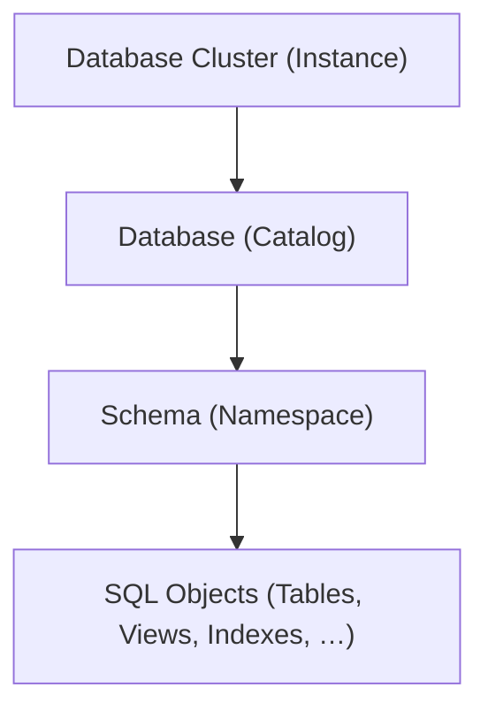
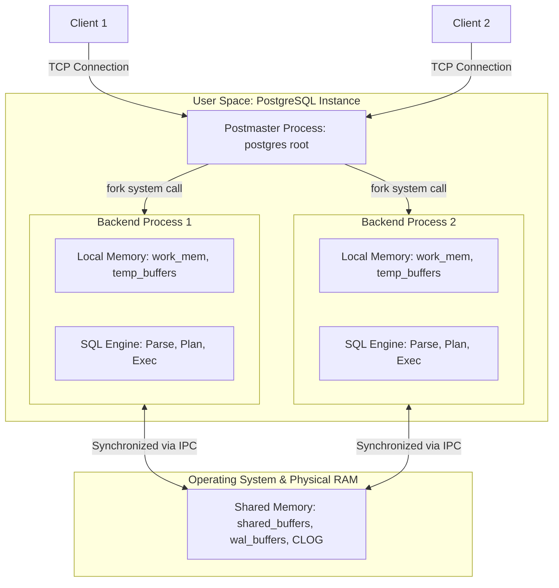
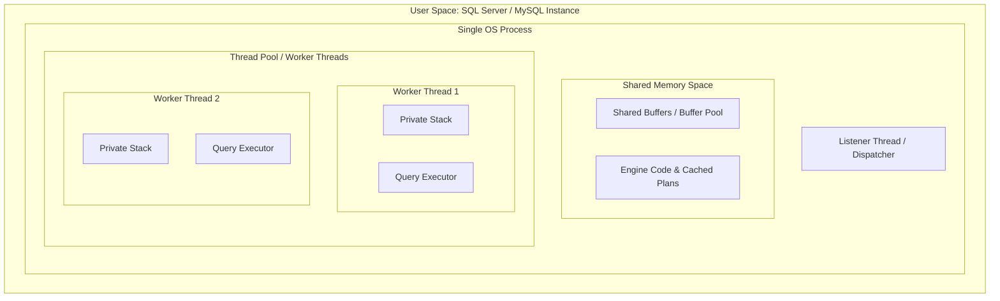
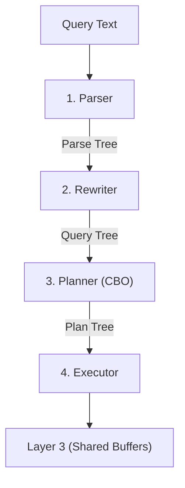
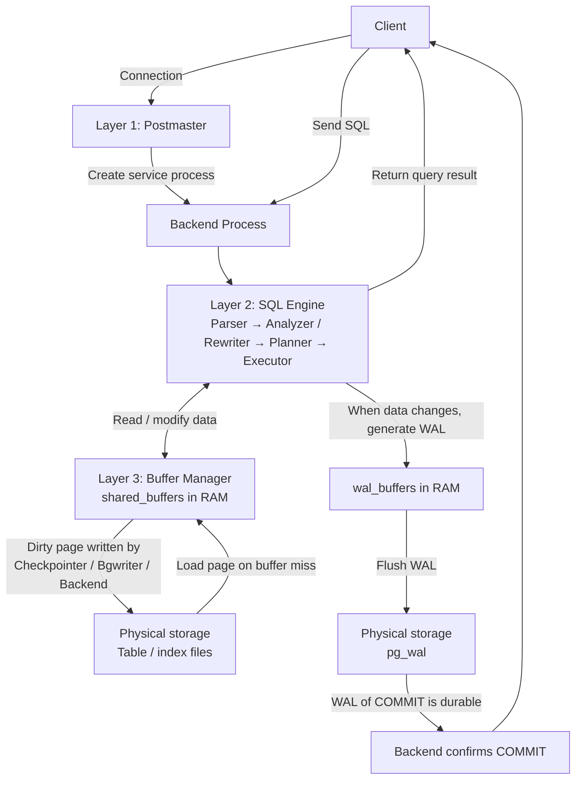

<header class="airflow-article-hero postgres-article-hero">
  <div class="airflow-article-hero__eyebrow">
    <a href="../../">BEHIND THE PIPELINE</a>
    <span>ARTICLE / 004</span>
  </div>
  <h1>PostgreSQL<br><em>Hierarchy & Storage</em></h1>
  <div class="airflow-article-hero__meta" aria-label="Article information">
    <span>DATABASE INTERNALS</span>
    <span>EDITION 04 · 2026</span>
  </div>
</header>

<figure class="airflow-opening-comic">
  
  <figcaption>
    <span>READ BEFORE</span>
    <strong>A fairly long article</strong>
  </figcaption>
</figure>

## 1. Logical Hierarchy in PostgreSQL

The logical hierarchy diagram of PostgreSQL, from top to bottom:



### Database Cluster (Instance)

**Database Cluster (Instance)** is a PostgreSQL process running on a physical machine or container. Each database cluster has a shared memory area (`shared_buffers`) in RAM and a data directory (`PGDATA`) on disk. Data for databases is stored in the `base/` directory.

### Database (Catalog)

A database cluster can contain multiple databases. These databases **cannot query each other directly**, unless using external tools. Each database has its own directory located within the `PGDATA` directory of the database cluster.

### Schema (Namespace)

Schemas reside within a database, and a database can have multiple schemas. Tables belonging to different schemas within the same database **can query each other**.

#### Why does a database need multiple schemas?

- **Avoid table name conflicts:** When multiple users share a database, dividing it into separate schemas helps avoid **table name conflicts**. For example, schema A and schema B can both contain a table named `order`. The system still accepts this because tables with the same name reside in different schemas.
- **Resource efficiency:** Multiple users sharing a single database are more resource-efficient than each user having their own isolated database.
- **Simplified privilege assignment:** As the system scales, assigning privileges to individual tables becomes difficult. Using schemas simplifies privilege assignment by granting privileges to a role at the schema level.

## 2. Architectural Layers of PostgreSQL

### Layer 1

#### Concepts to understand at Layer 1

##### Processes and Threads

**Process:** A standalone entity that owns a separate virtual address space. This space abstracts the operating system's memory, specifically RAM. Addresses within this space are continuously numbered from `0` to the highest address and are divided into two parts: a private memory region containing local variables and a shared memory region pointing to shared memory.

The process then only uses this virtual address space. The **MMU** (hardware integrated into the CPU) maps virtual addresses to physical addresses via a **Page Table** (a table used to map virtual addresses to physical addresses).

```text
[ Process A ]               [ Hardware: MMU ]            [ Physical RAM ]
Virtual page: 0x1000  -------->  (Lookup page table A)  -------->  Page frame: 0x88000

[ Process B ]
Virtual page: 0x1000  -------->  (Lookup page table B)  -------->  Page frame: 0x42000
```

Since the page table of process A does not contain mappings to the physical RAM page frames belonging to process B, process A is completely isolated and cannot read or interfere with **process B's private memory**.

**Thread:** A thread of execution within a process. All threads running in parallel share the virtual address space, the heap partition, the executable code segment (Code Segment), and the network connections of the parent process.

Each thread owns a separate **stack partition** (typically a few MB or a few hundred KB, used to store local variables, etc.) and an **instruction pointer** that helps the CPU determine where the thread has executed in the code. Each CPU core processes only the code of **a single thread at a time**. The operating system scheduler (OS Scheduler) can switch a thread from one core to another between execution cycles. Thus, cores are not permanently assigned to a specific thread. When a thread needs to perform I/O and temporarily transitions into a sleep state, the core can be reassigned to another thread.

##### Shared Buffers

`shared_buffers` is the amount of RAM used by an instance as a **buffer**, primarily to reduce disk read and write operations. This buffer resides in shared memory, which is shared among all processes.

This buffer is divided into thousands of equal-sized blocks. Each block has a size of **8 KB**, matching the size of a data page on disk.

##### Latch, Lock, and Lock Accumulation

**Latch:** A physical-level lock that prevents two threads from simultaneously writing to the same page, for example, one thread writing and another reading the same 8 KB page.

Suppose the `users` table has a data page of 8 KB (Page 42) already in RAM within the buffer pool. This page contains 5 rows, from row 1 to row 5.

Thread A executes an UPDATE command on row 1:

```sql
UPDATE users SET status = 'ACTIVE' WHERE id = 1;
```

Thread B executes a SELECT command on row 5:

```sql
SELECT * FROM users WHERE id = 5;
```

Logically (Lock), Thread A only locks row 1, and Thread B reading row 5 does not conflict with Thread A. However, both rows reside within the same 8 KB physical byte array of Page 42:

**Thread A requests an Exclusive Latch (physical write lock):** Thread A acquires an exclusive latch on the buffer frame containing Page 42 to prepare overwriting the status byte of row 1.

**Thread B requests a Shared Latch (physical read lock):** At the same time, Thread B wants to read Page 42 to retrieve row 5. Since Thread A holds an exclusive latch on Page 42, Thread B is immediately blocked, with a wait time in the nanosecond or microsecond range.

**Thread A completes its operation:** Thread A updates a few bytes in RAM within 1–2 microseconds and then releases the exclusive latch.

**Thread B continues:** Thread B can immediately safely read the data at row 5.

Without latches, Thread B could read Page 42 at the exact moment the CPU of Thread A is writing part of the page header bytes. As a result, Thread B would read a corrupted pointer.

**Lock:** A lock that protects logical data (rows, tables, views), ensuring transaction isolation according to the ACID standard. For example, when transaction 1 is updating a customer's account balance, a lock prevents transaction 2 from modifying or reading that balance until transaction 1 completes.

When a row changes, the database uses both types of locks simultaneously:

```text
[Start Transaction]
        │
        ▼
1. Request LOCK (Row Lock) ──────────┐
        │                            │
        ▼                            │
2. Load 8 KB page into Buffer Pool    │
        │                            │
        ▼                            │ ───► LOCK maintained continuously
3. Acquire LATCH (Exclusive) ────┐       │
        │                    │(A few µs│
        ▼                    │CROSS BOTH│
   Write data bytes into RAM  │ LOCKS) │
        ▼                    │         │
4. Release LATCH ────────────────┘       │
        │                            │
        ▼                            │
5. Perform other tasks...              │
        │                            │
        ▼                            │
[Transaction COMMIT / ROLLBACK]      │
6. Officially release LOCK ──────────┘
```

The diagram raises a question: Why does the system retain the old lock when transitioning to operations unrelated to the row?

Throughout the duration of a transaction, locks operate on the principle of **lock accumulation**. When processing a row, the system holds a lock on that row. When processing other rows, the system continues to hold locks on the new rows **while simultaneously retaining the lock on the previous row**. Only upon encountering a `COMMIT` or `ROLLBACK` command does the system release the lock.

Why does the system not release the old row's lock when processing other rows? If the system released the lock immediately after modifying `id = 1`, the following sequence could occur:

1. The initial transaction deducted 100 VND from `id = 1`, but had not yet updated `id = 2`.
2. Another transaction reads or modifies the balance of `id = 1`.
3. The command at `id = 2` encounters an error—such as an account being locked or a network disconnection—forcing the initial transaction to `ROLLBACK` to refund the amount to `id = 1`.

At this point, the second transaction has used incomplete data for computation, resulting in a **Dirty Read** or **Lost Update**, violating the atomicity (Atomicity) and isolation (Isolation) properties of ACID.

The location where PostgreSQL stores lock state differs from other database management systems:

In PostgreSQL, every tuple in a table's heap is always accompanied by a fixed-size 23-byte header called `HeapTupleHeaderData`. Within this header are fields that serve as control flags for row-level locking:

- **`t_xmin`:** Stores a Transaction ID.
- **`t_xmax`:** Stores a Transaction ID (XID) of the transaction modifying or holding a lock on this row.
- **`t_infomask`:** A set of binary flags indicating the purpose of the lock, such as `HEAP_XMAX_LOCK_ONLY`, `HEAP_XMAX_EXCL`, `HEAP_XMAX_KEYSHR`.

For example, an 8 KB page in the Buffer Pool:

```text
+-------------------------------------------------------------------------+
| ItemId (Pointer 1) | ItemId (Pointer 2) | ... Empty space ...             |
|-------------------------------------------------------------------------|
| Tuple for id = 1:                                                        |
| [Tuple Header: t_xmin=100, t_xmax=501 (Tx holding lock), t_infomask=LOCK_EXCL] |
| [Data: name = 'Alice', balance = 1000]                                   |
|-------------------------------------------------------------------------|
| Tuple for id = 2:                                                        |
| [Tuple Header: t_xmin=102, t_xmax=501 (Tx holding lock), t_infomask=LOCK_EXCL] |
| [Data: name = 'Bob', balance = 2000]                                     |
+-------------------------------------------------------------------------+
```

Following the storage of lock state, we will now explore the types of table locks in PostgreSQL.

##### Table Lock Types in PostgreSQL

When an SQL command is executed, PostgreSQL automatically assigns one of **eight table-level lock modes** to protect the table structure or data. These locks are stored in RAM within shared memory.

- When using `SELECT`, the system assigns an `AccessShareLock`. This is the lightest lock. These locks can coexist, allowing multiple `SELECT` commands to run simultaneously. It only conflicts with `AccessExclusiveLock`, used when executing DDL commands such as `ALTER TABLE`.
- When using `SELECT ... FOR UPDATE`, the system assigns a `RowShareLock` to protect the table structure and prevent DDL commands. Additionally, the system scans and directly locks tuples satisfying the condition at the tuple header level. This lock only conflicts with `ExclusiveLock` and `AccessExclusiveLock`.
- When executing DML commands that modify row data such as `INSERT`, `UPDATE`, `DELETE`, and `MERGE`, the system assigns a `RowExclusiveLock`. This lock conflicts with `ShareLock`, `ShareRowExclusiveLock`, `ExclusiveLock`, and `AccessExclusiveLock`.
- When background processes run, this lock does not block read or write operations, allowing background processes to run concurrently without application downtime. The lock conflicts with itself to ensure only one process runs at a time.
- When executing commands such as adding a foreign key or creating an index, data must remain unchanged during execution. The system assigns a `ShareRowExclusiveLock`. This lock allows users to read but prohibits writes or modifications to data.
- **`ExclusiveLock`:** Allows only concurrent `AccessShareLock` readers. This lock is activated by `REFRESH MATERIALIZED VIEW CONCURRENTLY`.
- When executing heavy DDL commands such as `ALTER TABLE`, `DROP TABLE`, `TRUNCATE`, `VACUUM FULL`, and `REINDEX`, the system uses an absolute exclusive lock, blocking **all** read and write operations (`SELECT`, `INSERT`, `UPDATE`, `DELETE`).

Note: In PostgreSQL, row-level locks are **directly written into the `t_xmax` field** of each tuple's header to avoid memory exhaustion, while **table-level locks** are entirely managed centrally **in RAM** (within the Lock Manager) for immediate checking and release.

After understanding how databases store lock state and the types of locks in PostgreSQL, we will now explore the concept of **Lock Escalation**.

**Lock Escalation (lock escalation)** is a database management system mechanism that automatically converts multiple fine-grained locks—such as row locks or page locks—into a single, broader lock, typically a table-level lock—within the same transaction.

Database systems like SQL Server store locks in RAM. A single lock typically consumes between 64 and 128 bytes:

- 10 rows: consumes approximately **1 KB of RAM**.
- 100,000 rows: consumes approximately **10 MB of RAM**.
- 10,000,000 rows: consumes approximately **1 GB of RAM** just to store the list of rows being locked.

To prevent the Lock Manager from consuming excessive RAM, SQL Server typically automatically activates Lock Escalation when a command holds more than 5,000 locks, replacing those locks with a single table-level exclusive lock.

In PostgreSQL, since row-level locks are not stored in RAM, the system consumes **no RAM** to store these row-level locks regardless of how many rows are locked. Therefore, PostgreSQL **does not experience Lock Escalation**.

#### PostgreSQL's Multi-Process Model

PostgreSQL uses a **multi-process model**: each client connection to the database runs in a separate process. These processes exchange data and synchronize through **Shared Memory**.

If Backend A has just read a table page from disk into `shared_buffers` (the largest component within Shared Memory), Backend B can directly read that page from `shared_buffers` without needing to access the disk again.

##### Connection Flow

The connection flow works as follows:

The parent **Postmaster** process runs in the background, initializing Shared Memory and opening network ports. When a client sends a connection request, the Postmaster forks the current process into a new process known as the **Backend Dedicated Process**. Thanks to the `fork()` mechanism, the child backend process automatically inherits the page table pointing into the shared memory area; private memory resources for query execution are dynamically allocated and only physically mapped into RAM when a read or write operation occurs.

**Child process address space:**

```text
┌──────────────────────────────────────────────────────────────┐
│ 1. Shared Memory (Shared Memory)                            │
│    - Shared across all other processes                      │
│    - Contains: shared_buffers, WAL buffers, Lock Manager, VM...  │
├──────────────────────────────────────────────────────────────┤
│ 2. Private Memory (Private Memory / Local Backend Memory)   │
│    - Exclusive to this child process                        │
│    - Isolated from the operating system; other processes cannot access │
│    - Contains: work_mem, temp_buffers, MemoryContexts...     │
└──────────────────────────────────────────────────────────────┘
```

The Postmaster hands off the client's network socket to the newly created backend process and immediately closes that socket on its own side to continue listening for other connections. Afterwards, the backend process initializes its own memory resources. Each child process consumes approximately **5 MB to 10 MB of RAM**, even when idle.



##### Query Serving Memory: `work_mem`

Each backend process has `work_mem`. This is a configuration that limits the amount of RAM a process requests to perform operations, used for resource-intensive tasks such as `ORDER BY`, `DISTINCT`, Hash Join, Merge Join, and Window Functions. **`work_mem` is not a per-query limit, but a per-operation (node) limit within the execution plan tree.**

###### Pipeline and Blocking Operators

To better understand, consider how PostgreSQL processes data:

PostgreSQL processes data in a pipeline model: the output of a lower-level node is **passed sequentially** up to the upper-level node.

However, some operators are known as **Blocking Operators**. These must gather all or most of the data into RAM before proceeding with computation. For example, sorting operations...

For instance, in Hash Join node 1, PostgreSQL requests RAM up to the maximum `work_mem`. At the same time, the Hash Join node 2 and the Sort node above also require RAM allocation. Since lower-level Hash nodes must continuously maintain data collection, processing, and data transfer to upper nodes, there is a period during which all three nodes are active and may collectively consume up to **3 × `work_mem`**.

```text
Maximum RAM used by a single query ≈ ∑ (work_mem of nodes that simultaneously gather data)
```

**Example of multiple operators sharing memory**

Illustrated by a query:

```sql
SELECT c.name, o.total, p.title
FROM orders o
JOIN customers c ON o.customer_id = c.id   -- Operation 1: Hash Join
JOIN products p ON o.product_id = p.id     -- Operation 2: Hash Join
ORDER BY o.total DESC;                     -- Operation 3: Sort
```

```text
[Sort Node]             --> Requires 1 RAM slot (maximum 1 × work_mem for sorting)
                    |
           [Hash Join 2: products]     --> Requires 1 RAM slot (maximum 1 × work_mem to build hash table for products)
                    |
           [Hash Join 1: customers]    --> Requires 1 RAM slot (maximum 1 × work_mem to build hash table for customers)
              /           \
     [Scan orders]    [Scan customers]
```

Unlike PostgreSQL's multi-process model, databases such as MySQL and SQL Server use a multi-threading model.

#### Multi-threading Model of Other Database Management Systems

Each client connection to the database is assigned a thread with a small stack size (256 KB to 1 MB). When a thread encounters a severe error, the entire database instance is at risk of crashing.

The thread operation works as follows:

**Connection Setup:** The client connects to the database port.

**Dispatcher Accepts:** A special thread acts as a listener thread that accepts connection requests.

**Thread Allocation:** Instead of calling the operating system to create a new process, the listener checks the system's thread pool and assigns an available idle thread (Worker Thread) to the client.

**Direct Execution:** The Worker Thread executes the SQL command directly within the shared memory space, reading and writing to the buffer pool.

**Return to Thread Pool:** When the client disconnects, the thread is not fully terminated. It cleans up session state variables and returns to an idle state within the thread pool, waiting for the next connection.

#### Related Questions




We have explored PostgreSQL's Layer 1 architecture. Next, let us explore Layer 2 architecture.

### Layer 2

**Layer 2 (SQL Engine / Query Processing Layer)** is the logical control component of PostgreSQL, responsible for transforming declarative text SQL commands (e.g., `SELECT * FROM table`) into an optimal physical execution plan based on cost estimation. This layer operates entirely within the local virtual memory space of the backend process.

#### Related Questions

**Why does Layer 2 operate entirely within local virtual memory?**

Layer 2 runs within the local virtual memory space because all steps—parsing, planning, and data computation—such as sorting or hash joins—serve only a single query of that backend process, rather than processing shared data across the entire system.


The compilation and execution chain of Layer 2 consists of the following stages:



#### Stage 1: Parser (Syntax Parsing)

The sole task of this stage is to convert a raw string of text into a data structure in RAM that a computer can process—a **Parse Tree**.

Note: At this stage, the Parser only validates syntax and command order, not whether the referenced table exists. For example, when parsing the sentence "The green dragon is flying over the moon", the Parser only knows the sentence is grammatically correct, but it has no knowledge of whether "green dragon" actually exists.

PostgreSQL designs the Parser independently from actual data to optimize performance and achieve **separation of concerns**. The validation of table existence, column data types, and user access privileges is fully delegated to the second stage: Rewriter / Analyzer.

This is an example of a Parse Tree:

```text
SelectStmt
├── targetList (List of columns to retrieve)
│   ├── ResTarget -> ColumnRef ("name")
│   └── ResTarget -> ColumnRef ("age")
├── fromClause (Data source)
│   └── RangeVar (relname = "users")
└── whereClause (Filter condition)
    └── A_Expr (operator ">")
        ├── lexpr -> ColumnRef ("age")
        └── rexpr -> A_Const (integer value = 18)
```

#### Stage 2: Rewriter / Analyzer (Semantic Analysis and Rule Transformation)

At this stage, the system checks for the existence of tables, columns, data types, and user access privileges by comparing the Parse Tree against system metadata tables: `pg_class`, `pg_attribute`, `pg_constraint`. Afterward, the Parse Tree is transformed into a **Query Tree**.

Next, the system applies transformation rules to adjust the Query Tree structure if the query accesses a view. Row-Level Security (RLS) and DML rule transformations are also processed directly during this stage.

#### Stage 3: Planner / Optimizer

At this stage, the Query Tree is transformed into a physical execution plan (**Plan Tree**) with the lowest estimated cost. PostgreSQL operates using a **Cost-Based Optimizer (CBO)** model, rather than applying rigid rules such as always using an index when one exists.

What is "cost" here? Cost reflects the amount of resources consumed by a query, including disk I/O and CPU processing—rather than time. For a given query, the Planner generates multiple execution strategies and estimates the resource consumption of each. The strategy with the lowest resource consumption is selected as the Plan Tree.

Based on statistical data from the Analyzer, the Planner first estimates the number of rows returned by each expression. Then, the Planner uses dynamic programming to generate strategies, compute costs, and immediately eliminate suboptimal branches. Finally, the Planner selects the strategy with the most appropriate Total Cost or Startup Cost, depending on whether a `LIMIT` or `CURSOR` is present, to package it into a Plan Tree and pass it to the Executor.

- **Total Cost:** Cost to return all data from the entire table.
- **Startup Cost:** Cost to begin returning the first data row.

What does a Plan Tree look like? Suppose you run a simple query:

```sql
SELECT name FROM users WHERE age > 18 LIMIT 2;
```

PostgreSQL transforms this command into a chain of three nodes stacked vertically:

```text
[Node 3: LIMIT (Returns exactly 2 people)]        <-- Top node (Parent node)
                       ↑
       [Node 2: FILTER (Checks age > 18)]      <-- Middle node
                       ↑
       [Node 1: SEQ SCAN (Reads each row from users table)] <-- Bottom node (Child node)
```

#### Stage 4: Executor (Execution of the Plan)

A common misconception among beginners is that: if Node 1 reads one million rows, it will pass all of them to Node 2; Node 2 filters and passes all results to Node 3 to return only two people.

However, as previously mentioned, PostgreSQL passes data row by row and operates using a **pull mechanism**: an upper node sends a request to a lower node to retrieve individual data rows. A simple example:

The client requests Node LIMIT: "Please return the result."  
Node LIMIT requests Node FILTER: "I need two people—please return the first one first."

Node FILTER has no data yet, so it requests Node SEQ SCAN: "Please read the first row from disk."  
Node SEQ SCAN reads the first row from disk—Nam, `age = 15`—and passes it to Node FILTER.

Node FILTER checks `15 < 18`, rejects this row, and continues requesting Node SEQ SCAN: "This row does not meet the condition—please read the next one."

Node SEQ SCAN reads the second row—Lan, `age = 20`—and passes it to Node FILTER.  
Node FILTER checks `20 > 18`, confirms the data is valid, and passes Lan's row to Node LIMIT.

Node LIMIT receives one person, still needs one more to reach two, so it continues requesting Node FILTER: "Please return the second person." This process repeats until Node LIMIT receives the second person, for example, Hùng, `age = 22`.

Once it has received two people, Node LIMIT requests the entire chain to stop. At the same time, the Executor reads metadata in the Tuple Header to verify whether the data is permitted to be displayed.

#### Stage 5: Memory Buffer and Physical Storage Layer (Storage Engine)

At this stage, when nodes require data access, the Executor never directly interacts with disk but instead sends requests to the **Buffer Manager**. The Buffer Manager queries a hash table (**Buffer Mapping Hash Table**). If the data is already in RAM, the Executor directly extracts and returns the data to the parent node. Having data in RAM reduces disk I/O costs.

When the data is not present in RAM (**Buffer Miss**), the Buffer Manager must load a page from disk into `shared_buffers`. Then, the Executor reads the data from there.

When writing data, changes are made in RAM, and the corresponding pages are marked as Dirty Pages. Immediately upon modifying data in RAM, PostgreSQL generates a **WAL record** and stores it in `wal_buffers` in RAM.

When a user executes `COMMIT`, the system does not immediately write Dirty Pages to disk. Instead, it first writes the content of `wal_buffers` to disk, following a fundamental principle of databases: **A Dirty Page in RAM is absolutely not written to disk unless the corresponding WAL record describing the page's changes has been safely persisted to disk.**

Dirty Pages remain in `shared_buffers` in RAM so that background processes such as Checkpointer or `bgwriter` can gradually write them to disk later. Only when the storage device's memory sends a confirmation signal — "The WAL records have been safely written to physical disk" — does PostgreSQL send a successful `COMMIT` response back to the client.

```text
[Executor]
                   │
                   ▼ (Query block 45)
          [Buffer Mapping Table] (Buffer Hash Table)
             /                \
      (Already in RAM)      (Not in RAM)
           /                    \
          ▼                      ▼
    [BUFFER HIT]           [BUFFER MISS]
   - Pin the page (Pin)     - Run Clock Sweep to find an empty slot
   - Acquire a lightweight lock (LWLock)    - Read from OS Page Cache / Disk (Async I/O PG 18)
   - Read data              - Load into shared_buffers and pin the page
```

##### Concepts to understand at this stage

To better understand this stage, let's explore the following concepts:

**Dirty Page:** A page in RAM whose content has been modified. To illustrate, for a **Clean Page**, the data in RAM and on disk are **identical at 100%**; for a **Dirty Page**, the data in RAM is the **latest version**, while the data on disk is the **older version**.

The lifecycle of a Dirty Page proceeds as follows:

```text
     [Disk] ──(Read into)──> [Shared Buffers: Clean Page]
                             │
                      (UPDATE / INSERT)
                             │
                             ▼
                    [Write to WAL]
                             │
                             ▼
               [Shared Buffers: Dirty Page] (Set BM_DIRTY flag)
                             │
                  (Checkpointer / Bgwriter)
                             │
                             ▼
[Disk] <──(Write & Fsync)─────┘ (Page returns to Clean state)
```

###### Which component is responsible for cleaning Dirty Pages?

- **Checkpointer:** Scans the entire `shared_buffers`, identifies all Dirty Pages, and forces them to be written to disk. The Checkpointer marks a checkpoint in the WAL file so the system knows where it has processed.
- **Background Writer (`bgwriter`):** Identifies a small number of less-used Dirty Pages and writes them to disk before a checkpoint occurs.
- **Backend (client process):** When a new buffer needs to be loaded but the selected buffer for reuse is a Dirty Page, the backend can write that buffer to disk before using it.


We have now explored all stages in Layer 2 of PostgreSQL. The following diagram illustrates how this layer operates:



```text
┌─────────────────────────────────────────────────────────────┐
│               BACKEND PROCESS (PRIVATE MEMORY)              │
│                                                             │
│  [SQL string] ──► [Parse Tree] ──► [Plan] ──► [Executor Engine]
│                                                      │      │
│  [work_mem: Hash Table / QuickSort region] ◄──────────┘      │
│                                                             │
└──────────────────────────────┬──────────────────────────────┘
                               │ Read tuple / Write WAL
                               ▼
┌─────────────────────────────────────────────────────────────┐
│                   SHARED MEMORY (SHARED)                   │
│                                                             │
│  - shared_buffers: Stores 8KB data blocks of tables and indexes│
│  - Lock Manager: Manages table locks                        │
│  - wal_buffers: Stores WAL records                         │
└─────────────────────────────────────────────────────────────┘
```

### Layer 3: Buffer Management and Transactions

Shared Memory consists of the following components:

```text
+-----------------------------------------------------------------------------------------+
|                                    SHARED MEMORY (RAM)                                  |
|  +---------------------+    +--------------------+    +------------------------------+  |
|  |   shared_buffers    |    |    wal_buffers     |    |   Commit Log (CLOG/pg_xact)  |  |
|  | (8KB data pages)    |    | (WAL buffer)       |    |  (Bit array of XID status)   |  |
|  +---------------------+    +--------------------+    +------------------------------+  |
|  | Lock Manager (Table lock table/Wait Queue) & SIREAD Locks (Predicates for SSI)        |  |
+-----------------------------------------------------------------------------------------+
```

#### Shared Buffers

`shared_buffers` is the largest shared memory region in PostgreSQL, serving as an intermediate cache for reading and writing 8KB data blocks of tables and indexes. This memory area stores data blocks read from disk to serve subsequent queries (**Read Cache**) and directly edits data into **Dirty Pages** before synchronizing them to physical disk.

PostgreSQL combines `shared_buffers` with the Linux kernel's OS Page Cache. This combination is known as the **dual-buffering mechanism**.

When `shared_buffers` is full and a new query requires loading additional 8KB pages from disk into RAM, the system uses the **Clock Sweep** mechanism to release RAM space. `shared_buffers` is divided into an array of buffer frames (buffers) of fixed size 8KB. Each buffer frame contains two values:

- **`refcount`:** The number of processes currently using the buffer frame. If `refcount > 0`, the buffer frame cannot be released; if `refcount = 0`, the system may consider releasing the frame and writing data to disk.
- **`usage_count` (0–5):** A higher value indicates the data has been used more frequently.

How Clock Sweep operates:

```text
    [Frame 0] (usage = 2)
              ↗           ↖
      [Frame 5]             [Frame 1] (usage = 0, ref = 0) ──► Frame released
         ↑         CLOCK       |
         |        HAND         |
      [Frame 4]  ────────►  [Frame 2] (usage = 3)
              ↘           ↙
                 [Frame 3] (refcount = 1 - Busy)
```

Clock Sweep checks buffer frames in a circular manner to find a frame eligible for release. This mechanism only considers frames with `refcount = 0`; each time a frame is examined, `usage_count` is decremented by one. The process continues until a frame satisfying the release condition is found.

You already know that `shared_buffers` is like a cabinet storing 8KB data pages in RAM, allowing immediate access without re-reading from disk. So, how does the system handle a query scanning a very large table?

When a query is detected to be scanning a very large table, PostgreSQL limits the scope of `shared_buffers` usage for that query. The system allocates only a small number of buffer frames, depending on the operation type, to form a **Buffer Ring** within `shared_buffers`.

At the start of the query, it uses 32 buffer frames from `shared_buffers`. When scanning reaches page 33, instead of using Clock Sweep to find new frames across the entire RAM, the system returns to frame 1 within the 32-frame ring, discards the old data, and loads page 33.

- **For small tables:** PostgreSQL still loads directly into the shared cache.
- **`BAS_BULKREAD`:** When scanning a large table (estimated table size greater than 25% of total `shared_buffers`), the Buffer Ring consists of 32 pages of 8KB.
- **`BAS_VACUUM`:** Enables Autovacuum to scan large tables to clean Dead Tuples; the Buffer Ring consists of 32 pages of 8KB.
- **`BAS_BULKWRITE`:** When loading a large amount of data, the Buffer Ring consists of 32 pages of 8KB.

A problem arises when this RAM region must serve a very large table scan.

#### wal_buffers

`wal_buffers` contains WAL records generated when a data page modification occurs in RAM. The data in this buffer is written to the physical file (`pg_wal`) when the system receives a `COMMIT` command.

#### Commit Log (CLOG / `pg_xact`)

The Commit Log is a compact bit array that stores the status of each Transaction ID. On disk, this data is stored in the `pg_clog` directory; in RAM, it is stored in the **SLRU Buffer**.

The Commit Log records whether a transaction has `COMMIT`ed or is in progress (in-progress). These states are represented by two binary bits to optimize memory usage. When the SLRU Buffer in RAM fills up, the system pushes Transaction IDs that have not been used for a long time to disk via the **LRU** mechanism.

#### Questions related to this layer's architecture

If you run a query that lasts 10 minutes, during that time thousands of continuous `UPDATE` or `DELETE` commands occur. How does the system handle this query?

First, let's understand **MVCC (Multi-Version Concurrency Control)**, which allows multiple readers and writers to operate simultaneously without blocking each other. The MVCC rule is: "Reads do not block writes, and writes do not block reads."

When executing DDL operations, the system performs the following steps:

- **`INSERT`:** `t_xmin = current XID`, `t_xmax = 0`.
- **`DELETE`:** `t_xmax = current XID`.
- **`UPDATE`:** Creates a new row that the old row points to. The old row has `t_xmax = current XID`; the new row has `t_xmin = current XID` and `t_xmax = 0`.

When executing a query, the system captures a snapshot of the current state called a **Transaction Snapshot**. When the Executor reads a row, it compares the row's `t_xmax` and `t_xmin` with the snapshot:

- **Visible:** `xmin` belongs to a transaction that has already `COMMIT`ed before the snapshot was created, and `xmax` is not set or belongs to a transaction executed after the snapshot.
- **Hidden:** The row was created by a transaction still in progress or by a transaction executed after the snapshot.

Thanks to the snapshot, if you run a reporting query for 10 minutes, its results remain consistent with the state at the start of the query, regardless of thousands of `UPDATE` or `DELETE` commands executed during that time. If every running `UPDATE` or `INSERT` locked its corresponding data row, the system would return to the traditional two-way blocking model. MVCC uses snapshots to let writes run alongside reads without interfering with each other.

A Transaction Snapshot contains three parameters:

- **`xmin`:** The XID of the oldest transaction still running.
- **`xmax`:** The first XID not yet assigned; all XIDs >= `xmax` are not visible.
- **`xip_list`:** An array containing a list of active XIDs at the time of snapshot capture.

We will now explore the algorithm **Serializable Snapshot Isolation (SSI)** and **SIREAD Locks**.

First, we need to understand the term **Serializable**. When multiple transactions run concurrently and produce output results equivalent to sequential execution — that is, one transaction completes before the next begins — this is called Serializable.

A common issue is the **Doctor on-call problem**. The hospital requires at least one doctor on duty. Currently, doctors A and B are both on duty (`on_call = true`). Both doctors simultaneously submit requests to take time off through parallel transactions (T1 and T2):

- **T1 (Doctor A):** Reads the table and counts the number of doctors on duty using the command `SELECT count(*) FROM doctors WHERE on_call = true;`. The result returned is 2. Since the result is greater than 1, T1 updates Doctor A's status to `false`.
- **T2 (Doctor B):** Runs in parallel and performs a similar count. The result is still 2 because T1 has not yet `COMMIT`. Since the result is greater than 1, T2 updates Doctor B's status to `false`.

Both T1 and T2 successfully `COMMIT`. The consequence is that the hospital no longer has a doctor on duty, violating business logic integrity.

To resolve this situation, PostgreSQL uses the **SSI algorithm via SIREAD Locks**. SIREAD Lock is not a physical lock but a **tag** stored in **Shared Memory** to indicate that T1 has previously read this data row. When a query reads multiple data rows, the system can aggregate SIREAD Locks from the row level to the page level, and then from multiple pages to the table level.

Aggregating SIREAD Locks only expands the monitoring scope and avoids **RAM exhaustion**, without physically locking tables.

The **rw-antidependency**, also known as **rw-conflict**: a transaction T1 reads a set of data, and then transaction T2 writes or modifies that data, making the data T1 read outdated. This relationship is represented by an edge on a graph: T1 ──(rw)──► T2.

The anomaly **Write Skew (non-serializable execution)** only occurs when the graph contains two consecutive rw edges: T1 ──(rw)──► T2 ──(rw)──► T3. In this case, T1 and T3 may be the same transaction, forming a cycle. In the above example, T1 reads data from a shared table while T2 modifies a row in that table, causing the data T1 read to become incorrect. When the system detects Write Skew, it immediately **rolls back** the final transaction that performed `COMMIT` to preserve data integrity.

When building a B-tree, the data in the tree **does not contain** transaction version metadata (MVCC metadata) such as `t_xmin`, `t_xmax`, and `t_infomask`. This information is only stored in the table's main record. Therefore, when using a **covering index**, the system navigates to the index entry containing valid data, checks the page number that holds the row, and then checks the `all-visible` bit of the page in the `_vm` file in RAM.

The `_vm` file represents a bit array used to track data pages. Each heap page is associated with two bits in the `_vm` file: `all-visible` and `all-frozen`. Since the `_vm` file is typically small, the system rarely writes it to disk.

If `all-visible = 1`, the entire page's data is considered valid, so the row is valid with the current snapshot. The system does not need to read the heap page from disk to check `t_xmin` and `t_xmax`, thus avoiding random disk reads. If `all-visible = 0`, the system cannot definitively determine whether the data is valid with the current snapshot, so it must read from disk to verify, increasing I/O cost.

This phenomenon of requiring disk reads for verification is called **Heap Fetches**. Heap Fetches increase when a large amount of data is updated and Autovacuum has not yet scanned it. In such cases, even with a covering index, performance does not improve. This phenomenon can be checked via the Heap Fetches metric when using `EXPLAIN`.

**When and how are the bits in the `_vm` file updated?**

- When a Vacuum process scans pages and determines there are no Dead Tuples and no data out of snapshot, the Vacuum sets the `all-visible` bit to `1`.
- When a DML command accesses a page with `all-visible = 1`, the system immediately sets the bit to `0`.

**Does the `_vm` file exist only when a table has an index?**

No. The `_vm` file still exists when a table has no index and performs two critical roles:

- **Optimizes the Vacuum process:** The system does not need to read the entire table to check for Dead Tuples. Instead, it scans the `_vm` file and skips pages with `all-visible = 1`.
- **Prevents Transaction ID overflow:** Uses the `all-frozen` bit.

### Layer 4: Physical Storage and Disaster Recovery

Each database cluster has a shared memory region (`shared_buffers`) in RAM and a data directory (`PGDATA`) on disk. Database data is stored in the `base/` directory.

#### Physical location of schema

Physically, schema has no separate storage location. All schemas within the same database reside in the same directory:

```text
PGDATA/base/<db_oid>/
```

In this case, `db_oid` is an identifier generated by the system each time the `CREATE DATABASE` command is executed.

#### Directory Structure of `PGDATA`

Illustration of a `PGDATA` directory:

```text
PGDATA/                          <-- Root directory of the entire cluster (instance)
├── pg_wal/                      <-- Contains Write-Ahead Log (WAL) files
├── pg_xact/                     <-- Contains transaction commit status (CLOG)
├── global/                      <-- Contains system-wide catalog tables (pg_database, pg_authid, ...)
└── base/                        <-- Directory containing data for all databases
    ├── 1/                       <-- Directory for database 'template1' (OID = 1)
    ├── 13745/                   <-- Directory for database 'postgres' (OID = 13745)
    └── 16384/                   <-- Directory for database 'my_sales_db' created by you (OID = 16384)
        ├── 16388                <-- File containing heap data pages for Table A
        ├── 16388_fsm            <-- Free Space Map (FSM) for Table A
        ├── 16388_vm
        ├── 16388_init
        └── 16390                <-- File containing B-Tree index for Table A
```

The subdirectories within `PGDATA` serve the following purposes:

- **`pg_wal`:** Contains WAL files, with each file defaulting to 16 MB in size. WAL (Write-Ahead Logging) is a core mechanism in PostgreSQL, requiring that all changes to tables and indexes be written and synchronized to the log before actual data pages (8 KB pages) are allowed to be written to disk. The memory buffer `wal_buffers` pushes data into this directory upon receiving a `COMMIT` command.
- **`pg_xact`:** Stores transaction commit status (CLOG) previously mentioned.
- **`global`:** Stores system catalog tables and shared configuration status files used across the entire database cluster.

The directory `16384/` contains all data for a database. When files reach either a 1 GB threshold or a user-configured threshold, the storage engine automatically splits them into subsequent segments, such as `16388.1`, `16388.2`. Instead of combining the `_fsm`, `_vm`, and `_init` files into a single large file, the system splits them into separate files placed adjacent to each other: Main Fork (`16388`), FSM Fork, VM Fork, and Init Fork.

- **File `_fsm`:** When an `INSERT` operation is performed, the system searches for free space within a page to store the row. Without an FSM file, the engine would need to sequentially read every 8 KB page from the beginning to the end of file `16388` to locate free space, causing severe disk I/O bottlenecks when the table is large. This file is continuously updated during insert operations, updates, or when the `VACUUM` process removes dead tuples.
- **File `_vm`:** Contains the two bits `all-visible` and `all-frozen` previously mentioned, which helps avoid multiple disk reads and prevents transaction overflow.
- **File `_init`:** Created when a table is unlogged, used to erase all data in the table and restore the table to its initial state in case of a failure.

#### Handling Large Data Columns with TOAST

TOAST is activated when a row exceeds 2 KB according to the default configuration. When creating columns with variable sizes such as `TEXT` or `VARCHAR`, PostgreSQL automatically creates a secondary table `pg_toast` within the database directory, along with a TOAST index. This mechanism prevents a single row from occupying two data pages. Large data columns are split and moved into the TOAST table; the corresponding data on the main fork of the primary table is replaced with a compact reference structure known as a TOAST Pointer. As a result, the row on the main fork now occupies only a few dozen bytes and fits comfortably within an 8 KB page.

---

#### Summary

<figure class="airflow-opening-comic">
  
</figure>

## Conclusion

<figure class="airflow-closing-comic" id="loi-ket">
  
  <figcaption>
    <span>CONCLUSION</span>
    <div>
      <strong>Thank you for reading all the way through!</strong>
      <p>Hopefully, this article has helped you better understand PostgreSQL's architecture. See you in future posts.</p>
    </div>
  </figcaption>
</figure>


<footer class="airflow-article-end postgres-article-end">
  <div>
    <span>BEHIND THE PIPELINE / 004</span>
    <strong>Understanding the system,<br>not just syntax.</strong>
  </div>
  <a href="../../">Return to library <span aria-hidden="true">→</span></a>
</footer>
