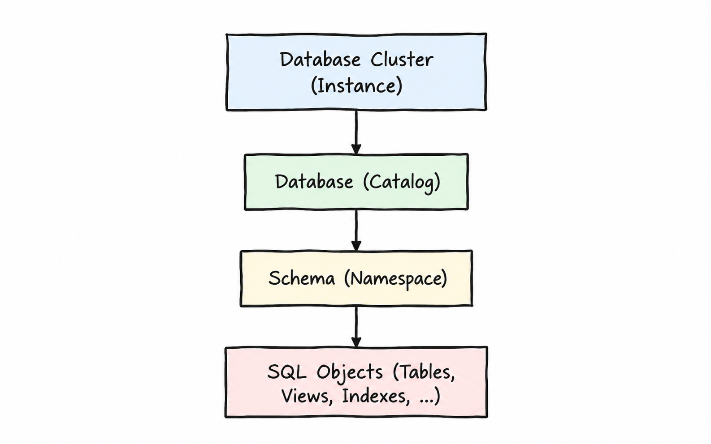
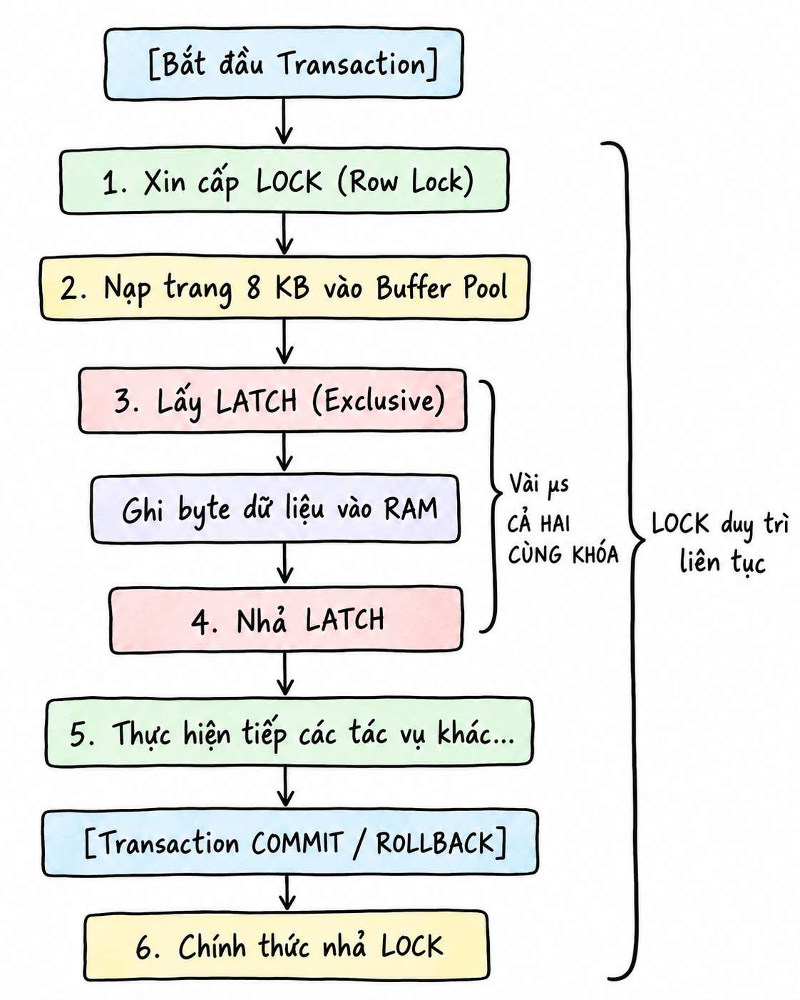
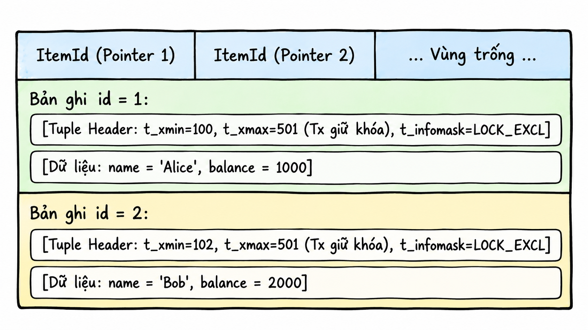
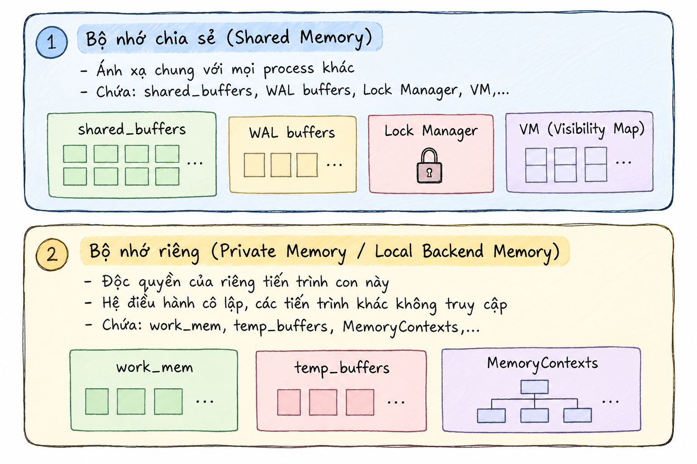
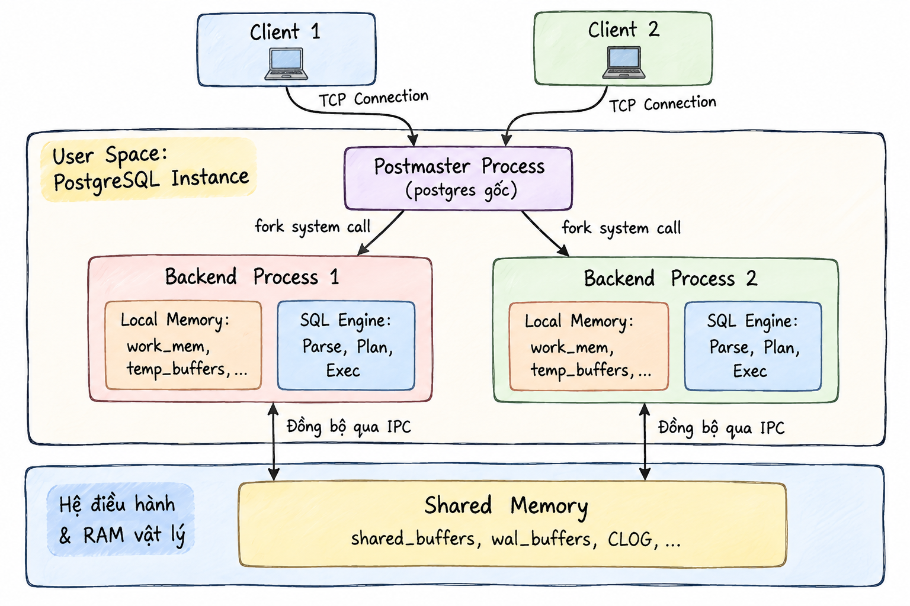
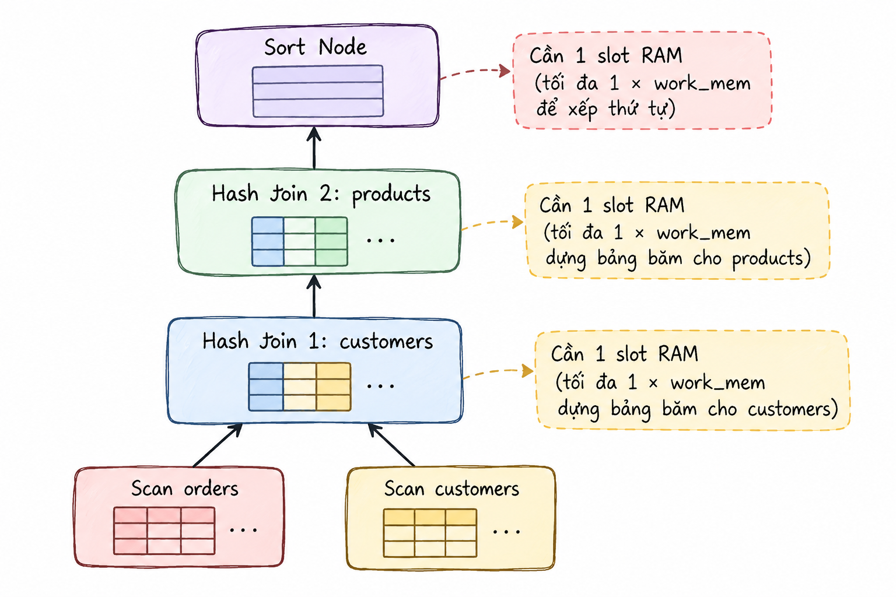
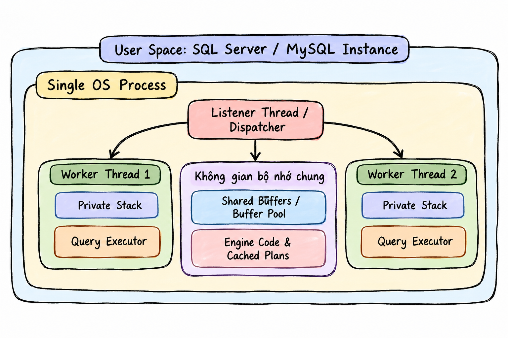

<header class="airflow-article-hero postgres-article-hero">
  <div class="airflow-article-hero__eyebrow">
    <a href="../../">BEHIND THE PIPELINE</a>
    <span>ARTICLE / 004 · PART 1</span>
  </div>
  <h1>PostgreSQL<br><em>Hierarchy, processes<br>&amp; memory</em></h1>
  <div class="airflow-article-hero__meta" aria-label="Article information">
    <span>DATABASE INTERNALS</span>
    <span>PART 1 / 2 · 2026</span>
  </div>
</header>

This is the first of two articles on PostgreSQL architecture. We start with Cluster, Database, and Schema, then explore processes, connections, locks, and query memory.

**In this series:** Part 1 — Hierarchy, processes, and memory · [Part 2 — Query processing, storage, and recovery](p2.en.md).

**The four architectural layers:**

- [Layer 1 — Processes, connections, and memory](postgres.en.md#tang-1-tien-trinh-ket-noi-va-bo-nho) · Part 1.
- [Layer 2 — Query processing](p2.en.md#tang-2-xu-ly-truy-van) · Part 2.
- [Layer 3 — Buffer management and transactions](p2.en.md#tang-3-bo-nho-em-va-giao-dich) · Part 2.
- [Layer 4 — Physical storage and recovery](p2.en.md#tang-4-luu-tru-vat-ly-va-phuc-hoi-tham-hoa) · Part 2.

## 1. Logical Hierarchy in PostgreSQL

PostgreSQL’s logical hierarchy, from the highest level to the lowest:

{ loading=lazy }

### Database Cluster (Instance)

**Database Cluster (Instance)** is a PostgreSQL process running on a physical machine or container. Each database cluster has a shared memory area (`shared_buffers`) in RAM and a data directory (`PGDATA`) on disk. Data for databases is stored in the `base/` directory.

### Database (Catalog)

A database cluster can contain multiple databases. **Queries cannot access data across these databases directly** without external tools. Each database has its own directory located within the `PGDATA` directory of the database cluster.

### Schema (Namespace)

Schemas reside within a database, and a database can have multiple schemas. A query **can access tables in different schemas** within the same database.

#### Why does a database need multiple schemas?

- **Avoid table name conflicts:** When multiple users share a database, dividing it into separate schemas helps avoid **table name conflicts**. For example, schema A and schema B can both contain a table named `order`. The system still accepts this because tables with the same name reside in different schemas.
- **Resource efficiency:** Sharing one database among multiple users uses fewer resources than giving each user a separate database.
- **Simplified privilege assignment:** As the system scales, assigning privileges to individual tables becomes difficult. Using schemas simplifies privilege assignment by granting privileges to a role at the schema level.

## Layer 1: Processes, Connections, and Memory

### Processes, Memory, and Locks

#### Processes and Threads

**Process:** A standalone entity that owns a separate virtual address space. This space abstracts the operating system's memory, specifically RAM. Addresses within this space are continuously numbered from `0` to the highest address and are divided into two parts: a private memory region containing local variables and a shared memory region pointing to shared memory.

The process works with this virtual address space. The **MMU**, hardware built into the CPU, translates virtual addresses into physical addresses using a **page table**.

```text
[ Process A ]               [ Hardware: MMU ]            [ Physical RAM ]
Virtual page: 0x1000  -------->  (Lookup page table A)  -------->  Page frame: 0x88000

[ Process B ]
Virtual page: 0x1000  -------->  (Lookup page table B)  -------->  Page frame: 0x42000
```

Since the page table of process A does not contain mappings to the physical RAM page frames belonging to process B, process A is completely isolated and cannot read or interfere with **process B's private memory**.

**Thread:** An execution path within a process. Threads in the same process share its virtual address space, heap, code segment, and network connections.

Each thread owns its own **stack** (typically a few MB or a few hundred KB, used to store local variables, etc.) and an **instruction pointer** that tracks the thread’s position in the code. Each CPU core processes only the code of **a single thread at a time**. The operating system scheduler (OS Scheduler) can switch a thread from one core to another between execution cycles. Thus, cores are not permanently assigned to a specific thread. When a thread needs to perform I/O and temporarily transitions into a sleep state, the core can be reassigned to another thread.

#### The `shared_buffers` Cache

`shared_buffers` is the amount of RAM used by an instance as a **buffer cache**, primarily to reduce disk read and write operations. This buffer resides in shared memory, which is shared among all processes.

This buffer is divided into thousands of equal-sized blocks. Each block has a size of **8 KB**, matching the size of a data page on disk.

#### Latch, Lock, and Lock Accumulation

**Latch:** A lock that protects a page during physical access, such as when one thread writes to an 8 KB page while another tries to read it.

Suppose the `users` table has a data page of 8 KB (Page 42) already in RAM within the buffer pool. This page contains 5 rows, from row 1 to row 5.

Thread A executes an UPDATE command on row 1:

```sql
UPDATE users SET status = 'ACTIVE' WHERE id = 1;
```

Thread B executes a SELECT command on row 5:

```sql
SELECT * FROM users WHERE id = 5;
```

At the logical lock level, Thread A locks only row 1, so Thread B’s read of row 5 does not conflict with it. However, both rows reside within the same 8 KB physical byte array of Page 42:

**Thread A requests an Exclusive Latch (physical write lock):** Thread A acquires an exclusive latch on the buffer frame containing Page 42 before overwriting row 1’s status byte.

**Thread B requests a Shared Latch (physical read lock):** At the same time, Thread B wants to read Page 42 to retrieve row 5. Since Thread A holds an exclusive latch on Page 42, Thread B is immediately blocked, with a wait time in the nanosecond or microsecond range.

**Thread A completes its operation:** Thread A updates a few bytes in RAM within 1–2 microseconds and then releases the exclusive latch.

**Thread B continues:** Thread B can now safely read row 5.

Without latches, Thread B could read Page 42 while Thread A is partway through writing the page header. As a result, Thread B would read a corrupted pointer.

**Lock:** Protects logical data, such as rows, tables, and views, to preserve the Isolation property of ACID transactions. For example, when transaction 1 executes an `UPDATE` on a customer's account balance, a lock prevents transaction 2 from modifying or reading that balance until transaction 1 completes.

When a row changes, the database uses both types of locks simultaneously:

{ loading=lazy }

Why does the system keep a row locked after it has moved on to work on other rows?

Locks **accumulate** over the course of a transaction. As the transaction processes new rows, it acquires new locks **while retaining those it already holds**. These locks are released only at `COMMIT` or `ROLLBACK`.

Why does the system not release the old row's lock when processing other rows? If the system released the lock immediately after modifying `id = 1`, the following sequence could occur:

1. The original transaction has deducted 100 VND from `id = 1` but has not yet credited `id = 2`.
2. Another transaction reads or modifies the balance of `id = 1`.
3. The command at `id = 2` encounters an error—such as an account being locked or a network disconnection—forcing the initial transaction to `ROLLBACK` to refund the amount to `id = 1`.

At this point, the second transaction has used incomplete data for computation, resulting in a **Dirty Read** or **Lost Update**, violating the Atomicity and Isolation properties of ACID.

The location where PostgreSQL stores lock state differs from other database management systems:

In PostgreSQL, every tuple in a table's heap is always accompanied by a fixed-size 23-byte header called `HeapTupleHeaderData`. This header contains fields used to manage row locks:

- **`t_xmin`:** Stores the Transaction ID that created the row.
- **`t_xmax`:** Stores a Transaction ID (XID) of the transaction modifying or holding a lock on this row.
- **`t_infomask`:** A set of binary flags indicating the purpose of the lock, such as `HEAP_XMAX_LOCK_ONLY`, `HEAP_XMAX_EXCL`, `HEAP_XMAX_KEYSHR`.

For example, an 8 KB page in the Buffer Pool:

{ loading=lazy }

Next, let’s look at PostgreSQL’s table lock modes.

#### Table Lock Types in PostgreSQL

When a SQL command is executed, PostgreSQL automatically assigns one of **eight table-level lock modes** to protect the table structure or data. These locks are stored in RAM within shared memory.

- When using `SELECT`, the system assigns an `AccessShareLock`. This is the lightest lock. These locks can coexist, allowing multiple `SELECT` commands to run simultaneously. It only conflicts with `AccessExclusiveLock`, used when executing DDL commands such as `ALTER TABLE`.
- When using `SELECT ... FOR UPDATE`, the system assigns a `RowShareLock` to protect the table structure and prevent DDL commands. Additionally, the system scans and directly locks tuples satisfying the condition at the tuple header level. This lock only conflicts with `ExclusiveLock` and `AccessExclusiveLock`.
- When executing DML commands that modify row data such as `INSERT`, `UPDATE`, `DELETE`, and `MERGE`, the system assigns a `RowExclusiveLock`. This lock conflicts with `ShareLock`, `ShareRowExclusiveLock`, `ExclusiveLock`, and `AccessExclusiveLock`.
- When background processes run, this lock does not block read or write operations, allowing background processes to run concurrently without application downtime. The lock conflicts with itself to ensure only one process runs at a time.
- When executing commands such as adding a foreign key or creating an index, data must remain unchanged during execution. The system assigns a `ShareRowExclusiveLock`. This lock allows users to read but prohibits writes or modifications to data.
- **`ExclusiveLock`:** Allows only concurrent `AccessShareLock` readers. This lock is activated by `REFRESH MATERIALIZED VIEW CONCURRENTLY`.
- When executing heavy DDL commands such as `ALTER TABLE`, `DROP TABLE`, `TRUNCATE`, `VACUUM FULL`, and `REINDEX`, the system uses a fully exclusive lock, blocking **all** read and write operations (`SELECT`, `INSERT`, `UPDATE`, `DELETE`).

> **Note:** In PostgreSQL, row-level locks are **directly written into the `t_xmax` field** of each tuple's header to avoid memory exhaustion, while **table-level locks** are entirely managed centrally **in RAM** (within the Lock Manager) for immediate checking and release.

After understanding how databases store lock state and the types of locks in PostgreSQL, we will now explore the concept of **Lock Escalation**.

**Lock Escalation** is a database management system mechanism that automatically converts multiple fine-grained locks—such as row locks or page locks—into a single, broader lock, typically a table-level lock—within the same transaction.

Database systems like SQL Server store locks in RAM. A single lock typically consumes between 64 and 128 bytes:

- 10 rows: consumes approximately **1 KB of RAM**.
- 100,000 rows: consumes approximately **10 MB of RAM**.
- 10,000,000 rows: consumes approximately **1 GB of RAM** just to store the list of rows being locked.

To prevent the Lock Manager from consuming excessive RAM, SQL Server typically automatically activates Lock Escalation when a command holds more than 5,000 locks, replacing those locks with a single table-level exclusive lock.

In PostgreSQL, since row-level locks are not stored in RAM, the system consumes **no RAM** to store these row-level locks regardless of how many rows are locked. Therefore, PostgreSQL **does not use Lock Escalation**.

### PostgreSQL's Multi-Process Model

PostgreSQL uses a **multi-process model**: each client connection to the database runs in a separate process. These processes exchange data and synchronize through **Shared Memory**.

If Backend A has just read a table page from disk into `shared_buffers` (the largest component within Shared Memory), Backend B can directly read that page from `shared_buffers` without needing to access the disk again.

#### Connection Flow

The connection flow works as follows:

The parent **Postmaster** process runs in the background, initializing Shared Memory and opening network ports. When a client sends a connection request, the Postmaster forks the current process into a new process called a **dedicated backend process**. Thanks to the `fork()` mechanism, the child backend process automatically inherits the page table pointing into the shared memory area; private memory resources for query execution are dynamically allocated and only physically mapped into RAM when a read or write operation occurs.

**Child process address space:**

{ loading=lazy }

The Postmaster hands off the client's network socket to the newly created backend process and immediately closes that socket on its own side to continue listening for other connections. Afterwards, the backend process initializes its own memory resources. Each child process consumes approximately **5 MB to 10 MB of RAM**, even when idle.

{ loading=lazy }

#### Query Memory: `work_mem`

The `work_mem` setting limits memory requested by a backend for operations such as `ORDER BY`, `DISTINCT`, Hash Join, Merge Join, and Window Functions. **`work_mem` is not a per-query limit, but a per-operation (node) limit within the execution plan tree.**

##### Pipeline and Blocking Operators

To better understand, consider how PostgreSQL processes data:

PostgreSQL processes data in a pipeline model: a child node’s output is **passed incrementally** to its parent.

However, some operators are known as **Blocking Operators**. These must gather all or most of the data into RAM before proceeding with computation. Sorting is one example.

For instance, in Hash Join node 1, PostgreSQL requests RAM up to the maximum `work_mem`. At the same time, the Hash Join node 2 and the Sort node above also require RAM allocation. The lower Hash nodes must keep their data in memory as they process it and pass results upward, so all three nodes can remain active at the same time and may collectively consume up to **3 × `work_mem`**.

```text
Maximum RAM used by a single query ≈ ∑ (work_mem of nodes that simultaneously gather data)
```

**Example of multiple operators using memory**

Illustrated by a query:

```sql
SELECT c.name, o.total, p.title
FROM orders o
JOIN customers c ON o.customer_id = c.id   -- Operation 1: Hash Join
JOIN products p ON o.product_id = p.id     -- Operation 2: Hash Join
ORDER BY o.total DESC;                     -- Operation 3: Sort
```

{ loading=lazy }

Unlike PostgreSQL's multi-process model, databases such as MySQL and SQL Server use a multi-threading model.

### Multi-threading Model of Other Database Management Systems

Each client connection to the database is assigned a thread with a small stack size (256 KB to 1 MB). When a thread encounters a severe error, the entire database instance is at risk of crashing.

Connection handling works as follows:

**Connection Setup:** The client connects to the database port.

**Accepting the connection:** A dedicated listener thread accepts connection requests.

**Thread Allocation:** Instead of calling the operating system to create a new process, the listener checks the system's thread pool and assigns an available idle thread (Worker Thread) to the client.

**Direct Execution:** The Worker Thread executes the SQL command directly within the shared memory space, reading and writing to the buffer pool.

**Return to Thread Pool:** When the client disconnects, the thread is not fully terminated. It cleans up session state variables and returns to an idle state within the thread pool, waiting for the next connection.

{ loading=lazy }

### Strengths and Limitations

Both multi-process and multi-threaded architectures have strengths and limitations:

| Architecture | Strengths | Limitations |
| --- | --- | --- |
| **Multi-process** | Each client has its own process, providing independent execution. | More processes consume more CPU and RAM. |
| **Multi-threaded** | Threads share resources within one process, providing fast execution with lower CPU and RAM use. | A failure in one thread can affect other threads. |


## Summary and Next Steps

You now have the foundations: PostgreSQL organizes objects into databases and schemas; backend processes handle connections, use shared memory, and allocate private memory for query operations. Locks coordinate access to data.

Continue with [Part 2 — Query processing, storage, and recovery](p2.en.md) to follow SQL through the Parser, Planner, and Executor, then explore buffers, WAL, and physical storage.

<footer class="airflow-article-end postgres-article-end">
  <div>
    <span>BEHIND THE PIPELINE / 004</span>
    <strong>Understand the system,<br>not just the syntax.</strong>
  </div>
  <a href="../p2.en/">Continue to Part 2 <span aria-hidden="true">→</span></a>
</footer>
