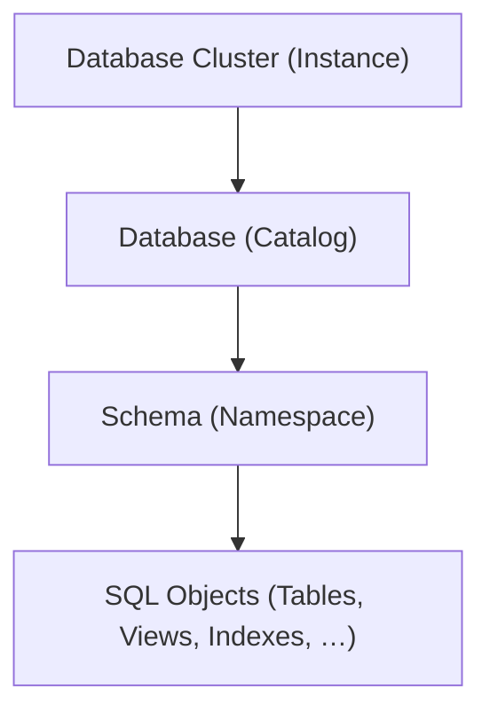

<header class="airflow-article-hero">
  <div class="airflow-article-hero__eyebrow">
    <a href="../../">BEHIND THE PIPELINE</a>
    <span>ARTICLE / 004</span>
  </div>
  <h1>PostgreSQL<br><em>Phân cấp &amp; lưu trữ</em></h1>
  <div class="airflow-article-hero__meta" aria-label="Thông tin bài viết">
    <span>DATABASE INTERNALS</span>
    <span>EDITION 04 · 2026</span>
  </div>
</header>

## 1. Phân cấp logic trong PostgreSQL

Sơ đồ phân cấp từ cao đến thấp của PostgreSQL:



### Database Cluster (Instance)

**Database Cluster (Instance)** là một tiến trình PostgreSQL chạy trên máy chủ vật lý hoặc container. Mỗi database cluster có một vùng nhớ chung (`shared_buffers`) trên RAM và một thư mục dữ liệu (`PGDATA`) trên ổ đĩa. Dữ liệu của các database được lưu trong thư mục `base/`.

### Database (Catalog)

Một database cluster có thể chứa nhiều database. Các database này **không thể truy vấn chéo nhau**, trừ khi sử dụng công cụ bên ngoài. Mỗi database có một thư mục riêng nằm trong thư mục `PGDATA` của database cluster.

### Schema (Namespace)

Schema nằm trong database, và một database có thể có nhiều schema. Các bảng thuộc những schema khác nhau trong cùng database **có thể truy vấn lẫn nhau**.

#### Vì sao một database cần nhiều schema?

- **Tránh trùng tên bảng:** Khi nhiều người cùng sử dụng một database, việc chia thành các schema riêng biệt giúp tránh xung đột tên bảng. Ví dụ, schema A và schema B đều có thể chứa bảng `order`. Hệ thống vẫn chấp nhận vì hai bảng cùng tên nằm trong các schema khác nhau.
- **Tiết kiệm tài nguyên:** Nhiều người cùng sử dụng một database giúp tiết kiệm tài nguyên hơn so với việc mỗi người sử dụng một database riêng.
- **Đơn giản hóa việc cấp quyền:** Cấp quyền cho từng bảng trở nên khó khăn khi hệ thống mở rộng. Khi sử dụng schema, chỉ cần gắn quyền của một role cho schema đó.

## 2. Lưu trữ vật lý: Cấu trúc thư mục PGDATA

### Vị trí lưu trữ của schema

Về mặt vật lý, schema không có nơi lưu trữ riêng biệt. Mọi schema trong cùng một database đều nằm chung tại thư mục:

```text
PGDATA/base/<db_oid>/
```

Trong đó, `db_oid` là mã được hệ thống sinh ra mỗi khi gọi `CREATE DATABASE`.

### Cấu trúc thư mục PGDATA

Minh họa một thư mục `PGDATA`:

```text
PGDATA/                          <-- Thư mục gốc của toàn bộ Cluster (Instance)
├── pg_wal/                      <-- Chứa các file Write-Ahead Log (WAL)
├── pg_xact/                     <-- Chứa trạng thái commit giao dịch (CLOG)
├── global/                      <-- Chứa bảng hệ thống chung toàn cluster (pg_database, pg_authid,...)
└── base/                        <-- Thư mục chứa dữ liệu của tất cả các database
    ├── 1/                       <-- Thư mục của database 'template1' (OID = 1)
    ├── 13745/                   <-- Thư mục của database 'postgres' (OID = 13745)
    └── 16384/                   <-- Thư mục của database 'my_sales_db' do bạn tạo (OID = 16384)
        ├── 16388                <-- Tệp chứa các trang dữ liệu (Heap) của Table A
        ├── 16388_fsm            <-- Bản đồ không gian trống (Free Space Map) của Table A
        └── 16390                <-- Tệp chứa chỉ mục B-Tree (Index) của Table A
```

## 3. Các tầng kiến trúc của PostgreSQL

### Tiến trình và luồng

**Các khái niệm cơ bản cần nắm**

**Tiến trình:** Là một thực thể chạy độc lập, sở hữu một không gian địa chỉ ảo riêng biệt. Không gian này là một cơ chế giúp trừu tượng hóa bộ nhớ của hệ điều hành (cụ thể là RAM). Các địa chỉ trong không gian này được đánh số liên tục từ `0` cho tới địa chỉ cao nhất.

Sau đó, tiến trình chỉ cần sử dụng không gian địa chỉ ảo này. **MMU** (phần cứng tích hợp trong CPU) sẽ ánh xạ địa chỉ ảo tới địa chỉ thật trên máy thông qua **Page Table** (bảng trang dùng để ánh xạ địa chỉ ảo tới địa chỉ thật).

```text
[ Tiến trình A ]               [ Phần cứng: MMU ]            [ RAM Vật Lý ]
Trang ảo: 0x1000  -------->  (Tra Bảng trang A)  -------->  Khung trang: 0x88000

[ Tiến trình B ]
Trang ảo: 0x1000  -------->  (Tra Bảng trang B)  -------->  Khung trang: 0x42000
```

Nhờ vào việc bảng trang A không chứa ánh xạ tới các ô nhớ được ánh xạ bởi bảng trang B, tiến trình A không thể đọc hoặc sử dụng dữ liệu của tiến trình B.

**Luồng:** Là một nhánh thực thi nằm bên trong một tiến trình duy nhất. Tất cả các luồng chạy song song đều chia sẻ chung không gian địa chỉ ảo, phân vùng Heap, mã máy thực thi (Code Segment) và các kết nối mạng của tiến trình cha.

Mỗi luồng chỉ sở hữu một phân vùng **Stack riêng biệt** (thường chỉ vài MB hoặc vài trăm KB, được dùng để lưu các biến cục bộ,...) và **con trỏ lệnh (Instruction Pointer)** giúp CPU biết thread này đã thực thi mã đến đâu. Mỗi core trong CPU chỉ xử lý mã của một thread duy nhất. Bộ điều phối của hệ điều hành (OS Scheduler) có thể luân chuyển một thread từ core này sang core khác giữa các chu kỳ chạy, chứ core không phụ trách cố định một thread nào.

### Bộ đệm `shared_buffers`

`shared_buffers` là dung lượng RAM mà một instance sử dụng làm **bộ nhớ đệm**, với mục đích chính là giảm thiểu việc đọc và ghi xuống ổ đĩa.

Bộ đệm này được chia thành hàng nghìn khối nhỏ bằng nhau. Mỗi khối có kích thước **8 KB**, bằng kích thước của một Data Page trên đĩa.

### Mô hình đa tiến trình của PostgreSQL

Mô hình mà PostgreSQL sử dụng là **mô hình đa tiến trình**: Mỗi client kết nối vào cơ sở dữ liệu sẽ có một tiến trình riêng biệt. Các tiến trình này trao đổi dữ liệu và đồng bộ thông qua **Shared Memory**, chủ yếu là `shared_buffers`.

Nếu Backend A vừa đọc một trang bảng từ đĩa vào `shared_buffers` (thành phần con lớn nhất trong Shared Memory), Backend B khi cần trang đó chỉ việc đọc trực tiếp từ `shared_buffers` mà không cần truy cập ổ đĩa lần nữa.

#### Luồng hoạt động của kết nối

Luồng hoạt động như sau:

Tiến trình mẹ **Postmaster** chạy ngầm, khởi tạo Shared Memory và mở cổng mạng. Khi client gửi yêu cầu kết nối, Postmaster sẽ fork tiến trình hiện tại thành một tiến trình mới gọi là **Backend Dedicated Process**. Do cơ chế của `fork()`, các backend process con này tự động kế thừa và ánh xạ dải địa chỉ ảo của mình vào cùng khối Shared Memory đó.

Postmaster bàn giao socket kết nối mạng của client cho backend process mới, rồi lập tức đóng socket đó ở phía mình để quay lại tiếp tục lắng nghe các kết nối khác. Sau đó, backend process này tự khởi tạo tài nguyên bộ nhớ cho chính nó và gắn kết vào `shared_buffers` để phục vụ truy vấn. Mỗi tiến trình con sử dụng khoảng **5 MB đến 10 MB RAM**, ngay cả khi không làm gì (Idle).


Bên cạnh mô hình đa tiến trình của Postgres, các cơ sở dữ liệu khác như Mysql, SQL Server lại sử dụng mô hình đa luồng:
    Mỗi client kết nối tới database sẽ được gán cho một worker thread với dung lượng stack rất nhẹ(256Kb - 1MB)


Cả 2 kiến trúc không có cái nào là hoàn hảo: 
kiến trúc đa tiến trình: 
    - ưu điểm: vì mỗi client là một tiến trình riêng nên đảm bảo được tính độc lập
    - nhược điểm: mỗi tiến trình rất tốn kém CPU/RAM
kiến trúc đa luồng:
    - ưu điểm: cực kì nhanh, không tốn nhiều RAM/CPU
    - nhược điểm: nếu một luồng bị hỏng, sẽ gây ảnh hưởng đến các luồng khác


graph TD
    subgraph User_Space [User Space: SQL Server / MySQL Instance]
        subgraph Main_Process [Single OS Process]
            Listener[Listener Thread / Dispatcher]
            
            subgraph CommonMemory [Không gian bộ nhớ chung]
                SharedBuffer[Shared Buffers / Buffer Pool]
                EngineCode[Engine Code & Cached Plans]
            end
            
            subgraph ThreadPool [Thread Pool / Worker Threads]
                subgraph Thread1 [Worker Thread 1]
                    Stack1[Private Stack]
                    Exec1[Query Executor]
                end
                subgraph Thread2 [Worker Thread 2]
                    Stack2[Private Stack]
                    Exec2[Query Executor]
                end
            end
        end
    end

### Bộ nhớ phục vụ truy vấn: `work_mem`

Trong mỗi backend process sẽ có `work_mem`. Đây là cấu hình dùng để giới hạn lượng RAM mà process xin thêm để xử lý các tác vụ, được dùng cho các phép tính nặng như `ORDER BY`, `DISTINCT`, Hash Join, Merge Join và các hàm Window Function. **`work_mem` không phải giới hạn trên mỗi truy vấn, mà là trên mỗi phép toán (node) trong cây thực thi (Execution Plan).**

#### Pipeline và các phép toán chặn

Để dễ hiểu hơn, hãy xem cách PostgreSQL xử lý dữ liệu:

PostgreSQL xử lý dữ liệu theo mô hình đường ống (pipeline): kết quả của node cấp dưới được truyền dần lên node cấp trên.

Tuy nhiên, có những phép toán được gọi là **Blocking Operator (phép toán chặn)**. Chúng bắt buộc phải gom đủ toàn bộ hoặc phần lớn dữ liệu vào RAM thì mới tính toán tiếp được.

Ví dụ, đối với node Hash Join 1, PostgreSQL xin cấp RAM tới mức trần `work_mem`. Cùng lúc đó, node Hash Join 2 và node Sort bên trên cũng cần được cấp RAM. Vì các node Hash bên dưới cần duy trì liên tục để thu thập đủ dữ liệu, xử lý và đẩy dữ liệu lên node trên, sẽ có một khoảng thời gian cả ba node đều phải duy trì và có thể chiếm tới **3 × `work_mem`**.

```text
RAM tối đa của 1 truy vấn ≈ ∑ (work_mem của các node cần gom dữ liệu đồng thời)
```

#### Ví dụ nhiều phép toán cùng sử dụng bộ nhớ

Minh họa bằng một câu truy vấn:

```sql
SELECT c.name, o.total, p.title
FROM orders o
JOIN customers c ON o.customer_id = c.id   -- Phép toán 1: Hash Join
JOIN products p ON o.product_id = p.id     -- Phép toán 2: Hash Join
ORDER BY o.total DESC;                     -- Phép toán 3: Sort
```

```text
[Sort Node]             --> Cần 1 slot RAM (tối đa 1x work_mem để xếp thứ tự)
                    |
           [Hash Join 2: products]     --> Cần 1 slot RAM (tối đa 1x work_mem dựng bảng băm cho products)
                    |
           [Hash Join 1: customers]    --> Cần 1 slot RAM (tối đa 1x work_mem dựng bảng băm cho customers)
              /           \
     [Scan orders]    [Scan customers]
```

## 4. Ràng buộc toàn vẹn (Integrity Constraints)

**Ràng buộc toàn vẹn (Integrity Constraints)** là tập hợp các quy tắc logic nhằm đảm bảo dữ liệu luôn chính xác, hợp lệ và nhất quán. Ngoài vai trò thể hiện quy tắc nghiệp vụ, ràng buộc còn là công cụ giúp **Query Optimizer** hiểu rõ phân phối dữ liệu.
