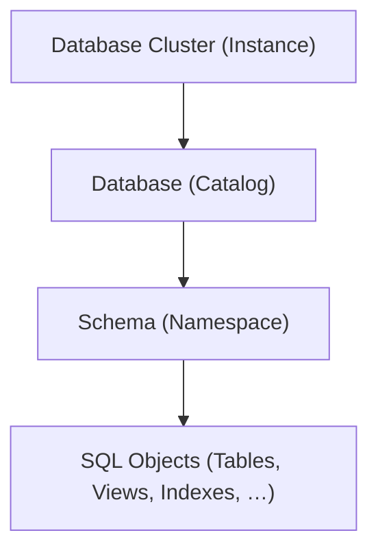
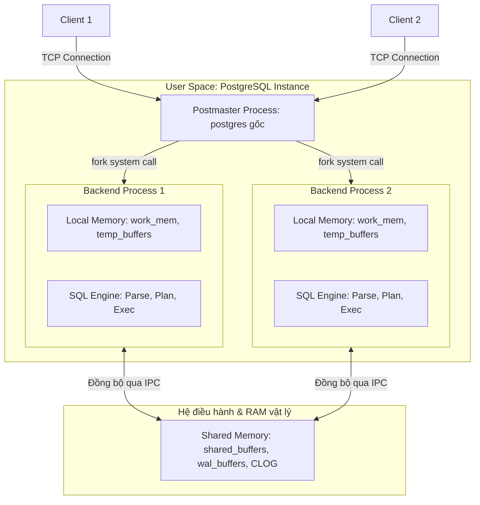
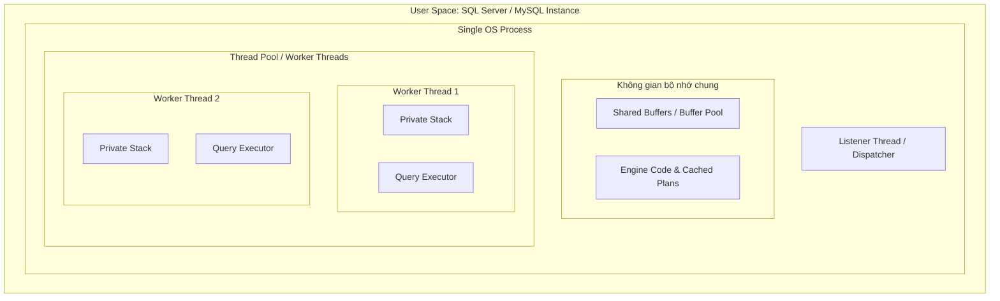
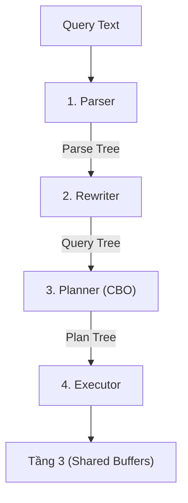
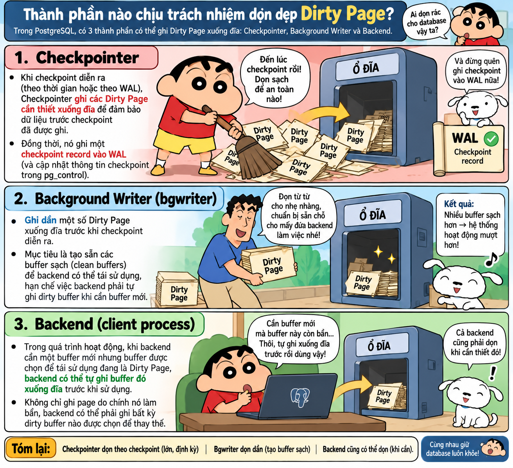
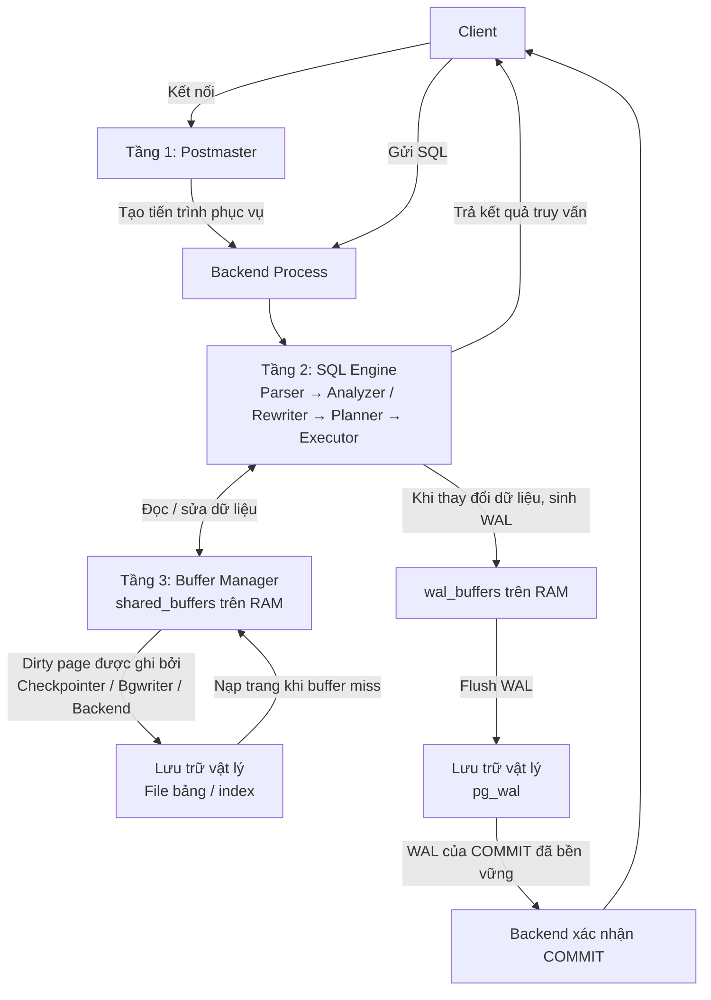
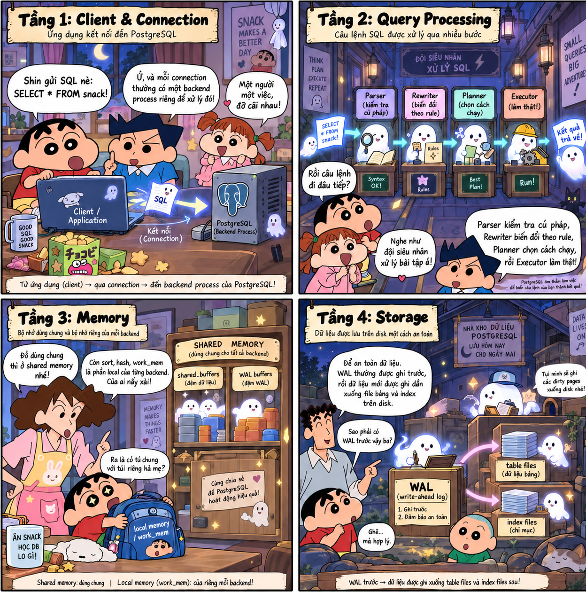

<header class="airflow-article-hero postgres-article-hero">
  <div class="airflow-article-hero__eyebrow">
    <a href="../../">BEHIND THE PIPELINE</a>
    <span>ARTICLE / 004</span>
  </div>
  <h1>PostgreSQL<br><em>Phân cấp &amp; lưu trữ</em></h1>
  <div class="airflow-article-hero__meta" aria-label="Thông tin bài viết">
    <span>DATABASE INTERNALS</span>
    <span>EDITION 04 · 2026</span>
  </div>
</header>

<figure class="airflow-opening-comic">
  
  <figcaption>
    <span>LƯU Ý TRƯỚC KHI ĐỌC</span>
    <strong>Một bài viết khá dài</strong>
  </figcaption>
</figure>

## 1. Phân cấp logic trong PostgreSQL

Sơ đồ phân cấp từ cao đến thấp của PostgreSQL:



### Database Cluster (Instance)

**Database Cluster (Instance)** là một tiến trình PostgreSQL chạy trên máy chủ vật lý hoặc container. Mỗi database cluster có một vùng nhớ chung (`shared_buffers`) trên RAM và một thư mục dữ liệu (`PGDATA`) trên ổ đĩa. Dữ liệu của các database được lưu trong thư mục `base/`.

### Database (Catalog)

Một database cluster có thể chứa nhiều database. Các database này **không thể truy vấn chéo nhau**, trừ khi sử dụng công cụ bên ngoài. Mỗi database có một thư mục riêng nằm trong thư mục `PGDATA` của database cluster.

### Schema (Namespace)

Schema nằm trong database, và một database có thể có nhiều schema. Các bảng thuộc những schema khác nhau trong cùng database **có thể truy vấn lẫn nhau**.

#### Vì sao một database cần nhiều schema?

- **Tránh trùng tên bảng:** Khi nhiều người cùng sử dụng một database, việc chia thành các schema riêng biệt giúp tránh **xung đột tên bảng**. Ví dụ, schema A và schema B đều có thể chứa bảng `order`. Hệ thống vẫn chấp nhận vì hai bảng cùng tên nằm trong các schema khác nhau.
- **Tiết kiệm tài nguyên:** Nhiều người cùng sử dụng một database giúp tiết kiệm tài nguyên hơn so với việc mỗi người sử dụng một database riêng.
- **Đơn giản hóa việc cấp quyền:** Cấp quyền cho từng bảng trở nên khó khăn khi hệ thống mở rộng. Khi sử dụng schema, chỉ cần cấp quyền cho role trên schema đó.

## 2. Các tầng kiến trúc của PostgreSQL

### Tầng 1

#### Các khái niệm cần nắm ở tầng 1

##### Tiến trình và luồng

**Tiến trình:** Một thực thể chạy **độc lập**, sở hữu không gian địa chỉ ảo riêng biệt. Không gian này là cơ chế trừu tượng hóa bộ nhớ của hệ điều hành, cụ thể là RAM. Các địa chỉ trong không gian được đánh số liên tục từ `0` đến địa chỉ cao nhất và chia thành hai phần: vùng nhớ riêng chứa các biến cục bộ và vùng nhớ dùng chung trỏ tới Shared Memory.

Sau đó, tiến trình chỉ cần sử dụng không gian địa chỉ ảo này. **MMU** (phần cứng tích hợp trong CPU) ánh xạ địa chỉ ảo đến địa chỉ vật lý thông qua **Page Table** (bảng trang dùng để ánh xạ địa chỉ ảo đến địa chỉ vật lý).

```text
[ Tiến trình A ]               [ Phần cứng: MMU ]            [ RAM vật lý ]
Trang ảo: 0x1000  -------->  (Tra bảng trang A)  -------->  Khung trang: 0x88000

[ Tiến trình B ]
Trang ảo: 0x1000  -------->  (Tra bảng trang B)  -------->  Khung trang: 0x42000
```

Do bảng trang của tiến trình A không chứa ánh xạ tới các khung trang RAM vật lý thuộc về tiến trình B, nên tiến trình A hoàn toàn bị cô lập và không thể đọc hay can thiệp vào **bộ nhớ riêng** của tiến trình B.

**Luồng:** Một nhánh thực thi nằm bên trong một tiến trình. Tất cả các luồng chạy song song đều chia sẻ không gian địa chỉ ảo, phân vùng Heap, mã máy thực thi (Code Segment) và các kết nối mạng của tiến trình cha.

Mỗi luồng chỉ sở hữu một phân vùng **Stack riêng biệt** (thường có kích thước vài MB hoặc vài trăm KB, dùng để lưu các biến cục bộ, …) và **con trỏ lệnh (Instruction Pointer)** giúp CPU xác định vị trí mã mà luồng đã thực thi đến. Mỗi core trong CPU chỉ xử lý mã của **một luồng duy nhất**. Bộ điều phối của hệ điều hành (OS Scheduler) có thể luân chuyển một luồng từ core này sang core khác giữa các chu kỳ chạy. Vì vậy, core không được dành cố định cho một luồng. Khi một luồng cần đọc I/O và tạm thời chuyển sang trạng thái sleep, core có thể được dành cho luồng khác.

##### Bộ đệm `shared_buffers`

`shared_buffers` là dung lượng RAM mà một instance sử dụng làm **bộ nhớ đệm**, với mục đích chính là giảm thao tác đọc và ghi xuống ổ đĩa. Bộ đệm này nằm trong Shared Memory, vùng nhớ dùng chung cho các tiến trình.

Bộ đệm này được chia thành hàng nghìn khối nhỏ bằng nhau. Mỗi khối có kích thước **8 KB**, bằng kích thước của một Data Page trên đĩa.

##### Latch, Lock và Lock Accumulation

**Latch:** Khóa ở **cấp độ vật lý**, giúp ngăn hai luồng ghi đè vào cùng một trang, chẳng hạn một luồng ghi và một luồng đọc trên cùng một trang 8 KB.

Giả sử bảng `users` có một trang dữ liệu 8 KB (Page 42) đang nằm sẵn trên RAM trong Buffer Pool. Trang này chứa 5 bản ghi, từ dòng 1 đến dòng 5.

Luồng A thực thi câu lệnh sửa dòng 1:

```sql
UPDATE users SET status = 'ACTIVE' WHERE id = 1;
```

Luồng B thực thi câu lệnh đọc dòng 5:

```sql
SELECT * FROM users WHERE id = 5;
```

Về mặt logic (Lock), luồng A chỉ khóa nghiệp vụ dòng 1, luồng B đọc dòng 5 nên không xung đột Lock với nhau. Tuy nhiên, cả hai dòng lại nằm chung trên một mảng byte vật lý 8 KB của Page 42:

**Luồng A xin Exclusive Latch (khóa ghi vật lý):** Luồng A lấy Exclusive Latch trên khung đệm chứa Page 42 để chuẩn bị ghi đè byte trạng thái của dòng 1.

**Luồng B xin Shared Latch (khóa đọc vật lý):** Cùng lúc đó, luồng B muốn đọc Page 42 để lấy dòng 5. Do luồng A đang giữ Exclusive Latch trên Page 42, luồng B bị chặn ngay lập tức, với thời gian chờ ở mức nanosecond hoặc microsecond.

**Luồng A hoàn tất thao tác:** Luồng A cập nhật vài byte trên RAM trong khoảng 1–2 microsecond, sau đó nhả Exclusive Latch.

**Luồng B tiếp tục:** Luồng B ngay lập tức có thể đọc an toàn dữ liệu ở dòng 5.

Nếu không có Latch, luồng B có thể đọc Page 42 đúng thời điểm CPU của luồng A đang ghi dở một phần số byte của tiêu đề trang (Page Header). Kết quả là luồng B đọc phải con trỏ hỏng.

**Lock:** Khóa bảo vệ dữ liệu nghiệp vụ logic (dòng, bảng, view), đảm bảo tính cô lập (Isolation) của các giao dịch theo chuẩn ACID. Ví dụ, khi giao dịch 1 đang `UPDATE` số dư tài khoản của khách hàng A, Lock ngăn giao dịch 2 sửa đổi hoặc đọc số dư đó cho đến khi giao dịch 1 hoàn tất.

Khi một dòng thay đổi, database sử dụng đồng thời cả hai loại khóa:

```text
[Bắt đầu Transaction]
        │
        ▼
1. Xin cấp LOCK (Row Lock) ──────────┐
        │                            │
        ▼                            │
2. Nạp trang 8 KB vào Buffer Pool    │
        │                            │
        ▼                            │ ───► LOCK duy trì liên tục
3. Lấy LATCH (Exclusive) ────┐       │
        │                    │(Vài µs│
        ▼                    │CẢ HAI │
   Ghi byte dữ liệu vào RAM  │ CÙNG  │
        ▼                    │ KHÓA) │
4. Nhả LATCH ────────────────┘       │
        │                            │
        ▼                            │
5. Thực hiện tiếp các tác vụ khác... │
        │                            │
        ▼                            │
[Transaction COMMIT / ROLLBACK]      │
6. Chính thức nhả LOCK ──────────────┘
```

Sơ đồ trên đặt ra một câu hỏi: Tại sao hệ thống vẫn giữ khóa cũ khi đã chuyển sang thực hiện các tác vụ không còn liên quan đến dòng đó?

Trong suốt thời gian một giao dịch diễn ra, các khóa hoạt động theo **nguyên lý tích lũy (Lock Accumulation)**. Khi bạn xử lý một dòng, hệ thống giữ khóa của dòng đó. Khi xử lý các dòng khác, hệ thống tiếp tục giữ khóa của các dòng mới **đồng thời giữ cả khóa của dòng cũ**. Chỉ khi gặp lệnh `COMMIT` hoặc `ROLLBACK`, hệ thống mới nhả khóa.

Vậy tại sao hệ thống không nhả khóa của dòng cũ khi xử lý các dòng khác? Nếu hệ thống nhả khóa ngay sau khi sửa xong `id = 1`, trình tự sau có thể xảy ra:

1. Giao dịch ban đầu đã trừ 100 đồng ở `id = 1`, nhưng chưa kịp cộng tiền cho `id = 2`.
2. Một giao dịch khác đọc hoặc sửa đổi số dư của `id = 1`.
3. Câu lệnh ở `id = 2` gặp lỗi, chẳng hạn tài khoản bị khóa hoặc mất kết nối mạng, buộc toàn bộ giao dịch ban đầu phải `ROLLBACK` để hoàn tiền lại cho `id = 1`.

Lúc này, giao dịch kia đã sử dụng dữ liệu chưa hoàn tất để tính toán, gây ra lỗi **Dirty Read** hoặc **Lost Update**, phá vỡ tính nguyên tử (Atomicity) và tính cô lập (Isolation) của ACID.

Vị trí lưu trạng thái khóa của PostgreSQL khác với các hệ quản trị cơ sở dữ liệu khác:

Trong PostgreSQL, mỗi bản ghi (Tuple) trong bảng Heap luôn đi kèm một phần đầu cố định 23 byte gọi là `HeapTupleHeaderData`. Trong đó có các trường đóng vai trò kiểm soát khóa dòng:

- **`t_xmin`:** Lưu Transaction ID.
- **`t_xmax`:** Lưu Transaction ID (XID) của giao dịch đang sửa đổi hoặc đang giữ khóa dòng này.
- **`t_infomask`:** Tập hợp các cờ nhị phân báo hiệu mục đích khóa, ví dụ: `HEAP_XMAX_LOCK_ONLY`, `HEAP_XMAX_EXCL`, `HEAP_XMAX_KEYSHR`.

Ví dụ, một trang 8 KB (Page) trên Buffer Pool:

```text
+-------------------------------------------------------------------------+
| ItemId (Pointer 1) | ItemId (Pointer 2) | ... Vùng trống ...             |
|-------------------------------------------------------------------------|
| Bản ghi id = 1:                                                         |
| [Tuple Header: t_xmin=100, t_xmax=501 (Tx giữ khóa), t_infomask=LOCK_EXCL] |
| [Dữ liệu: name = 'Alice', balance = 1000]                               |
|-------------------------------------------------------------------------|
| Bản ghi id = 2:                                                         |
| [Tuple Header: t_xmin=102, t_xmax=501 (Tx giữ khóa), t_infomask=LOCK_EXCL] |
| [Dữ liệu: name = 'Bob', balance = 2000]                                 |
+-------------------------------------------------------------------------+
```

Tiếp nối phần lưu trữ trạng thái khóa, ta sẽ cùng tìm hiểu các loại khóa bảng trong PostgreSQL.

##### Các loại khóa bảng trong PostgreSQL

Khi một câu lệnh SQL được thực thi, PostgreSQL tự động cấp phát một trong **8 chế độ khóa cấp bảng** tương ứng để bảo vệ cấu trúc hoặc dữ liệu bảng. Các khóa này được lưu trên RAM trong Shared Memory.

- Khi sử dụng câu lệnh `SELECT`, hệ thống cấp phát một khóa `AccessShareLock`. Đây là loại khóa nhẹ nhất. Các khóa này có thể tồn tại đồng thời nên nhiều câu lệnh `SELECT` có thể cùng thực thi. Khóa này chỉ xung đột với `AccessExclusiveLock`, được dùng khi chạy các câu lệnh thay đổi cấu trúc bảng như `ALTER TABLE`.
- Khi sử dụng `SELECT ... FOR UPDATE`, hệ thống cấp khóa bảng `RowShareLock` để bảo vệ cấu trúc bảng và ngăn các lệnh DDL. Đồng thời, hệ thống quét và khóa trực tiếp các dòng thỏa mãn điều kiện ở tầng bản ghi (Tuple Header). Khóa này chỉ xung đột với `ExclusiveLock` và `AccessExclusiveLock`.
- Khi chạy các câu lệnh DML sửa đổi dữ liệu dòng như `INSERT`, `UPDATE`, `DELETE` và `MERGE`, hệ thống cấp khóa `RowExclusiveLock`. Khóa này xung đột với `ShareLock`, `ShareRowExclusiveLock`, `ExclusiveLock` và `AccessExclusiveLock`.
- Khi các tiến trình nền thực thi, khóa này không chặn luồng đọc và ghi nên các tiến trình nền có thể chạy song song mà không gây downtime cho ứng dụng. Khóa xung đột với chính nó để đảm bảo chỉ có một tiến trình chạy tại một thời điểm.
- Khi chạy các câu lệnh như thêm Foreign Key hoặc tạo index, dữ liệu cần được giữ nguyên trong quá trình thực thi. Hệ thống cấp khóa `ShareRowExclusiveLock`. Khóa này cho phép người dùng đọc nhưng không cho phép ghi hoặc thay đổi dữ liệu.
- **`ExclusiveLock`:** Chỉ cho phép các tiến trình đọc (`AccessShareLock`) chạy song song. Khóa này được kích hoạt bởi `REFRESH MATERIALIZED VIEW CONCURRENTLY`.
- Khi chạy các lệnh DDL nặng như `ALTER TABLE`, `DROP TABLE`, `TRUNCATE`, `VACUUM FULL` và `REINDEX`, hệ thống dùng khóa độc quyền tuyệt đối, chặn **toàn bộ** luồng đọc và ghi (`SELECT`, `INSERT`, `UPDATE`, `DELETE`).

Điểm cần lưu ý: Trong PostgreSQL, khóa dòng được **ghi trực tiếp vào trường `t_xmax`** trên header của từng bản ghi để tránh cạn kiệt bộ nhớ, còn **khóa bảng** được quản lý tập trung hoàn toàn **trên RAM** (trong Lock Manager) để kiểm tra và giải phóng tức thì.

Khi đã tìm hiểu cách các cơ sở dữ liệu lưu trạng thái khóa và các loại khóa của PostgreSQL, ta sẽ cùng tìm hiểu khái niệm **Lock Escalation**.

**Lock Escalation (leo thang khóa)** là cơ chế tự động của hệ quản trị cơ sở dữ liệu nhằm chuyển đổi nhiều khóa ở cấp độ chi tiết, như khóa dòng (Row Lock) hoặc khóa trang (Page Lock), thành một khóa duy nhất ở cấp độ bao quát hơn, thường là khóa toàn bảng (Table Lock), trong cùng một giao dịch.

Các hệ quản trị cơ sở dữ liệu như SQL Server lưu trữ khóa trên RAM. Một khóa thường tiêu tốn khoảng 64 đến 128 byte:

- Khóa 10 dòng: tốn khoảng **1 KB RAM**.
- Khóa 100.000 dòng: tốn khoảng **10 MB RAM**.
- Khóa 10.000.000 dòng: tốn khoảng **1 GB RAM** chỉ để ghi nhớ danh sách các dòng đang bị khóa.

Để tránh Lock Manager chiếm hết RAM, SQL Server thường tự động kích hoạt Lock Escalation khi một câu lệnh giữ trên 5.000 khóa, thay thế các khóa này bằng một khóa độc quyền duy nhất ở cấp bảng.

Đối với PostgreSQL, vì các khóa dòng không lưu trữ trên RAM nên dù hệ thống khóa bao nhiêu dòng cũng **không tiêu tốn RAM** để lưu các khóa dòng này. Vì vậy, PostgreSQL **không xảy ra Lock Escalation**.

#### Mô hình đa tiến trình của PostgreSQL

PostgreSQL sử dụng **mô hình đa tiến trình**: mỗi client kết nối vào cơ sở dữ liệu có một tiến trình riêng biệt. Các tiến trình này trao đổi dữ liệu và đồng bộ thông qua **Shared Memory**.

Nếu Backend A vừa đọc một trang bảng từ đĩa vào `shared_buffers` (thành phần con lớn nhất trong Shared Memory), Backend B khi cần trang đó có thể đọc trực tiếp từ `shared_buffers` mà không cần truy cập ổ đĩa lần nữa.

##### Luồng hoạt động của kết nối

Luồng hoạt động như sau:

Tiến trình mẹ **Postmaster** chạy ngầm, khởi tạo Shared Memory và mở cổng mạng. Khi client gửi yêu cầu kết nối, Postmaster fork tiến trình hiện tại thành một tiến trình mới gọi là **Backend Dedicated Process**. Nhờ cơ chế của `fork()`, tiến trình backend con tự động kế thừa bảng trang để trỏ vào vùng Shared Memory dùng chung; các vùng bộ nhớ riêng phục vụ truy vấn được cấp phát động và chỉ thực sự ánh xạ vào RAM vật lý khi phát sinh thao tác đọc hoặc ghi.

**Không gian địa chỉ tiến trình con:**

```text
┌──────────────────────────────────────────────────────────────┐
│ 1. Bộ nhớ chia sẻ (Shared Memory)                           │
│    - Ánh xạ chung với mọi process khác                       │
│    - Chứa: shared_buffers, WAL buffers, Lock Manager, VM...  │
├──────────────────────────────────────────────────────────────┤
│ 2. Bộ nhớ riêng (Private Memory / Local Backend Memory)       │
│    - Độc quyền của riêng tiến trình con này                  │
│    - Hệ điều hành cô lập, các tiến trình khác không truy cập │
│    - Chứa: work_mem, temp_buffers, MemoryContexts...         │
└──────────────────────────────────────────────────────────────┘
```

Postmaster bàn giao socket kết nối mạng của client cho backend process mới, rồi lập tức đóng socket đó ở phía mình để tiếp tục lắng nghe các kết nối khác. Sau đó, backend process tự khởi tạo tài nguyên bộ nhớ. Mỗi tiến trình con sử dụng khoảng **5 MB đến 10 MB RAM**, ngay cả khi ở trạng thái nhàn rỗi (Idle).



##### Bộ nhớ phục vụ truy vấn: `work_mem`

Trong mỗi backend process có `work_mem`. Đây là cấu hình giới hạn lượng RAM mà tiến trình yêu cầu cấp thêm để xử lý các tác vụ, được dùng cho các phép tính tốn tài nguyên như `ORDER BY`, `DISTINCT`, Hash Join, Merge Join và các hàm Window Function. **`work_mem` không phải giới hạn trên mỗi truy vấn, mà là trên mỗi phép toán (node) trong cây thực thi (Execution Plan).**

###### Pipeline và các phép toán chặn

Để dễ hiểu hơn, hãy xem cách PostgreSQL xử lý dữ liệu:

PostgreSQL xử lý dữ liệu theo mô hình đường ống (pipeline): kết quả của node cấp dưới được **truyền dần** lên node cấp trên.

Tuy nhiên, có những phép toán được gọi là **Blocking Operator (phép toán chặn)**. Chúng phải tập hợp toàn bộ hoặc phần lớn dữ liệu vào RAM trước khi tiếp tục tính toán. Ví dụ như phép sort,..

Ví dụ, đối với node Hash Join 1, PostgreSQL yêu cầu cấp RAM tới mức trần `work_mem`. Cùng lúc đó, node Hash Join 2 và node Sort phía trên cũng cần được cấp RAM. Vì các node Hash phía dưới phải duy trì liên tục để thu thập đủ dữ liệu, xử lý và chuyển dữ liệu lên node phía trên, sẽ có một khoảng thời gian cả ba node cùng được duy trì và có thể chiếm tới **3 × `work_mem`**.

```text
RAM tối đa của 1 truy vấn ≈ ∑ (work_mem của các node cần gom dữ liệu đồng thời)
```

**Ví dụ nhiều phép toán cùng sử dụng bộ nhớ**

Minh họa bằng một câu truy vấn:

```sql
SELECT c.name, o.total, p.title
FROM orders o
JOIN customers c ON o.customer_id = c.id   -- Phép toán 1: Hash Join
JOIN products p ON o.product_id = p.id     -- Phép toán 2: Hash Join
ORDER BY o.total DESC;                     -- Phép toán 3: Sort
```

```text
[Sort Node]             --> Cần 1 slot RAM (tối đa 1 × work_mem để xếp thứ tự)
                    |
           [Hash Join 2: products]     --> Cần 1 slot RAM (tối đa 1 × work_mem dựng bảng băm cho products)
                    |
           [Hash Join 1: customers]    --> Cần 1 slot RAM (tối đa 1 × work_mem dựng bảng băm cho customers)
              /           \
     [Scan orders]    [Scan customers]
```

Khác với mô hình đa tiến trình của PostgreSQL, các cơ sở dữ liệu như MySQL và SQL Server sử dụng mô hình đa luồng.

#### Mô hình đa luồng của các hệ quản trị cơ sở khác

Mỗi client kết nối tới database được gán cho một luồng với dung lượng Stack nhỏ (256 KB đến 1 MB). Khi một luồng gặp lỗi nghiêm trọng, toàn bộ database instance có nguy cơ ngừng hoạt động.

Luồng hoạt động như sau:

**Thiết lập kết nối:** Client kết nối tới cổng của cơ sở dữ liệu.

**Dispatcher tiếp nhận:** Một luồng đặc biệt đóng vai trò lắng nghe kết nối (Listener Thread) đón nhận yêu cầu kết nối.

**Cấp phát luồng:** Thay vì gọi hệ điều hành tạo tiến trình mới, Listener kiểm tra Thread Pool của hệ thống và gán một luồng trống (Worker Thread) sẵn có cho client này.

**Thực thi trực tiếp:** Worker Thread xử lý câu lệnh SQL trực tiếp bên trong không gian bộ nhớ chung, đọc và ghi vào vùng bộ nhớ đệm Buffer Pool.

**Trả luồng về Thread Pool:** Khi client ngắt kết nối, luồng này không bị hủy hoàn toàn. Luồng dọn dẹp các biến trạng thái phiên làm việc (Session State) và trở về trạng thái nhàn rỗi trong Thread Pool để chờ kết nối tiếp theo.

#### Câu hỏi liên quan




Chúng ta đã cùng tìm hiểu về kiến trúc tầng 1 của PostgreSQL. Tiếp theo, ta cùng tìm hiểu về kiến trúc tầng 2.

### Tầng 2

**Tầng 2 (SQL Engine / Query Processing Layer)** là bộ phận điều hành logic của PostgreSQL, chịu trách nhiệm chuyển câu lệnh SQL dạng văn bản khai báo (Declarative Text), ví dụ `SELECT * FROM table`, thành kế hoạch thực thi vật lý tối ưu nhất dựa trên chi phí tính toán. Tầng này vận hành hoàn toàn bên trong bộ nhớ ảo cục bộ của backend process.

#### Câu hỏi liên quan

**Tại sao lại nói tầng 2 vận hành hoàn toàn bên trong bộ nhớ ảo cục bộ?**

Tầng 2 nằm bên trong không gian bộ nhớ ảo cục bộ vì toàn bộ các bước phân tích, lập kế hoạch và tính toán dữ liệu, như Sort hay Hash Join, đều phục vụ riêng cho một truy vấn của tiến trình đó, thay vì xử lý dữ liệu dùng chung của toàn hệ thống.


Chuỗi biên dịch và thực thi của tầng 2 gồm các giai đoạn sau:



#### Giai đoạn 1: Parser (phân tích cú pháp thô)

Nhiệm vụ duy nhất của giai đoạn này là chuyển đổi một chuỗi ký tự văn bản thô (String) thành một cấu trúc dữ liệu dạng cây trong bộ nhớ RAM mà máy tính có thể xử lý, gọi là **Parse Tree**.

Lưu ý, ở giai đoạn này, Parser chỉ kiểm tra cú pháp và thứ tự câu lệnh, không kiểm tra xem bảng được truy vấn có hợp lệ hay không. Lấy ví dụ khi phân tích câu “The green dragon is flying over the moon”, Parser chỉ biết câu này đúng ngữ pháp, không biết “green dragon” có tồn tại hay không.

Lý do PostgreSQL thiết kế Parser độc lập hoàn toàn với dữ liệu thực tế là để tối ưu tốc độ và **tách biệt trách nhiệm (Separation of Concerns)**. Nhiệm vụ xác thực sự tồn tại của bảng, kiểu dữ liệu cột và quyền truy cập của người dùng được giao toàn bộ cho giai đoạn thứ hai: Rewriter / Analyzer.

Đây là minh họa cho một Parse Tree:

```text
SelectStmt
├── targetList (Danh sách cột muốn lấy)
│   ├── ResTarget -> ColumnRef ("name")
│   └── ResTarget -> ColumnRef ("age")
├── fromClause (Nguồn dữ liệu)
│   └── RangeVar (relname = "users")
└── whereClause (Điều kiện lọc)
    └── A_Expr (toán tử ">")
        ├── lexpr -> ColumnRef ("age")
        └── rexpr -> A_Const (giá trị nguyên = 18)
```

#### Giai đoạn 2: Rewriter / Analyzer (phân tích ngữ nghĩa và biến đổi quy tắc)

Ở giai đoạn này, hệ thống kiểm tra sự tồn tại của bảng, cột, kiểu dữ liệu và quyền truy cập của người dùng bằng cách đối chiếu Parse Tree với các bảng metadata của hệ thống: `pg_class`, `pg_attribute`, `pg_constraint`. Sau đó, Parse Tree được chuyển thành **Query Tree**.

Tiếp theo, hệ thống áp dụng các quy tắc biến đổi để điều chỉnh cấu trúc Query Tree nếu câu truy vấn truy cập vào view. RLS và các quy tắc biến đổi lệnh DML cũng được xử lý trực tiếp trong giai đoạn này.

#### Giai đoạn 3: Planner / Optimizer

Ở giai đoạn này, Query Tree được chuyển thành một kế hoạch thực thi vật lý (**Plan Tree**) có chi phí tính toán thấp nhất. PostgreSQL vận hành theo mô hình **tối ưu hóa dựa trên chi phí (Cost-Based Optimizer — CBO)**, thay vì áp dụng các quy tắc cứng nhắc như luôn sử dụng index khi có index.

Vậy Cost ở đây là gì? Cost phản ánh lượng tài nguyên mà câu truy vấn tiêu tốn, gồm I/O đọc đĩa và CPU xử lý, chứ không phải thời gian. Với một câu truy vấn, Planner tạo ra nhiều phương án thực thi và ước lượng mức tiêu thụ tài nguyên của từng phương án. Phương án tiêu tốn ít tài nguyên nhất được chọn làm Plan Tree.

Dựa trên dữ liệu thống kê từ Analyzer, Planner trước hết ước lượng số dòng trả về của từng biểu thức. Sau đó, Planner dùng thuật toán quy hoạch động để vừa sinh các phương án, vừa tính toán chi phí và loại bỏ ngay các nhánh kém tối ưu. Cuối cùng, Planner chọn phương án có Total Cost hoặc Startup Cost phù hợp nhất, tùy vào việc có `LIMIT` hoặc `CURSOR` hay không, để đóng gói thành Plan Tree và chuyển cho Executor.

- **Total Cost:** Chi phí để trả về toàn bộ bảng dữ liệu.
- **Startup Cost:** Chi phí để bắt đầu trả về dòng dữ liệu đầu tiên.

Một Plan Tree có hình dạng như thế nào? Giả sử bạn chạy một câu lệnh đơn giản:

```sql
SELECT name FROM users WHERE age > 18 LIMIT 2;
```

PostgreSQL biến câu lệnh này thành một dây chuyền gồm 3 nút xếp chồng lên nhau:

```text
[Nút 3: LIMIT (Lấy đúng 2 người)]        <-- Nút trên cùng (Nút cha)
                       ↑
       [Nút 2: FILTER (Kiểm tra age > 18)]      <-- Nút ở giữa
                       ↑
       [Nút 1: SEQ SCAN (Đọc từng dòng bảng users)] <-- Nút dưới cùng (Nút con)
```

#### Giai đoạn 4: Executor (thực thi kế hoạch — Execution)

Một hiểu nhầm thường gặp ở người mới học là: Nếu nút 1 đọc được 1 triệu dòng dữ liệu, nó sẽ chuyển toàn bộ lên nút 2; nút 2 lọc rồi chuyển toàn bộ kết quả cho nút 3 để chỉ lấy 2 người.

Tuy nhiên, như đã đề cập ở trên, PostgreSQL truyền dữ liệu theo từng dòng và vận hành theo **cơ chế pull**: nút phía trên gửi yêu cầu xuống nút phía dưới để lấy từng dòng dữ liệu. Ví dụ dễ hiểu:

Client yêu cầu nút LIMIT: “Hãy trả về kết quả.” Nút LIMIT yêu cầu nút FILTER: “Tôi cần 2 người, hãy trả về người đầu tiên trước.”

Nút FILTER chưa có dữ liệu nên yêu cầu nút SEQ SCAN: “Hãy đọc đúng 1 dòng từ ổ đĩa.” Nút SEQ SCAN đọc dòng đầu tiên từ ổ đĩa — Nam, `age = 15` — rồi chuyển lên nút FILTER.

Nút FILTER kiểm tra `15 < 18`, loại dòng này và tiếp tục yêu cầu nút SEQ SCAN: “Dòng này không đáp ứng điều kiện, hãy đọc dòng tiếp theo.”

Nút SEQ SCAN đọc dòng thứ hai — Lan, `age = 20` — rồi chuyển cho nút FILTER. Nút FILTER kiểm tra `20 > 18`, xác định dữ liệu hợp lệ và chuyển dòng của Lan lên nút LIMIT.

Nút LIMIT nhận được 1 người, còn thiếu 1 người để đủ 2, nên tiếp tục yêu cầu nút FILTER: “Hãy trả về người thứ hai.” Quá trình lặp lại cho đến khi nút LIMIT nhận đủ người thứ hai, ví dụ Hùng, `age = 22`.

Khi đã nhận đủ 2 người, nút LIMIT yêu cầu toàn bộ dây chuyền dừng lại. Đồng thời, Executor cũng đọc metadata trong Tuple Header để kiểm tra xem dữ liệu có được phép hiển thị hay không.

#### Giai đoạn 5: Tầng bộ nhớ đệm và lưu trữ vật lý (Storage Engine)

Ở giai đoạn này, khi các nút cần đọc dữ liệu, Executor không bao giờ làm việc trực tiếp với ổ đĩa mà gửi yêu cầu tới **Buffer Manager**. Buffer Manager tra bảng băm (**Buffer Mapping Hash Table**). Nếu dữ liệu đã có trên RAM, Executor trực tiếp trích xuất dữ liệu và trả về nút cha. Dữ liệu có sẵn trên RAM giúp giảm chi phí đọc từ ổ đĩa.

Khi dữ liệu không có trên RAM (**Buffer Miss**), Buffer Manager phải nạp trang từ ổ đĩa vào `shared_buffers`. Sau đó, Executor đọc dữ liệu từ đây.

Khi cần ghi dữ liệu, các thay đổi được thực hiện trên RAM và các page tương ứng được đánh dấu là Dirty Page. Ngay tại thời điểm sửa dữ liệu trên RAM, PostgreSQL sinh ra **WAL record** và lưu vào `wal_buffers` trên RAM.

Khi người dùng `COMMIT`, hệ thống không ghi ngay các Dirty Page xuống đĩa mà ghi nội dung `wal_buffers` xuống trước, theo một nguyên tắc bất biến của database: **Một Dirty Page trên RAM tuyệt đối không được ghi xuống đĩa nếu bản ghi WAL mô tả thay đổi của trang đó chưa được lưu an toàn trên đĩa.**

Các Dirty Page vẫn nằm trong `shared_buffers` trên RAM để các tiến trình nền như Checkpointer hoặc `bgwriter` ghi dần xuống đĩa sau đó. Chỉ khi chip nhớ của ổ đĩa phát tín hiệu xác nhận “Các byte WAL đã được lưu an toàn trên đĩa vật lý”, PostgreSQL mới gửi phản hồi `COMMIT` thành công về cho client.

```text
[Executor]
                   │
                   ▼ (Hỏi khối số 45)
          [Buffer Mapping Table] (Bảng băm tra cứu)
             /                \
      (Đã có trên RAM)      (Chưa có trên RAM)
           /                    \
          ▼                      ▼
    [BUFFER HIT]           [BUFFER MISS]
   - Ghim trang (Pin)     - Chạy Clock Sweep tìm ô trống
   - Khóa nhẹ (LWLock)    - Đọc từ OS Page Cache / Đĩa (Async I/O PG 18)
   - Đọc dữ liệu          - Đưa lên shared_buffers & Pin trang
```

##### Các khái niệm cần biết ở giai đoạn này

Để dễ hiểu hơn về giai đoạn này, ta sẽ cùng tìm hiểu những khái niệm sau:

**Dirty Page:** Là một page trên RAM có nội dung đã bị thay đổi. Để dễ hình dung, với **Clean Page**, dữ liệu trên RAM và trên ổ đĩa **giống nhau 100%**; với Dirty Page, dữ liệu trên RAM là **phiên bản mới nhất**, còn dữ liệu trên đĩa là **phiên bản cũ**.

Vòng đời của một Dirty Page diễn ra như sau:

```text
     [Ổ đĩa] ──(Đọc lên)──> [Shared Buffers: Clean Page]
                             │
                      (UPDATE / INSERT)
                             │
                             ▼
                    [Ghi nhật ký WAL]
                             │
                             ▼
               [Shared Buffers: Dirty Page] (Đánh dấu cờ BM_DIRTY)
                             │
                  (Checkpointer / Bgwriter)
                             │
                             ▼
[Ổ đĩa] <──(Ghi & Fsync)─────┘ (Trang trở lại trạng thái Clean)
```

###### Thành phần nào chịu trách nhiệm dọn dẹp Dirty Page?

- **Checkpointer:** Quét toàn bộ `shared_buffers`, tìm tất cả Dirty Page và buộc ghi xuống ổ đĩa. Checkpointer đánh dấu một checkpoint vào file WAL để hệ thống biết đã xử lý đến đâu.
- **Background Writer (`bgwriter`):** Tìm một lượng nhỏ Dirty Page ít dùng và ghi dần xuống đĩa trước khi checkpoint diễn ra.
- **Backend (client process):** Khi cần nạp một buffer mới nhưng buffer được chọn để tái sử dụng đang là Dirty Page, backend có thể tự ghi buffer đó xuống đĩa trước khi sử dụng.



Vậy là chúng ta đã cùng tìm hiểu toàn bộ các giai đoạn ở tầng 2 của PostgreSQL. Dưới đây là sơ đồ minh họa cách tầng này vận hành:



```text
┌─────────────────────────────────────────────────────────────┐
│               TIẾN TRÌNH BACKEND (BỘ NHỚ RIÊNG)             │
│                                                             │
│  [Chuỗi SQL] ──► [Parse Tree] ──► [Plan] ──► [Executor Engine]
│                                                      │      │
│  [work_mem: Hash Table / Vùng QuickSort] ◄──────────┘      │
│                                                             │
└──────────────────────────────┬──────────────────────────────┘
                               │ Đọc tuple / Ghi WAL
                               ▼
┌─────────────────────────────────────────────────────────────┐
│                   SHARED MEMORY (DÙNG CHUNG)                │
│                                                             │
│  - shared_buffers: Chứa các khối dữ liệu 8KB của bảng       │
│  - Lock Manager: Quản lý khóa bảng                          │
│  - wal_buffers: Ghi nhật ký thay đổi                        │
└─────────────────────────────────────────────────────────────┘
```

### Tầng 3: Bộ nhớ đệm và giao dịch

Shared Memory gồm các thành phần sau:

```text
+-----------------------------------------------------------------------------------------+
|                                    SHARED MEMORY (RAM)                                  |
|  +---------------------+    +--------------------+    +------------------------------+  |
|  |   shared_buffers    |    |    wal_buffers     |    |   Commit Log (CLOG/pg_xact)  |  |
|  | (Trang dữ liệu 8 KB)|    | (Nhật ký WAL đệm)  |    |  (Mảng bit XID status)       |  |
|  +---------------------+    +--------------------+    +------------------------------+  |
|  | Lock Manager (Bảng khóa Table/Wait Queue) & SIREAD Locks (Predicates cho SSI)        |  |
+-----------------------------------------------------------------------------------------+
```

#### Bộ đệm `shared_buffers`

`shared_buffers` là vùng RAM dùng chung lớn nhất trong PostgreSQL, đóng vai trò bộ đệm đọc và ghi trung gian cho các khối 8 KB của bảng và index. Vùng nhớ này vừa lưu các trang đã đọc từ đĩa để phục vụ những truy vấn sau (**Read Cache**), vừa là nơi trực tiếp chỉnh sửa dữ liệu thành các **Dirty Page** trước khi đồng bộ xuống đĩa vật lý.

PostgreSQL sử dụng kết hợp `shared_buffers` và OS Page Cache của Linux kernel. Sự kết hợp này được gọi là **cơ chế đệm kép**.

Khi `shared_buffers` đã đầy mà một truy vấn mới cần nạp thêm trang 8 KB từ ổ đĩa vào RAM, hệ thống sử dụng cơ chế **Clock Sweep** để giải phóng vùng RAM. `shared_buffers` được chia thành một mảng các ô đệm (**Buffer Frames**) có kích thước cố định 8 KB. Mỗi ô đệm chứa hai giá trị:

- **`refcount`:** Số tiến trình đang sử dụng ô đệm. Nếu `refcount > 0`, ô đệm không thể được giải phóng; nếu `refcount = 0`, hệ thống có thể xem xét giải phóng ô đệm và ghi dữ liệu xuống ổ đĩa.
- **`usage_count` (0–5):** Giá trị càng cao cho biết dữ liệu đã được sử dụng càng nhiều lần.

Cách Clock Sweep vận hành:

```text
    [Ô số 0] (usage = 2)
              ↗           ↖
      [Ô số 5]             [Ô số 1] (usage = 0, ref = 0) ──► Ô ĐỆM ĐƯỢC GIẢI PHÓNG
         ↑         KIM       |
         |        ĐỒNG HỒ    |
      [Ô số 4]  ────────►  [Ô số 2] (usage = 3)
              ↘           ↙
                 [Ô số 3] (refcount = 1 - Đang bận)
```

Clock Sweep kiểm tra các ô đệm theo vòng tròn để tìm ô đủ điều kiện giải phóng. Cơ chế này chỉ xét các ô có `refcount = 0`; mỗi lần xét một ô, `usage_count` giảm 1 đơn vị. Quá trình tiếp tục cho đến khi tìm được ô thỏa điều kiện giải phóng.

Bạn đã biết `shared_buffers` giống như một chiếc tủ chứa các trang dữ liệu 8 KB trên RAM để có thể sử dụng ngay khi cần, không phải đọc lại từ ổ đĩa. Vậy hệ thống xử lý thế nào khi gặp một câu lệnh quét bảng quá lớn?

Khi phát hiện một câu lệnh đang quét bảng quá lớn, PostgreSQL giới hạn phạm vi sử dụng `shared_buffers` của câu lệnh đó. Hệ thống chỉ cấp một số ô đệm, tùy vào tính chất thao tác, để tạo thành **Buffer Ring** ngay trong `shared_buffers`.

Khi câu lệnh bắt đầu, nó sử dụng 32 ô đệm từ `shared_buffers`. Khi quét đến trang thứ 33, thay vì dùng Clock Sweep để tìm thêm ô mới trên toàn bộ RAM, hệ thống quay lại ô đệm số 1 trong vòng 32 ô đó, loại dữ liệu cũ và nạp trang thứ 33 vào.

- **Khi bảng nhỏ:** PostgreSQL vẫn nạp trực tiếp vào cache chung.
- **`BAS_BULKREAD`:** Khi quét bảng lớn, tức dung lượng bảng ước tính lớn hơn 25% tổng dung lượng `shared_buffers`, Buffer Ring gồm 32 trang 8 KB.
- **`BAS_VACUUM`:** Giúp Autovacuum quét các bảng lớn để dọn Dead Tuple; Buffer Ring gồm 32 trang 8 KB.
- **`BAS_BULKWRITE`:** Khi nạp một lượng lớn dữ liệu, Buffer Ring gồm 32 trang 8 KB.

Vấn đề phát sinh khi vùng RAM này phải phục vụ một câu lệnh quét bảng quá lớn.

#### Bộ đệm `wal_buffers`

`wal_buffers` chứa các bản ghi WAL được tạo ra khi một thao tác sửa đổi trang diễn ra trên RAM. Dữ liệu trong vùng đệm này được ghi xuống tệp tin vật lý (`pg_wal`) khi hệ thống nhận lệnh `COMMIT`.

#### Commit Log (CLOG / `pg_xact`)

Commit Log là cấu trúc mảng bit nhỏ gọn, lưu trạng thái của từng Transaction ID. Trên ổ đĩa, dữ liệu này được lưu trong thư mục `pg_clog`; trên RAM, dữ liệu được lưu trong **SLRU Buffer**.

Commit Log ghi nhận giao dịch đã `COMMIT` hay đang thực hiện (in-progress). Các trạng thái được biểu diễn bằng 2 bit nhị phân để tối ưu bộ nhớ. Khi SLRU Buffer trên RAM đầy, hệ thống đẩy các Transaction ID lâu không sử dụng xuống ổ đĩa theo cơ chế **LRU**.

#### Câu hỏi liên quan đến kiến trúc tầng này

Nếu bạn chạy một truy vấn kéo dài 10 phút, trong khoảng thời gian đó có hàng nghìn câu lệnh `UPDATE` hoặc `DELETE` khác diễn ra liên tục. Hệ thống sẽ xử lý truy vấn này như thế nào?

Trước tiên, ta cùng tìm hiểu khái niệm **MVCC**. MVCC (Multi-Version Concurrency Control — kiểm soát đồng thời đa phiên bản) là cơ chế cho phép nhiều người đọc và ghi dữ liệu cùng lúc mà không chặn nhau. Quy tắc của MVCC là: “Luồng đọc không chặn luồng ghi, và luồng ghi không chặn luồng đọc.”

Khi thực hiện các thao tác DDL, hệ thống thực thi các bước sau:

- **`INSERT`:** `t_xmin = XID` hiện tại, `t_xmax = 0`.
- **`DELETE`:** `t_xmax = XID` hiện tại.
- **`UPDATE`:** Tạo một dòng mới được dòng cũ trỏ tới. Dòng cũ có `t_xmax = XID` hiện tại; dòng mới có `t_xmin = XID` hiện tại và `t_xmax = 0`.

Khi thực thi câu lệnh truy vấn, hệ thống chụp lại một ảnh trạng thái gọi là **Transaction Snapshot**. Khi Executor đọc một dòng, nó đối chiếu `t_xmax` và `t_xmin` của dòng đó với snapshot:

- **Được phép nhìn thấy:** `xmin` thuộc về một giao dịch đã `COMMIT` trước khi snapshot được tạo, và `xmax` chưa được đặt hoặc thuộc về một giao dịch được thực hiện sau snapshot.
- **Bị ẩn:** Dòng được tạo bởi một giao dịch đang thực hiện dở dang hoặc một giao dịch sinh ra sau snapshot.

Nhờ snapshot, nếu bạn chạy một truy vấn báo cáo kéo dài 10 phút, dữ liệu trả về luôn nhất quán với thời điểm 10 phút trước, bất chấp việc trong khoảng thời gian đó có hàng nghìn câu lệnh **`UPDATE`** hoặc **`DELETE`** khác diễn ra liên tục. Nếu mỗi lệnh **`UPDATE`** hoặc **`INSERT`** đang chạy đều khóa dòng dữ liệu tương ứng, hệ thống sẽ quay lại mô hình khóa chặn hai chiều truyền thống. MVCC sử dụng snapshot để cho phép thao tác ghi diễn ra song song với thao tác đọc mà không ảnh hưởng lẫn nhau.

Một Transaction Snapshot chứa 3 thông số:

- **`xmin`:** XID của giao dịch cũ nhất vẫn đang chạy.
- **`xmax`:** XID đầu tiên chưa được cấp phát; mọi XID >= `xmax` đều không hiển thị.
- **`xip_list`:** Mảng chứa danh sách các XID đang hoạt động tại thời điểm chụp snapshot.

Ta sẽ cùng tìm hiểu thuật toán **Serializable Snapshot Isolation (SSI)** và **SIREAD Locks**.

Trước tiên, ta cần hiểu thuật ngữ **Serializable**. Các giao dịch chạy song song nhưng tạo ra kết quả đầu ra tương đương với việc thực thi tuần tự, tức giao dịch này hoàn tất trước khi giao dịch tiếp theo bắt đầu, được gọi là Serializable.

Một vấn đề thường gặp là **bài toán trực ca bác sĩ (Doctor on-call problem)**. Bệnh viện quy định phải có ít nhất một bác sĩ trực. Hiện tại, hai bác sĩ A và B cùng trực (`on_call = true`). Hai bác sĩ đồng thời gửi yêu cầu xin nghỉ thông qua hai giao dịch song song (T1 và T2):

- **T1 (Bác sĩ A):** Đọc bảng và đếm số người đang trực bằng câu lệnh `SELECT count(*) FROM doctors WHERE on_call = true;`. Kết quả trả về là 2. Vì kết quả lớn hơn 1, T1 cập nhật trạng thái của bác sĩ A thành `false`.
- **T2 (Bác sĩ B):** Chạy song song và thực hiện phép đếm tương tự. Kết quả vẫn là 2 vì T1 chưa `COMMIT`. Vì kết quả lớn hơn 1, T2 cập nhật trạng thái của bác sĩ B thành `false`.

Cả T1 và T2 đều `COMMIT` thành công. Hậu quả là bệnh viện không còn bác sĩ trực, vi phạm tính toàn vẹn của logic nghiệp vụ.

Để giải quyết tình trạng trên, PostgreSQL sử dụng thuật toán **SSI thông qua SIREAD Locks**. SIREAD Lock không phải khóa vật lý, mà là một **thẻ đánh dấu** được lưu trong **Shared Memory** để ghi nhận rằng T1 đã từng đọc dòng dữ liệu này. Khi một truy vấn đọc nhiều dữ liệu, hệ thống có thể gộp các SIREAD Lock từ cấp dòng thành cấp page, rồi từ nhiều page thành cấp bảng.

Việc gộp các SIREAD Lock chỉ mở rộng phạm vi theo dõi và tránh làm **cạn kiệt RAM**, không khóa vật lý các bảng.

Quan hệ phụ thuộc **rw-antidependency**, còn gọi là **rw-conflict**: giao dịch T1 đọc một tập dữ liệu, sau đó giao dịch T2 ghi hoặc sửa đổi tập dữ liệu đó, khiến dữ liệu mà T1 đã đọc trở nên lỗi thời. Mối quan hệ này được biểu diễn bằng một cạnh trên đồ thị: T1 ──(rw)──► T2.

Dị thường **Write Skew (non-serializable execution)** chỉ có thể xảy ra khi đồ thị xuất hiện hai cạnh rw liên tiếp: T1 ──(rw)──► T2 ──(rw)──► T3. Trong đó, T1 và T3 có thể là cùng một giao dịch, tạo thành chu trình. Trong ví dụ trên, T1 đọc dữ liệu từ bảng chung trong khi T2 sửa một dòng của bảng đó, làm dữ liệu mà T1 đã đọc bị sai lệch. Khi phát hiện dị thường Write Skew, hệ thống lập tức **hủy giao dịch** thực hiện `COMMIT` sau cùng để bảo toàn dữ liệu.

Khi tạo cây B-tree, dữ liệu trên cây **không chứa** các thông tin phiên bản giao dịch (MVCC Metadata) như `t_xmin`, `t_xmax` và `t_infomask`. Những thông tin này chỉ nằm trong bản ghi chính. Do đó, khi sử dụng **chỉ mục bao phủ (covering index)**, hệ thống duyệt đến index entry chứa dữ liệu hợp lệ, kiểm tra số hiệu của trang chứa dòng đó, rồi kiểm tra bit `all-visible` của trang trong tệp `_vm` trên RAM.

Tệp `_vm` đại diện cho một mảng bit dùng để theo dõi các trang dữ liệu. Mỗi trang trên heap được gắn với hai bit trong tệp `_vm`: `all-visible` và `all-frozen`. Vì tệp `_vm` thường khá nhỏ nên hệ thống hiếm khi đẩy tệp này xuống ổ đĩa.

Nếu `all-visible = 1`, dữ liệu của toàn bộ page được xem là hợp lệ nên dòng đó cũng hợp lệ với snapshot hiện tại. Hệ thống không cần đọc trang heap trên đĩa để kiểm tra `t_xmin` và `t_xmax`, nhờ đó tránh được thao tác đọc ngẫu nhiên từ đĩa. Nếu `all-visible = 0`, hệ thống không thể xác định chắc chắn dữ liệu có hợp lệ với snapshot hiện tại hay không, nên phải đọc ổ đĩa để kiểm tra, làm tăng chi phí I/O.

Hiện tượng phải đọc ổ đĩa để kiểm tra này được gọi là **Heap Fetches**. Heap Fetches tăng cao khi bạn cập nhật một lượng lớn dữ liệu mà Autovacuum chưa kịp quét qua. Khi đó, dù đã sử dụng covering index, hiệu năng vẫn không tăng. Có thể kiểm tra hiện tượng này qua chỉ số Heap Fetches khi sử dụng `EXPLAIN`.

**Bit trong tệp `_vm` được cập nhật khi nào và như thế nào?**

- Khi tiến trình Vacuum quét các trang và xác định không có Dead Tuple cũng như không có dữ liệu lệch snapshot, Vacuum bật bit `all-visible` thành `1`.
- Khi một lệnh DML chạm vào trang đang có bit `all-visible = 1`, hệ thống lập tức chuyển bit này về `0`.

**Tệp `_vm` có phải chỉ tồn tại khi bảng có index không?**

Không. Tệp `_vm` vẫn tồn tại khi bảng không có index và đảm nhiệm hai vai trò quan trọng:

- **Tối ưu hóa tiến trình Vacuum:** Hệ thống không cần đọc toàn bộ bảng để kiểm tra Dead Tuple. Thay vào đó, hệ thống duyệt tệp `_vm` và bỏ qua các trang có bit `all-visible = 1`.
- **Ngăn tràn Transaction ID:** Sử dụng bit `all-frozen`.

### Tầng 4: Lưu trữ vật lý và phục hồi thảm họa

Mỗi database cluster có một vùng nhớ chung (`shared_buffers`) trên RAM và một thư mục dữ liệu (`PGDATA`) trên ổ đĩa. Dữ liệu của các database được lưu trong thư mục `base/`.

#### Vị trí lưu trữ của schema

Về mặt vật lý, schema không có nơi lưu trữ riêng biệt. Mọi schema trong cùng một database đều nằm chung tại thư mục:

```text
PGDATA/base/<db_oid>/
```

Trong đó, `db_oid` là mã được hệ thống sinh ra mỗi khi gọi `CREATE DATABASE`.

#### Cấu trúc thư mục `PGDATA`

Minh họa một thư mục `PGDATA`:

```text
PGDATA/                          <-- Thư mục gốc của toàn bộ Cluster (Instance)
├── pg_wal/                      <-- Chứa các file Write-Ahead Log (WAL)
├── pg_xact/                     <-- Chứa trạng thái commit giao dịch (CLOG)
├── global/                      <-- Chứa bảng hệ thống chung toàn cluster (pg_database, pg_authid, ...)
└── base/                        <-- Thư mục chứa dữ liệu của tất cả các database
    ├── 1/                       <-- Thư mục của database 'template1' (OID = 1)
    ├── 13745/                   <-- Thư mục của database 'postgres' (OID = 13745)
    └── 16384/                   <-- Thư mục của database 'my_sales_db' do bạn tạo (OID = 16384)
        ├── 16388                <-- Tệp chứa các trang dữ liệu (Heap) của Table A
        ├── 16388_fsm            <-- Bản đồ không gian trống (Free Space Map) của Table A
        ├── 16388_vm
        ├── 16388_init
        └── 16390                <-- Tệp chứa chỉ mục B-Tree (Index) của Table A
```

Các thư mục bên trong `PGDATA` có vai trò như sau:

- **`pg_wal`:** Chứa các tệp WAL, mặc định mỗi tệp có dung lượng 16 MB. WAL (Write-Ahead Logging) là cơ chế cốt lõi của PostgreSQL, quy định mọi thay đổi đối với bảng và chỉ mục phải được ghi và đồng bộ vào nhật ký trước khi các trang dữ liệu thực tế (các page 8 KB) được phép ghi xuống ổ đĩa. Vùng nhớ `wal_buffers` đẩy dữ liệu vào thư mục này mỗi khi có lệnh `COMMIT`.
- **`pg_xact`:** Lưu trạng thái commit của giao dịch (CLOG) đã được đề cập ở phần trước.
- **`global`:** Lưu các bảng danh mục hệ thống (system catalogs) và tệp cấu hình trạng thái dùng chung cho toàn bộ database cluster.

Thư mục `16384/` chứa toàn bộ dữ liệu của một database. Khi các tệp đạt ngưỡng 1 GB hoặc ngưỡng được cấu hình, storage engine tự động tách chúng thành các phân đoạn kế tiếp, ví dụ `16388.1`, `16388.2`. Thay vì gộp các tệp `_fsm`, `_vm` và `_init` vào một tệp lớn, hệ thống tách chúng thành các tệp riêng nằm cạnh nhau: Main Fork (`16388`), FSM Fork, VM Fork và Init Fork.

- **Tệp `_fsm`:** Khi `INSERT` một dòng dữ liệu, hệ thống tìm khoảng trống trong một trang để lưu dòng đó. Nếu không có tệp FSM, engine phải đọc tuần tự từng trang 8 KB từ đầu đến cuối tệp `16388` để tìm chỗ trống, gây nghẽn Disk I/O nghiêm trọng khi bảng có dung lượng lớn. Tệp này được cập nhật liên tục khi có thao tác chèn, sửa hoặc khi tiến trình `VACUUM` dọn Dead Tuple.
- **Tệp `_vm`:** Chứa hai bit `all-visible` và `all-frozen` đã được đề cập ở phần trước, giúp tránh phải đọc ổ đĩa nhiều lần và ngăn hiện tượng tràn số giao dịch.
- **Tệp `_init`:** Được tạo khi bảng là unlogged table, dùng để xóa toàn bộ dữ liệu trong bảng và khôi phục bảng về trạng thái ban đầu khi có sự cố.

#### Xử lý cột dữ liệu lớn bằng TOAST

TOAST được kích hoạt khi một dòng vượt quá 2 KB theo cấu hình mặc định. Khi tạo các cột có kích thước biến thiên như `TEXT` hoặc `VARCHAR`, PostgreSQL tự động tạo một bảng phụ `pg_toast` trong thư mục của database, kèm theo một TOAST index. Cơ chế này tránh tình trạng một dòng quá lớn chiếm đến hai data page. Cột dữ liệu lớn được cắt nhỏ và chuyển vào bảng TOAST; dữ liệu tương ứng trên Main Fork của bảng chính được thay bằng một cấu trúc tham chiếu nhỏ gọn gọi là TOAST Pointer. Nhờ đó, dòng trên Main Fork chỉ còn vài chục byte và có thể nằm gọn trong trang 8 KB.

---

#### Tóm tắt

<figure class="airflow-opening-comic">
  
</figure>

## Lời kết

<figure class="airflow-closing-comic" id="loi-ket">
  
  <figcaption>
    <span>LỜI KẾT</span>
    <div>
      <strong>Cảm ơn bạn đã đọc đến cuối!</strong>
      <p>Hy vọng bài viết giúp bạn hiểu kiến trúc PostgreSQL rõ hơn. Hẹn gặp lại ở những bài viết tiếp theo.</p>
    </div>
  </figcaption>
</figure>


<footer class="airflow-article-end postgres-article-end">
  <div>
    <span>BEHIND THE PIPELINE / 004</span>
    <strong>Hiểu hệ thống,<br>không chỉ cú pháp.</strong>
  </div>
  <a href="../../">Trở về thư viện <span aria-hidden="true">→</span></a>
</footer>
