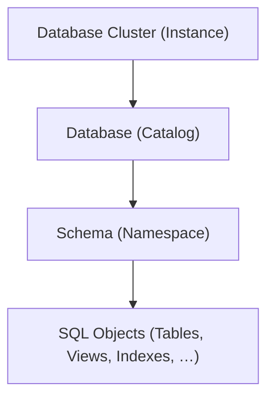
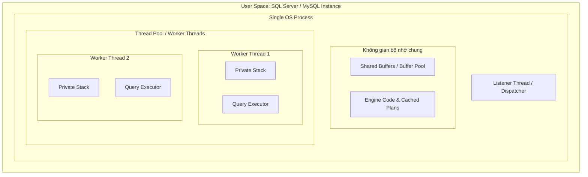
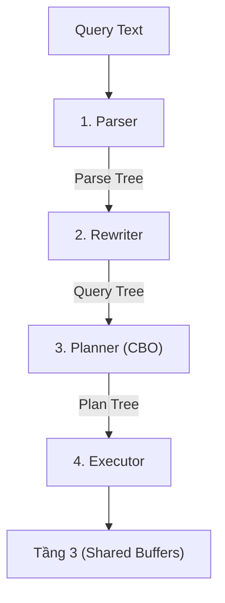
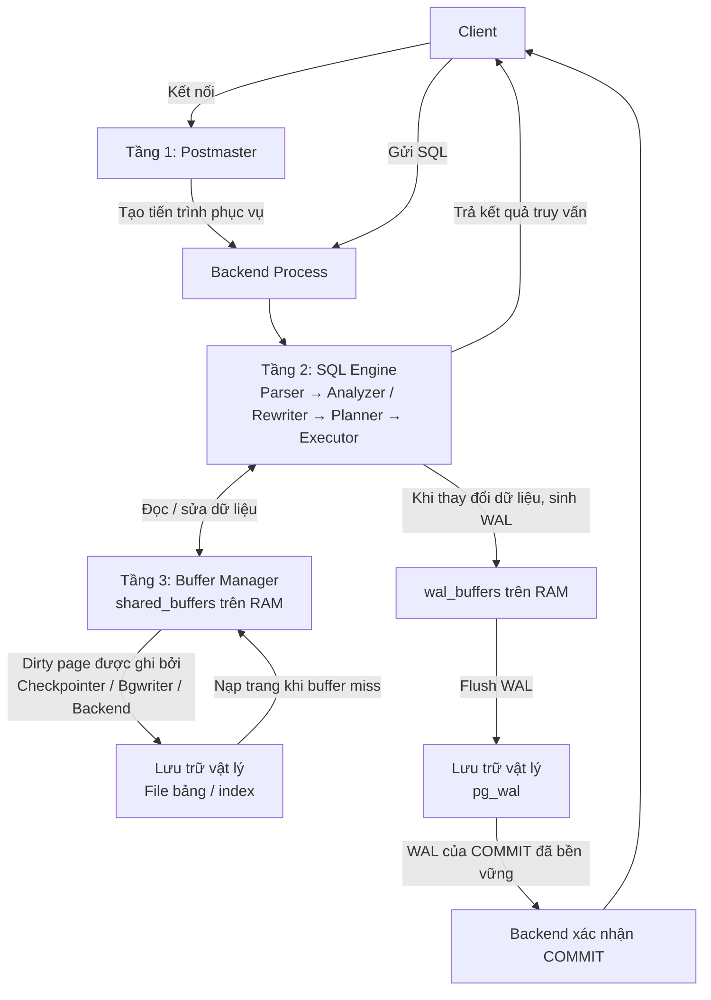

<header class="airflow-article-hero">
  <div class="airflow-article-hero__eyebrow">
    <a href="../../">BEHIND THE PIPELINE</a>
    <span>ARTICLE / 004</span>
  </div>
  <h1>PostgreSQL<br><em>Phân cấp &amp; lưu trữ</em></h1>
  <div class="airflow-article-hero__meta" aria-label="Thông tin bài viết">
    <span>DATABASE INTERNALS</span>
    <span>EDITION 04 · 2026</span>
  </div>
</header>

## 1. Phân cấp logic trong PostgreSQL

Sơ đồ phân cấp từ cao đến thấp của PostgreSQL:



### Database Cluster (Instance)

**Database Cluster (Instance)** là một tiến trình PostgreSQL chạy trên máy chủ vật lý hoặc container. Mỗi database cluster có một vùng nhớ chung (`shared_buffers`) trên RAM và một thư mục dữ liệu (`PGDATA`) trên ổ đĩa. Dữ liệu của các database được lưu trong thư mục `base/`.

### Database (Catalog)

Một database cluster có thể chứa nhiều database. Các database này **không thể truy vấn chéo nhau**, trừ khi sử dụng công cụ bên ngoài. Mỗi database có một thư mục riêng nằm trong thư mục `PGDATA` của database cluster.

### Schema (Namespace)

Schema nằm trong database, và một database có thể có nhiều schema. Các bảng thuộc những schema khác nhau trong cùng database **có thể truy vấn lẫn nhau**.

#### Vì sao một database cần nhiều schema?

- **Tránh trùng tên bảng:** Khi nhiều người cùng sử dụng một database, việc chia thành các schema riêng biệt giúp tránh **xung đột tên bảng**. Ví dụ, schema A và schema B đều có thể chứa bảng `order`. Hệ thống vẫn chấp nhận vì hai bảng cùng tên nằm trong các schema khác nhau.
- **Tiết kiệm tài nguyên:** Nhiều người cùng sử dụng một database giúp tiết kiệm tài nguyên hơn so với việc mỗi người sử dụng một database riêng.
- **Đơn giản hóa việc cấp quyền:** Cấp quyền cho từng bảng trở nên khó khăn khi hệ thống mở rộng. Khi sử dụng schema, chỉ cần cấp quyền cho role trên schema đó.

## 2. Lưu trữ vật lý: cấu trúc thư mục PGDATA

### Vị trí lưu trữ của schema

Về mặt vật lý, schema không có nơi lưu trữ riêng biệt. Mọi schema trong cùng một database đều nằm chung tại thư mục:

```text
PGDATA/base/<db_oid>/
```

Trong đó, `db_oid` là mã được hệ thống sinh ra mỗi khi gọi `CREATE DATABASE`.

### Cấu trúc thư mục PGDATA

Minh họa một thư mục `PGDATA`:

```text
PGDATA/                          <-- Thư mục gốc của toàn bộ Cluster (Instance)
├── pg_wal/                      <-- Chứa các file Write-Ahead Log (WAL)
├── pg_xact/                     <-- Chứa trạng thái commit giao dịch (CLOG)
├── global/                      <-- Chứa bảng hệ thống chung toàn cluster (pg_database, pg_authid,...)
└── base/                        <-- Thư mục chứa dữ liệu của tất cả các database
    ├── 1/                       <-- Thư mục của database 'template1' (OID = 1)
    ├── 13745/                   <-- Thư mục của database 'postgres' (OID = 13745)
    └── 16384/                   <-- Thư mục của database 'my_sales_db' do bạn tạo (OID = 16384)
        ├── 16388                <-- Tệp chứa các trang dữ liệu (Heap) của Table A
        ├── 16388_fsm            <-- Bản đồ không gian trống (Free Space Map) của Table A
        └── 16390                <-- Tệp chứa chỉ mục B-Tree (Index) của Table A
```

## 3. Các tầng kiến trúc của PostgreSQL

### Tầng 1

#### Các khái niệm cần nắm ở tầng 1

##### Tiến trình và luồng

**Tiến trình:** Là một thực thể chạy độc lập, sở hữu một không gian địa chỉ ảo riêng biệt. Không gian này là cơ chế trừu tượng hóa bộ nhớ của hệ điều hành, cụ thể là RAM. Các địa chỉ trong không gian này được đánh số liên tục từ `0` đến địa chỉ cao nhất.

Sau đó, tiến trình chỉ cần sử dụng không gian địa chỉ ảo này. **MMU** (phần cứng tích hợp trong CPU) ánh xạ địa chỉ ảo đến địa chỉ vật lý thông qua **Page Table** (bảng trang dùng để ánh xạ địa chỉ ảo đến địa chỉ vật lý).

```text
[ Tiến trình A ]               [ Phần cứng: MMU ]            [ RAM Vật Lý ]
Trang ảo: 0x1000  -------->  (Tra Bảng trang A)  -------->  Khung trang: 0x88000

[ Tiến trình B ]
Trang ảo: 0x1000  -------->  (Tra Bảng trang B)  -------->  Khung trang: 0x42000
```

Do bảng trang A không chứa ánh xạ đến các ô nhớ được ánh xạ bởi bảng trang B, tiến trình A không thể đọc hoặc sử dụng dữ liệu của tiến trình B.

**Luồng:** Là một nhánh thực thi nằm bên trong một tiến trình duy nhất. Tất cả các luồng chạy song song đều chia sẻ chung không gian địa chỉ ảo, phân vùng Heap, mã máy thực thi (Code Segment) và các kết nối mạng của tiến trình cha.

Mỗi luồng chỉ sở hữu một phân vùng **Stack riêng biệt** (thường có kích thước vài MB hoặc vài trăm KB, dùng để lưu các biến cục bộ, …) và **con trỏ lệnh (Instruction Pointer)** giúp CPU xác định vị trí mã mà luồng đã thực thi đến. Mỗi core trong CPU chỉ xử lý mã của một luồng duy nhất. Bộ điều phối của hệ điều hành (OS Scheduler) có thể luân chuyển một luồng từ core này sang core khác giữa các chu kỳ chạy. Vì vậy, core không được dành cố định cho một luồng nào.

##### Bộ đệm `shared_buffers`

`shared_buffers` là dung lượng RAM mà một instance sử dụng làm **bộ nhớ đệm**, với mục đích chính là giảm thiểu việc đọc và ghi xuống ổ đĩa.

Bộ đệm này được chia thành hàng nghìn khối nhỏ bằng nhau. Mỗi khối có kích thước **8 KB**, bằng kích thước của một Data Page trên đĩa.

##### Latch,Lock và Lock Accumulation

**Latch:** Là khóa ở cấp độ vật lý, giúp ngăn hai luồng ghi đè vào cùng một page. Ví dụ, một luồng ghi và một luồng đọc trên cùng một trang 8 KB.

Giả sử bảng `users` có một trang dữ liệu 8 KB (Page 42) đang nằm sẵn trên RAM trong Buffer Pool. Trang này chứa 5 bản ghi, từ dòng 1 đến dòng 5.

Luồng A thực thi câu lệnh sửa dòng 1:

```sql
UPDATE users SET status = 'ACTIVE' WHERE id = 1;
```

Luồng B thực thi câu lệnh đọc dòng 5:

```sql
SELECT * FROM users WHERE id = 5;
```

Về mặt logic (Lock), luồng A chỉ khóa nghiệp vụ dòng 1, luồng B đọc dòng 5 nên không xung đột Lock với nhau. Tuy nhiên, cả hai dòng lại nằm chung trên một mảng byte vật lý 8 KB của Page 42:

**Luồng A xin Exclusive Latch (khóa ghi vật lý):** Luồng A lấy Exclusive Latch trên khung đệm chứa Page 42 để chuẩn bị ghi đè byte trạng thái của dòng 1.

**Luồng B xin Shared Latch (khóa đọc vật lý):** Cùng lúc đó, luồng B muốn đọc Page 42 để lấy dòng 5. Do luồng A đang giữ Exclusive Latch trên Page 42, luồng B bị chặn ngay lập tức, với thời gian chờ ở mức nanosecond hoặc microsecond.

**Luồng A hoàn tất thao tác:** Luồng A cập nhật vài byte trên RAM trong khoảng 1–2 microsecond, sau đó nhả Exclusive Latch.

**Luồng B tiếp tục:** Luồng B ngay lập tức nhận được Shared Latch, đọc an toàn dữ liệu của dòng 5 và nhả Shared Latch.

Nếu không có Latch, luồng B có thể đọc Page 42 đúng thời điểm CPU của luồng A đang ghi dở một phần số byte của tiêu đề trang (Page Header). Kết quả là luồng B đọc phải con trỏ hỏng.

**Lock:** Là khóa bảo vệ dữ liệu nghiệp vụ logic (rows, tables, views), đảm bảo tính cô lập (Isolation) của các giao dịch theo chuẩn ACID. Ví dụ, khi giao dịch 1 đang `UPDATE` số dư tài khoản của khách hàng A, Lock sẽ ngăn giao dịch 2 sửa đổi hoặc đọc số dư đó cho đến khi giao dịch 1 hoàn tất.

Khi ta thay đổi một dòng, database sẽ sử dụng đồng thời cả hai khóa:

```text
[Bắt đầu Transaction]
        │
        ▼
1. Xin cấp LOCK (Row Lock) ──────────┐
        │                            │
        ▼                            │
2. Nạp trang 8KB vào Buffer Pool     │
        │                            │
        ▼                            │ ───► LOCK duy trì liên tục
3. Lấy LATCH (Exclusive) ────┐       │
        │                    │(Vài µs│
        ▼                    │CẢ HAI │
   Ghi byte dữ liệu vào RAM  │ CÙNG  │
        ▼                    │ KHÓA) │
4. Nhả LATCH ────────────────┘       │
        │                            │
        ▼                            │
5. Thực hiện tiếp các tác vụ khác... │
        │                            │
        ▼                            │
[Transaction COMMIT / ROLLBACK]      │
6. Chính thức nhả LOCK ──────────────┘
```

Khi nhìn vào sơ đồ trên, bạn có tự hỏi: Tại sao hệ thống vẫn giữ khóa cũ khi đã chuyển sang thực hiện các tác vụ không còn liên quan đến dòng đó?

Trong suốt thời gian một giao dịch diễn ra, các khóa hoạt động theo **nguyên lý tích lũy (Lock Accumulation)**. Khi bạn xử lý một dòng, hệ thống giữ khóa của dòng đó. Khi xử lý các dòng khác, hệ thống tiếp tục giữ khóa của các dòng mới đồng thời giữ cả khóa của dòng cũ. Chỉ khi gặp lệnh `COMMIT` hoặc `ROLLBACK`, hệ thống mới nhả khóa.

Vậy tại sao khi xử lý các dòng khác lại không nhả khóa của dòng cũ? Nếu hệ thống vừa sửa xong `id = 1` đã vội nhả khóa:

Giao dịch của bạn đã trừ 100 đồng ở `id = 1`, nhưng chưa kịp cộng tiền cho `id = 2`.

Một giao dịch khác đọc hoặc sửa đổi số dư của `id = 1`.

Đột nhiên, câu lệnh ở `id = 2` bị lỗi, chẳng hạn tài khoản bị khóa hoặc mất kết nối mạng, buộc toàn bộ giao dịch phải `ROLLBACK` để hoàn tiền lại cho `id = 1`.

Lúc này, giao dịch kia đã sử dụng dữ liệu chưa hoàn tất để tính toán, gây ra lỗi **Dirty Read** hoặc **Lost Update**, phá vỡ tính nguyên tử (Atomicity) và tính cô lập (Isolation) của ACID.

Vị trí lưu trạng thái khóa của PostgreSQL khác với các hệ quản trị cơ sở dữ liệu khác:

Trong PostgreSQL, mỗi bản ghi (Tuple) trong bảng Heap luôn đi kèm một phần đầu cố định 23 byte gọi là `HeapTupleHeaderData`. Trong đó có hai trường đóng vai trò kiểm soát khóa dòng:

- **`t_x    min`:** Lưu Transaction ID 
- **`t_xmax`:** Lưu Transaction ID (XID) của giao dịch đang sửa đổi hoặc đang giữ khóa dòng này.
- **`t_infomask`:** Tập hợp các cờ nhị phân báo hiệu mục đích khóa, ví dụ: `HEAP_XMAX_LOCK_ONLY`, `HEAP_XMAX_EXCL`, `HEAP_XMAX_KEYSHR`.
cuar
Ví dụ, một trang 8 KB (Page) trên Buffer Pool:

```text
+-------------------------------------------------------------------------+
| ItemId (Pointer 1) | ItemId (Pointer 2) | ... Vùng trống ...             |
|-------------------------------------------------------------------------|
| Bản ghi id = 1:                                                         |
| [Tuple Header: t_xmin=100, t_xmax=501 (Tx giữ khóa), t_infomask=LOCK_EXCL] |
| [Dữ liệu: name = 'Alice', balance = 1000]                               |
|-------------------------------------------------------------------------|
| Bản ghi id = 2:                                                         |
| [Tuple Header: t_xmin=102, t_xmax=501 (Tx giữ khóa), t_infomask=LOCK_EXCL] |
| [Dữ liệu: name = 'Bob', balance = 2000]                                 |
+-------------------------------------------------------------------------+
```

Trong SQL Server và MySQL, trạng thái khóa được quản lý bởi **Lock Manager** và lưu trữ hoàn toàn trên RAM. Với mỗi dòng bị khóa, Lock Manager tạo một đối tượng khóa (Lock Resource / Lock Head) trong RAM, chứa:

- **Resource ID:** Mã băm định danh đối tượng bị khóa: `DatabaseID + TableID + PageID + RowID/Hash(PrimaryKey)`.
- **Lock Mode:** Chế độ khóa: Exclusive (X), Shared (S), Update (U).
- **Owner:** ID của giao dịch đang giữ khóa.
- **Wait List:** Danh sách các giao dịch khác đang xếp hàng chờ xin khóa dòng này.

Lock Manager Hash Table nằm trên RAM, trong Shared Memory:

```text
[Bucket 12] ──► [Lock Node: Hash(Row_1)]
                 ├── Owner: Tx_501 (Mode: Exclusive)
                 └── Waiters: [Tx_502]

[Bucket 45] ──► [Lock Node: Hash(Row_2)]
                 ├── Owner: Tx_501 (Mode: Exclusive)
                 └── Waiters: (None)
```

Khi đã tìm hiểu cách các cơ sở dữ liệu lưu trạng thái khóa, ta sẽ cùng tìm hiểu khái niệm **Lock Escalation**.

**Lock Escalation (leo thang khóa)** là cơ chế tự động của hệ quản trị cơ sở dữ liệu nhằm chuyển đổi nhiều khóa ở cấp độ chi tiết, như khóa dòng (Row Lock) hoặc khóa trang (Page Lock), thành một khóa duy nhất ở cấp độ bao quát hơn, thường là khóa toàn bảng (Table Lock), trong cùng một giao dịch.

Các hệ quản trị cơ sở dữ liệu như SQL Server lưu trữ khóa trên RAM. Một khóa thường tiêu tốn khoảng 64 đến 128 byte:

- Khóa 10 dòng: tốn khoảng 1 KB RAM.
- Khóa 100.000 dòng: tốn khoảng 10 MB RAM.
- Khóa 10.000.000 dòng: tốn khoảng 1 GB RAM chỉ để ghi nhớ danh sách các dòng đang bị khóa.

Để tránh Lock Manager chiếm hết RAM, SQL Server thường tự động kích hoạt Lock Escalation khi một câu lệnh giữ trên 5.000 khóa, thay thế các khóa này bằng một khóa độc quyền duy nhất ở cấp bảng.

Đối với PostgreSQL, vì các khóa dòng không lưu trữ trên RAM nên dù hệ thống khóa bao nhiêu dòng cũng không tiêu tốn RAM để lưu các khóa dòng này. Vì vậy, PostgreSQL không xảy ra Lock Escalation.

#### Mô hình đa tiến trình của PostgreSQL

PostgreSQL sử dụng **mô hình đa tiến trình**: mỗi client kết nối vào cơ sở dữ liệu có một tiến trình riêng biệt. Các tiến trình này trao đổi dữ liệu và đồng bộ thông qua **Shared Memory**, chủ yếu là `shared_buffers`.

Nếu Backend A vừa đọc một trang bảng từ đĩa vào `shared_buffers` (thành phần con lớn nhất trong Shared Memory), Backend B khi cần trang đó có thể đọc trực tiếp từ `shared_buffers` mà không cần truy cập ổ đĩa lần nữa.

##### Luồng hoạt động của kết nối

Luồng hoạt động như sau:

Tiến trình mẹ **Postmaster** chạy ngầm, khởi tạo Shared Memory và mở cổng mạng. Khi client gửi yêu cầu kết nối, Postmaster sẽ fork tiến trình hiện tại thành một tiến trình mới gọi là **Backend Dedicated Process**. Do cơ chế của `fork()`, các backend process con này tự động kế thừa và ánh xạ dải địa chỉ ảo của mình vào cùng khối Shared Memory đó.

Postmaster bàn giao socket kết nối mạng của client cho backend process mới, rồi lập tức đóng socket đó ở phía mình để tiếp tục lắng nghe các kết nối khác. Sau đó, backend process tự khởi tạo tài nguyên bộ nhớ và gắn kết vào `shared_buffers` để phục vụ truy vấn. Mỗi tiến trình con sử dụng khoảng **5 MB đến 10 MB RAM**, ngay cả khi ở trạng thái nhàn rỗi (Idle).


##### Bộ nhớ phục vụ truy vấn: `work_mem`

Trong mỗi backend process có `work_mem`. Đây là cấu hình giới hạn lượng RAM mà tiến trình yêu cầu cấp thêm để xử lý các tác vụ, được dùng cho các phép tính tốn tài nguyên như `ORDER BY`, `DISTINCT`, Hash Join, Merge Join và các hàm Window Function. **`work_mem` không phải giới hạn trên mỗi truy vấn, mà là trên mỗi phép toán (node) trong cây thực thi (Execution Plan).**

###### Pipeline và các phép toán chặn

Để dễ hiểu hơn, hãy xem cách PostgreSQL xử lý dữ liệu:

PostgreSQL xử lý dữ liệu theo mô hình đường ống (pipeline): kết quả của node cấp dưới được truyền dần lên node cấp trên.

Tuy nhiên, có những phép toán được gọi là **Blocking Operator (phép toán chặn)**. Chúng phải tập hợp toàn bộ hoặc phần lớn dữ liệu vào RAM trước khi tiếp tục tính toán.

Ví dụ, đối với node Hash Join 1, PostgreSQL yêu cầu cấp RAM tới mức trần `work_mem`. Cùng lúc đó, node Hash Join 2 và node Sort phía trên cũng cần được cấp RAM. Vì các node Hash phía dưới phải duy trì liên tục để thu thập đủ dữ liệu, xử lý và chuyển dữ liệu lên node phía trên, sẽ có một khoảng thời gian cả ba node cùng được duy trì và có thể chiếm tới **3 × `work_mem`**.

```text
RAM tối đa của 1 truy vấn ≈ ∑ (work_mem của các node cần gom dữ liệu đồng thời)
```

**Ví dụ nhiều phép toán cùng sử dụng bộ nhớ**

Minh họa bằng một câu truy vấn:

```sql
SELECT c.name, o.total, p.title
FROM orders o
JOIN customers c ON o.customer_id = c.id   -- Phép toán 1: Hash Join
JOIN products p ON o.product_id = p.id     -- Phép toán 2: Hash Join
ORDER BY o.total DESC;                     -- Phép toán 3: Sort
```

```text
[Sort Node]             --> Cần 1 slot RAM (tối đa 1x work_mem để xếp thứ tự)
                    |
           [Hash Join 2: products]     --> Cần 1 slot RAM (tối đa 1x work_mem dựng bảng băm cho products)
                    |
           [Hash Join 1: customers]    --> Cần 1 slot RAM (tối đa 1x work_mem dựng bảng băm cho customers)
              /           \
     [Scan orders]    [Scan customers]
```

Bên cạnh mô hình đa tiến trình của PostgreSQL, các cơ sở dữ liệu khác như MySQL và SQL Server lại sử dụng mô hình đa luồng

#### Mô hình đa luồng

Mỗi client kết nối tới database được gán cho một luồng với dung lượng Stack nhỏ (256 KB đến 1 MB). Vì các luồng đều truy cập vào cùng một không gian bộ nhớ ảo nên hệ thống phải dùng các khóa như Latch hay Lock. Tuy nhiên, khi một luồng gặp lỗi nghiêm trọng, toàn bộ database instance có nguy cơ ngừng hoạt động.

Luồng hoạt động như sau:

**Thiết lập kết nối:** Client kết nối tới cổng của cơ sở dữ liệu.

**Dispatcher tiếp nhận:** Một luồng đặc biệt đóng vai trò lắng nghe kết nối (Listener Thread) đón nhận yêu cầu kết nối.

**Cấp phát thread:** Thay vì gọi hệ điều hành tạo tiến trình mới, Listener kiểm tra Thread Pool của hệ thống và gán một luồng trống (Worker Thread) sẵn có cho client này.

**Thực thi trực tiếp:** Worker Thread xử lý câu lệnh SQL trực tiếp bên trong không gian bộ nhớ chung, đọc và ghi vào vùng bộ nhớ đệm Buffer Pool.

**Trả luồng về pool:** Khi client ngắt kết nối, luồng này không bị hủy hoàn toàn. Luồng dọn dẹp các biến trạng thái phiên làm việc (Session State) và trở về trạng thái nhàn rỗi trong Thread Pool để chờ kết nối tiếp theo [cite: 281].

#### Câu hỏi liên quan:




Chúng ta đã cùng tìm hiểu về kiến trúc tầng 1 của PostgreSQL. Tiếp theo, ta cùng tìm hiểu về kiến trúc tầng 2.

### Tầng 2

**Tầng 2 (SQL Engine / Query Processing Layer)** là bộ phận điều hành logic của PostgreSQL, chịu trách nhiệm chuyển câu lệnh SQL dạng văn bản khai báo (Declarative Text), ví dụ `SELECT * FROM table`, thành kế hoạch thực thi vật lý tối ưu nhất dựa trên chi phí tính toán. Tầng này vận hành hoàn toàn bên trong bộ nhớ ảo cục bộ của backend process.

Tại sao lại nói tầng 2 vận hành hoàn toàn bên trong bộ nhớ ảo cục bộ?

Tầng 2 nằm bên trong không gian bộ nhớ ảo cục bộ vì toàn bộ các bước phân tích, lập kế hoạch và tính toán dữ liệu, như Sort hay Hash Join, là công việc phục vụ riêng cho một truy vấn duy nhất của tiến trình đó, thay vì là dữ liệu chung của cả hệ thống. Lưu ý là…

Chuỗi biên dịch và thực thi gồm 4 giai đoạn của tầng 2:



#### Giai đoạn 1: Parser (phân tích cú pháp thô)

Nhiệm vụ duy nhất của giai đoạn này là chuyển đổi một chuỗi ký tự văn bản thô (String) thành một cấu trúc dữ liệu dạng cây trong bộ nhớ RAM mà máy tính có thể xử lý, gọi là **Parse Tree**.

Lưu ý, ở giai đoạn này, Parser chỉ kiểm tra cú pháp và thứ tự câu lệnh, không kiểm tra xem bảng được truy vấn có hợp lệ hay không. Lấy ví dụ khi phân tích câu “The green dragon is flying over the moon”, Parser chỉ biết câu này đúng ngữ pháp, không biết “green dragon” có tồn tại hay không.

Lý do PostgreSQL thiết kế Parser độc lập hoàn toàn với dữ liệu thực tế là để tối ưu tốc độ và **tách biệt trách nhiệm (Separation of Concerns)**. Nhiệm vụ xác thực sự tồn tại của bảng, kiểu dữ liệu cột và quyền truy cập của người dùng được giao toàn bộ cho giai đoạn thứ hai: Rewriter / Analyzer.

Đây là minh họa cho một Parse Tree:

```text
SelectStmt
├── targetList (Danh sách cột muốn lấy)
│   ├── ResTarget -> ColumnRef ("name")
│   └── ResTarget -> ColumnRef ("age")
├── fromClause (Nguồn dữ liệu)
│   └── RangeVar (relname = "users")
└── whereClause (Điều kiện lọc)
    └── A_Expr (toán tử ">")
        ├── lexpr -> ColumnRef ("age")
        └── rexpr -> A_Const (giá trị nguyên = 18)
```

#### Giai đoạn 2: Rewriter / Analyzer (phân tích ngữ nghĩa và biến đổi quy tắc)

Ở giai đoạn này, hệ thống kiểm tra sự tồn tại của bảng, cột, kiểu dữ liệu và quyền truy cập của người dùng bằng cách đối chiếu Parse Tree với các bảng metadata của hệ thống: `pg_class`, `pg_attribute`, `pg_constraint`. Sau đó, Parse Tree được chuyển thành **Query Tree**.

Tiếp theo, hệ thống áp dụng các quy tắc biến đổi để điều chỉnh cấu trúc Query Tree nếu câu truy vấn truy cập vào view. RLS và các quy tắc biến đổi lệnh DML cũng được xử lý trực tiếp trong giai đoạn này.

#### Giai đoạn 3: Planner / Optimizer

Ở giai đoạn này, Query Tree được chuyển thành một kế hoạch thực thi vật lý (**Plan Tree**) có chi phí tính toán thấp nhất. PostgreSQL vận hành theo mô hình **tối ưu hóa dựa trên chi phí (Cost-Based Optimizer — CBO)**, thay vì áp dụng các quy tắc cứng nhắc như luôn sử dụng index khi có index.

Vậy cost ở đây là gì? Cost phản ánh lượng tài nguyên mà câu truy vấn tiêu tốn, gồm I/O đọc đĩa và CPU xử lý, chứ không phải thời gian. Với một câu truy vấn, Planner tạo ra nhiều phương án thực thi và ước lượng mức tiêu thụ tài nguyên của từng phương án. Phương án tiêu tốn ít tài nguyên nhất được chọn làm Plan Tree.

Dựa trên dữ liệu thống kê từ Analyzer, Planner trước hết ước lượng số dòng trả về của từng biểu thức. Sau đó, Planner dùng thuật toán quy hoạch động để vừa sinh các phương án, vừa tính toán chi phí và loại bỏ ngay các nhánh kém tối ưu. Cuối cùng, Planner chọn phương án có Total Cost hoặc Startup Cost phù hợp nhất, tùy vào việc có `LIMIT` hoặc `CURSOR` hay không, để đóng gói thành Plan Tree và chuyển cho Executor.

- **Total Cost:** Chi phí để trả về toàn bộ bảng dữ liệu.
- **Startup Cost:** Chi phí để bắt đầu trả về dòng dữ liệu đầu tiên.

Một Plan Tree có hình dạng như thế nào? Giả sử bạn chạy một câu lệnh đơn giản:

```sql
SELECT name FROM users WHERE age > 18 LIMIT 2;
```

PostgreSQL biến câu lệnh này thành một dây chuyền gồm 3 nút xếp chồng lên nhau:

```text
[Nút 3: LIMIT (Lấy đúng 2 người)]        <-- Nút trên cùng (Nút cha)
                       ↑
       [Nút 2: FILTER (Kiểm tra age > 18)]      <-- Nút ở giữa
                       ↑
       [Nút 1: SEQ SCAN (Đọc từng dòng bảng users)] <-- Nút dưới cùng (Nút con)
```

#### Giai đoạn 4: Executor (thực thi kế hoạch — Execution)

Một hiểu nhầm thường gặp ở người mới học là: Nếu nút 1 đọc được 1 triệu dòng dữ liệu, nó sẽ chuyển toàn bộ lên nút 2; nút 2 lọc rồi chuyển toàn bộ kết quả cho nút 3 để chỉ lấy 2 người.

Tuy nhiên, như đã đề cập ở trên, PostgreSQL truyền dữ liệu theo từng dòng và vận hành theo **cơ chế pull**: nút phía trên gửi yêu cầu xuống nút phía dưới để lấy từng dòng dữ liệu. Ví dụ dễ hiểu:

Client yêu cầu nút LIMIT: “Hãy trả về kết quả.” Nút LIMIT yêu cầu nút FILTER: “Tôi cần 2 người, hãy trả về người đầu tiên trước.”

Nút FILTER chưa có dữ liệu nên yêu cầu nút SEQ SCAN: “Hãy đọc đúng 1 dòng từ ổ đĩa.” Nút SEQ SCAN đọc dòng đầu tiên từ ổ đĩa — Nam, `age = 15` — rồi chuyển lên nút FILTER.

Nút FILTER kiểm tra `15 < 18`, loại dòng này và tiếp tục yêu cầu nút SEQ SCAN: “Dòng này không đáp ứng điều kiện, hãy đọc dòng tiếp theo.”

Nút SEQ SCAN đọc dòng thứ hai — Lan, `age = 20` — rồi chuyển cho nút FILTER. Nút FILTER kiểm tra `20 > 18`, xác định dữ liệu hợp lệ và chuyển dòng của Lan lên nút LIMIT.

Nút LIMIT nhận được 1 người, còn thiếu 1 người để đủ 2, nên tiếp tục yêu cầu nút FILTER: “Hãy trả về người thứ hai.” Quá trình lặp lại cho đến khi nút LIMIT nhận đủ người thứ hai, ví dụ Hùng, `age = 22`.

Khi đã nhận đủ 2 người, nút LIMIT yêu cầu toàn bộ dây chuyền dừng lại. Đồng thời, Executor cũng đọc metadata trong Tuple Header để kiểm tra xem dữ liệu có được phép hiển thị hay không.

#### Giai đoạn 5: Tầng bộ nhớ đệm và lưu trữ vật lý (Storage Engine)

Ở giai đoạn này, khi các nút cần đọc dữ liệu, Executor không bao giờ làm việc trực tiếp với ổ đĩa mà gửi yêu cầu tới **Buffer Manager**. Buffer Manager tra bảng băm (**Buffer Mapping Hash Table**). Nếu dữ liệu đã có trên RAM, Executor trực tiếp trích xuất dữ liệu và trả về nút cha. Dữ liệu có sẵn trên RAM giúp giảm chi phí đọc từ ổ đĩa.

Khi dữ liệu không có trên RAM (**Buffer Miss**), Buffer Manager phải nạp trang từ ổ đĩa vào `shared_buffers`. Sau đó, Executor đọc dữ liệu từ đây.

Còn khi cần ghi dữ liệu, các thay đổi được thực hiện trên RAM và các page tương ứng được đánh dấu là Dirty Page. Ngay tại thời điểm sửa dữ liệu trên RAM, PostgreSQL sinh ra **WAL record** và lưu vào `wal_buffers` trên RAM.

Khi người dùng `COMMIT`, hệ thống không ghi ngay các Dirty Page xuống đĩa mà ghi nội dung `wal_buffers` xuống trước, theo một nguyên tắc bất biến của database: **Một Dirty Page trên RAM tuyệt đối không được ghi xuống đĩa nếu bản ghi WAL mô tả thay đổi của trang đó chưa được lưu an toàn trên đĩa.**

Các Dirty Page vẫn nằm trong `shared_buffers` trên RAM để các tiến trình nền như Checkpointer hoặc `bgwriter` ghi dần xuống đĩa sau đó. Chỉ khi chip nhớ của ổ đĩa phát tín hiệu xác nhận “Các byte WAL đã được lưu an toàn trên đĩa vật lý”, PostgreSQL mới gửi phản hồi `COMMIT` thành công về cho client.

```text
[Executor]
                   │
                   ▼ (Hỏi khối số 45)
          [Buffer Mapping Table] (Bảng băm tra cứu)
             /                \
      (Đã có trên RAM)      (Chưa có trên RAM)
           /                    \
          ▼                      ▼
    [BUFFER HIT]           [BUFFER MISS]
   - Ghim trang (Pin)     - Chạy Clock Sweep tìm ô trống
   - Khóa nhẹ (LWLock)    - Đọc từ OS Page Cache / Đĩa (Async I/O PG 18)
   - Đọc dữ liệu          - Đưa lên shared_buffers & Pin trang
```
##### Các khái niệm cần biết ở giai đoạn này
Để dễ hiểu hơn về giai đoạn này, ta sẽ cùng tìm hiểu những khái niệm sau:

**Dirty Page:** Là một page đang nằm trên RAM có nội dung đã bị thay đổi. Để dễ hình dung, với **Clean Page**, dữ liệu trên RAM và trên ổ đĩa giống nhau 100%; với Dirty Page, dữ liệu trên RAM là phiên bản mới nhất, còn dữ liệu trên đĩa là phiên bản cũ.

Vòng đời của một Dirty Page diễn ra như sau:

```text
     [Ổ đĩa] ──(Đọc lên)──> [Shared Buffers: Clean Page]
                             │
                      (UPDATE / INSERT)
                             │
                             ▼
                    [Ghi nhật ký WAL]
                             │
                             ▼
               [Shared Buffers: Dirty Page] (Đánh dấu cờ BM_DIRTY)
                             │
                  (Checkpointer / Bgwriter)
                             │
                             ▼
[Ổ đĩa] <──(Ghi & Fsync)─────┘ (Trang trở lại trạng thái Clean)
```

###### Thành phần nào chịu trách nhiệm dọn dẹp Dirty Page?

- **Checkpointer:** Quét toàn bộ `shared_buffers`, tìm tất cả Dirty Page và buộc ghi xuống ổ đĩa. Checkpointer đánh dấu một checkpoint vào file WAL để hệ thống biết đã xử lý đến đâu.
- **Background Writer (`bgwriter`):** Tìm một lượng nhỏ Dirty Page ít dùng và ghi dần xuống đĩa trước khi checkpoint diễn ra.
- **Backend Allocation (người dùng tự dọn).**

Vậy là chúng ta đã cùng tìm hiểu toàn bộ các giai đoạn ở tầng 2 của PostgreSQL. Dưới đây là sơ đồ minh họa cách tầng này vận hành:



### Tầng 3: Bộ nhớ đệm và giao dịch

Shared Memory gồm các thành phần sau:

```text
+-----------------------------------------------------------------------------------------+
|                                    SHARED MEMORY (RAM)                                  |
|  +---------------------+    +--------------------+    +------------------------------+  |
|  |   shared_buffers    |    |    wal_buffers     |    |   Commit Log (CLOG/pg_xact)  |  |
|  | (Trang dữ liệu 8KB) |    | (Nhật ký WAL đệm)  |    |  (Mảng bit XID status)       |  |
|  +---------------------+    +--------------------+    +------------------------------+  |
|  | Lock Manager (Bảng khóa Table/Wait Queue) & SIREAD Locks (Predicates cho SSI)        |  |
+-----------------------------------------------------------------------------------------+
```

#### Bộ đệm `shared_buffers`

`shared_buffers` là vùng RAM dùng chung lớn nhất trong PostgreSQL, đóng vai trò bộ đệm đọc và ghi trung gian cho các khối 8 KB của bảng và index. Vùng nhớ này vừa lưu các trang đã đọc từ đĩa để phục vụ những truy vấn sau (**Read Cache**), vừa là nơi trực tiếp chỉnh sửa dữ liệu thành các **Dirty Page** trước khi đồng bộ xuống đĩa vật lý.

PostgreSQL sử dụng kết hợp `shared_buffers` và OS Page Cache của Linux kernel. Sự kết hợp này được gọi là **cơ chế đệm kép**.

Khi `shared_buffers` đã đầy mà một truy vấn mới cần nạp thêm trang 8 KB từ ổ đĩa vào RAM, hệ thống sử dụng cơ chế **Clock Sweep** để giải phóng vùng RAM. `shared_buffers` được chia thành một mảng các ô đệm (**Buffer Frames**) có kích thước cố định 8 KB. Mỗi ô đệm chứa hai giá trị:

- **`refcount`:** Số tiến trình đang sử dụng ô đệm. Nếu `refcount > 0`, ô đệm không thể được giải phóng; nếu `refcount = 0`, hệ thống có thể xem xét giải phóng ô đệm và ghi dữ liệu xuống ổ đĩa.
- **`usage_count` (0–5):** Giá trị càng cao cho biết dữ liệu đã được sử dụng càng nhiều lần.

Cách Clock Sweep vận hành:

```text
    [Ô số 0] (usage = 2)
              ↗           ↖
      [Ô số 5]             [Ô số 1] (usage = 0, ref = 0) ──► NẠN NHÂN BỊ ĐẨY RA!
         ↑         KIM       |
         |        ĐỒNG HỒ    |
      [Ô số 4]  ────────►  [Ô số 2] (usage = 3)
              ↘           ↙
                 [Ô số 3] (refcount = 1 - Đang bận)
```

Clock Sweep kiểm tra các ô đệm theo vòng tròn để tìm ô đủ điều kiện giải phóng. Cơ chế này chỉ xét các ô có `refcount = 0`; mỗi lần xét một ô, `usage_count` giảm 1 đơn vị. Quá trình tiếp tục cho đến khi tìm được ô thỏa điều kiện giải phóng.

Bạn đã biết `shared_buffers` giống như một chiếc tủ chứa các trang dữ liệu 8 KB trên RAM để có thể sử dụng ngay khi cần, không phải đọc lại từ ổ đĩa. Vậy hệ thống xử lý thế nào khi gặp một câu lệnh quét bảng quá lớn?

Khi phát hiện câu lệnh đang quét một bảng quá lớn, PostgreSQL không cho phép câu lệnh sử dụng toàn bộ `shared_buffers` một cách không giới hạn. Hệ thống chỉ cấp riêng một số ô đệm, tùy vào tính chất thao tác, tạo thành **Buffer Ring** ngay trong `shared_buffers`.

Khi câu lệnh bắt đầu, nó mượn 32 ô đệm từ `shared_buffers`. Khi quét đến trang thứ 33, thay vì dùng Clock Sweep để tìm thêm ô mới trên toàn bộ RAM, hệ thống quay lại ô đệm số 1 trong vòng 32 ô đó, loại dữ liệu cũ và nạp trang thứ 33 vào.

- **Khi bảng nhỏ:** PostgreSQL vẫn nạp trực tiếp vào cache chung.
- **`BAS_BULKREAD`:** Khi quét bảng lớn, tức dung lượng bảng ước tính lớn hơn 25% tổng dung lượng `shared_buffers`, Buffer Ring gồm 32 trang 8 KB.
- **`BAS_VACUUM`:** Giúp Autovacuum quét các bảng lớn để dọn Dead Tuple; Buffer Ring gồm 32 trang 8 KB.
- **`BAS_BULKWRITE`:** Khi nạp một lượng lớn dữ liệu, Buffer Ring gồm 32 trang 8 KB.

Vấn đề nảy sinh khi vùng RAM này phải phục vụ một câu lệnh quét bảng quá lớn.

#### Bộ đệm `wal_buffers`

`wal_buffers` chứa các bản ghi WAL được tạo ra khi một thao tác sửa đổi trang diễn ra trên RAM. Dữ liệu trong vùng đệm này được ghi xuống tệp tin vật lý (`pg_wal`) khi hệ thống phát hiện lệnh `COMMIT`.

#### Commit Log (CLOG / `pg_xact`)

Commit Log là cấu trúc mảng bit nhỏ gọn, lưu trạng thái của từng Transaction ID. Trên ổ đĩa, dữ liệu này được lưu trong thư mục `pg_clog`; trên RAM, dữ liệu được lưu trong **SLRU Buffer**.

Commit Log ghi nhận giao dịch đã `COMMIT` hay đang thực hiện (in-progress). Các trạng thái được biểu diễn bằng 2 bit nhị phân để tối ưu bộ nhớ. Khi SLRU Buffer trên RAM đầy, hệ thống đẩy các Transaction ID lâu không sử dụng xuống ổ đĩa theo cơ chế **LRU**.

    Câu hỏi liên quan đến kiến trúc tầng này: nếu bạn chạy một truy vấn 10 kéo dài 10 phút, trong khoảng thời gian 10 phút này có hàng ngàn câu lệnh UPDATE hay Delete khác đang diễn ra liên tục. Vậy liệu câu truy vấn này hệ thống sẽ xử lí như thế nào?
        Trước tiên ta cùng tìm hiểu về khái niệm MVCC: MVCC (Multi-Version Concurrency Control - Kiểm soát đồng thời đa phiên bản) là cơ chế cho phép nhiều người đọc và ghi dữ liệu cùng một lúc mà không bao giờ chặn nhau. Quy tắc vàng của MVCC là: "Luồng đọc không bao giờ chặn luồng ghi, và luồng ghi không bao giờ chặn luồng đọc." Khi thực hiện các thao tác DDL, bên dưới hệ thống sẽ thực thi các bước saU:
            - INSERT: t_xmin = XID hiện tại, t_xmax =0
            - DELETE: t_xmax = XID hiện tại,
            - UPDATE: tạo ra một dòng mới được dòng cũ trỏ tới, dòng cũ: t_xmax = XID hiện tại, dòng mới: t_xmin = XID hiện tại, t_xmax =0 
        Khi thực thi câu lệnh truy vấn, hệ thống sẽ chụp lại một bức ảnh trạng thái gọi là Transaction Snapshot. Khi executor đọc qua một dòng, nó đối chiếu t_xmax và t_xmin của dòng đó với snapshot:
            Được phép nhìn thấy dòng: Nếu xmin thuộc về một giao dịch đã commit trước khi snapshot được tạo, VÀ xmax chưa được đặt (hoặc thuộc về một giao dịch được thực hiện sau snapshot).

Bị ẩn đi: Nếu dòng đó được tạo bởi một giao dịch đang chạy dở dang, hoặc một giao dịch sinh ra sau snapshot.
Nhờ Snapshot, nếu bạn chạy một truy vấn báo cáo kéo dài 10 phút, kết quả dữ liệu trả về sẽ luôn nhất quán đúng tại thời điểm 10 phút trước, bất chấp việc trong 10 phút đó có hàng ngàn câu lệnh UPDATE hay DELETE khác đang diễn ra liên tục.
    Một Transaction Snapshot chứa 3 thông số:
    xmin: XID của giao dịch cũ nhất vẫn còn đang chạy.xmax: XID đầu tiên chưa được cấp phát (mọi XID $\ge$ xmax đều không hiển thị).xip_list: Mảng danh sách các XIDs đang hoạt động tại thời điểm chụp snapshot.