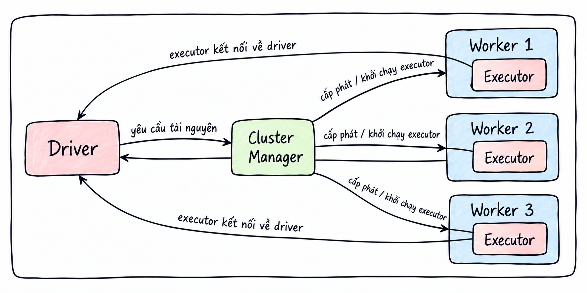
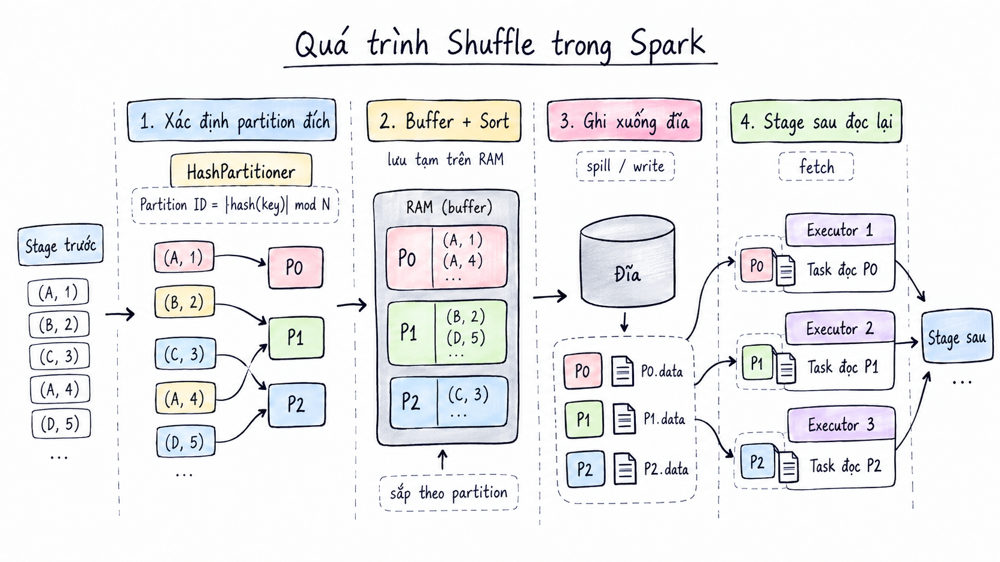
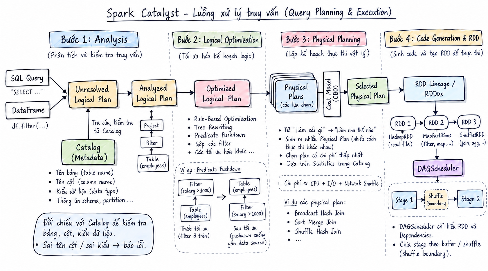

<header class="airflow-article-hero spark-article-hero">
  <div class="airflow-article-hero__eyebrow">
    <a href="../../">BEHIND THE PIPELINE</a>
    <span>ARTICLE / 005</span>
  </div>
  <h1>Apache Spark<br><em>Architecture (Part 1)</em></h1>
  <p class="airflow-article-hero__dek">
    From why Spark was created to how a query runs across a cluster:
    understand the architecture to see what happens when a program runs or fails.
  </p>
  <div class="airflow-article-hero__meta" aria-label="Article information">
    <span>DISTRIBUTED COMPUTING</span>
    <span>DEEP DIVE</span>
    <span>EDITION 05 · 2026</span>
  </div>
</header>

## Why Understand Spark Architecture?

You may already know Spark or have used it in a project. But when a program fails, finding a fix on ChatGPT and applying it successfully does not necessarily mean you understand **why it works**. Understanding how Spark works internally helps you identify the cause yourself. This article introduces Spark's architecture and explains how it executes a query.

## 1. What Is Spark?

**Apache Spark** is a distributed computing engine for processing large datasets across multiple machines. With suitable infrastructure, it can process data at petabyte scale.

Instead of keeping all data and computation on one machine, Spark divides data into **partitions** and work into **tasks**. Executors on multiple machines run these tasks in parallel.

## 2. How Did Spark Begin?

Spark began as a research project at **UC Berkeley** in 2009 and was open-sourced in early 2010. It moved to the **Apache Software Foundation** in 2013.

At the time, **MapReduce** already supported processing across multiple machines, but had limitations for workloads that reused the same data over several rounds of computation. Reading the data from disk again after each round increased latency. Spark was designed to support these workloads by allowing data to be **kept and reused in RAM** between computations while preserving fault tolerance.

Spark has several key features:

- **In-memory processing:** Cached data is kept in RAM, allowing iterative workloads to run much faster than with MapReduce.
- **Fault tolerance:** Supported by RDDs and the Lineage Graph.
- **Lazy evaluation:** Spark does not execute transformations when they are declared; execution begins when an Action is called.
- **Multiple language APIs:** Java, Scala, and Python.

We will explore these features in more detail below.

## 3. The Entry Point to Spark

**SparkSession** (or **SparkContext**) is the entry point that connects your code to Spark. It is the first object you need to initialize when using Spark.

For example, to initialize a `SparkSession` in Python:

```python
spark = SparkSession.builder \
    .appName("MyFirstSparkApp") \
    .master("local[*]") \
    .config("spark.executor.memory", "2g") \
    .getOrCreate()
```

## 4. Apache Spark Architecture

Spark's architecture is usually described in terms of its execution components and their roles in the distributed system, rather than as a set of layers.

### Driver Program — Application Coordinator

Spark follows a **Master–Worker** model, also known as Master–Slave. In the application coordination model described here, the **Driver Program** acts as the master: the central process responsible for **coordinating the entire application**.

The Driver includes the following components:

| Component | Role |
| --- | --- |
| **SparkSession** | The entry point connecting your code to Spark; the first object to initialize when using Spark. |
| **SparkContext** | The component underlying SparkSession since Spark 2.0. It connects the Driver to the Spark cluster and lets it send work to Executors. |
| **DAGScheduler** | Takes the computation plan, builds a DAG, and divides the work into Stages. |
| **TaskScheduler** | Receives tasks from the DAGScheduler and sends them to Executors. |

### Worker Nodes and Executors

The worker side consists of **worker nodes** and **Executors**:

- **Worker node:** A physical or virtual machine in the distributed cluster.
- **Executor:** A child process launched on a worker node that runs tasks on parallel threads.

### Cluster Manager — Resource Management

The **Cluster Manager** manages and allocates resources to Spark applications. An application requests resources from the Cluster Manager, which allocates CPU and RAM on worker nodes and launches Executors to run tasks.

These components work together as follows:

1. When you run `spark-submit`, the Driver process starts and initializes `SparkContext`. The Driver contacts the Cluster Manager to request resources.
2. The Cluster Manager checks the worker nodes and instructs those with sufficient resources to launch Executors.
3. Once started, Executors connect directly to the Driver to receive work.
4. When an Action is called, the Driver assigns work to the Executors. They return results to the Driver when they finish.

[{ loading=lazy .article-diagram--wide }](../assets/images/spark/flow.png){ title="View full-size image" }

## 6. Partitions, Dependencies, and Shuffle

### What Is a Partition?

To understand shuffle, we first need to understand **partitions** in Spark.

A **partition** is the basic unit of data storage and parallelism. Spark uses a divide-and-conquer approach to large datasets, splitting them into smaller pieces called partitions. Each partition is processed by a task on an Executor.

### Narrow Dependency

With a **Narrow Dependency**, each partition of the child dataset depends on a single partition of the parent dataset.

Transformations such as `map()`, `filter()`, and `flatMap()` are examples of Narrow Dependencies.

### Wide Dependency and Shuffle

With a **Wide Dependency**, computing a child partition requires data from multiple or all parent partitions spread across different machines. Examples discussed here include `groupByKey()`, `reduceByKey()`, `join()`, and `distinct()`.

To bring data from multiple partitions together into a new partition, Spark transfers it across the network. This process is called a **shuffle**.

### How Does a Shuffle Work?

After the preceding Stages finish their Narrow Dependency operations, the data is represented as `(key, value)` pairs. The shuffle then proceeds as follows:

1. **Determine the target partition:** Spark uses `HashPartitioner` to calculate each row's Partition ID as `Partition ID = |hash(Key)| mod N`, where `N` is the number of partitions in the next Stage.
2. **Buffer and sort:** Data is buffered in the Executor's RAM, then sorted by Partition ID.
3. **Write to disk:** Once computation finishes, Spark writes the data to the worker node's disk.
4. **Read in the next Stage:** Subsequent Stages read the preceding Stage's output from disk.

[{ loading=lazy }](../assets/images/spark/shuffle.png){ title="View full-size image" }

### Why Write Shuffle Data to Disk?

Why does an Executor write its output to disk instead of passing it directly to Executors in the next Stage? There are several reasons:

- **Avoiding memory exhaustion:** A shuffle can produce a large amount of data. Keeping all of it in RAM could fill the Executor's memory, forcing Spark to spill data to disk.
- **Avoiding deadlock:** A cluster has a fixed number of CPU cores and a fixed amount of RAM shared across Stages. Suppose it has 100 task cores, and both the preceding and following Stages have 200 tasks each. If 100 completed tasks hold on to their cores and RAM while waiting for downstream tasks to fetch their data, all 100 cores remain occupied. The downstream tasks cannot start, causing deadlock.
- **Limiting simultaneous network connections:** Now suppose the cluster has 200 cores. If 100 completed upstream tasks remain active while 100 downstream tasks start fetching data, the system must maintain `100 × 100` simultaneous network connections. Too many connections can overwhelm network bandwidth.
- **Supporting fault tolerance:** If a downstream task fails, it can reread the data from disk instead of restarting upstream tasks.

## 7. Query Execution with the DataFrame API and Spark SQL

This section follows a query through **Apache Spark**, from the DataFrame API or Spark SQL through optimization and distributed scheduling to task assignment on Executors.

### Stage 1: Declaring a Query and Lazy Evaluation

When you declare a DataFrame transformation such as `df.filter()`, Spark does not execute it immediately. Instead, it creates a new node and adds it to an **Abstract Syntax Tree (AST)**. This is lazy evaluation.

#### What Is an Abstract Syntax Tree?

An **AST** is a hierarchical tree representing the syntax of code. It consists of a root node, branches or intermediate nodes, and leaf nodes.

For example:

```python
df.filter(df["age"] > 18).select("name")
```

This expression is represented by the following AST:

```text
[ Project / Select ]                    ← Root: select the 'name' column
          │
          ▼
[ Filter / Where ]                      ← Branch: filter the data
     /          \
(Condition)   (Data source)
    │               │
  [ > ]     [ Relation: users.csv ]      ← Leaf: source file
  /   \
['age'] [18]                            ← Leaves: operands (column and constant)
```

#### DataFrames and the Unresolved Logical Plan

A Spark **DataFrame** is essentially a wrapper holding a reference to an AST, rather than the data itself. Declaring a transformation adds a new branch to this tree. At this point, it is called an **Unresolved Logical Plan** because Spark has not yet checked whether the referenced columns and tables exist.

### Stage 2: Optimization with Catalyst and Project Tungsten

The **Catalyst Optimizer** processes the `Unresolved Logical Plan` in four steps:

1. **Analysis:** Catalyst checks table names, column names, and data types against the **Catalog**, the metadata repository initialized with `SparkSession`. Invalid column names or data types cause an error. Once validated, the `Unresolved Logical Plan` becomes an **Analyzed Logical Plan**.
2. **Logical Optimization:** Spark applies optimization rules to the `Analyzed Logical Plan`. For example, **Predicate Pushdown** moves filters closer to the `LogicalRelation` (the data source) to avoid reading unnecessary data. Spark can also combine filter nodes. These rule-based tree transformations are called **Rule-Based Optimization** or **Tree Rewriting**. The result is an **Optimized Logical Plan**.
3. **Physical Planning:** Spark turns the logical plan into one or more **Physical Plans**, each describing execution algorithms for the cluster. This moves from what to compute to how to compute it. When Catalog statistics are available, **Cost-Based Optimization (CBO)** can help choose the **Selected Physical Plan**. CPU use, disk I/O, and network shuffle traffic are useful ways to think about execution cost; they are considerations, not a fixed Spark cost formula.
4. **Preparing for scheduling:** The physical plan is implemented as a sequence or tree of RDDs (Resilient Distributed Datasets) and their dependencies. The `DAGScheduler` follows those dependencies backward from the target RDD to the source RDDs to identify Stage boundaries.

### Stage 3: Triggering an Action and Scheduling on the Driver

When the program calls an **Action**, the prepared plan begins execution and `SparkContext` creates a **Job**. The `DAGScheduler` follows dependencies from the target RDD back to the source RDDs and divides the Job into **Stages** at shuffle boundaries. For each Stage, it creates **Tasks**, usually one per **partition**, and bundles them into a **TaskSet**. The `TaskScheduler` receives the TaskSet and assigns Tasks to suitable **Executors**.

[{ loading=lazy .article-diagram--wide }](../assets/images/spark/Planing.png){ title="View full-size image" }

#### Stages Are Divided at Shuffle Boundaries

Stages are not simply divided into one group of narrow transformations and another group of wide transformations. A **shuffle dependency** creates the boundary: the preceding Stage produces shuffle data, and the following Stage reads it to continue processing. Transformations connected by narrow dependencies can belong to the same Stage.

Consider this sequence:

```text
A (narrow) → B (narrow) → C (wide, requires shuffle) → D (narrow) → E (narrow)
```

Tasks in the first Stage perform A and B, then produce shuffle output for C. Once that output is available, the next Stage reads it, performs C, and continues with D and E if there is no further shuffle boundary. C therefore marks the Stage boundary; there is no rule that all narrow operations belong to Stage A and all wide operations to Stage B.

## 8. Questions to Explore Next

- Which components does the Driver contain?
- Which components does an Executor contain, and how does it manage memory?
- Adaptive Query Execution (AQE).
- Join types in Spark.

---

## Closing Thoughts

From the roles of the Driver and Executors to partitions, shuffle, Jobs, Stages, and Tasks, Part 1 has explained how Spark organizes and runs work across a cluster. These concepts provide the foundation for understanding physical join execution.

In [Apache Spark Architecture (Part 2)](p2.en.md), we continue with join strategies, the role of RDDs, communication in PySpark, and memory management on the Driver and Executors.

There is still much more to learn about Spark. Please share any corrections so we can learn together.

Thank you for reading to the end! I hope this article helps you understand Spark's architecture more clearly. See you in future articles.

<footer class="airflow-article-end spark-article-end">
  <div>
    <span>BEHIND THE PIPELINE / 005</span>
    <strong>Understand the system,<br>not just the syntax.</strong>
  </div>
  <a href="../../">Back to the library <span aria-hidden="true">→</span></a>
</footer>
