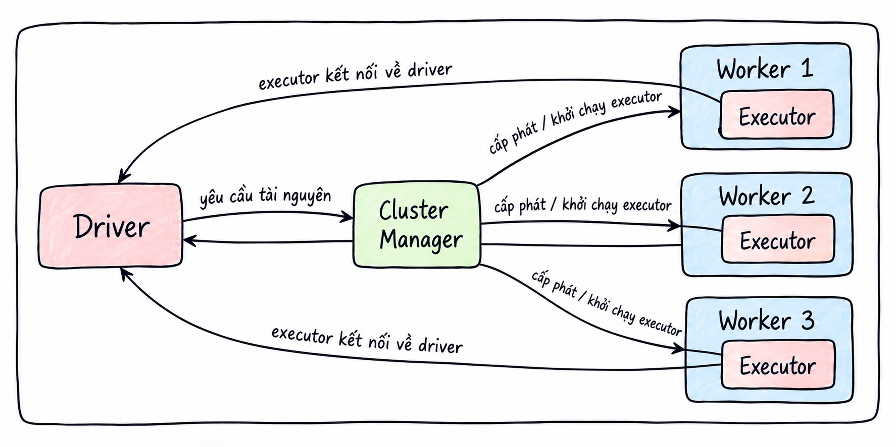
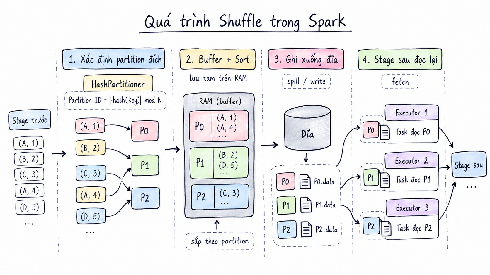
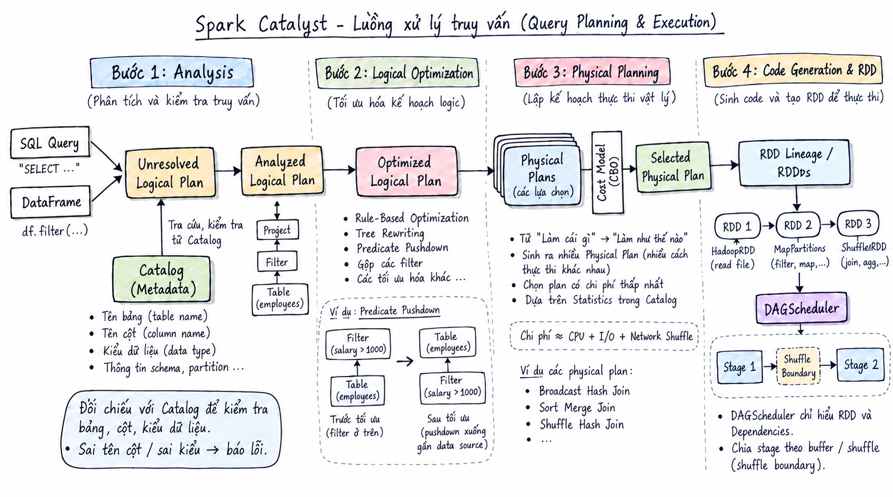

<header class="airflow-article-hero spark-article-hero">
  <div class="airflow-article-hero__eyebrow">
    <a href="../../">BEHIND THE PIPELINE</a>
    <span>ARTICLE / 005</span>
  </div>
  <h1>Kiến trúc<br><em>Apache Spark</em></h1>
  <p class="airflow-article-hero__dek">
    Từ lý do Spark ra đời đến cách một câu lệnh được thực thi trên cụm máy:
    hiểu kiến trúc để biết điều gì xảy ra khi chương trình chạy hoặc gặp lỗi.
  </p>
  <div class="airflow-article-hero__meta" aria-label="Thông tin bài viết">
    <span>DISTRIBUTED COMPUTING</span>
    <span>DEEP DIVE</span>
    <span>EDITION 05 · 2026</span>
  </div>
</header>

## Tại sao cần hiểu kiến trúc Spark?

Có thể bạn đã biết đến Spark hoặc sử dụng công cụ này trong một dự án. Tuy nhiên, khi chương trình gặp lỗi, việc tìm lời giải trên ChatGPT và áp dụng thành công chưa đồng nghĩa với việc hiểu **vì sao cách sửa đó có tác dụng**. Hiểu cách Spark vận hành bên dưới sẽ giúp bạn chủ động xác định nguyên nhân. Bài viết này giới thiệu kiến trúc Spark và cách Spark thực thi một câu lệnh.

## 1. Spark là gì?

**Apache Spark** là một engine tính toán phân tán dùng để xử lý dữ liệu lớn trên nhiều máy. Với hạ tầng phù hợp, Spark có thể xử lý dữ liệu ở quy mô petabyte.

Thay vì tập trung toàn bộ dữ liệu và phép tính trên một máy, Spark chia dữ liệu thành nhiều **partition** và công việc thành nhiều **task**. Các Executor trên nhiều máy thực thi những task này song song.

## 2. Spark ra đời như thế nào?

Spark bắt đầu từ một dự án nghiên cứu tại **UC Berkeley** năm 2009 và được công bố mã nguồn vào đầu năm 2010. Đến năm 2013, dự án chuyển sang **Apache Software Foundation**.

Khi đó, **MapReduce** đã hỗ trợ xử lý dữ liệu trên nhiều máy, nhưng còn hạn chế với những công việc cần sử dụng lại cùng một tập dữ liệu qua nhiều lượt tính toán. Việc phải đọc lại dữ liệu từ ổ đĩa sau mỗi lượt xử lý làm tăng độ trễ. Spark được thiết kế để hỗ trợ những công việc này bằng cách cho phép **giữ và tái sử dụng dữ liệu trong RAM** giữa các phép tính, đồng thời duy trì khả năng chịu lỗi.

Spark nổi bật với các đặc điểm sau:

- **Xử lý trên bộ nhớ:** Dữ liệu đệm được lưu trong RAM, giúp Spark thực thi các tác vụ lặp lại nhanh hơn nhiều lần so với MapReduce.
- **Khả năng chịu lỗi:** Được hỗ trợ bởi RDD và Lineage Graph.
- **Đánh giá lười biếng (lazy evaluation):** Spark chưa thực thi ngay khi người dùng khai báo các phép biến đổi, mà chỉ bắt đầu thực thi khi một Action được gọi.
- **Hỗ trợ đa ngôn ngữ:** Java, Scala và Python.

Những đặc điểm này sẽ được trình bày chi tiết ở các phần sau.

## 3. Điểm truy cập vào Spark

**SparkSession** (hoặc **SparkContext**) là điểm truy cập giúp kết nối mã của bạn với hệ thống Spark. Đây là đối tượng đầu tiên cần khởi tạo khi sử dụng Spark.

Ví dụ khởi tạo `SparkSession` bằng Python:

```python
spark = SparkSession.builder \
    .appName("MyFirstSparkApp") \
    .master("local[*]") \
    .config("spark.executor.memory", "2g") \
    .getOrCreate()
```

## 4. Kiến trúc Apache Spark

Kiến trúc Spark được mô tả chủ yếu theo các thành phần thực thi và vai trò của chúng trong hệ thống phân tán, thay vì phân chia theo các tầng (layer).

### Driver Program — tiến trình điều khiển

Spark được thiết kế theo mô hình **Master–Worker** (còn được gọi là Master–Slave). Trong mô hình điều phối ứng dụng được mô tả ở đây, **Driver Program** giữ vai trò Master: tiến trình trung tâm chịu trách nhiệm **điều phối toàn bộ ứng dụng**.

Driver bao gồm các thành phần sau:

| Thành phần | Vai trò |
| --- | --- |
| **SparkSession** | Điểm truy cập giúp kết nối mã của bạn với hệ thống Spark; là đối tượng đầu tiên cần khởi tạo khi sử dụng Spark. |
| **SparkContext** | Thành phần bên dưới SparkSession kể từ Spark 2.0, chịu trách nhiệm kết nối Driver với cụm Spark và giúp Driver gửi công việc tới các Executor. |
| **DAGScheduler** | Nhận kế hoạch tính toán, xây dựng DAG và phân chia công việc thành các Stage. |
| **TaskScheduler** | Nhận các task từ DAGScheduler và gửi chúng tới từng Executor. |

### Worker node và Executor

Phía Worker gồm các **worker node** và **Executor**:

- **Worker node:** Máy vật lý hoặc máy ảo thuộc cụm phân tán.
- **Executor:** Tiến trình con được khởi tạo trên worker node, chịu trách nhiệm chạy các task trên những luồng song song.

### Cluster Manager — bộ quản lý tài nguyên

**Cluster Manager** chịu trách nhiệm quản lý và phân bổ tài nguyên cho ứng dụng Spark. Khi cần chạy, ứng dụng gửi yêu cầu tài nguyên tới Cluster Manager. Thành phần này cấp CPU và RAM trên các worker node, đồng thời khởi tạo các Executor để thực thi task.

Các thành phần này phối hợp với nhau như thế nào?
  Bước 1: Khi bạn chạy spark-submit, tiến trình Driver được tạo ra và khởi chạy SparkContext. Driver liên hệ với Cluster Manager yêu cầu cấp phát tài nguyên.
  Bước 2: Cluster Manager rà soát tình trạng các worker node. Với các worker node đáp ứng yêu cầu, cluster manager sẽ gửi lệnh đến worker node để yêu cầu khởi chạy các executor trên worker node đó.
  Bước 3: Khi khởi động xong các executor không làm việc với Cluster Manager nữa mà sẽ chủ động kết nối với Driver.
  Bước 4: Khi gặp một Action Driver sẽ giao việc cho các executor này. Khi làm việc xong các executor này sẽ trả kết quả về cho Driver.


## 6. Partition, dependency và shuffle

### Partition là gì?

Để hiểu shuffle, trước tiên cần nắm được khái niệm **partition** trong Spark.

**Partition** (phân vùng dữ liệu) là đơn vị lưu trữ và song song hóa cơ bản. Spark xử lý dữ liệu lớn theo nguyên lý “chia để trị”: tập dữ liệu được chia thành những phần nhỏ gọi là partition. Mỗi partition được một task xử lý trên một Executor.

### Narrow Dependency

Với **Narrow Dependency**, mỗi partition của tập dữ liệu con chỉ phụ thuộc vào một partition của tập dữ liệu cha.

Các phép biến đổi như `map()`, `filter()` và `flatMap()` là những ví dụ của Narrow Dependency.

### Wide Dependency và shuffle

Với **Wide Dependency**, để tính toán một partition con, Spark cần tập hợp dữ liệu từ nhiều hoặc tất cả các partition cha nằm rải rác trên những máy khác nhau. Các phép biến đổi như `groupByKey()`, `reduceByKey()`, `join()` và `distinct()` là những ví dụ được xét ở đây.

Để tập hợp dữ liệu từ nhiều partition thành một partition mới, dữ liệu được truyền qua mạng. Quá trình này được gọi là **shuffle**.

### Quá trình shuffle diễn ra như thế nào?

Sau khi các Stage trước, với những thao tác Narrow Dependency, hoàn tất việc xử lý, dữ liệu được biểu diễn dưới dạng `(key, value)`. Quá trình shuffle tiếp tục qua các bước sau:

1. **Xác định partition đích:** Spark sử dụng `HashPartitioner` để tính Partition ID cho từng dòng dữ liệu theo công thức `Partition ID = |hash(Key)| mod N`, trong đó `N` là tổng số partition ở Stage sau.
2. **Lưu vào bộ đệm và sắp xếp:** Dữ liệu được lưu vào bộ nhớ đệm trên RAM của Executor, sau đó được sắp xếp theo Partition ID.
3. **Ghi dữ liệu xuống đĩa:** Sau khi hoàn tất tính toán, Spark ghi dữ liệu xuống ổ đĩa của worker node.
4. **Đọc dữ liệu ở Stage tiếp theo:** Các Stage sau đọc dữ liệu kết quả của Stage trước từ ổ đĩa.



### Vì sao dữ liệu shuffle cần được ghi xuống đĩa?

Vì sao Executor không chuyển trực tiếp dữ liệu đã xử lý cho các Executor ở Stage tiếp theo mà phải ghi xuống đĩa? Cách tổ chức này xuất phát từ những lý do sau:

- **Tránh tràn bộ nhớ:** Dữ liệu của một thao tác shuffle có thể rất lớn. Nếu Executor giữ toàn bộ dữ liệu đã xử lý trong RAM, bộ nhớ có thể bị đầy. Khi đó, Spark buộc phải chuyển dữ liệu xuống ổ đĩa.
- **Tránh deadlock:** Trong một cụm Spark, số lượng CPU core và dung lượng RAM là cố định, được dùng chung giữa các Stage. Giả sử cụm có 100 core để chạy task, Stage trước có 200 task và Stage sau cũng có 200 task. Nếu 100 task đã xử lý xong vẫn giữ tiến trình và RAM để chờ các task ở Stage sau lấy dữ liệu, chúng tiếp tục chiếm cả 100 core. Các task ở Stage sau không còn core để chạy và lấy dữ liệu, dẫn đến deadlock.
- **Hạn chế số lượng kết nối mạng tăng đột biến:** Giả sử cụm được nâng lên 200 core. Có 100 task ở Stage trước xử lý xong và giữ nguyên trạng thái, trong khi 100 task ở Stage sau bắt đầu chạy để kéo dữ liệu về. Hệ thống khi đó phải duy trì đồng thời `100 × 100` kết nối mạng. Nếu số lượng kết nối quá lớn, băng thông mạng có thể bị nghẽn.
- **Đảm bảo khả năng chịu lỗi:** Nếu một task ở Stage sau gặp lỗi, task đó chỉ cần đọc lại dữ liệu từ ổ đĩa, thay vì phải khởi chạy lại các task ở Stage trước.

## 7. Luồng xử lý truy vấn với DataFrame API và Spark SQL

Phần này trình bày chi tiết luồng vận hành của **Apache Spark**, từ khi tiếp nhận một truy vấn qua DataFrame API hoặc Spark SQL, qua các bước tối ưu hóa và lập lịch phân tán, cho đến khi phân các task cho executor.

### Giai đoạn 1: Khai báo truy vấn và đánh giá lười biếng

Khi bạn khai báo các phép xử lý DataFrame, chẳng hạn `df.filter()`, Spark chưa thực thi ngay. Thay vào đó, Spark tạo một node mới và ghép vào **cây cú pháp trừu tượng (Abstract Syntax Tree — AST)**. Đây là giai đoạn đánh giá lười biếng (lazy evaluation).

#### Cây cú pháp trừu tượng là gì?

**AST** là một cây phân cấp dùng để biểu diễn cấu trúc ngữ pháp của mã lệnh. Cây gồm nút gốc, các nhánh hoặc nút trung gian và các nút lá.

Ví dụ:

```python
df.filter(df["age"] > 18).select("name")
```

Câu lệnh trên được biểu diễn thành cây AST như sau:

```text
[ Project / Select ]                    ← Nút gốc: lấy cột 'name'
          │
          ▼
[ Filter / Where ]                      ← Nhánh: lọc dữ liệu
     /          \
(Điều kiện)   (Nguồn dữ liệu)
    │               │
  [ > ]     [ Relation: users.csv ]      ← Lá: nguồn tệp
  /   \
['age'] [18]                            ← Lá: toán hạng (cột và hằng số)
```

#### DataFrame và Unresolved Logical Plan

Về bản chất, một đối tượng **DataFrame** trong Spark là một lớp bao (wrapper) chứa con trỏ tới cây AST, thay vì trực tiếp chứa dữ liệu. Khi khai báo logic xử lý trên DataFrame, bạn đang bổ sung một nhánh mới vào cây AST. Ở giai đoạn này, cây AST còn được gọi là **Unresolved Logical Plan**. Sỡ dĩ còn được gọi là **Unresolved Logical Plan** là vì khi này Spark vẫn chưa xác minh các cột/ bảng đó có tồn tại hay không.

### Giai đoạn 2: Tối ưu hóa bằng Catalyst Optimizer và Project Tungsten

Bộ tối ưu **Catalyst Optimizer** tiếp nhận `Unresolved Logical Plan` và xử lý qua bốn bước:

1. **Analysis — phân tích:** Catalyst đối chiếu cây biểu thức với **Catalog** (kho metadata được khởi tạo cùng `SparkSession`) để kiểm tra tên bảng, tên cột và kiểu dữ liệu. Nếu truy vấn dùng tên cột hoặc kiểu dữ liệu không hợp lệ, Spark báo lỗi. Khi truy vấn hợp lệ, `Unresolved Logical Plan` trở thành **Analyzed Logical Plan**.
2. **Logical Optimization — tối ưu kế hoạch logic:** Spark áp dụng các quy tắc tối ưu lên `Analyzed Logical Plan`. Chẳng hạn, **Predicate Pushdown** đẩy điều kiện lọc xuống gần `LogicalRelation` (nguồn dữ liệu) để hạn chế đọc dữ liệu dư thừa; Spark cũng có thể gộp các nút lọc. Cách biến đổi cây theo quy tắc này được gọi là **Rule-Based Optimization** hay **Tree Rewriting**. Kết quả là **Optimized Logical Plan**.
3. **Physical Planning — lập kế hoạch vật lý:** Spark chuyển kế hoạch logic thành một hoặc nhiều **Physical Plan**, tương ứng với các thuật toán thực thi trên cụm. Đây là bước chuyển từ “cần làm gì” sang “thực hiện như thế nào”. Khi có thông tin thống kê trong Catalog, mô hình tối ưu dựa trên chi phí (**Cost-Based Optimization — CBO**) có thể hỗ trợ lựa chọn **Selected Physical Plan**. Có thể hình dung các yếu tố chi phí gồm tài nguyên CPU, lượng đọc/ghi đĩa (I/O) và dữ liệu truyền qua mạng khi shuffle; đây là cách diễn giải các yếu tố cần cân nhắc, không phải công thức tính chi phí cố định của Spark.
4. **Chuẩn bị cho lập lịch:** Kế hoạch vật lý được triển khai thành chuỗi hoặc cây các RDD (Resilient Distributed Dataset) cùng quan hệ phụ thuộc giữa chúng. `DAGScheduler` dựa vào các quan hệ phụ thuộc đó để đi từ RDD đích về các RDD nguồn và xác định ranh giới giữa các Stage.

### Giai đoạn 3: Kích hoạt Action và lập lịch thực thi trên Driver

Khi chương trình gọi một **Action**, kế hoạch đã được chuẩn bị được đưa vào thực thi và `SparkContext` tạo một **Job**. Trên cây RDD, `DAGScheduler` lần theo các quan hệ phụ thuộc từ RDD đích về RDD nguồn, rồi chia Job thành các **Stage** tại ranh giới shuffle. Với mỗi Stage, `DAGScheduler` tạo các **Task** — thông thường mỗi Task xử lý một **partition** — và đóng gói chúng thành **TaskSet**. `TaskScheduler` nhận TaskSet và phân bổ các Task tới những **Executor** phù hợp.



#### Stage được chia tại ranh giới shuffle

Stage không được chia đơn giản thành một nhóm chỉ chứa các phép biến đổi *narrow* và một nhóm chỉ chứa phép biến đổi *wide*. Ranh giới xuất hiện ở **shuffle dependency**: Stage phía trước tạo dữ liệu shuffle, còn Stage phía sau đọc dữ liệu đó để tiếp tục xử lý. Các phép biến đổi nối với nhau bằng narrow dependency có thể nằm cùng một Stage.

Ví dụ, xét chuỗi phép biến đổi:

```text
A (narrow) → B (narrow) → C (wide, cần shuffle) → D (narrow) → E (narrow)
```

Trong trường hợp này, các Task của Stage trước thực hiện A và B rồi tạo đầu ra shuffle phục vụ C. Sau khi đầu ra đó sẵn sàng, Stage tiếp theo đọc dữ liệu shuffle, thực hiện phần xử lý của C và tiếp tục với D, E nếu không có thêm ranh giới shuffle. Vì vậy, C đánh dấu điểm tách Stage; không có quy tắc “mọi phép narrow thuộc Stage A, mọi phép wide thuộc Stage B”.

## 8. Các câu hỏi cần tìm hiểu tiếp

- Driver chứa những thành phần nào?
- Executor chứa những thành phần nào và quản lý bộ nhớ ra sao?
- AQE
- Các loại join trong Spark

---

## Lời kết

<figure class="airflow-closing-comic" id="loi-ket">
  
  <figcaption>
    <span>LỜI KẾT</span>
    <div>
      <strong>Cảm ơn bạn đã đọc đến cuối!</strong>
      <p>Hy vọng bài viết giúp bạn hiểu kiến trúc Spark rõ hơn. Hẹn gặp lại ở những bài viết tiếp theo.</p>
    </div>
  </figcaption>
</figure>

<footer class="airflow-article-end spark-article-end">
  <div>
    <span>BEHIND THE PIPELINE / 005</span>
    <strong>Hiểu hệ thống,<br>không chỉ cú pháp.</strong>
  </div>
  <a href="../../">Trở về thư viện <span aria-hidden="true">→</span></a>
</footer>
