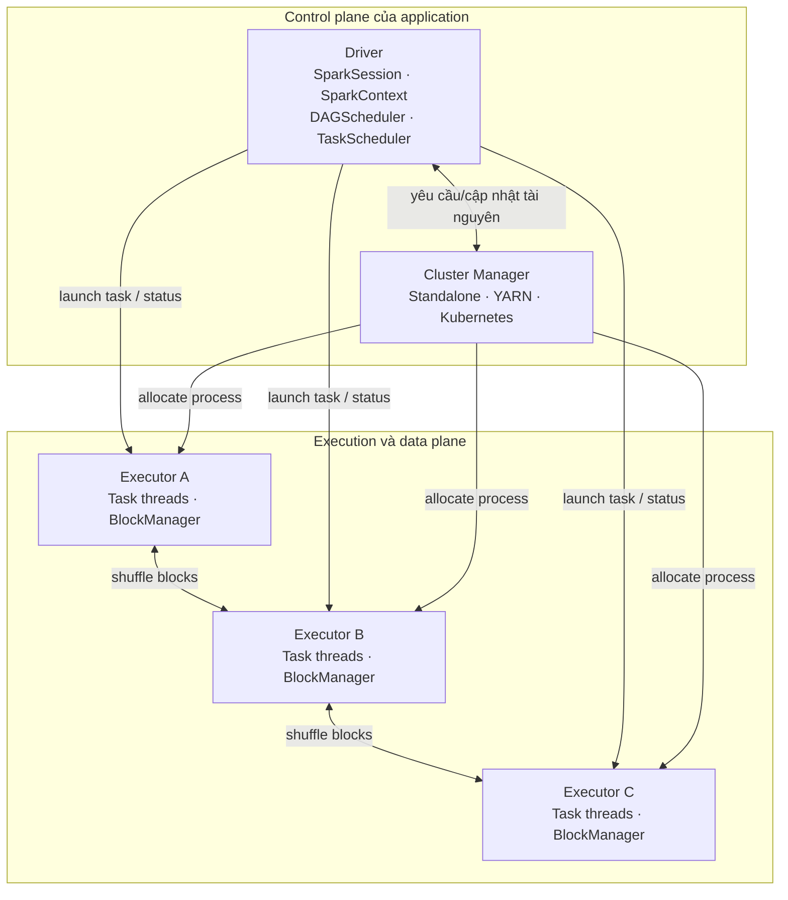
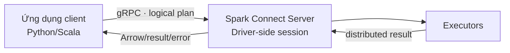

<header class="airflow-article-hero spark-article-hero">
  

    

      <a href="../overview/">SPARK HANDBOOK</a>
      CHAPTER 02 / ARCHITECTURE
    

    <h1>Kiến trúc <em>Apache Spark</em></h1>
    
Control plane, data plane và ranh giới lỗi từ Driver đến Executor trong Spark Classic và Spark Connect.

    

      SYSTEM INTERNALS12 PHÚT ĐỌCSPARK 4.2.0
    

  

</header>

> **Phạm vi:** Apache Spark 4.2.0. Phần tiến trình và cấp tài nguyên bên dưới mô tả **Spark Classic**. Với Spark Connect, client nói chuyện với một Spark Connect server qua giao thức riêng; `SparkContext` không nằm trong client như Classic.

Một Spark application không phải một process “phình to” trên nhiều máy. Nó là một tập process có vai trò và vòng đời khác nhau: Driver giữ quyền điều phối, Cluster Manager cấp tài nguyên, Executor thực thi Task và giữ dữ liệu trung gian của riêng application.

## 1. Hai lớp cần tách biệt

Cluster Manager quyết định **process được chạy ở đâu và có bao nhiêu tài nguyên**. Driver quyết định **Task nào chạy trên Executor nào**. Nhầm hai lớp này dẫn đến chẩn đoán sai: YARN/Kubernetes có thể báo application được cấp đủ container/pod, nhưng Spark vẫn chậm vì plan, số partition hoặc skew.

## 2. Driver internals

### SparkSession và SparkContext

`SparkSession` là entry point thống nhất cho DataFrame, SQL, catalog và configuration theo session. Trong Classic, nó dựa trên `SparkContext`, đối tượng đại diện cho kết nối của application tới cluster và là entry point của Spark Core/RDD.

Không nên tạo nhiều `SparkContext` trong cùng JVM. Session mới có thể chia sẻ context nhưng mang SQL configuration/catalog state khác tùy cách tạo.

### DAGScheduler

DAGScheduler chuyển một Job thành DAG các Stage. Nó theo dõi dependency, xác định shuffle boundary, tạo `ShuffleMapStage`/`ResultStage`, và yêu cầu chạy lại Stage hoặc partition cần thiết khi output bị mất.

### TaskScheduler và SchedulerBackend

TaskScheduler nhận các TaskSet của từng Stage, áp dụng locality/fairness/FIFO và retry task. SchedulerBackend giao tiếp với Executor/cluster-specific backend để nhận resource offer và launch task. Đây là lý do Stage graph và placement của Task là trách nhiệm Spark, không phải trực tiếp của Kubernetes/YARN scheduler.

### Metadata đặt áp lực lên Driver

Driver giữ logical/physical plan, trạng thái Job/Stage/Task, broadcast metadata và kết quả nhỏ trả về. Hàng triệu Task, plan sinh tự động quá lớn, `collect()` hoặc broadcast object khổng lồ đều có thể làm Driver thiếu heap dù Executor còn dư memory.

## 3. Executor và BlockManager

Executor là JVM process dành riêng cho một application. Mỗi Executor:

- chạy nhiều Task đồng thời, thường theo số executor cores;
- quản lý execution/storage memory;
- giữ cached partitions và broadcast blocks;
- ghi/đọc shuffle blocks trên local disk và qua network;
- heartbeat và gửi Task metrics/status về Driver.

`BlockManager` quản lý block ở memory/disk và truyền block giữa các node. Cache và shuffle đều dùng local resource, nhưng có vòng đời/phục hồi khác nhau: cached partition có thể recompute từ lineage; shuffle output mất có thể buộc map stage chạy lại.

Executor không được chia sẻ giữa applications. Hai application muốn dùng chung một dataset phải ghi/đọc qua storage bên ngoài; cache của application A không trở thành cache của application B.

## 4. Vòng đời một application Classic

1. `spark-submit` chuẩn bị classpath, Spark configuration và application arguments.
2. Driver chạy ở client hoặc được cluster manager khởi tạo trong cluster.
3. Driver tạo `SparkContext`, đăng ký với cluster manager và yêu cầu Executor.
4. Executor khởi động, đăng ký ngược với Driver và sẵn sàng nhận Task.
5. Action tạo Job; Driver lập Stage và Task rồi gửi closure/code tới Executor.
6. Executor đọc partition, chạy operator, tạo cache/shuffle/output và báo metrics.
7. Khi application kết thúc, Executor bị thu hồi; local cache và local state không còn là durable data.

Với Python, Executor JVM còn khởi tạo Python worker cho Python UDF/RDD function. Dữ liệu phải đi qua ranh giới JVM–Python; Arrow có thể vector hóa một số đường truyền nhưng không xóa hoàn toàn chi phí serialization và process boundary.

## 5. Spark Connect thay đổi ranh giới nào?

Spark Connect tách client application khỏi Spark Driver bằng giao thức client–server. Client xây unresolved logical plan và gửi plan tới server; server phân tích và thực thi trên Spark cluster.

Hệ quả quan trọng:

- client không truy cập trực tiếp `SparkContext` hay RDD internals như Classic;
- dependency của client được tách khỏi dependency server tốt hơn;
- server có thể phục vụ nhiều session, vì vậy isolation, authentication và quota phải được thiết kế ở ranh giới server;
- lỗi client network không nhất thiết giống lỗi Driver, nhưng session/query lifecycle phải được quản lý rõ.

Khi đọc một tài liệu nói “Driver chạy hàm `main` của bạn”, cần kiểm tra tài liệu đó đang nói về Classic hay Connect.

## 6. Failure domain

| Thành phần mất | Tác động trực tiếp | Cơ chế/điều kiện phục hồi |
| --- | --- | --- |
| Một Task | Partition đó chưa hoàn thành | TaskScheduler retry đến giới hạn cấu hình |
| Executor | Task đang chạy, cache và local shuffle blocks có thể mất | Thay Executor; recompute Task/Stage cần thiết |
| Worker/node | Mọi Executor/pod trên node mất | Cluster manager cấp lại ở node khác nếu còn capacity |
| Driver | Control state của application mất | Thường application thất bại; recovery tùy cluster mode/supervision và workload |
| Cluster manager | Không cấp/thu hồi được resource mới | Task đang chạy có thể tiếp tục một thời gian; hành vi phụ thuộc nền tảng |
| External storage | Input/output không khả dụng | Spark retry hữu hạn; phải xử lý consistency/idempotency ở hệ thống ngoài |

Spark fault tolerance bảo vệ computation tốt hơn side effect. Một Task ghi API bên ngoài rồi mất acknowledgement có thể được retry và ghi hai lần. Output committer, transactional table format hoặc idempotency key là phần của thiết kế end-to-end.

## 7. Network và security boundary

Driver phải được Executor truy cập; Executor trao đổi shuffle data với nhau; UI/event log có thể chứa SQL text, path hoặc metadata nhạy cảm. Production topology cần xem xét:

- DNS/routing và port reachability giữa Driver–Executor;
- TLS/authentication theo cluster manager và Spark network settings;
- secret injection thay vì đặt credential trong command line/config được log;
- quyền của service account lên input, output, checkpoint và event-log location;
- network policy không chặn shuffle/block transfer;
- redaction cho configuration và environment hiển thị trong UI.

## 8. Cách đọc log theo kiến trúc

- Driver log: planning, stage submission, executor registration/loss, job-level failure.
- Executor log: Task exception, OOM, Python worker failure, fetch/write issue cục bộ.
- Cluster-manager events: pod/container pending, eviction, quota, image pull, node pressure.
- Spark event log/UI: timeline và metrics đã tổng hợp; không thay thế hoàn toàn raw log.

Nếu Executor liên tục bị “lost”, đừng chỉ tăng retry. Đối chiếu thời điểm mất Executor với GC, container exit code, node eviction và shuffle fetch failure để xác định failure domain thật.

## 9. Thực chiến: truy vết một Executor bị mất

Một application đang ở Stage 17 thì Executor 6 biến mất, sau đó nhiều Task báo fetch failure. Chuỗi triệu chứng này thường bị diễn giải thành “shuffle lỗi”, nhưng shuffle failure có thể chỉ là hậu quả. Hãy lần theo control plane và data plane theo thứ tự thời gian.

1. **Cluster manager:** lấy pod/container termination reason, node event và timestamp. `OOMKilled`, eviction, preemption và process exit tạo các nhánh điều tra khác nhau.
2. **Driver:** tìm log `ExecutorLostFailure`, executor removal reason, Stage retry và thời điểm Driver nhận heartbeat cuối. Driver cho biết Spark đã phản ứng thế nào, không luôn cho biết process chết vì sao.
3. **Executor:** đối chiếu GC pause, JVM/Python exception, peak heap/overhead và local disk. Nếu log kết thúc đột ngột, ưu tiên bằng chứng từ container/node thay vì suy đoán từ dòng log cuối.
4. **Shuffle consumers:** xác định fetch failure cùng trỏ tới block trên Executor 6 hay phân tán nhiều host. Một nguồn block đã mất tạo fan-out lỗi ở nhiều reduce Task.
5. **Recovery:** kiểm tra map stage có được chạy lại, output có idempotent, và application có vượt failure budget hay không.

| Quan sát | Failure domain có khả năng | Thay đổi nên thử trước |
| --- | --- | --- |
| Container vượt memory limit, heap chưa đầy | Off-heap, Python worker hoặc native overhead | Đo RSS theo process; sizing overhead/giảm concurrency |
| Full GC kéo dài rồi heartbeat timeout | JVM heap/object pressure | Sửa representation, partition hoặc cache trước khi tăng heap |
| Node bị thu hồi, nhiều Executor mất cùng lúc | Infrastructure/preemption | Decommission, disruption policy và capacity headroom |
| Local disk đầy trước fetch failure | Shuffle spill/storage | Giảm shuffle bytes, tăng/giám sát ephemeral disk |
| Chỉ Driver mất, Executor bị thu hồi sau đó | Control plane | Driver sizing, deploy mode, supervision và HA boundary |

Kết thúc incident bằng timeline nối bốn nguồn: cluster event, Driver log, Executor log và Spark UI/event log. Nếu chỉ tăng `spark.task.maxFailures`, hệ thống có thể chạy lâu hơn nhưng không thay đổi failure domain. Retry là cơ chế phục hồi hữu hạn, không phải cách che một lỗi lặp lại có tính hệ thống.

## Kết luận

Mental model đúng là: Cluster Manager cấp process; Driver biến plan thành công việc và điều phối; Executor thực thi và giữ dữ liệu tạm. Spark Connect thêm một ranh giới client–server phía trước Driver, chứ không loại bỏ kiến trúc thực thi phân tán phía sau.

**Đọc tiếp:** [Execution model](execution-model.md) · [Deployment](deployment.md) · [Memory và Fault Tolerance](memory-fault-tolerance.md)

## Tài liệu chính thức

- [Cluster Mode Overview 4.2.0](https://spark.apache.org/docs/4.2.0/cluster-overview.html)
- [Spark Connect Overview](https://spark.apache.org/spark-connect/)
- [SparkSession API](https://spark.apache.org/docs/4.2.0/api/java/org/apache/spark/sql/SparkSession.html)
