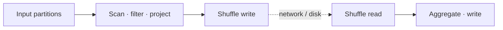

# Spark Execution Model

> **Phạm vi:** Apache Spark 4.2.0, chủ yếu ở execution model của Spark Classic. SQL/DataFrame bổ sung query planning nhưng cuối cùng vẫn phát sinh Stage và Task trên engine lõi.

Một dòng code không ánh xạ trực tiếp thành một Task. Spark tích lũy transformation thành plan/dependency graph; action mới yêu cầu materialize kết quả. Driver sau đó chia computation theo shuffle boundary và partition.

## 1. Chuỗi đơn vị thực thi

```text
Application
  └── Action / query execution
      └── Job
          ├── ShuffleMapStage
          │   └── Task × số partition đầu ra của stage
          └── ResultStage
              └── Task × số partition cần tạo kết quả
```

- **Application**: vòng đời Driver và tập Executor.
- **Job**: computation được tạo để đáp ứng một action hoặc nhu cầu materialize nội bộ.
- **Stage**: tập Task cùng computation, không cần vượt shuffle boundary bên trong.
- **Task**: đơn vị được serialize và gửi tới một Executor.
- **Task attempt**: một lần thử chạy Task; retry/speculation có thể tạo nhiều attempt cho cùng partition.

“Một action bằng một Job” chỉ là heuristic. SQL execution có thể tạo Job bổ sung để materialize broadcast, lấy statistics hoặc thực hiện subquery. UI của lần chạy cụ thể là nguồn xác nhận.

## 2. Narrow và wide dependency

Với narrow dependency, mỗi child partition đọc một số nhỏ parent partition đã biết. `map`, `filter`, projection thường có thể pipeline trong một Stage.

Với wide dependency, record từ nhiều parent partition phải được phân phối theo partitioner mới. `groupBy`, `distinct`, repartition và nhiều join tạo shuffle; DAGScheduler đặt stage boundary tại đó.



Stage boundary không nhất thiết tương ứng một dòng code. Nhiều expressions có thể được whole-stage code generation gộp vào một pipeline vật lý; một operator có `Exchange` lại cắt plan thành nhiều stage.

## 3. Theo dõi một action

```python
paid = orders.filter("status = 'PAID'")
daily = paid.groupBy("order_date").sum("amount")
daily.write.mode("overwrite").parquet(output_path)
```

1. `filter` và `groupBy` chỉ xây logical plan.
2. `write` kích hoạt query execution.
3. File scan tạo input partitions; filter chạy cùng pipeline nếu plan cho phép.
4. Partial aggregate giảm dữ liệu phía map trước shuffle.
5. Shuffle writer phân record theo hash của `order_date`.
6. Reduce-side Task fetch blocks từ các map output, merge/aggregate rồi ghi file.
7. Job chỉ thành công khi commit protocol của output xác nhận kết quả.

Nếu một reduce Task fail, Spark có thể retry đúng partition đó. Nếu map output cần thiết đã mất cùng Executor, map stage liên quan có thể phải recompute.

## 4. Task scheduling và locality

TaskScheduler nhận resource offers từ Executor và cố đặt Task gần dữ liệu khi data source/local block hỗ trợ. Các mức locality có thể đi từ process-local/node-local tới any. Trên object storage, “data locality” kiểu HDFS thường không tồn tại; network throughput và request pattern quan trọng hơn vị trí node.

Số Task chạy đồng thời bị chặn bởi:

- tổng executor cores/task CPUs;
- số partition sẵn sàng của Stage;
- resource profile như GPU/custom resource;
- Executor còn sống và slot khả dụng;
- scheduling pool/FIFO/fair scheduling;
- upstream stage hoặc barrier constraint.

Vì vậy 1.000 partitions trên cluster 100 cores tạo nhiều wave; 20 partitions trên cluster 100 cores chỉ dùng tối đa khoảng 20 Task đồng thời cho Stage đó.

## 5. Retry, speculation và tính đúng

Task failure thường được retry đến `spark.task.maxFailures` (cần đọc đúng semantics của cấu hình theo version). Retry bảo vệ computation thuần, nhưng có ba rủi ro:

1. **Non-determinism:** function phụ thuộc random/time/external mutable state có thể cho kết quả khác khi recompute.
2. **Side effect:** Task gọi API/ghi hệ thống ngoài có thể thực thi nhiều lần.
3. **Bad record cố định:** retry không chữa được record luôn làm code crash; chỉ lặp lại chi phí.

Speculative execution có thể chạy bản sao của Task chậm trên Executor khác và lấy attempt hoàn thành trước. Nó hữu ích cho straggler do node chậm, nhưng không chữa key skew: cả hai attempt vẫn nhận partition lớn như nhau. Nó cũng làm yêu cầu idempotency nghiêm ngặt hơn.

## 6. Closure và serialization

Code trong Task được đóng gói thành closure. Vô tình capture một object lớn hoặc non-serializable có thể làm Task binary phình to hay fail trước execution.

```python
# Rủi ro: closure có thể giữ cả service object lớn.
result = rdd.map(lambda row: service.transform(row))

# Tốt hơn: chỉ truyền cấu hình nhỏ; khởi tạo resource theo partition nếu hợp lệ.
config = small_serializable_config
result = rdd.mapPartitions(lambda rows: transform_partition(rows, config))
```

Resource mở trong `mapPartitions` phải được đóng, chịu retry và không được giả định một partition chỉ chạy đúng một lần. Dữ liệu tra cứu read-only nhỏ nên cân nhắc broadcast thay vì capture/copy theo Task.

## 7. Barrier và scheduling đặc biệt

Một số distributed algorithm cần tất cả Task trong Stage khởi động cùng nhau. Barrier execution mode thay đổi scheduling constraint và failure semantics: thiếu đủ slot có thể khiến Stage không khởi động; một Task fail có thể làm cả barrier stage retry. Đây không phải mode mặc định cho ETL.

## 8. Đọc execution từ UI

Khi một Job chậm:

1. Timeline cho biết chờ scheduling hay chạy thực tế.
2. Stage DAG cho biết shuffle boundary.
3. Task table phân biệt median và max duration/input/shuffle/spill.
4. Attempts và failure reason cho biết retry hay speculation.
5. SQL tab nối Stage ID về physical operator.

Một Task chậm duy nhất thường là skew/straggler; mọi Task cùng chậm có thể là I/O, CPU hoặc operator nặng; nhiều wave với Task cực ngắn là over-partitioning/small files.

## Kết luận

Spark execution là quá trình biến dependency graph thành Stage và Task, rồi chạy Task attempts trên tài nguyên hữu hạn. Tính đúng của business output không chỉ nằm ở retry của Spark mà còn ở determinism, commit protocol và idempotency của mọi hệ thống bên ngoài.

**Đọc tiếp:** [Query planning](query-planning.md) · [Partitioning và Shuffle](partition-shuffle.md) · [Đọc Spark UI](performance.md)

## Tài liệu chính thức

- [Cluster Mode Overview and Glossary](https://spark.apache.org/docs/4.2.0/cluster-overview.html)
- [RDD Programming Guide](https://spark.apache.org/docs/4.2.0/rdd-programming-guide.html)
- [Scheduling Within an Application](https://spark.apache.org/docs/4.2.0/job-scheduling.html)
