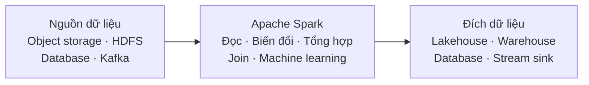
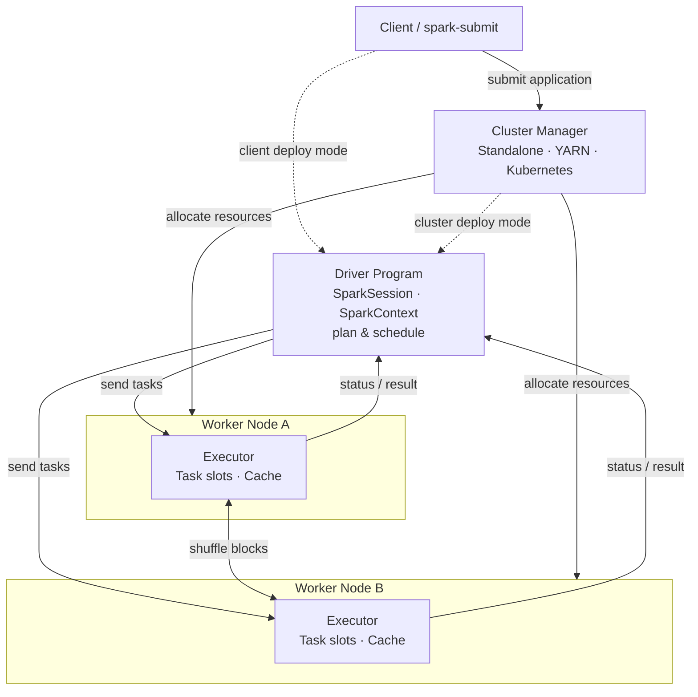
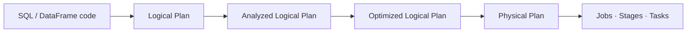
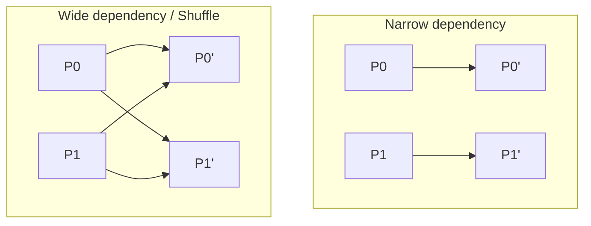
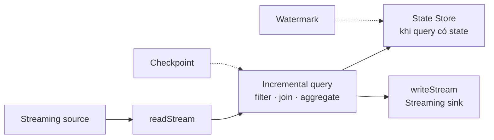
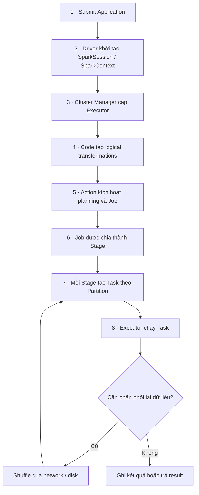

<header class="airflow-article-hero spark-article-hero">
  <div class="airflow-article-hero__eyebrow">
    <a href="../../">BEHIND THE PIPELINE</a>
    <span>ARTICLE / 005</span>
  </div>
  <h1>Apache Spark<br><em>toàn cảnh</em></h1>
  <p class="airflow-article-hero__dek">
    Từ một chương trình xử lý dữ liệu đến Application, Driver, Executor,
    Job, Stage, Task và những lần dữ liệu phải đi qua mạng.
  </p>
  <div class="airflow-article-hero__meta" aria-label="Thông tin bài viết">
    <span>DISTRIBUTED PROCESSING</span>
    <span>OVERVIEW</span>
    <span>EDITION 05 · 2026</span>
  </div>
</header>

Apache Spark thường được giới thiệu bằng những cụm từ như “xử lý dữ liệu lớn”, “in-memory” hoặc “nhanh hơn MapReduce”. Những mô tả này không sai, nhưng chưa đủ để hình dung hệ thống vận hành ra sao. Điều quan trọng hơn là Spark cung cấp một **execution engine phân tán**: người dùng mô tả phép biến đổi dữ liệu, còn Spark lập kế hoạch, chia công việc và điều phối các tiến trình trên cluster để thực hiện kế hoạch đó.

Bài viết này là bản đồ của series Spark. Mục tiêu không phải giải thích mọi chi tiết nội bộ, mà xây dựng một mental model thống nhất để người đọc có thể:

- đặt đúng vị trí của Spark trong một data platform;
- phân biệt Driver, Cluster Manager, Worker Node và Executor;
- nối được chuỗi `Application → Job → Stage → Task → Partition`;
- hiểu vì sao lazy evaluation, shuffle, memory và data skew tác động đến hiệu năng;
- biết nên quan sát phần nào của Spark UI khi một application chạy chậm;
- đi tiếp đến đúng bài chuyên sâu khi cần triển khai hoặc tối ưu.

Nội dung được chốt theo **Apache Spark 4.2.0**. Thuật ngữ trong bài bám theo [glossary và Cluster Mode Overview](https://spark.apache.org/docs/4.2.0/cluster-overview.html). Tên tiếng Anh được giữ lại ở những vị trí cần đối chiếu với Spark UI, log và tài liệu chính thức. Phần kiến trúc Driver–`SparkContext` mô tả **Spark Classic**; [Spark Connect](architecture.md) đặt thêm ranh giới client–server và không cung cấp `SparkContext` trực tiếp ở client.

---

## 1. Vị trí của Spark trong data platform

Spark là một **distributed processing engine**. Nó nhận một chương trình xử lý, đọc dữ liệu từ nguồn bên ngoài, thực thi computation song song trên nhiều tài nguyên và ghi kết quả trở lại hệ thống lưu trữ hoặc dịch vụ đích.

Spark **không phải database**: nó không cung cấp đầy đủ transaction processing, index và cơ chế phục vụ truy vấn point lookup như một OLTP database. Spark cũng **không phải storage system**: dữ liệu bền vững thường nằm trong object storage, distributed file system, table format, data warehouse, database hoặc message broker. Executor có thể giữ partition trong memory hoặc local disk, nhưng vòng đời của vùng dữ liệu này gắn với application và không thay thế durable storage.



Spark phù hợp khi một workload có một hoặc nhiều đặc điểm sau:

- lượng dữ liệu hoặc working set vượt quá khả năng xử lý hợp lý của một máy;
- computation có thể chia thành nhiều partition và chạy song song;
- pipeline cần scan, filter, join hoặc aggregate trên lượng dữ liệu lớn;
- cùng một nền tảng cần phục vụ batch, SQL, streaming hoặc machine learning;
- thời gian chạy theo giây hoặc phút chấp nhận được để đổi lấy throughput lớn.

Ngược lại, Spark thường không phải lựa chọn đầu tiên cho dữ liệu nhỏ, OLTP, request/response cần độ trễ vài mili giây hoặc pipeline đơn giản mà một process trên một máy đã hoàn thành nhanh và ổn định. Distributed computing luôn mang thêm chi phí khởi tạo process, scheduling, serialization, network và vận hành cluster.

> **Mental model:** Storage giữ dữ liệu; Spark tổ chức computation trên dữ liệu đó.

[Đọc sâu: Phạm vi sử dụng và trade-off của Spark](when-to-use.md)

---

## 2. Một engine, nhiều loại workload

Spark cung cấp nhiều thư viện trên cùng nền tảng thực thi. Điều này không có nghĩa mọi workload đều giống nhau, nhưng chúng chia sẻ cách quản lý tài nguyên, lập lịch và quan sát ở tầng lõi.

| Thành phần | Vai trò | Ghi chú |
| --- | --- | --- |
| **Spark Core** | Nền tảng thực thi phân tán, scheduling, memory management, fault recovery và RDD API | Các module cấp cao chạy trên phần lõi này |
| **Spark SQL** | Xử lý structured data bằng SQL, DataFrame và Dataset | Cung cấp query optimizer và physical execution plan |
| **Structured Streaming** | Xử lý stream bằng DataFrame/Dataset API | Chạy computation tăng dần trên dữ liệu liên tục; mặc định thường theo micro-batch |
| **MLlib** | Thuật toán và pipeline machine learning phân tán | API dựa trên DataFrame là hướng sử dụng chính |
| **GraphX** | Xử lý graph và graph-parallel computation | API dành cho Scala |

[Tài liệu Spark SQL](https://spark.apache.org/docs/latest/sql-programming-guide) mô tả SQL, DataFrame và Dataset cùng sử dụng một execution engine, dù computation được biểu đạt bằng API hoặc ngôn ngữ khác nhau. Đây là lý do một pipeline có thể kết hợp SQL với DataFrame transformations mà không chuyển sang một hệ thống thực thi khác.

Structured Streaming tiếp tục ý tưởng đó cho dữ liệu không hữu hạn: developer mô tả phép xử lý bằng structured APIs quen thuộc, còn engine thực thi query theo cách tăng dần và quản lý các khái niệm như checkpoint, state và watermark.

[Đọc sâu: RDD, DataFrame và Dataset](data-abstractions.md) · [Đọc sâu: Structured Streaming](structured-streaming.md)

---

## 3. Kiến trúc của một Spark Application

Theo glossary chính thức, **Application** là chương trình người dùng xây trên Spark, gồm một **driver program** và các **executor** trên cluster. Mỗi application là một tập process độc lập.



### Driver program

Driver là process chạy hàm `main()` của application và tạo `SparkContext`; trong các ứng dụng DataFrame/SQL hiện đại, điểm vào thường là `SparkSession`, bên trong kết nối với `SparkContext`. Driver xây execution plan, tạo Job, chia Job thành Stage, lập lịch Task, theo dõi trạng thái và thu thập những kết quả cần trả về application.

Driver không phải nơi mặc định để xử lý toàn bộ dữ liệu. Tuy nhiên, các thao tác như `collect()` hoặc `toPandas()` có thể đưa lượng lớn dữ liệu từ Executor về Driver và gây hết memory. Driver cũng phải duy trì kết nối với Executor trong suốt vòng đời application, vì vậy nó cần ổn định và có thể được các worker node truy cập qua mạng.

### Cluster Manager

Cluster Manager là dịch vụ cấp tài nguyên cho application. Spark hiện hỗ trợ **Standalone**, **Hadoop YARN** và **Kubernetes** trong tài liệu triển khai chính thức. Cluster Manager quyết định application được cấp CPU và memory ở đâu; nó không thay Driver lập kế hoạch cho từng Task.

### Worker Node và Executor

Worker Node là máy có thể chạy application code. Executor là **process được khởi tạo cho một application** trên worker node. Executor chạy Task, giữ dữ liệu đã cache hoặc shuffle data trong memory/local disk và báo trạng thái về Driver.

Một worker node có thể chạy nhiều Executor tùy cách cấp tài nguyên, nhưng một Executor thuộc về một application cụ thể. Các application không dùng chung Executor; muốn chia sẻ dữ liệu, chúng cần đi qua một storage system bên ngoài.

| Thành phần | Sở hữu | Trách nhiệm chính | Nếu mất thành phần |
| --- | --- | --- | --- |
| Driver | Application | Lập kế hoạch, scheduling, theo dõi và điều phối | Application thường kết thúc nếu không có cơ chế phục hồi tương ứng |
| Cluster Manager | Cluster | Cấp và thu hồi tài nguyên giữa các application | Không thể cấp tài nguyên mới; ảnh hưởng tùy nền tảng |
| Worker Node | Cluster | Cung cấp CPU, memory và local disk | Executor trên node đó bị mất |
| Executor | Application | Chạy Task và giữ dữ liệu trung gian | Task được chạy lại; cache hoặc shuffle blocks có thể phải tạo lại |

[Đọc sâu: Driver, Cluster Manager và Executor](architecture.md)

---

## 4. Abstraction dữ liệu và Partition

Spark không gửi “một DataFrame” nguyên khối đến một máy. Một distributed collection được chia thành các **Partition**. Mỗi partition là một phần dữ liệu mà một Task có thể xử lý. Đây là cầu nối quan trọng nhất giữa data layout và mức độ song song.

### RDD

**Resilient Distributed Dataset (RDD)** là collection phân tán, bất biến và có thể xử lý song song. RDD lưu quan hệ phụ thuộc giữa các partition để có thể recompute dữ liệu bị mất. API này cho developer quyền kiểm soát ở mức thấp hơn, nhưng cung cấp ít thông tin cấu trúc hơn cho optimizer.

### DataFrame và Dataset

**DataFrame** là Dataset được tổ chức thành các cột có tên, gần với một bảng quan hệ nhưng có execution engine phân tán và optimizer phía dưới. Schema cho Spark biết tên cột, kiểu dữ liệu và cấu trúc computation; nhờ đó engine có thể loại bỏ cột không cần thiết, đẩy filter xuống data source hoặc lựa chọn physical operator phù hợp.

**Dataset** kết hợp typed domain objects với optimized Spark SQL engine và chỉ có trong Scala/Java. Trong Scala, `DataFrame` là alias của `Dataset[Row]`; Python và R cung cấp DataFrame API nhưng không có typed Dataset API theo nghĩa này.

Trong phần lớn ETL/ELT và analytics workload hiện đại, DataFrame hoặc SQL là điểm bắt đầu phù hợp. RDD vẫn hữu ích khi cần transformation cấp thấp mà structured APIs không biểu đạt tốt.

### Partition quyết định parallelism

Trong một Stage, mỗi partition thường tương ứng với một Task. Nếu Stage có 200 partition, Spark tạo khoảng 200 Task cho Stage đó. Các Task không nhất thiết chạy cùng lúc: số Task chạy đồng thời còn bị giới hạn bởi tổng executor cores, resource profile và scheduling.

- **Quá ít partition:** một số core rảnh, mỗi Task phải xử lý working set lớn và dễ spill hoặc OOM.
- **Quá nhiều partition:** Task nhỏ nhưng scheduling overhead và số lượng file/shuffle block tăng.
- **Partition lệch:** phần lớn Task kết thúc sớm trong khi một vài Task lớn trở thành straggler; đây là biểu hiện điển hình của data skew.

> **Mental model:** Partition là đơn vị chia dữ liệu; Task là đơn vị computation chạy trên phần dữ liệu đó.

[Đọc sâu: RDD, DataFrame và Dataset](data-abstractions.md) · [Đọc sâu: Partitioning và Shuffle](partition-shuffle.md)

---

## 5. Từ code đến execution plan

Ví dụ PySpark sau mô tả một pipeline nhỏ:

```python
from pyspark.sql import functions as F

orders = spark.read.parquet("s3://lake/orders/")

revenue_by_country = (
    orders
    .filter(F.col("status") == "PAID")
    .groupBy("country")
    .agg(F.sum("amount").alias("revenue"))
)

revenue_by_country.write.mode("overwrite").parquet(
    "s3://lake/revenue_by_country/"
)
```

Các lời gọi `filter()` và `groupBy()` là **transformation**: chúng mô tả DataFrame mới nhưng chưa buộc Spark quét toàn bộ dữ liệu ngay. `write` là **action**, yêu cầu tạo kết quả và kích hoạt computation. Cơ chế này được gọi là **lazy evaluation**.

Đối với DataFrame/SQL, có thể hình dung pipeline lập kế hoạch như sau:



1. **Logical Plan** mô tả kết quả cần tạo mà chưa chốt cách chạy cụ thể.
2. **Analysis** phân giải table, column, function và data type dựa trên catalog/schema.
3. **Optimization** áp dụng các rule như predicate pushdown hoặc column pruning khi có thể.
4. **Physical Planning** lựa chọn physical operators, chẳng hạn broadcast hash join hoặc sort-merge join.
5. **Execution** chuyển kế hoạch thành các Job, Stage và Task chạy trên Executor.

Spark SQL có thể điều chỉnh một phần physical plan trong runtime bằng **Adaptive Query Execution (AQE)** dựa trên statistics thu được sau các shuffle stage. AQE có thể coalesce shuffle partitions nhỏ, xử lý skewed partitions hoặc đổi join strategy trong những điều kiện phù hợp.

Lazy evaluation không đồng nghĩa với “không tốn chi phí”. Nó trì hoãn execution để Spark nhìn được chuỗi transformation trước khi quyết định cách chạy. Để quan sát kế hoạch thay vì đoán, có thể dùng `DataFrame.explain()` và kiểm tra tab SQL/DataFrame trong Spark UI.

[Đọc sâu: Logical Plan, Physical Plan, Catalyst và AQE](query-planning.md)

---

## 6. Application, Job, Stage và Task

Các đơn vị trên Spark UI tạo thành một chuỗi phân cấp, nhưng mỗi đơn vị trả lời một câu hỏi khác nhau.

```text
Application
  └── Job                  được tạo để thực hiện một action
      ├── Stage            nhóm Task có thể chạy mà không cần vượt qua shuffle boundary
      │   ├── Task         xử lý Partition 0
      │   ├── Task         xử lý Partition 1
      │   └── ...
      └── Stage
          └── Task × số Partition của Stage
```

| Đơn vị | Ý nghĩa thực tế |
| --- | --- |
| **Application** | Chương trình người dùng gồm Driver và các Executor |
| **Job** | Parallel computation được tạo để đáp ứng một action như `save` hoặc `collect` |
| **Stage** | Một tập Task trong Job có thể chạy cùng kiểu computation trước hoặc sau một dependency cần shuffle |
| **Task** | Đơn vị công việc được Driver gửi đến một Executor |
| **Partition** | Phần dữ liệu mà một Task xử lý trong Stage |

Một application có thể chạy nhiều action và tạo nhiều Job. Một action SQL/DataFrame cũng có thể dẫn đến nhiều Job nội bộ, chẳng hạn khi Spark cần materialize broadcast input hoặc thực thi các phần khác nhau của query plan. Vì vậy, không nên dùng công thức cứng “một action luôn bằng đúng một Job”; Spark UI là nguồn xác nhận cho lần chạy cụ thể.

Stage thường được ngăn cách bởi **shuffle boundary**. Trước boundary, các Task tạo shuffle output theo target partition. Sau boundary, các Task khác fetch những block liên quan để tiếp tục computation.

[Đọc sâu: Execution model — Job, Stage và Task](execution-model.md)

---

## 7. Dependency và Shuffle

Ở mức khái niệm, dependency giữa các partition có thể chia thành hai nhóm:

- **Narrow dependency:** mỗi partition đầu ra chỉ phụ thuộc vào một số nhỏ partition đầu vào; `map` và `filter` thường thuộc nhóm này. Nhiều transformation dạng narrow có thể pipeline trong cùng một Stage.
- **Wide dependency:** dữ liệu của nhiều partition đầu vào phải được phân phối lại để tạo partition đầu ra; `groupBy`, `join`, `distinct` và `repartition` thường dẫn đến shuffle.



Shuffle đắt vì dữ liệu cần được phân loại theo partition đích, serialize, ghi thành block trung gian, truyền qua network và đọc lại ở phía nhận. Nếu working set không vừa memory, Spark spill dữ liệu xuống disk. Shuffle còn tạo điểm đồng bộ: Stage sau không thể hoàn thành nếu block cần thiết từ Stage trước chưa sẵn sàng.

Không phải mọi shuffle đều xấu. Aggregate theo key và distributed join vốn cần đưa các record liên quan về cùng partition. Mục tiêu tối ưu là loại bỏ shuffle không cần thiết, giảm lượng dữ liệu trước shuffle và phân phối dữ liệu đủ đều — không phải cố xóa mọi `Exchange` khỏi plan.

[RDD Programming Guide](https://spark.apache.org/docs/latest/rdd-programming-guide) của Spark liệt kê repartition operations, `groupByKey`, `reduceByKey`, `cogroup` và `join` trong các operation có thể tạo shuffle; tài liệu cũng nhấn mạnh ba nhóm chi phí chính là disk I/O, serialization và network I/O.

[Đọc sâu: Partitioning, Dependency và Shuffle](partition-shuffle.md)

---

## 8. Memory, Cache và Fault Tolerance

Spark có thể giữ dữ liệu trong memory, nhưng “Spark là in-memory engine” dễ dẫn đến ba hiểu lầm: toàn bộ input phải nằm trong RAM, Spark tự cache mọi thứ, hoặc thiếu RAM đồng nghĩa application không thể chạy. Trên thực tế, Spark đọc dữ liệu theo partition, sử dụng memory cho computation và có thể spill xuống local disk khi cần.

### Execution memory và storage memory

Tài liệu tuning của Spark chia phần memory được quản lý chủ yếu thành:

- **Execution memory:** phục vụ shuffle, join, sort và aggregation.
- **Storage memory:** phục vụ cache/persist và dữ liệu nội bộ được truyền trong cluster.

Hai phần dùng chung một vùng thống nhất. Khi execution cần thêm không gian, cached blocks có thể bị evict trong giới hạn của memory manager. Vì vậy cache không phải lời hứa rằng toàn bộ dữ liệu luôn ở RAM.

### Cache chỉ có ích khi có reuse

`cache()` hoặc `persist()` đánh dấu dataset để các partition đã tính có thể được tái sử dụng ở action sau. Cache thường hữu ích cho iterative algorithm, interactive analysis hoặc một nhánh dữ liệu đắt được dùng nhiều lần. Nếu dataset chỉ được đọc một lần, chi phí materialize, lưu và evict cache có thể khiến pipeline chậm hơn.

### Lineage và recomputation

RDD giữ lineage — chuỗi transformation dùng để tạo các partition. Nếu một partition bị mất, Spark có thể chạy lại các transformation cần thiết thay vì khôi phục toàn bộ dataset từ bản sao. Task failure thường được retry; khi Executor mất, Task đang chạy, cached partitions và một số shuffle output trên Executor đó cũng có thể mất và phải tạo lại.

Fault tolerance không miễn phí. Lineage quá dài, shuffle data bị mất hoặc external side effect không idempotent đều khiến recovery phức tạp hơn. Với lineage cần cắt ngắn hoặc state dài hạn, checkpoint là một cơ chế khác cần được cân nhắc.

[Đọc sâu: Memory Management, Cache, Spill và Fault Tolerance](memory-fault-tolerance.md)

---

## 9. Deployment và cấp tài nguyên

Application được gửi bằng `spark-submit`. Hai lựa chọn cần tách biệt là **cluster manager** và **deploy mode**.

### Cluster manager

- **Standalone:** cluster manager đi kèm Spark, đơn giản cho một Spark cluster chuyên dụng.
- **YARN:** cấp tài nguyên Spark bên cạnh các workload trong hệ sinh thái Hadoop.
- **Kubernetes:** chạy Driver và Executor trong pod, tận dụng scheduling và isolation của Kubernetes.

### Deploy mode

| Deploy mode | Driver chạy ở đâu | Đặc điểm chính |
| --- | --- | --- |
| **Client mode** | Trong process gửi application, bên ngoài cluster | Thuận tiện cho interactive session; client phải duy trì kết nối và ở gần worker về network |
| **Cluster mode** | Bên trong cluster, do framework khởi tạo | Phù hợp cho production job vì Driver không phụ thuộc vào máy submit sau khi application đã được gửi |

Executor resources xác định lượng CPU và memory application có thể dùng, nhưng “thêm Executor” không đảm bảo chạy nhanh hơn. Parallelism có thể bị giới hạn bởi số partition, data source, shuffle, skew hoặc throughput của storage. Dynamic allocation có thể thay đổi số Executor theo backlog, nhưng cần được đánh giá cùng startup latency, cache và shuffle tracking của môi trường triển khai.

[Đọc sâu: Deploy mode, Cluster Manager và Resource Allocation](deployment.md)

---

## 10. Structured Streaming trong cùng mental model

Structured Streaming là stream processing engine có khả năng mở rộng và chịu lỗi, được xây trên Spark SQL engine. Developer định nghĩa computation trên streaming DataFrame/Dataset gần giống cách định nghĩa batch query; Spark chạy query tăng dần khi dữ liệu mới đến.



Các khái niệm bổ sung quan trọng gồm:

- **trigger:** thời điểm engine xử lý dữ liệu mới;
- **checkpoint:** metadata phục hồi và tiến độ của query;
- **state store:** trạng thái trung gian của aggregation, deduplication hoặc stream-stream join;
- **event time và watermark:** cách giới hạn thời gian chờ late data và kích thước state;
- **output mode và sink semantics:** quyết định record nào được ghi và mức bảo đảm end-to-end.

Streaming không biến một batch job thành real-time chỉ bằng cách đổi `read` thành `readStream`. State growth, late data, source/sink guarantees, checkpoint location và recovery cần được thiết kế rõ ràng.

[Đọc sâu: Kiến trúc Structured Streaming](structured-streaming.md)

---

## 11. Quan sát và chẩn đoán hiệu năng

Mỗi Driver cung cấp một Web UI, mặc định thường ở cổng `4040` khi application đang chạy. Spark History Server có thể hiển thị lại event log sau khi application kết thúc. Các tab Jobs, Stages, SQL/DataFrame, Storage và Executors là điểm bắt đầu để kiểm chứng execution plan và tìm bottleneck.

| Triệu chứng | Dấu hiệu cần tìm | Hướng điều tra đầu tiên |
| --- | --- | --- |
| Stage chỉ còn một vài Task chạy rất lâu | Task duration hoặc shuffle read size lệch xa median | Data skew, key nóng, partition quá lớn |
| Executor thường xuyên mất hoặc OOM | Executor lost, peak memory cao, GC time lớn | Working set mỗi Task, join strategy, cache và memory overhead |
| Nhiều Task rất ngắn | Hàng chục nghìn Task, scheduling delay đáng kể | Quá nhiều partition hoặc small files |
| Shuffle read/write rất lớn | `Exchange` trong plan, network và disk I/O cao | Filter sớm hơn, pre-aggregation, partitioning, join strategy |
| Driver OOM | Result size lớn, `collect()`/`toPandas()` | Giữ xử lý phân tán, giới hạn result, ghi ra storage |
| Thêm Executor nhưng thời gian không giảm | Core rảnh hoặc chỉ ít Task chạy | Số partition, I/O source, skew, serial section |
| Cùng query nhưng plan thay đổi | Adaptive plan hoặc runtime statistics khác | AQE, table statistics, input size và broadcast threshold |

Một quy trình chẩn đoán ngắn gọn:

1. Xác định Job và Stage chiếm thời gian.
2. Mở SQL/DataFrame plan để tìm `Exchange`, join và scan lớn.
3. So sánh Task duration, input, shuffle read/write và spill giữa các Task.
4. Kiểm tra Executor loss, GC time, memory và mức sử dụng cores.
5. Chỉ thay cấu hình sau khi đã có metric chỉ ra bottleneck.

Tuning không bắt đầu bằng việc sao chép một bộ `spark.*` configuration. Nó bắt đầu bằng execution plan và bằng chứng từ lần chạy thật.

[Đọc sâu: Đọc Spark UI và tối ưu application](performance.md)

---

## 12. Mental model tổng hợp

Toàn bộ vòng đời có thể rút gọn thành luồng sau:



Sáu ý cần giữ lại sau bài overview:

1. **Spark là processing engine**, không phải durable storage hay OLTP database.
2. **Driver điều phối, Executor thực thi, Cluster Manager cấp tài nguyên.**
3. **Partition mô tả cách dữ liệu được chia; Task là computation trên một partition.**
4. **Action kích hoạt execution; shuffle thường chia Job thành các Stage.**
5. **Memory là tài nguyên cho cả execution và storage; cache chỉ có giá trị khi dữ liệu được tái sử dụng.**
6. **Tối ưu bắt đầu từ plan và Spark UI, không bắt đầu từ việc tăng tài nguyên theo cảm tính.**

---

## Bản đồ đọc sâu

Mười chương dưới đây mở rộng mental model của bài overview thành các quyết định thiết kế, cấu hình và quy trình chẩn đoán có thể áp dụng trong production.

| Chủ đề | Trọng tâm chuyên sâu |
| --- | --- |
| [Phạm vi sử dụng và trade-off](when-to-use.md) | Decision framework theo workload, SLA, data movement và operational cost |
| [Kiến trúc Spark](architecture.md) | Classic/Connect, Driver, Cluster Manager, Executor và failure domain |
| [Data abstractions](data-abstractions.md) | RDD, DataFrame, Dataset, schema, representation và JVM–Python boundary |
| [Execution model](execution-model.md) | Action, Job, Stage, Task attempt, scheduling và retry semantics |
| [Query planning](query-planning.md) | Catalyst, statistics, join strategy, code generation và AQE |
| [Partitioning và Shuffle](partition-shuffle.md) | Input/shuffle/output partition, spill, skew và storage locality |
| [Memory và Fault Tolerance](memory-fault-tolerance.md) | Heap/overhead, unified memory, cache, lineage và checkpoint |
| [Deployment](deployment.md) | Standalone, YARN, Kubernetes, deploy mode, sizing và security |
| [Performance](performance.md) | Spark UI, Task distribution, bottleneck taxonomy và benchmark workflow |
| [Structured Streaming](structured-streaming.md) | Incremental execution, state, watermark, delivery và recovery semantics |

## Tài liệu chính thức tham khảo

- [Apache Spark 4.2.0 Documentation](https://spark.apache.org/docs/4.2.0/)
- [Cluster Mode Overview và Glossary](https://spark.apache.org/docs/4.2.0/cluster-overview.html)
- [Spark SQL, DataFrames and Datasets Guide](https://spark.apache.org/docs/4.2.0/sql-programming-guide.html)
- [RDD Programming Guide](https://spark.apache.org/docs/4.2.0/rdd-programming-guide.html)
- [Spark SQL Performance Tuning](https://spark.apache.org/docs/4.2.0/sql-performance-tuning.html)
- [Tuning Guide](https://spark.apache.org/docs/4.2.0/tuning.html)
- [Monitoring and Instrumentation](https://spark.apache.org/docs/4.2.0/monitoring.html)
- [Structured Streaming Programming Guide](https://spark.apache.org/docs/4.2.0/streaming/index.html)
