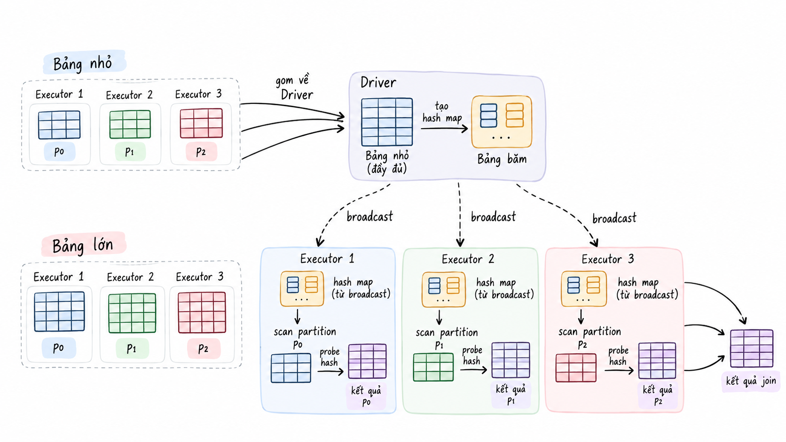
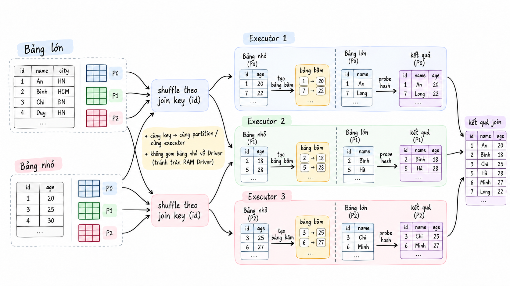
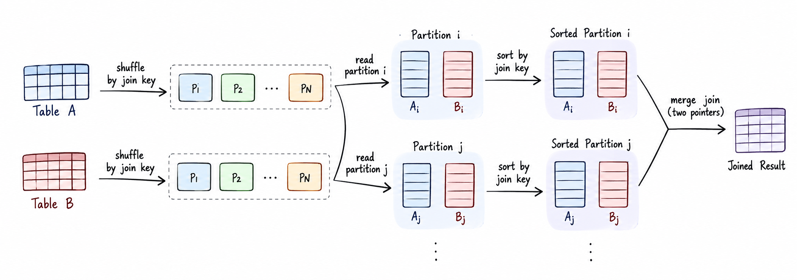
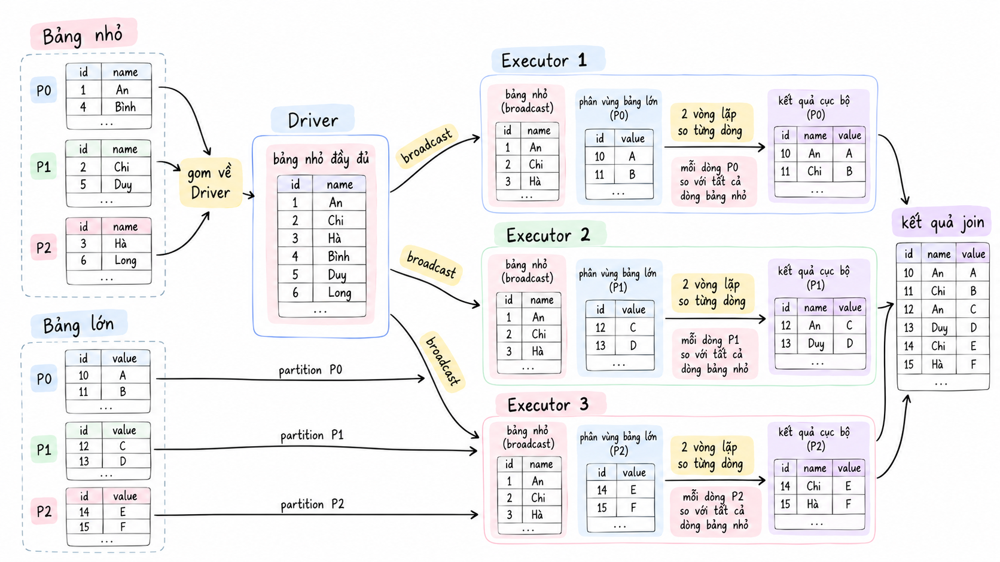
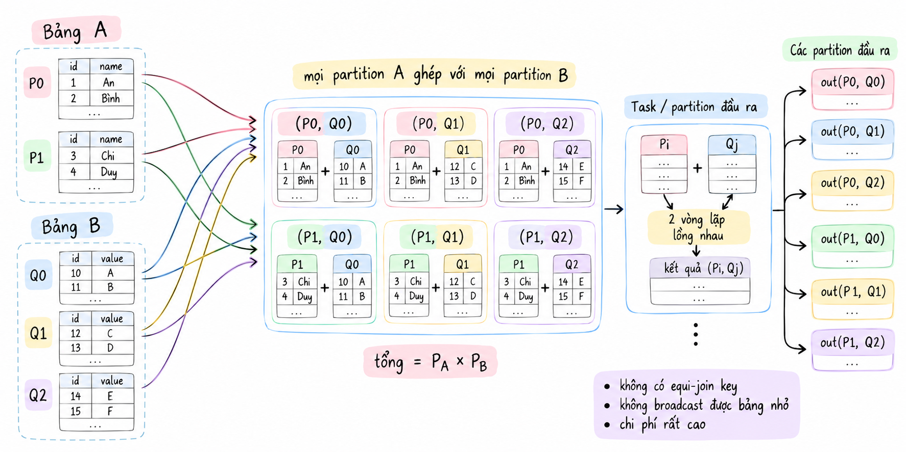
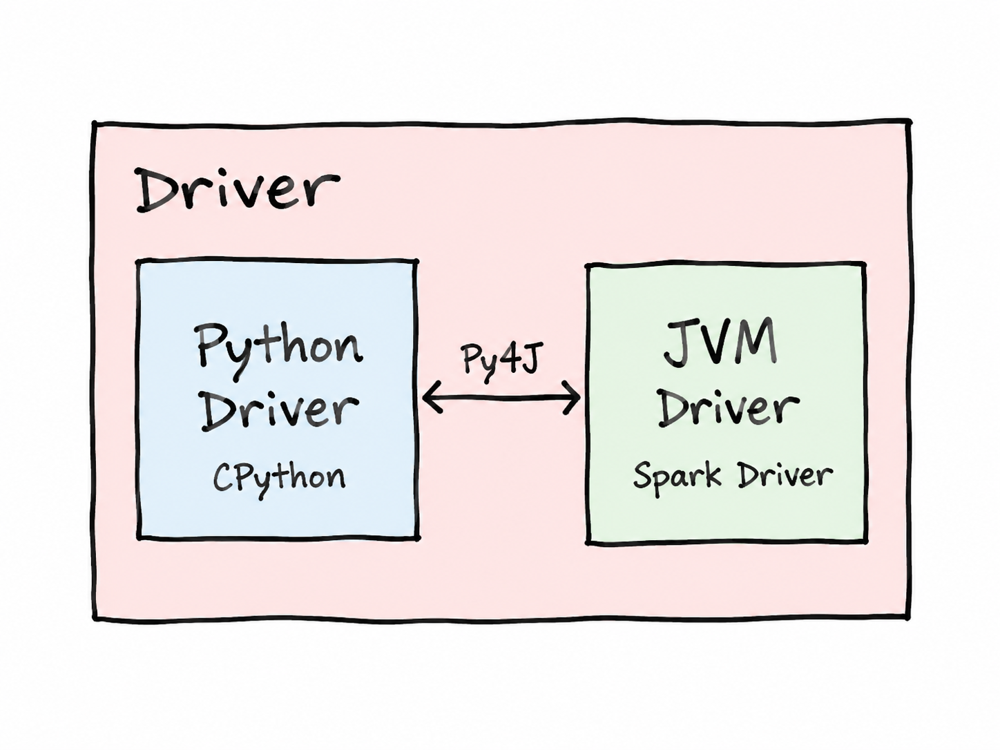
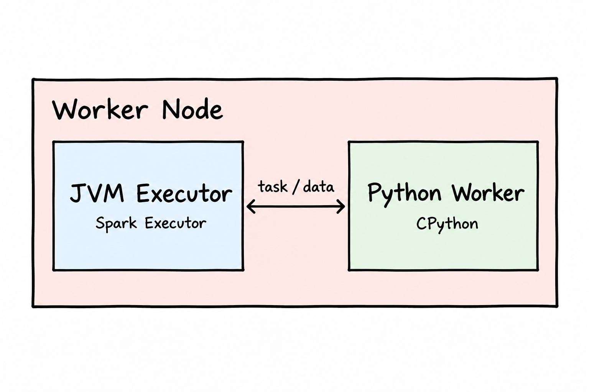
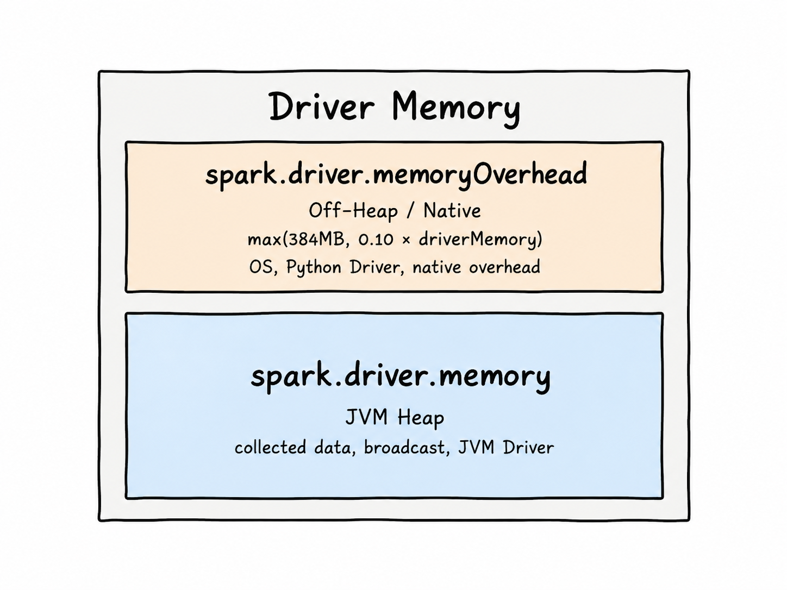
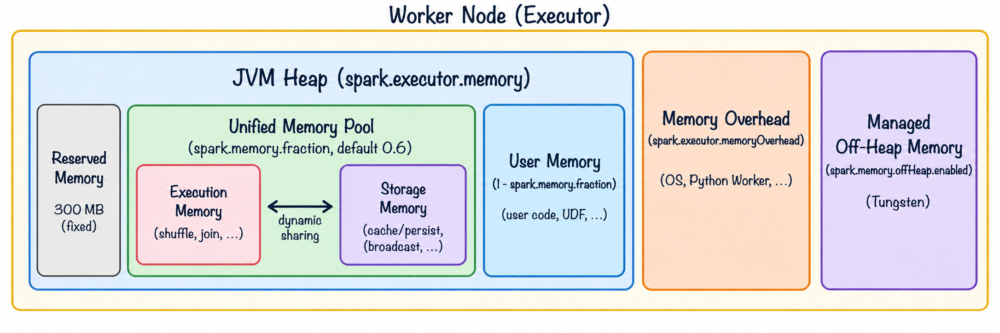

<header class="airflow-article-hero spark-article-hero">
  <div class="airflow-article-hero__eyebrow">
    <a href="../../">BEHIND THE PIPELINE</a>
    <span>ARTICLE / 006</span>
  </div>
  <h1>Kiến trúc<br><em>Apache Spark (phần 2)</em></h1>
  <p class="airflow-article-hero__dek">
    Từ các chiến lược Join và RDD đến giao tiếp trong PySpark,
    cách Driver và Executor tổ chức, sử dụng bộ nhớ.
  </p>
  <div class="airflow-article-hero__meta" aria-label="Thông tin bài viết">
    <span>DISTRIBUTED COMPUTING</span>
    <span>DEEP DIVE</span>
    <span>EDITION 06 · 2026</span>
  </div>
</header>

Trong Spark, cần phân biệt giữa **Logical Join** và **Physical Join Strategy**. Spark hỗ trợ đầy đủ các kiểu
Join logic tiêu chuẩn như SQL (`LEFT`, `RIGHT`, `INNER`…), nhưng ở tầng thực thi vật lý, **Catalyst
Optimizer** sẽ tự động lựa chọn các thuật toán phân tán phù hợp, như Broadcast Hash Join hay Sort-Merge
Join, để giảm thiểu chi phí shuffle qua mạng và tối ưu bộ nhớ. Bài viết này trình bày các thuật toán
Physical Join đó, sau đó đi vào vai trò của RDD, cơ chế giao tiếp trong PySpark và quản lý bộ nhớ
trên Driver, Executor.

## 1. Broadcast Hash Join

Dữ liệu ban đầu nằm rải rác trong các partition trên các Executor. Khi thực hiện **Broadcast Hash Join**,
Spark tập hợp các partition của bảng nhỏ về Driver thành một bảng hoàn chỉnh. Driver sau đó chuyển bảng dữ
liệu này thành **bảng băm (Hash Table)**.

Các Executor tải bảng băm về và lưu vào bộ nhớ đệm, sau đó khởi chạy các Task để quét từng dòng trong
partition của bảng lớn. Mỗi dòng được ghép nối bằng cách đối chiếu key của bảng lớn với key của bảng nhỏ
trong bảng băm.

- **Ưu điểm:** Loại bỏ hoàn toàn chi phí shuffle. Đây là phép Join có tốc độ thực thi nhanh nhất trong
  Spark.

- **Nhược điểm:** Dễ gây quá tải RAM của Driver và Executor nếu bảng quá lớn; chỉ áp dụng được khi Join giữa
  một bảng lớn và một bảng nhỏ.

[{ loading=lazy }](../assets/images/spark/broadcast.png){ title="Xem ảnh kích thước gốc" }

## 2. Shuffle Hash Join

Với **Shuffle Hash Join**, dữ liệu của cả hai bảng được shuffle qua mạng dựa trên giá trị hash của Join Key,
nhằm đưa các dòng có cùng key về cùng một partition trên một Executor.

Tại mỗi partition, Spark xây dựng một **Hash Table** cho phần dữ liệu của bảng nhỏ hơn, sau đó đọc từng dòng
của bảng lớn hơn và tra cứu trong Hash Table để ghép nối.

Cơ chế này gần tương tự Broadcast Hash Join, nhưng có thêm bước shuffle ở đầu và Driver không tập hợp các
partition của bảng nhỏ. Bước shuffle là cần thiết vì nếu bảng nhỏ vẫn có kích thước quá lớn, việc tập hợp
toàn bộ bảng về Driver có thể gây tràn RAM.

- **Ưu điểm:** Nhanh hơn Sort-Merge Join vì không cần sắp xếp dữ liệu.

- **Nhược điểm:** Dễ bị ảnh hưởng bởi lệch dữ liệu (**Data Skew**) và gặp lỗi **OOM (Out Of Memory)** nếu
  partition của bảng nhỏ vẫn lớn hơn RAM của Executor.

[{ loading=lazy }](../assets/images/spark/shuffle_hash.png){ title="Xem ảnh kích thước gốc" }

## 3. Sort-Merge Join (SMJ)

Với **Sort-Merge Join (SMJ)**, dữ liệu của cả hai bảng được shuffle theo Join Key để đưa các dòng có cùng
key về cùng một partition. Executor sau đó sắp xếp dữ liệu của cả hai bảng theo thứ tự Join Key.

Executor duyệt song song hai tập dữ liệu đã sắp xếp bằng hai con trỏ đọc để tìm các dòng có key khớp nhau.

- **Ưu điểm:** Xử lý được dữ liệu có kích thước rất lớn, hỗ trợ ghi xuống đĩa khi kích thước partition vượt
  quá dung lượng RAM.

- **Nhược điểm:** Phát sinh chi phí shuffle qua mạng, tiêu tốn CPU cho việc sắp xếp và nhạy cảm với hiện
  tượng Data Skew.

[{ loading=lazy .article-diagram--wide }](../assets/images/spark/sort_join.png){ title="Xem ảnh kích thước gốc" }

## 4. Broadcast Nested Loop Join (BNLJ)

Tương tự Broadcast Hash Join, Driver tập hợp dữ liệu của bảng nhỏ rồi broadcast bảng này tới các Executor.
Sau đó, **Broadcast Nested Loop Join (BNLJ)** sử dụng hai vòng lặp lồng nhau để so sánh từng dòng của bảng
lớn với từng dòng của bảng nhỏ.

BNLJ đặc biệt hữu ích khi phép Join không có **equi-join key**, chẳng hạn với các điều kiện `>`, `<`, `>=`,
`<=`, vì khi đó Spark không thể sử dụng các thuật toán Hash Join hoặc Sort-Merge Join thông thường.

Cơ chế hai vòng lặp được mô phỏng như sau:

```python
# Giả lập logic bên trong một Task của Executor
bang_nho = [dong_1, dong_2, ..., dong_k]  # Nằm trọn trong RAM của Executor

for dong_lon in partition_bang_lon:
    # Vòng lặp trong: duyệt toàn bộ bảng nhỏ
    for dong_nho in bang_nho:
        if dieu_kien_non_equi(dong_lon, dong_nho):  # Ví dụ: dong_lon.gia > dong_nho.gia_san
            xuat_ket_qua(dong_lon, dong_nho)
```

[{ loading=lazy }](../assets/images/spark/BNJT.png){ title="Xem ảnh kích thước gốc" }

## 5. Cartesian Product Join (Shuffle-and-Replicate Nested Loop Join)

**Cartesian Product Join**, còn gọi là **Shuffle-and-Replicate Nested Loop Join**, là chiến lược tốn kém
nhất trong các phép Join. Chiến lược này được sử dụng khi không có equi-join key và không thể tập hợp bảng
vào RAM.

Spark phải ghép từng partition của bảng A với từng partition của bảng B, tương tự phép tích Descartes. Giả
sử bảng A có `P_A` partition và bảng B có `P_B` partition, Spark sẽ tạo tổng cộng **`P_A × P_B` partition
đầu ra**.

Trong mỗi partition mới, Task thực hiện hai vòng lặp lồng nhau để duyệt dữ liệu, tương tự BNLJ.

[{ loading=lazy }](../assets/images/spark/last_join.png){ title="Xem ảnh kích thước gốc" }

## 6. RDD và vai trò trong thực thi Spark

### RDD là gì?

**RDD** là mô hình trừu tượng dữ liệu cốt lõi và nguyên thủy nhất của Apache Spark. Khi sử dụng DataFrame,
bên dưới vẫn là RDD. Dù chương trình được viết bằng DataFrame, Dataset hay Spark SQL, Spark không thực thi
trực tiếp DataFrame ở tầng máy tính.

- **DataFrame và SQL** là lớp trừu tượng logic (Logical Abstraction), giúp người dùng khai báo dữ liệu dưới
  dạng bảng và cột. Khi một Action được gọi, Catalyst Optimizer tối ưu logic truy vấn và chuyển thành
  Physical Plan. Kế hoạch này tiếp tục được chuyển thành chuỗi hoặc cây RDD để DAGScheduler phân chia thành
  các Stage và Task.

- **Executor** thực thi tính toán thông qua các phương thức của RDD.

### Mô hình phân tầng thực thi

```text
[Giao diện người dùng]     DataFrame API / Spark SQL / Datasets
                                         │
                                         ▼ (Catalyst Optimizer & Tungsten)
[Tầng biên dịch ngầm]      Logical Plan ──► Physical Plan
                                         │
                                         ▼ (Biên dịch thành RDD nội bộ)
[Động cơ cốt lõi]          RDD Graph (FileScanRDD, ShuffledRowRDD, Lineage)
                                         │
                                         ▼ (DAGScheduler & TaskScheduler)
[Tầng thực thi vật lý]     Stages ──► Tasks ──► CPU/RAM của Executor
```

### Khả năng chịu lỗi của RDD

Một tính năng quan trọng của RDD là **khả năng chịu lỗi**. Khi một Action được gọi, Physical Plan được
chuyển thành cây RDD. Nếu một worker node gặp lỗi, Spark có thể dựa vào cây này để phân công xử lý lại các
partition đã mất trên những worker node còn hoạt động, thay vì hủy toàn bộ Job.

## 7. Cơ chế giao tiếp nội bộ của PySpark

Apache Spark hỗ trợ nhiều ngôn ngữ lập trình như Scala, Java, Python và R. **PySpark** là Python API của
Apache Spark, cho phép người dùng viết chương trình xử lý dữ liệu bằng Python và thực thi trên Spark. Để làm
việc hiệu quả với Spark, Data Engineer cần hiểu cả cách viết mã PySpark lẫn cơ chế hoạt động phía sau, đặc
biệt là cách Python giao tiếp với Spark Engine.

Phần này trình bày cơ chế giao tiếp nội bộ của PySpark ở phía **Driver** và **worker node**, tức là cách mã
Python được truyền sang JVM để Spark xử lý.

### Vì sao PySpark cần giao tiếp với Spark Engine?

PySpark cung cấp API để người dùng xử lý dữ liệu bằng Python, trong khi phần lõi thực thi của Spark chủ yếu
chạy trên **JVM**. Vì vậy, PySpark cần cơ chế giao tiếp giữa tiến trình Python và JVM để chuyển các lệnh của
người dùng sang Spark Engine xử lý.

**JVM** là môi trường phần mềm trung gian giúp máy tính chạy các chương trình được viết bằng Java và những
ngôn ngữ liên quan, chẳng hạn Scala.

### Giao tiếp tại Driver

Cơ chế giao tiếp nội bộ tại Driver hoạt động theo mô hình **hai tiến trình**:

- **Python Driver Process (CPython):** Tiến trình Python thông thường, có thể thấy trong Task Manager hoặc
  Activity Monitor, chịu trách nhiệm thực thi mã Python của người dùng.

- **JVM Driver Process (Java/Scala Spark Driver):** Tiến trình Java chạy ngầm, được tạo khi gọi lệnh khởi
  tạo `SparkSession` trong Python.

Hai tiến trình trao đổi với nhau thông qua thư viện **Py4J**. Khi người dùng viết một câu lệnh Python, Py4J
chuyển lời gọi hàm sang JVM Driver; JVM sau đó trả thông tin về tiến trình Python.

[{ loading=lazy }](../assets/images/spark/driver.png){ title="Xem ảnh kích thước gốc" }

Khi gặp một **Action**, JVM Driver kích hoạt Job trên cụm và nhận kết quả từ các Executor. Dữ liệu kết quả
sau đó được chuyển về tiến trình Python thông qua một **local socket**.

### Giao tiếp tại worker node

Cơ chế giao tiếp nội bộ tại worker node cũng dựa trên mô hình **hai tiến trình**:

- **JVM Executor:** Trên mỗi worker node, ứng dụng Spark có một hoặc nhiều tiến trình JVM Executor. Các tiến
  trình này quản lý luồng tính toán, bộ nhớ đệm và trực tiếp thực thi mã tính toán trên dữ liệu tại worker
  node.

- **Python Worker Process (CPython):** Khi một Task chứa mã Python, chẳng hạn RDD `map`/`filter`, Python
  UDFs hoặc Pandas UDFs, JVM Executor khởi chạy các tiến trình Python Worker để thực thi mã đó.

[{ loading=lazy }](../assets/images/spark/worker.png){ title="Xem ảnh kích thước gốc" }

## 8. Bộ nhớ của Driver

### Các thành phần bộ nhớ

Bộ nhớ của Driver gồm **hai phần**:

- **JVM Heap (`spark.driver.memory`):** Dung lượng RAM chính được cấp phát cho tiến trình JVM Driver. Đây là
  nơi chứa dữ liệu thu thập từ các Executor và dữ liệu sử dụng cho broadcast.

- **Memory Overhead (`spark.driver.memoryOverhead` — Off-Heap / Native):** Mặc định bằng `max(384 MB, 0.10 *
  driverMemory)`. Vùng nhớ này phục vụ việc quản lý của hệ điều hành, tiến trình Python Driver và các nhu
  cầu bộ nhớ liên quan.

[{ loading=lazy }](../assets/images/spark/driver_mem.png){ title="Xem ảnh kích thước gốc" }

### Cách dọn dẹp bộ nhớ trên Driver

- **Bộ dọn rác JVM (Garbage Collector):** GC tự động đánh dấu và thu hồi vùng nhớ Heap chứa dữ liệu không
  còn được sử dụng.

- **Tiến trình ngầm ContextCleaner:** Khi dữ liệu bị GC xóa, ContextCleaner dọn dẹp các dữ liệu liên quan
  đến dữ liệu đã bị xóa đó.

- **Dọn dẹp chủ động:** Lập trình viên có thể ra lệnh để dọn dẹp bộ nhớ.

## 9. Bộ nhớ của Executor

Bộ nhớ của Executor gồm **ba phần**: JVM Heap, Memory Overhead và Managed Off-Heap Memory.

### JVM Heap (`spark.executor.memory`)

**JVM Heap** được chia thành ba khu vực chính:

#### Reserved Memory

**Reserved Memory** có dung lượng cố định **300 MB**. Đây là phần JVM Heap được Spark loại khỏi vùng bộ nhớ
mà Unified Memory Manager có thể sử dụng cho Execution và Storage. Phần này tạo khoảng trống cho các cấu
trúc nội bộ của Spark/JVM và những nhu cầu bộ nhớ khác, đồng thời giảm nguy cơ hết bộ nhớ do Spark sử dụng
toàn bộ Heap.

#### Unified Memory Pool

**Unified Memory Pool** là vùng bộ nhớ dùng chung, được tính theo công thức:

```text
Unified Memory = (spark.executor.memory - 300 MB) × spark.memory.fraction
```

Mặc định, **`spark.memory.fraction = 0.6`**, tương đương 60% phần Heap khả dụng.

Vùng này được chia thành **hai vùng bộ nhớ con**:

- **Execution Memory:** Lưu dữ liệu ngắn hạn và được giải phóng ngay sau khi Task xử lý xong. Vùng này chứa
  dữ liệu shuffle hoặc các Hash Table phục vụ phép Join, chẳng hạn Shuffle Hash Join.

- **Storage Memory:** Lưu các DataFrame/RDD được cache hoặc persist (`df.cache()`, `df.persist()`) và các
  **Broadcast Variables**, chẳng hạn Hash Table trong Broadcast Hash Join.

Ranh giới giữa Execution và Storage là **ranh giới động**, với mức phân chia mặc định là **0.5**. Khi một
vùng còn trống, vùng kia có thể mượn dung lượng; cả Execution và Storage đều có thể sử dụng phần bộ nhớ đang
rảnh của nhau. Tuy nhiên, Execution có quyền thu hồi phần bộ nhớ mà Storage đã mượn, trong khi Storage không
thể lấy phần bộ nhớ Execution đang được Task sử dụng.

#### User Memory

**User Memory** được tính theo công thức:

```text
User Memory = (spark.executor.memory - 300 MB) × (1 - spark.memory.fraction)
```

Vùng này chiếm khoảng **40% phần Heap còn lại sau khi trừ Reserved Memory**, dùng để chứa các câu lệnh do
người dùng tự tạo, chẳng hạn **UDF**.

### Memory Overhead

**Memory Overhead** là vùng bộ nhớ nằm ngoài JVM Heap. Với PySpark, nếu không cấu hình
**`spark.executor.pyspark.memory`**, bộ nhớ của Python Worker cũng được tính vào vùng này.

### Managed Off-Heap Memory

**Managed Off-Heap Memory** là tùy chọn cấp phát bộ nhớ ngoài Heap dành riêng cho động cơ **Project
Tungsten**. Vùng nhớ này không được quản lý bởi JVM Garbage Collector, giúp loại bỏ các đợt tạm dừng dọn rác
(GC Pauses) khi xử lý tập dữ liệu lớn.

[{ loading=lazy .article-diagram--wide }](../assets/images/spark/exec_mem.png){ title="Xem ảnh kích thước gốc" }
