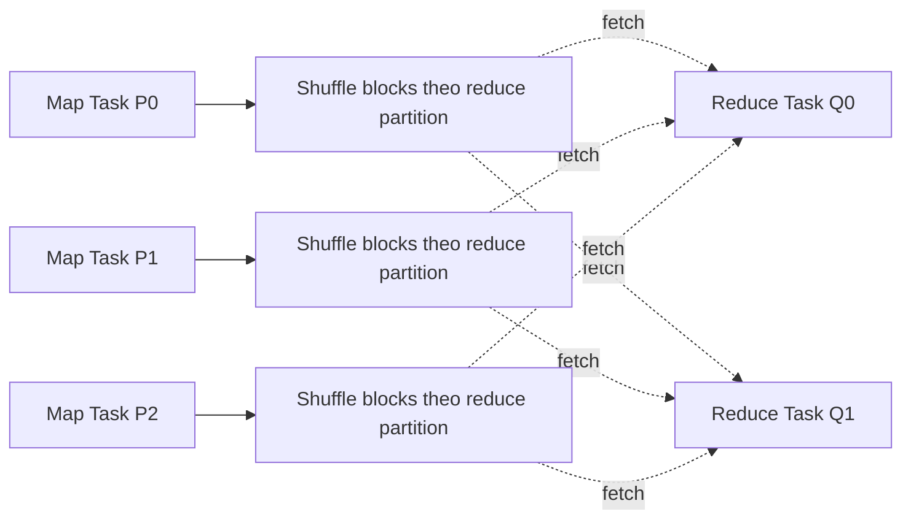

# Partitioning và Shuffle trong Spark

> **Phạm vi:** Apache Spark 4.2.0. Giá trị cấu hình cần được benchmark theo workload; bài viết tập trung vào cơ chế và dấu hiệu quan sát được.

Partition quyết định đơn vị song song; shuffle thay đổi cách record được phân bố giữa các partition. Phần lớn sự cố hiệu năng Spark nghiêm trọng đều liên quan trực tiếp hoặc gián tiếp đến hai yếu tố này.

## 1. Ba loại partition cần phân biệt

### Input partition

Được tạo khi data source lập kế hoạch đọc. Với file source, kích thước file, khả năng split, `spark.sql.files.maxPartitionBytes`, open cost và số lượng file cùng tác động. Một file gzip không splittable không trở thành nhiều input partitions chỉ vì tăng shuffle partitions.

### Shuffle partition

Là partition sau `Exchange`, thường điều khiển bởi `spark.sql.shuffle.partitions` cho SQL/DataFrame trước khi AQE coalesce/split. Nó không thay đổi parallelism của scan trước exchange.

### Output file partition

DataFrame partition trước write ảnh hưởng số writer/task và số file, nhưng table partitioning (`partitionBy("date")`) còn chia record theo thư mục business key. Một Task có thể ghi nhiều dynamic partition files; công thức “một Task bằng một file” không luôn đúng.

## 2. Shuffle diễn ra thế nào?

Map-side operator xác định target partition cho mỗi record, serialize/sort/aggregate khi phù hợp và ghi shuffle blocks. Reduce-side Task fetch blocks cần thiết từ nhiều Executor, merge/sort rồi chạy operator tiếp theo. Working set vượt memory có thể spill xuống disk.

Chi phí gồm CPU serialization/hash/sort, disk I/O, network, file descriptors/metadata và điểm đồng bộ giữa stage. “Shuffle read 1 TB” không đồng nghĩa 1 TB duy nhất trên wire nếu có retry/compression; cần đọc metric cụ thể và cấu hình codec.

## 3. Chọn số partition

Không có con số phổ quát. Một cách sizing ban đầu:

`partitions ≈ max(total_input_bytes / target_bytes_per_task, total_cores × waves)`

Đây chỉ là seed. Target phải điều chỉnh theo row width, decompression ratio, operator expansion, memory per Task và source throughput. Một partition 256 MB compressed có thể trở thành vài GB in memory.

Dấu hiệu quá ít partition:

- core nhàn rỗi trong khi Stage còn chạy;
- Task kéo dài, peak memory/spill cao;
- một failure phải recompute khối dữ liệu lớn.

Dấu hiệu quá nhiều partition:

- hàng chục nghìn Task vài chục mili giây;
- scheduling delay lớn so với executor run time;
- nhiều file/shuffle block nhỏ;
- Driver/UI/event log chịu nhiều metadata.

AQE coalesce giúp phía sau shuffle, không tự gộp hàng triệu small input files trước scan.

## 4. `repartition`, `coalesce` và range partitioning

| Operation | Thường gây shuffle | Dùng khi |
| --- | --- | --- |
| `repartition(n)` | Có | Cần phân phối lại đều và đổi parallelism |
| `repartition(n, cols...)` | Có | Cần colocate cùng key cho operator/write tiếp theo |
| `repartitionByRange` | Có | Cần range distribution/order cục bộ phù hợp |
| `coalesce(n)` | Thường tránh full shuffle khi giảm | Giảm partition rẻ, chấp nhận phân bố có thể lệch |

`coalesce(1)` trước write tạo serial bottleneck và một file khổng lồ; chỉ hợp lý cho kết quả thật nhỏ. `repartition` mù quáng trước mỗi join có thể thêm exchange mà planner vốn đã thực hiện.

## 5. Data skew

Skew xuất hiện khi partition size hoặc compute cost lệch mạnh. Nguồn phổ biến:

- hot key như `UNKNOWN`, `NULL`, một tenant lớn;
- join many-to-many làm nổ cardinality;
- partition theo date khi một ngày có traffic bất thường;
- custom UDF có chi phí khác nhau theo record;
- file layout lệch hoặc compressed size che uncompressed size.

Chẩn đoán bằng distribution, không chỉ average: so median, p75, p95 và max của input/shuffle read, records, duration và spill. Nếu max lớn hơn median hàng chục lần và cùng Task mang nhiều bytes, đây là data skew; nếu bytes tương đương nhưng duration lệch, nghiêng về node/GC/external I/O/computation skew.

## 6. Kỹ thuật xử lý skew

### Filter và pre-aggregate sớm

Loại cột/record không cần trước exchange; aggregate phía map nếu semantics cho phép. Đây thường là giải pháp ít rủi ro nhất.

### Broadcast phía nhỏ

Broadcast dimension tránh shuffle phía fact nhưng phải thực sự vừa memory trên mỗi Executor. Không broadcast theo file compressed size một cách máy móc.

### AQE skew join

AQE có thể phát hiện shuffle partition lệch và tách partition theo ngưỡng/cấu hình. Xác nhận final adaptive plan và metrics thay vì chỉ bật cờ rồi giả định đã xử lý.

### Salting

Thêm salt vào hot key để phân tán, nhân/biến đổi phía join tương ứng, rồi gộp lại. Salting làm logic và cardinality phức tạp; phải chứng minh equivalence, đặc biệt với outer join và null.

### Tách hot key

Xử lý hot keys bằng nhánh riêng, union với phần còn lại. Đây là lựa chọn rõ semantics khi chỉ vài key biết trước chi phối workload.

Tăng số partition không sửa một key duy nhất: hash của key vẫn đi vào một partition.

## 7. Locality và storage

HDFS có locality theo block/node; object storage thì không. Với object storage, tối ưu thường nằm ở:

- tránh list hàng triệu objects;
- compact small files theo target size;
- partition pruning và metadata index của table format;
- giới hạn request concurrency/retry hợp lý;
- đặt compute cùng region và endpoint phù hợp.

Output layout là đầu vào của job sau. Tuning chỉ cho một lần chạy có thể tạo “nợ file nhỏ” làm toàn platform chậm dần.

## 8. Checklist khi thấy `Exchange`

1. Exchange này có bắt buộc theo semantics (join/group/window) không?
2. Có thể giảm row/column trước exchange không?
3. Partitioning key có skew hoặc null concentration không?
4. Số partition có tạo đủ waves nhưng không quá nhiều Task nhỏ không?
5. Join có thể broadcast an toàn không?
6. Spill là do partition quá lớn hay memory pressure đồng thời?
7. AQE final plan đã coalesce/split như mong đợi chưa?
8. Output có tạo layout bền vững cho consumer tiếp theo không?

## Kết luận

Partitioning là thiết kế phân phối dữ liệu, không phải một con số cấu hình. Shuffle cần thiết cho nhiều phép toán đúng; tối ưu tốt tập trung vào giảm bytes, phân phối đều, chọn đúng strategy và kiểm chứng bằng tail metrics.

**Đọc tiếp:** [Execution model](execution-model.md) · [Query planning](query-planning.md) · [Memory và Fault Tolerance](memory-fault-tolerance.md)

## Tài liệu chính thức

- [Spark SQL Performance Tuning](https://spark.apache.org/docs/4.2.0/sql-performance-tuning.html)
- [RDD Shuffle Operations](https://spark.apache.org/docs/4.2.0/rdd-programming-guide.html#shuffle-operations)
- [Spark Configuration](https://spark.apache.org/docs/4.2.0/configuration.html)
