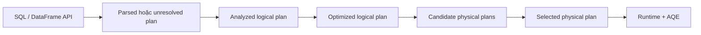

# Spark SQL Query Planning

> **Phạm vi:** Apache Spark 4.2.0. Tên node và rule nội bộ có thể thay đổi theo version; hãy coi `explain` của chính application là bằng chứng cuối cùng.

DataFrame/SQL code mô tả **kết quả**, không đóng đinh thuật toán vật lý. Spark SQL đi qua nhiều tầng plan để phân giải nghĩa, tối ưu biểu thức và chọn operator thực thi.

## 1. Pipeline của một query



### Parse và unresolved plan

SQL parser hoặc DataFrame API tạo cây quan hệ. Tên table, column, function có thể chưa được phân giải. Sai tên cột thường chỉ lộ khi analyzer cần resolve plan, dù API là lazy.

### Analysis

Analyzer dùng catalog và schema để resolve attribute, function, relation, type coercion và quyền truy cập tương ứng của catalog/connector. Kết quả là analyzed logical plan có nghĩa xác định.

### Logical optimization

Catalyst áp dụng rule lặp đến fixed point theo batch. Ví dụ thường gặp gồm constant folding, predicate pushdown, column pruning, null propagation và simplification. Rule có điều kiện; UDF opaque hoặc connector không hỗ trợ pushdown sẽ giới hạn hiệu quả.

### Physical planning

Planner sinh các SparkPlan candidate rồi chọn plan. Physical nodes thể hiện cách chạy: scan dạng row/columnar, hash/sort aggregate, broadcast hash join, sort-merge join, shuffle exchange, sort, window...

## 2. Đọc `explain` đúng cách

```python
query.explain(mode="formatted")
query.explain(mode="cost")
```

- `simple`: physical plan gọn.
- `extended`: parsed, analyzed, optimized và physical plan.
- `formatted`: outline node và detail dễ nối operator–metric.
- `cost`: plan kèm statistics nếu có.

Khi đọc từ dưới lên, tìm:

1. Scan đã prune column/partition và push filter chưa?
2. `Exchange` nào gây shuffle, partitioning expression là gì?
3. Join strategy có phù hợp kích thước hai phía không?
4. Sort có xuất hiện do join/window/order yêu cầu không?
5. `AdaptiveSparkPlan` đã final hay mới initial?
6. UDF/Python execution node có cắt codegen pipeline không?

## 3. Statistics và cost

Optimizer không biết sự thật; nó ra quyết định từ statistics. Các đại lượng quan trọng gồm row count, size in bytes, distinct count, null count, min/max và runtime map-output statistics.

Statistics thiếu hoặc cũ có thể khiến:

- không broadcast một dimension thực sự nhỏ;
- broadcast một phía lớn hơn dự kiến và gây memory pressure;
- chọn join order kém;
- ước lượng cardinality sau filter sai nhiều bậc.

`ANALYZE TABLE ... COMPUTE STATISTICS` và column statistics có thể giúp với catalog phù hợp, nhưng cần kiểm tra connector/table format đang cung cấp thông tin gì. `EXPLAIN COST` cho thấy estimates, không phải số đo runtime.

## 4. Join strategy

| Strategy | Điều kiện điển hình | Chi phí/rủi ro |
| --- | --- | --- |
| Broadcast hash join | Một phía đủ nhỏ, equi-join | Tránh shuffle phía lớn; tốn memory trên mỗi Executor |
| Sort-merge join | Hai phía lớn, equi-join, sortable keys | Shuffle và sort cả hai phía; ổn định cho large-large |
| Shuffle hash join | Một phía nhỏ hơn theo từng partition | Memory build-side; phụ thuộc config/estimate |
| Broadcast nested loop | Non-equi/cross hoặc fallback phù hợp | Có thể rất đắt; kiểm tra cardinality |

Ngưỡng auto broadcast mặc định thường được tài liệu cấu hình công bố (10 MB trong tài liệu 4.2.0), nhưng không nên coi đó là target cố định. Serialized/hashed relation, concurrency và executor overhead quyết định memory thật.

Join hint (`BROADCAST`, `MERGE`, `SHUFFLE_HASH`...) là chỉ dẫn ưu tiên, không phải bảo đảm tuyệt đối cho mọi join type. Hint sai có thể che statistics lỗi và tạo regression khi data lớn lên.

## 5. Adaptive Query Execution

AQE dùng statistics thu được sau materialized shuffle stage để tối ưu plan đang chạy. Ba nhóm khả năng quan trọng:

- coalesce các shuffle partition nhỏ để giảm Task overhead;
- xử lý skewed shuffle partitions bằng cách tách phần lớn;
- chuyển join strategy khi runtime size cho phép, theo cấu hình/điều kiện.

AQE không quay ngược thời gian: chi phí scan hoặc shuffle đã xảy ra vẫn tồn tại. Nó cũng không sửa business key skew nằm trong stateful operator nếu operator/semantics không cho phép split tương ứng.

Khi debug, so sánh **initial plan** và **final plan**, đồng thời đọc runtime metrics của `Exchange` và join node.

## 6. Ví dụ phân tích plan

```sql
SELECT c.segment, SUM(o.amount) AS revenue
FROM orders o
JOIN customers c ON o.customer_id = c.customer_id
WHERE o.order_date >= DATE '2026-09-01'
GROUP BY c.segment
```

Plan tốt có thể:

1. prune `orders` còn ba cột và partition-prune theo ngày;
2. scan `customers` chỉ hai cột;
3. broadcast `customers` nếu runtime/estimate đủ nhỏ;
4. partial aggregate revenue trước/following shuffle tùy plan;
5. shuffle theo `segment` cho final aggregate.

Nếu `customers` bị estimate 8 MB nhưng runtime 2 GB, broadcast có thể gây OOM. Nếu `segment='UNKNOWN'` chiếm 70% record, final aggregate vẫn skew dù join đã broadcast. Query planning và data distribution phải được đọc cùng nhau.

## 7. Anti-pattern

- Dùng `selectExpr("*")` xuyên pipeline rồi mong column pruning luôn cứu mọi connector/UDF.
- Bọc điều kiện trong Python UDF khiến pushdown và codegen mất cơ hội.
- Cache trước filter/projection làm cached footprint lớn không cần thiết.
- Ép broadcast theo dữ liệu hôm nay mà không có guardrail theo growth.
- Chỉnh `spark.sql.shuffle.partitions` toàn cục chỉ vì một query.
- Chỉ đọc logical plan và bỏ qua adaptive final plan/metrics.

## 8. Workflow tối ưu query

1. Lưu query text, Spark version, configs và input snapshot/partition range.
2. Chụp `explain formatted` và `cost` trước thay đổi.
3. Xác định scan bytes, exchange bytes, join strategy và skew.
4. Sửa data layout/expression/statistics trước khi tăng tài nguyên.
5. Chạy A/B trên input đại diện, so median và tail Task metrics.
6. Kiểm tra output equality; plan nhanh nhưng sai null/join semantics là thất bại.

## Kết luận

Catalyst không thay thế hiểu biết về dữ liệu. Nó tối ưu trong giới hạn schema, expression, connector capability và statistics được cung cấp. Tuning có căn cứ luôn nối ba lớp: `explain`, runtime Spark UI metrics và đặc điểm phân phối dữ liệu.

**Đọc tiếp:** [Data abstractions](data-abstractions.md) · [Partitioning và Shuffle](partition-shuffle.md) · [Performance](performance.md)

## Tài liệu chính thức

- [Spark SQL Performance Tuning](https://spark.apache.org/docs/4.2.0/sql-performance-tuning.html)
- [SQL Configuration](https://spark.apache.org/docs/4.2.0/configuration.html#runtime-sql-configuration)
