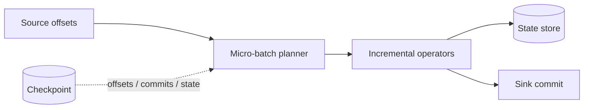

# Kiến trúc Structured Streaming

> **Phạm vi:** Apache Spark 4.2.0. Micro-batch là execution mode mặc định. Continuous processing có feature/delivery semantics khác và không nên được suy diễn từ micro-batch.

Structured Streaming cho phép mô tả stream như một bảng không hữu hạn và biểu đạt transform bằng DataFrame/Dataset. Mô hình khai báo giống batch không có nghĩa runtime giống batch: query dài hạn phải quản lý progress, state, late data và recovery.

## 1. Unbounded table và incremental result

Mỗi record mới được xem như hàng được append vào input table. Query biến đổi input table thành result table; sink nhận phần thay đổi theo output mode.



Đây là mental model, không có nghĩa Spark materialize toàn bộ input table trong RAM. Stateless operators xử lý range dữ liệu mới; stateful operators giữ state cần thiết giữa các batch.

## 2. Vòng đời một micro-batch

1. Engine xác định end offset mới từ source.
2. Range offset chưa xử lý trở thành input của batch.
3. Logical/physical incremental plan chạy như một Spark job gồm Stage/Task.
4. Stateful operators đọc và cập nhật state version tương ứng.
5. Sink ghi output theo contract của connector.
6. Progress/commit metadata được checkpoint để lần restart biết phần nào đã hoàn tất.

Nếu processing time lớn hơn trigger interval, batch sau không thể magically chạy đúng lịch; backlog tăng và end-to-end lag tích lũy. Throughput ổn định yêu cầu processed rows/sec cao hơn input trung bình và đủ headroom cho burst/recovery.

## 3. Trigger không phải SLA

| Trigger | Ý nghĩa | Lưu ý |
| --- | --- | --- |
| Processing time | Cố khởi chạy batch theo interval | Latency còn gồm scheduling, processing và sink commit |
| Available now | Xử lý dữ liệu hiện có rồi dừng | Hợp incremental batch/backfill orchestration |
| Continuous | Chế độ latency thấp riêng | At-least-once và giới hạn operator/feature cần kiểm tra theo version |

Đặt trigger 1 giây không tạo latency 1 giây nếu mỗi batch mất 20 giây. Trigger quá dày còn tạo batch rất nhỏ và overhead scheduling/commit cao.

## 4. Checkpoint là protocol state, không phải cache

Checkpoint location lưu progress metadata, commit log và state store metadata/data cần phục hồi. Yêu cầu:

- durable và nhất quán theo filesystem/connector contract;
- chỉ một active query dùng một checkpoint lineage, trừ khi framework hỗ trợ coordination tương ứng;
- quyền đọc/ghi của mọi lần restart;
- không xóa tùy tiện khi query đang chạy;
- lifecycle/backup phù hợp recovery objective.

Đổi source, stateful operator, grouping key, schema/state encoding hoặc sink có thể không tương thích với checkpoint cũ. “Deploy code mới và dùng lại checkpoint” phải qua compatibility test; nếu phải khởi tạo checkpoint mới, cần kế hoạch offset/backfill để tránh gap/duplicate.

## 5. Stateful operator

Aggregation theo window/key, deduplication, stream-stream join và arbitrary stateful processing cần giữ state qua batch. State cost phụ thuộc:

`state_size ≈ active_keys × state_per_key × retained_time`

Rủi ro không chỉ là memory: state phải được checkpoint, load, update và compact. Cardinality key cao hoặc không có điều kiện loại state làm latency tăng theo tuổi query.

Theo dõi số rows trong state, rows updated/removed, memory/state-store metrics và checkpoint duration. Với state lớn, cấu hình/provider phải được đánh giá theo version và môi trường thay vì chỉ tăng Executor.

## 6. Event time và watermark

Event time là thời điểm sự kiện xảy ra trong domain; processing time là thời điểm engine xử lý. Watermark biểu diễn mức tiến triển dựa trên **max event time đã quan sát trừ delay threshold** (chi tiết semantics phụ thuộc operator).

```python
events = (
    spark.readStream.format("kafka").load()
    .selectExpr("CAST(value AS STRING) AS json")
    .select(parse_event("json").alias("e"))
    .select("e.*")
    .withWatermark("event_time", "15 minutes")
)

result = (
    events
    .groupBy(window("event_time", "5 minutes"), "account_id")
    .count()
)
```

Watermark có hai vai trò thường bị trộn:

- cho engine điều kiện để loại state cũ ở operator hỗ trợ;
- xác định late records nào còn có thể cập nhật output/state theo semantics của query.

Delay 15 phút không bảo đảm mọi record trễ dưới 15 phút luôn được xử lý trong mọi topology, và không có nghĩa record trễ hơn chắc chắn bị drop ngay đúng mốc. Cần đọc guarantee cụ thể của operator/output mode.

## 7. Window, deduplication và join

### Window aggregation

Window càng rộng và slide càng nhỏ, một event có thể thuộc nhiều window, làm state/update tăng. Append mode thường cần watermark để biết window nào không còn cập nhật trước khi phát output cuối.

### Deduplication

Dedup cần key có ý nghĩa và phạm vi thời gian. Không watermark/time constraint, engine có thể phải nhớ mọi key đã thấy vô hạn. ID không ổn định hoặc tái sử dụng theo domain làm dedup “đúng kỹ thuật, sai nghiệp vụ”.

### Stream-stream join

Hai phía đều không hữu hạn nên join cần state hai bên. Event-time constraint và watermark giúp giới hạn khoảng chờ/mức state. Outer join có quy tắc phát NULL row muộn hơn; phải kiểm chứng khi watermark tiến triển và khi một stream tạm ngừng.

## 8. Output mode và sink

| Output mode | Phần result được phát | Dùng điển hình |
| --- | --- | --- |
| Append | Chỉ row mới được coi là final theo semantics | Stateless transform, window final có watermark |
| Update | Row thay đổi từ trigger trước | Aggregation/stateful sink hỗ trợ update |
| Complete | Toàn bộ result table mỗi trigger | Result nhỏ; chi phí tăng theo state |

Delivery guarantee end-to-end là tổ hợp của source replay, checkpoint, engine và sink commit. Spark có thể replay batch; sink phải nhận diện batch/transaction hoặc ghi idempotent để tránh duplicate. `foreachBatch` cung cấp `batch_id` giúp xây dedup/transaction logic, nhưng user code vẫn chịu trách nhiệm.

Không tuyên bố “exactly-once” chỉ vì query có checkpoint. Một HTTP call/JDBC append không idempotent trong `foreachBatch` có thể tạo duplicate sau crash giữa external commit và Spark checkpoint commit.

## 9. Source control và backpressure

Source option như max offsets/files per trigger giới hạn lượng input mỗi batch để tránh một batch khổng lồ sau downtime. Giới hạn quá thấp làm backlog không bao giờ bắt kịp; quá cao gây OOM/state spike/sink overload.

Kế hoạch recovery cần tính:

`catchup_time ≈ backlog / (processing_rate - incoming_rate)`

nếu processing rate không lớn hơn incoming rate thì query không thể catch up dù không còn failure.

## 10. Vận hành và quan sát

Theo dõi theo từng query và batch:

- `inputRowsPerSecond` và `processedRowsPerSecond`;
- batch/trigger duration và breakdown query planning/addBatch/commit;
- source start/end offsets và backlog/consumer lag;
- state rows, memory, files và update/removal rate;
- watermark hiện tại và max event time;
- sink latency/error/retry;
- failed/restarted batch và tuổi checkpoint.

Cảnh báo nên dựa trên end-to-end freshness và backlog growth, không chỉ process còn sống. Một query “RUNNING” vẫn có thể kẹt sink hoặc xử lý chậm hơn input.

## 11. Deployment và thay đổi schema

- Version code, Spark và connector cùng checkpoint lineage.
- Canary trên checkpoint/source riêng với data đại diện nếu semantics cho phép.
- Có runbook rollback: phiên bản cũ có đọc state mới không?
- Đánh giá additive/rename/type changes ở source, state và sink riêng biệt.
- Không chạy hai query ghi cùng non-transactional sink mà thiếu coordination.
- Với planned reset checkpoint, ghi rõ starting offsets và reconciliation window.

## Kết luận

Structured Streaming không chỉ là batch API chạy lặp. Hệ thống đúng cần một protocol hoàn chỉnh cho offset, state, watermark, sink commit và code evolution. Checkpoint giúp phục hồi engine state; tính đúng end-to-end vẫn phụ thuộc contract của source, sink và business key.

**Đọc tiếp:** [Deployment](deployment.md) · [Memory và Fault Tolerance](memory-fault-tolerance.md) · [Performance](performance.md)

## Tài liệu chính thức

- [Structured Streaming Programming Guide](https://spark.apache.org/docs/4.2.0/streaming/index.html)
- [Structured Streaming State Management](https://spark.apache.org/docs/4.2.0/streaming/apis-on-dataframes-and-datasets.html)
- [Structured Streaming Operations Guide](https://spark.apache.org/docs/4.2.0/streaming/structured-streaming-kafka-integration.html)
