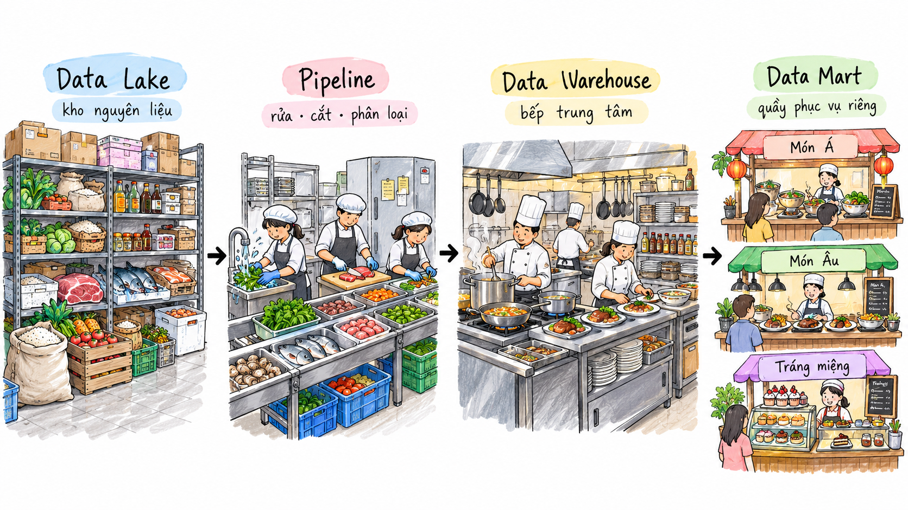

<header class="airflow-article-hero storage-article-hero">
  <div class="airflow-article-hero__eyebrow">
    <a href="../../">BEHIND THE PIPELINE</a>
    <span>ARTICLE / 006</span>
  </div>
  <h1>Data Lake, Data Warehouse<br><em>&amp; Data Mart</em></h1>
  <p class="airflow-article-hero__dek">
    From the characteristics of Big Data to how storage platforms operate,
    differ, and converge in the Data Lakehouse architecture.
  </p>
  <div class="airflow-article-hero__meta" aria-label="Article information">
    <span>DATA ARCHITECTURE</span>
    <span>EDITION 06 · 2026</span>
  </div>
</header>

> **Before you read:** This is a long article that needs more than a quick skim. Set aside some time, grab a glass of water, and give it your full attention.

## Why Distinguish Between Data Storage Models?

A business might collect orders, website clicks, application logs, and images at the same time. All of these are data, but they should not necessarily be stored and used in the same way. As data volumes grow, the question is not just **where to store the data**, but also **who will use it and for what purpose**.

This article starts with the characteristics of Big Data, then explores Data Lakes, Data Warehouses, and Data Marts to explain the role, strengths, and limitations of each model. Finally, we look at how the Data Lakehouse combines these capabilities.

## 1. The Context and Definition of Big Data

### 1.1. Rapid Data Growth

In the digital age, the amount of data generated worldwide each day is growing rapidly. The internet, social networks, mobile devices, sensor systems, and online services continuously produce enormous amounts of data.

For example, in a single minute, 12 million people send iMessages, 6 million people shop online, YouTube users stream 694,000 videos, and TikTok users watch 167 million videos.

Businesses collect data from many sources:

- Website behavior, such as clicks and time spent on a page.
- GPS data from phones.
- Purchase history.
- Social media comments.

### 1.2. What Is Big Data?

**Big Data** refers to datasets so large and complex that they are difficult to manage or analyze with traditional data processing tools, particularly spreadsheets and conventional processing systems.

#### Data Categories

- **Structured data:** Follows a clearly defined schema and can be represented as rows and columns. Examples include Excel spreadsheets and SQL databases.
- **Unstructured data:** Does not have a readily identifiable structure that fits the conventional rows and columns of a relational database. It does not follow a fixed format, sequence, set of semantics, or rules. Examples include images and videos.
- **Semi-structured data:** Is not simply stored as rows and columns in a relational database. Instead, it contains tags, elements, or metadata that group and organize it hierarchically. Examples include XML and JSON files.

#### The Five Vs of Big Data

- **Volume:** The amount of data to process can range from tens of terabytes (TB) to hundreds of petabytes (PB).
- **Velocity:** Data is generated and arrives at the system rapidly, sometimes in real time.
- **Variety:** Data comes in many forms, from structured data to unstructured text, audio, and video. Some forms need additional processing to extract meaning and support metadata.
- **Veracity:** The accuracy, reliability, quality, and integrity of the data.
- **Value:** The business value gained by turning data into useful information.

## 2. Data Storage Platforms

### 2.1. Data Lake — A Repository That Takes Everything In

**Definition:** A Data Lake is a centralized repository that stores data at any scale: structured data such as SQL tables, semi-structured data such as JSON and XML, and unstructured data such as images, videos, audio files, and PDFs. Examples of storage tools include MinIO and Amazon S3.

#### Core Characteristics

- **Raw data storage:** Data is kept as received from its source, without transformation.
- **Scalability:** Data Lakes are often built on cloud storage systems such as Amazon S3, Google Cloud Storage, and Azure Data Lake Storage. Low storage costs make petabyte-scale storage feasible.
- **Support for diverse data types:** They accept structured, semi-structured, and unstructured data.
- **Separation of storage and compute:** Data is stored independently, with compute clusters such as Spark or Presto used when processing is needed.

#### Limitations

- **Risk of becoming a Data Swamp:** Without careful schema management, data classification, metadata, ownership, and input quality controls, data becomes difficult to manage.
- **Lack of ACID transactions:** Traditional Data Lakes do not provide the full set of transactional capabilities found in Data Warehouses.
- **Lack of data versioning:** They do not have a built-in mechanism for querying past versions of data.
- **Slower queries than a Data Warehouse:** They primarily serve as storage and are not optimized for queries in the same way as a database.

### 2.2. Data Warehouse — An Organized Library

**Definition:** A Data Warehouse is a central data storage system that integrates data from multiple sources. Most modern Data Warehouses use columnar storage to optimize queries that read many rows.

**Examples include:** Snowflake, Google BigQuery, and Amazon Redshift.

#### Core Characteristics

- **Subject-oriented:** Data is organized around key business subjects such as customers, sales, and products.
- **Integrated:** Data from multiple sources is cleaned and usually standardized into a consistent format before being loaded.
- **Time-variant:** Historical data is often retained for long periods, depending on configuration, to support comparisons and trend analysis.
- **Non-volatile:** End users rarely change or delete loaded data. When changes occur, new data is often added alongside existing data. The primary use is reading data for analysis.

#### Limitations

- Primarily optimized for storing structured data.
- Data can arrive with a delay because it usually goes through transformation steps first.
- Querying the data from machine learning and deep learning libraries can be difficult.

### 2.3. Data Mart

**Definition:** In a traditional data warehouse architecture, a Data Mart is a repository focused on a particular subject or business unit within an organization.

#### Core Characteristics

- **Focused scope:** While a Data Warehouse covers the entire business, a Data Mart contains data for one area, such as sales, finance, or marketing.
- **Smaller size:** Because it holds specialized data, a Data Mart is usually smaller than the overall warehouse, allowing faster queries.
- **Optimized data structure:** Data is often modeled in a form that end users can easily understand, such as a **Star Schema**, to directly support **Business Intelligence (BI)** tools.

### 2.4. A Restaurant Analogy for the Data Flow

Think of the whole data system as a large restaurant.

The **Data Lake** is the restaurant's central ingredient store. It accepts and stores all kinds of ingredients largely as they arrive: vegetables, meat, seafood, spices, and even ingredients that have not been prepared at all. As long as there is room, it takes them in.

The **Data Pipeline (ETL/ELT)** moves and prepares those ingredients. They are brought from storage into the kitchen, washed, cut, sorted, and prepared to a consistent standard before cooking.

The **Data Warehouse** is the central kitchen. Prepared ingredients are cooked, organized, and standardized into finished dishes, checked for quality, and made ready to serve.

Finally, **Data Marts** are separate serving counters, such as Asian food, European food, or desserts. Each counter offers a specific group of dishes, so customers can find what they need without going through the entire kitchen.

{ loading=lazy }

*The illustration shows the role of each layer.*

## 3. ETL and ELT

We mentioned ETL and ELT earlier. What do they mean?

### 3.1. ETL — Extract → Transform → Load

ETL processes data in this order:

```text
Data sources → Extract → Transform → Load → Data Warehouse
```

- **Extract:** Retrieve data from sources such as databases, APIs, and CSV/JSON files.
- **Transform:** Clean, standardize, process, and combine the data.
- **Load:** Load the data into the Data Warehouse after processing is complete.

ELT uses a different order:

### 3.2. ELT — Extract → Load → Transform

ELT changes the sequence to:

```text
Data sources → Extract → Load → Transform
```

- **Extract:** Retrieve data from its sources.
- **Load:** Put the raw data into storage first, for example in Amazon S3.
- **Transform:** Process the data later, when it is needed.

## 4. Future Trends

### 4.1. Data Lakehouse

One trend in data architecture is the **Data Lakehouse**. Introduced by Databricks as a combination of the Data Warehouse and Data Lake, it builds on the strengths and addresses the limitations of each:

- A Data Warehouse stores clearly structured data, but usually focuses on certain forms, such as numerical and tabular data.
- As LLMs and AI develop, model training requires diverse data types and cannot rely on just one form.
- A Data Lake accepts many data types, but data without structure can be difficult to manage. Traditional Data Lakes also lack reliability when there is no **concurrency control** for simultaneous reads and writes.

A Data Lakehouse combines the flexibility of a Data Lake with a data management layer such as **Iceberg** or **Delta**. This helps address the Data Swamp problem while providing Data Warehouse capabilities such as ACID transactions and data versioning.

What does ACID mean?

### 4.2. ACID Transactions in a Data Lakehouse

A Data Lakehouse also supports the ACID properties:

- **A — Atomicity:** A transaction either succeeds in full or has no effect. For example, if a write fails midway before the final log entry is written, it is treated as if it never happened.
- **C — Consistency:** Data follows the required rules and schema. For example, a numeric `age` column cannot accept a string.
- **I — Isolation:** Concurrent writers do not interfere with each other's transactions. For example, if you are writing based on version 10 but another writer has already created version 11, your write fails and needs to be retried.
- **D — Durability:** Successfully written data is not lost.

---

## Closing Thoughts

No single storage system fits every type of data and every user. When designing a data platform, start with the data you need to store, how it will be processed, and each group's query needs: exploring raw data, producing shared reports, or analyzing a department's activity. These needs explain why Data Lakes, Data Warehouses, Data Marts, and Data Lakehouses can play different roles within the same architecture.

Thank you for reading to the end! See you in future articles.

<footer class="airflow-article-end ware-lake-article-end">
  <div>
    <span>BEHIND THE PIPELINE / 006</span>
    <strong>Understand the system,<br>not just the syntax.</strong>
  </div>
  <a href="../../">Back to the library <span aria-hidden="true">→</span></a>
</footer>
